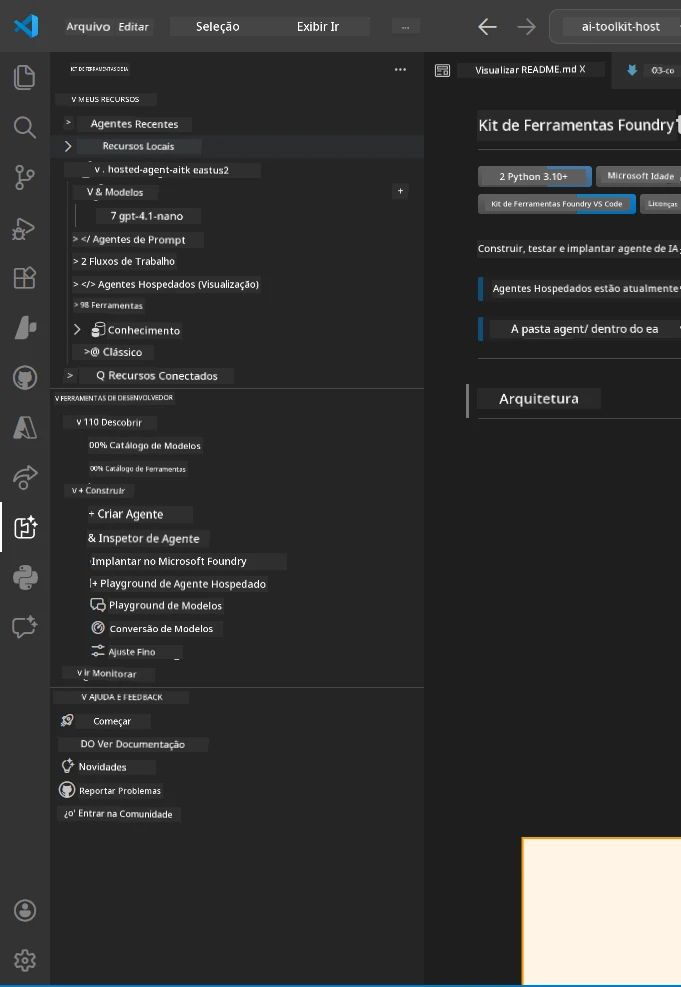
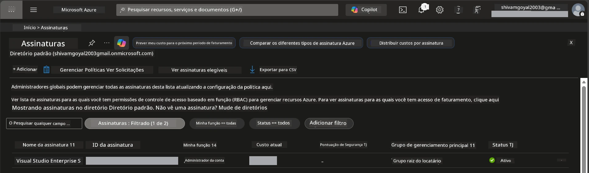
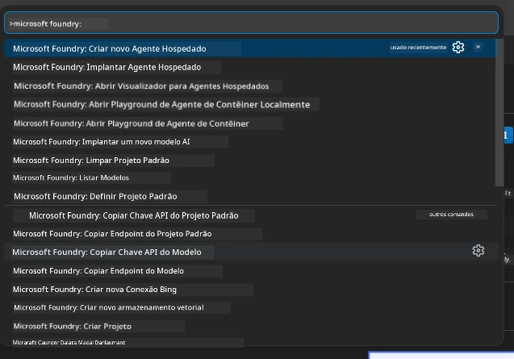
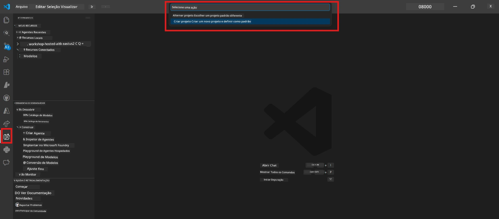
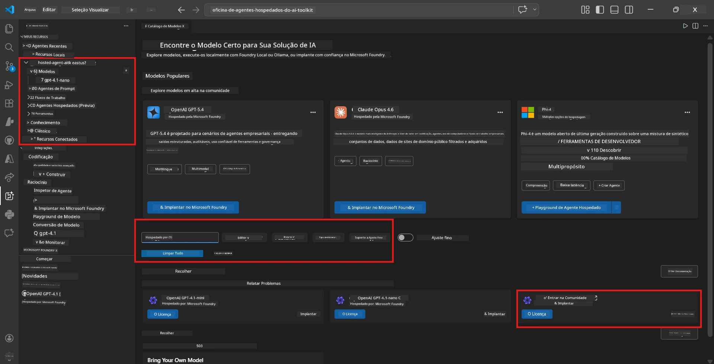
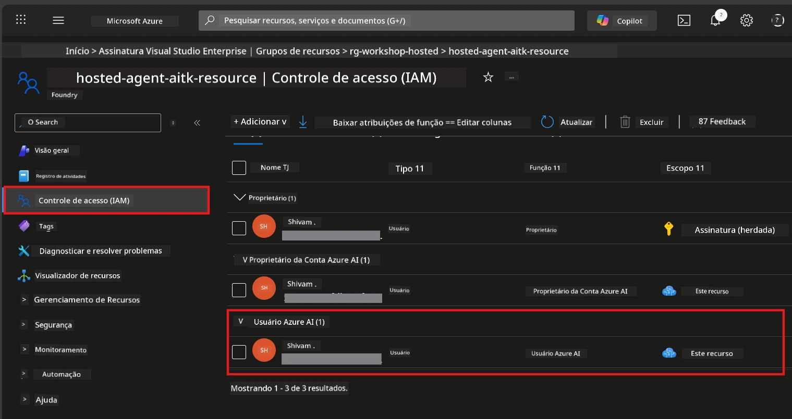

# Configuração: Extensão, Projeto e Modelo

⏱️ ~15 min

Neste módulo, você instala e verifica a extensão Foundry Toolkit, cria (ou conecta a) um projeto Foundry e implanta um modelo que seu agente usará.

## Passo 1: Instalar Foundry Toolkit

**Foundry Toolkit para VS Code** é a principal extensão deste workshop. Ela oferece criação de projetos, implantação de modelos, scaffold de agentes, testes locais (Agent Inspector) e implantação na nuvem - tudo pelo VS Code.

1. Abra o VS Code e pressione `Ctrl+Shift+X` para abrir o painel de **Extensões**.
2. Busque por **Foundry Toolkit**.
3. Instale o **Foundry Toolkit para VS Code** (Publicador: Microsoft, ID: `ms-windows-ai-studio.windows-ai-studio`).
4. Após a instalação, o ícone do **Foundry Toolkit** aparecerá na Barra de Atividades (barra lateral esquerda).

> *Nota: A Barra de Atividades pode exibir "AI TOOLKIT" em versões mais antigas da extensão. A funcionalidade é idêntica.*



## Passo 2: Configuração baseada no seu acesso

> **Escolha seu caminho:** Expanda a seção abaixo que corresponde à sua configuração. Você só precisa completar **um** caminho.

<details>
<summary><strong>🅰️ Caminho A - Nuvem Azure (requer assinatura Azure)</strong></summary>

### Azure CLI

1. Instale a partir de [learn.microsoft.com/cli/azure/install-azure-cli](https://learn.microsoft.com/cli/azure/install-azure-cli).
2. Verifique: `az --version` (espere 2.80.0+).
3. Faça login: `az login`

### Opções de Autenticação

O [Microsoft Agent Framework](https://learn.microsoft.com/agent-framework/overview/) utiliza [`DefaultAzureCredential`](https://learn.microsoft.com/azure/developer/python/sdk/authentication/credential-chains#defaultazurecredential-overview) que tenta múltiplos métodos de autenticação em ordem. Escolha o que se adapta ao seu ambiente:

#### Opção 1: Contas do VS Code (recomendado para workshops)
1. Clique no ícone **Contas** (silhueta de pessoa) no canto inferior esquerdo do VS Code.
2. Selecione **Entrar para usar Microsoft Foundry** (ou **Entrar com Azure**).
3. Um navegador será aberto - entre com a conta Azure que tem acesso à sua assinatura.
4. Volte para o VS Code. Você deverá ver o nome da sua conta no canto inferior esquerdo.

#### Opção 2: Azure CLI
```bash
az login
az account set --subscription "<your-subscription-id>"
```

#### Opção 3: Service Principal (Enterprise/CI)
Para ambientes restritos ou pipelines CI/CD, defina estas variáveis de ambiente no seu arquivo `.env`:
```env
AZURE_TENANT_ID=<your-tenant-id>
AZURE_CLIENT_ID=<your-client-id>
AZURE_CLIENT_SECRET=<your-client-secret>
```

> **Como funciona o `DefaultAzureCredential`:** Ele tenta primeiro as variáveis de ambiente, depois a identidade gerenciada, depois o login do VS Code, depois o Azure CLI - e usa o que funcionar primeiro. Veja [documentação da cadeia de credenciais](https://learn.microsoft.com/azure/developer/python/sdk/authentication/credential-chains#defaultazurecredential-overview).

### Azure Developer CLI (azd)

1. Instale: `winget install microsoft.azd` (Windows) ou veja [documentação de instalação](https://learn.microsoft.com/azure/developer/azure-developer-cli/install-azd).
2. Verifique: `azd version`
3. Faça login: `azd auth login`

### Docker Desktop (opcional)

Docker é necessário somente se você quiser construir containers localmente. A extensão Foundry cuida das construções automaticamente durante a implantação.

1. Instale a partir de [docs.docker.com/get-docker](https://docs.docker.com/get-docker/).
2. Verifique: `docker info`

### Assinatura Azure & RBAC

1. Faça login em [portal.azure.com](https://portal.azure.com).
2. Navegue para **Assinaturas** e confirme que pelo menos uma está **Ativa**.
3. Anote seu **ID da Assinatura** - você precisará no Módulo 01.



#### Tabela de Cenários RBAC

A implantação de [Hosted Agent](https://learn.microsoft.com/azure/foundry/agents/concepts/hosted-agents) requer permissões de **ação de dados** que os papéis padrão do Azure `Owner` e `Contributor` **não** incluem. Use a tabela abaixo para determinar quais papéis você precisa:

| Cenário | Papéis necessários | Onde atribuí-los |
|----------|---------------|----------------------|
| Criar novo projeto Foundry | **Azure AI Owner** no recurso Foundry | Recurso Foundry no portal Azure |
| Implantar em projeto existente (novos recursos) | **Azure AI Owner** + **Contributor** na assinatura | Assinatura + recurso Foundry |
| Implantar em projeto totalmente configurado | **Reader** na conta + **Azure AI User** no projeto | Conta + projeto no portal Azure |
| Somente teste local (sem implantação) | **Azure AI User** no projeto | Projeto no portal Azure |

> **Ponto chave:** Os papéis `Owner` e `Contributor` do Azure cobrem apenas permissões de *gerenciamento* (operações ARM). Você precisa de [**Azure AI User**](https://learn.microsoft.com/azure/foundry/concepts/rbac-foundry#built-in-roles) (ou superior) para *ações de dados* como `agents/write`, necessário para criar e implantar agentes.

## Conectar ou criar um projeto Foundry



1. Pressione `Ctrl+Shift+P` → digite **Foundry Toolkit: Create Project** → selecione.
2. Selecione sua **assinatura Azure** no dropdown.
3. Selecione ou crie um **grupo de recursos** (exemplo, `rg-hosted-agents-workshop`).
4. Selecione uma **região** que suporte agentes hospedados: `East US`, `West US 2` ou `Sweden Central`. Veja [disponibilidade por região](https://learn.microsoft.com/azure/foundry/agents/concepts/hosted-agents#region-availability).
5. Digite um nome para o projeto (exemplo, `workshop-agents`).
6. Aguarde 2–5 minutos pelo provisionamento. Uma notificação de progresso aparecerá no VS Code.
7. Quando concluído, seu projeto aparecerá na barra lateral **Foundry Toolkit** em **MINHOS RECURSOS**.



## Implantar um modelo e atribuir RBAC

Seu agente hospedado precisa de um modelo de IA para gerar respostas.

#### Matriz de Seleção de Modelo
Dependendo das suas necessidades, você pode escolher entre diferentes níveis de modelos:

| Modelo | Melhor para | Custo | Notas |
|-------|----------|------|-------|
| `gpt-4.1` | Respostas de alta qualidade e nuance | Mais alto | Melhores resultados, recomendado para o teste final |
| `gpt-4.1-mini/gpt-5-mini` | Iteração rápida, menor custo | Mais baixo | Bom para desenvolvimento em workshop e testes rápidos |
| `gpt-4.1-nano` | Tarefas leves | Mais baixo | Mais econômico, mas respostas mais simples |

1. Pressione `Ctrl+Shift+P` → **Foundry Toolkit: Open Model Catalog** (ou clique em **Catálogo de Modelos** na barra lateral em FERRAMENTAS DE DESENVOLVIMENTO → Descobrir).
2. Busque por **gpt-4.1** no catálogo.
3. Encontre **OpenAI GPT-4.1-mini** (ou `gpt-5-mini` para qualidade melhor) e clique em **Implantar**.



4. Na configuração da implantação: 
   - **Nome da implantação:** Deixe o padrão ou insira um nome personalizado. **Lembre-se deste nome.**
   - **Destino:** Selecione **Implantar para Foundry Toolkit** → escolha seu projeto.
5. Clique em **Implantar** e aguarde 1–3 minutos.

> **Recomendação:** Use `gpt-4.1-mini/gpt-5-mini` para o workshop - rápido, acessível e produz bons resultados.

### Anote seus valores

Após a implantação, anote estes dois valores (você precisará no Módulo 03):

| Valor | Onde encontrar |
|-------|-----------------|
| **Endpoint do projeto** | Clique no seu projeto na barra lateral → a vista de detalhes mostra a URL (exemplo, `https://<account>.services.ai.azure.com/api/projects/<project>`) |
| **Nome da implantação do modelo** | Expanda o projeto → **Modelos** → o nome ao lado do seu modelo implantado (exemplo, `gpt-4.1-mini/gpt-5-mini`) |

### Atribuir papel RBAC

> ⚠️ **Este é o passo mais comumente esquecido.** Sem o papel correto, a implantação no Módulo 05 falhará.

#### Qual papel eu preciso?
Dependendo do seu cenário, você precisa das seguintes combinações de papéis:

| Cenário | Papéis necessários | Onde atribuí-los |
|----------|---------------|----------------------|
| Criar novo projeto Foundry | **Azure AI Owner** no recurso Foundry | Recurso Foundry no portal Azure |
| Implantar em projeto existente (novos recursos) | **Azure AI Owner** + **Contributor** na assinatura | Assinatura + recurso Foundry |
| Implantar em projeto totalmente configurado | **Reader** na conta + **Azure AI User** no projeto | Conta + projeto no portal Azure |

**Ponto chave:** Os papéis `Owner` e `Contributor` do Azure cobrem apenas permissões de *gerenciamento*. Você precisa de **Azure AI User** (ou superior) para *ações de dados* como `agents/write` necessário para criar e implantar agentes.

1. Abra [portal.azure.com](https://portal.azure.com).
2. Pesquise pelo nome do seu **projeto Foundry** → clique no resultado do tipo **"Projeto Foundry Toolkit"** (NÃO na conta principal).
3. Clique em **Controle de acesso (IAM)** na navegação esquerda.
4. Clique em **+ Adicionar** → **Adicionar atribuição de papel**.
5. **Aba Papel:** Procure por **Azure AI User**, selecione-o, e clique em **Avançar**.
6. **Aba Membros:** Selecione **Usuário, grupo ou principal de serviço** → clique em **+ Selecionar membros** → encontre e selecione você mesmo → clique em **Selecionar**.
7. Clique em **Rever + atribuir** → novamente em **Rever + atribuir**.
8. **Aguarde 1–2 minutos** para propagação.

> **Por que este papel?** Os papéis `Owner`/`Contributor` do Azure concedem somente permissões de gerenciamento. O papel **Azure AI User** concede a ação de dados `agents/write` necessária para criar e implantar agentes. Veja [documentação RBAC do Foundry](https://learn.microsoft.com/azure/foundry/concepts/rbac-foundry#built-in-roles).



</details>

<details>
<summary><strong>🅱️ Caminho B - Local / camada gratuita (não precisa de assinatura Azure)</strong></summary>

### Foundry Local

Foundry Local permite executar modelos de IA na sua própria máquina - não precisa de conta na nuvem. Você pode acessar modelos do Foundry Local usando Foundry Toolkit pelo catálogo de modelos assim:

1. Vá para a extensão Foundry Toolkit.
2. Na navegação Foundry Toolkit vá para **Ferramentas de Desenvolvimento** > e selecione **Catálogo de Modelos**
3. Na nova janela, selecione **local** na barra de navegação.
4. Desça até **Phi 4 Mini,** e clique no **botão adicionar**; uma popup indicará que o modelo está sendo baixado.
5. Após o download do modelo, você pode prosseguir para o próximo passo.

</details>

### ✅ Ponto de verificação


- [ ] `Ctrl+Shift+P` → "Foundry Toolkit" mostra comandos disponíveis
- [ ] Extensão Foundry Toolkit instalada e barra lateral carrega sem erros
- [ ] VS Code abre e funciona corretamente
- [ ] `python --version` mostra 3.10+
- [ ] Ícone Foundry Toolkit visível na Barra de Atividades do VS Code
- [ ] **Caminho A:** `az login` sucesso, assinatura está Ativa
- [ ] **Caminho B:** Foundry Local está rodando (`foundry local status`)
- [ ] **Caminho A:** Projeto Foundry visível na barra lateral, modelo implantado, papel Azure AI User atribuído
- [ ] **Caminho B:** Foundry Local rodando com um modelo
- [ ] Você anotou seu **endpoint** e **nome da implantação do modelo**


**Anterior:** [00 - Requisitos](00-prerequisites.md) · **Próximo:** [02 - Criar Agente Hospedado →](02-create-hosted-agent.md)

---

<!-- CO-OP TRANSLATOR DISCLAIMER START -->
**Aviso Legal**:
Este documento foi traduzido usando o serviço de tradução por IA [Co-op Translator](https://github.com/Azure/co-op-translator). Embora nos esforcemos pela precisão, por favor, esteja ciente de que traduções automatizadas podem conter erros ou imprecisões. O documento original em seu idioma nativo deve ser considerado a fonte autorizada. Para informações críticas, recomenda-se tradução profissional humana. Não nos responsabilizamos por quaisquer mal-entendidos ou interpretações incorretas decorrentes do uso desta tradução.
<!-- CO-OP TRANSLATOR DISCLAIMER END -->