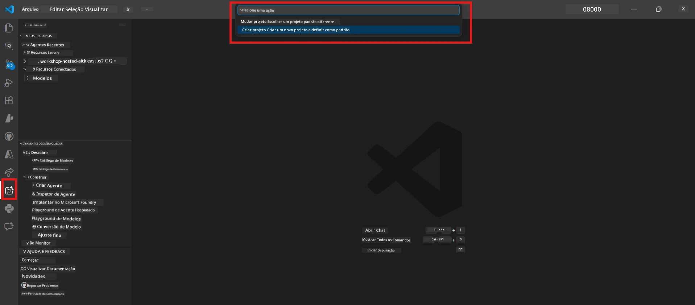
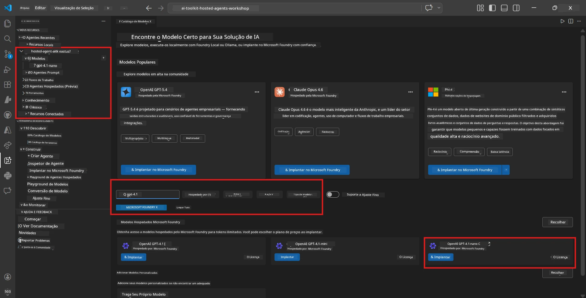
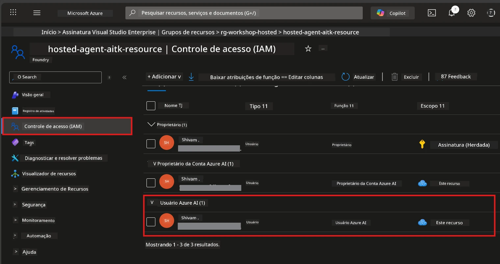

# Module 2 - Criar um Projeto Foundry e Implantar um Modelo

Neste módulo, você cria (ou seleciona) um projeto Microsoft Foundry e implanta um modelo que seu agente usará. Cada passo está escrito explicitamente - siga-os na ordem.

> Se você já possui um projeto Foundry com um modelo implantado, pule para [Módulo 3](03-create-hosted-agent.md).

---

## Passo 1: Criar um projeto Foundry a partir do VS Code

Você usará a extensão Microsoft Foundry para criar um projeto sem sair do VS Code.

1. Pressione `Ctrl+Shift+P` para abrir a **Paleta de Comandos**.
2. Digite: **Microsoft Foundry: Create Project** e selecione-o.
3. Um menu suspenso aparece - selecione sua **assinatura Azure** na lista.
4. Você será solicitado a selecionar ou criar um **grupo de recursos**:
   - Para criar um novo: digite um nome (ex.: `rg-hosted-agents-workshop`) e pressione Enter.
   - Para usar um existente: selecione-o no menu suspenso.
5. Selecione uma **região**. **Importante:** Escolha uma região que suporte agentes hospedados. Consulte a [disponibilidade das regiões](https://learn.microsoft.com/azure/foundry/agents/concepts/hosted-agents#region-availability) - as escolhas comuns são `East US`, `West US 2` ou `Sweden Central`.
6. Digite um **nome** para o projeto Foundry (ex.: `workshop-agents`).
7. Pressione Enter e aguarde a conclusão do provisionamento.

> **O provisionamento leva de 2 a 5 minutos.** Você verá uma notificação de progresso no canto inferior direito do VS Code. Não feche o VS Code durante o provisionamento.

8. Quando concluído, a barra lateral do **Microsoft Foundry** mostrará seu novo projeto em **Resources**.
9. Clique no nome do projeto para expandi-lo e confirme que exibe seções como **Models + endpoints** e **Agents**.



### Alternativa: Criar via Portal Foundry

Se preferir usar o navegador:

1. Abra [https://ai.azure.com](https://ai.azure.com) e faça login.
2. Clique em **Create project** na página inicial.
3. Insira um nome para o projeto, selecione sua assinatura, grupo de recursos e região.
4. Clique em **Create** e aguarde o provisionamento.
5. Após a criação, volte ao VS Code - o projeto deve aparecer na barra lateral Foundry após uma atualização (clique no ícone de atualizar).

---

## Passo 2: Implantar um modelo

Seu [agente hospedado](https://learn.microsoft.com/azure/foundry/agents/concepts/hosted-agents) precisa de um modelo Azure OpenAI para gerar respostas. Você vai [implantar um agora](https://learn.microsoft.com/azure/ai-foundry/openai/how-to/create-resource#deploy-a-model).

1. Pressione `Ctrl+Shift+P` para abrir a **Paleta de Comandos**.
2. Digite: **Microsoft Foundry: Open [Model Catalog](https://learn.microsoft.com/azure/ai-foundry/openai/concepts/models)** e selecione-o.
3. A visualização do Catálogo de Modelos abre no VS Code. Navegue ou use a barra de busca para encontrar **gpt-4.1**.
4. Clique no cartão do modelo **gpt-4.1** (ou `gpt-4.1-mini` se preferir menor custo).
5. Clique em **Deploy**.


6. Na configuração da implantação:
   - **Deployment name**: Mantenha o padrão (ex.: `gpt-4.1`) ou digite um nome personalizado. **Lembre deste nome** - você precisará dele no Módulo 4.
   - **Target**: Selecione **Deploy to Microsoft Foundry** e escolha o projeto que você acabou de criar.
7. Clique em **Deploy** e aguarde a conclusão da implantação (1-3 minutos).

### Escolhendo um modelo

| Modelo | Melhor para | Custo | Observações |
|--------|-------------|-------|-------------|
| `gpt-4.1` | Respostas de alta qualidade e nuances | Mais alto | Melhores resultados, recomendado para testes finais |
| `gpt-4.1-mini` | Iteração rápida, menor custo | Mais baixo | Bom para desenvolvimento e testes durante o workshop |
| `gpt-4.1-nano` | Tarefas leves | Mais baixo possível | Mais econômico, mas respostas mais simples |

> **Recomendação para este workshop:** Use `gpt-4.1-mini` para desenvolvimento e testes. É rápido, barato e produz bons resultados para os exercícios.

### Verifique a implantação do modelo

1. Na barra lateral **Microsoft Foundry**, expanda seu projeto.
2. Procure em **Models + endpoints** (ou seção similar).
3. Você deve ver seu modelo implantado (ex.: `gpt-4.1-mini`) com status **Succeeded** ou **Active**.
4. Clique na implantação do modelo para ver seus detalhes.
5. **Anote** estes dois valores - você vai precisar deles no Módulo 4:

   | Configuração | Onde encontrar | Exemplo |
   |--------------|----------------|---------|
   | **Project endpoint** | Clique no nome do projeto na barra lateral Foundry. A URL do endpoint é mostrada na visualização de detalhes. | `https://<account>.services.ai.azure.com/api/projects/<project>` |
   | **Model deployment name** | O nome mostrado ao lado do modelo implantado. | `gpt-4.1-mini` |

---

## Passo 3: Atribuir funções RBAC necessárias

Este é o **passo mais comumente esquecido**. Sem as funções corretas, a implantação no Módulo 6 falhará com erro de permissões.

### 3.1 Atribuir a função Azure AI User a você mesmo

1. Abra um navegador e acesse [https://portal.azure.com](https://portal.azure.com).
2. Na barra de busca superior, digite o nome do seu **projeto Foundry** e clique nele nos resultados.
   - **Importante:** Navegue para o recurso **projeto** (tipo: "Microsoft Foundry project"), **não** para a conta/hub pai.
3. No menu de navegação à esquerda do projeto, clique em **Controle de acesso (IAM)**.
4. Clique no botão **+ Adicionar** no topo → selecione **Adicionar atribuição de função**.
5. Na aba **Função**, pesquise por [**Azure AI User**](https://learn.microsoft.com/azure/foundry/concepts/rbac-foundry#built-in-roles) e selecione-a. Clique em **Avançar**.
6. Na aba **Membros**:
   - Selecione **Usuário, grupo ou entidade de serviço**.
   - Clique em **+ Selecionar membros**.
   - Procure seu nome ou e-mail, selecione-se e clique em **Selecionar**.
7. Clique em **Revisar + atribuir** → depois clique em **Revisar + atribuir** novamente para confirmar.



### 3.2 (Opcional) Atribuir a função Azure AI Developer

Se você precisar criar recursos adicionais no projeto ou gerenciar implantações programaticamente:

1. Repita os passos acima, mas no passo 5 selecione **Azure AI Developer**.
2. Atribua isso no nível do **recurso Foundry (conta)**, não apenas no nível do projeto.

### 3.3 Verifique suas atribuições de função

1. Na página **Controle de acesso (IAM)** do projeto, clique na aba **Atribuições de função**.
2. Procure seu nome.
3. Você deve ver pelo menos a função **Azure AI User** listada para o escopo do projeto.

> **Por que isso importa:** A função [`Azure AI User`](https://learn.microsoft.com/azure/foundry/concepts/rbac-foundry#built-in-roles) concede a ação de dados `Microsoft.CognitiveServices/accounts/AIServices/agents/write`. Sem ela, você verá este erro durante a implantação:
>
> ```
> Error: lacks the required data action 
> Microsoft.CognitiveServices/accounts/AIServices/agents/write 
> to perform POST /api/projects/{projectName}/assistants operation.
> ```
>
> Veja [Módulo 8 - Solução de Problemas](08-troubleshooting.md) para mais detalhes.

---

### Ponto de verificação

- [ ] Projeto Foundry existe e está visível na barra lateral Microsoft Foundry no VS Code
- [ ] Pelo menos um modelo está implantado (ex.: `gpt-4.1-mini`) com status **Succeeded**
- [ ] Você anotou a URL do **project endpoint** e o **nome da implantação do modelo**
- [ ] Você tem a função **Azure AI User** atribuída no nível do **projeto** (verifique no Azure Portal → IAM → Atribuições de função)
- [ ] O projeto está em uma [região suportada](https://learn.microsoft.com/azure/foundry/agents/concepts/hosted-agents#region-availability) para agentes hospedados

---

**Anterior:** [01 - Instalar Foundry Toolkit](01-install-foundry-toolkit.md) · **Próximo:** [03 - Criar um Agente Hospedado →](03-create-hosted-agent.md)

---

<!-- CO-OP TRANSLATOR DISCLAIMER START -->
**Aviso Legal**:  
Este documento foi traduzido usando o serviço de tradução por IA [Co-op Translator](https://github.com/Azure/co-op-translator). Embora nos esforcemos pela precisão, esteja ciente de que traduções automáticas podem conter erros ou imprecisões. O documento original, em seu idioma nativo, deve ser considerado a fonte autorizada. Para informações críticas, recomenda-se a tradução profissional feita por um humano. Não nos responsabilizamos por quaisquer mal-entendidos ou interpretações equivocadas decorrentes do uso desta tradução.
<!-- CO-OP TRANSLATOR DISCLAIMER END -->