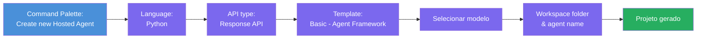
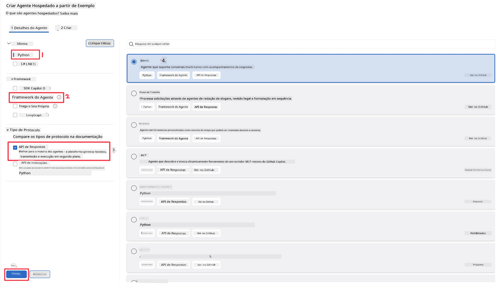
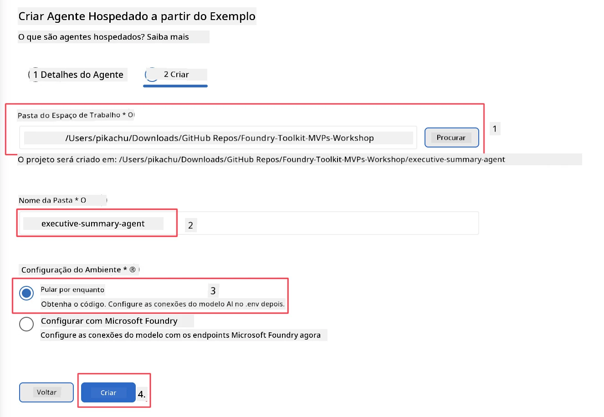

# Módulo 2 - Criar um Novo Agente Hospedado

⏱️ ~5 min

Neste módulo, você usa o Foundry Toolkit para **criar a estrutura de um projeto de agente hospedado**. O esqueleto gera toda a estrutura do projeto - `agent.yaml`, `main.py`, `Dockerfile`, `requirements.txt` e configuração de depuração do VS Code - para que você possa focar em personalizar o comportamento do agente.

> **Conceito chave:** A pasta `agent/` neste laboratório é um exemplo do que o Foundry Toolkit gera. Você não escreve esses arquivos do zero.

### Fluxo do assistente de scaffolding



---

## Passo 1: Abra o assistente de criação de Agente Hospedado

1. Pressione `Ctrl+Shift+P` para abrir a **Paleta de Comandos**.
2. Digite: **Foundry Toolkit: Create new Hosted Agent** e selecione.

> **Alternativa: Criar via Foundry Portal**
> Se preferir pelo navegador, você pode criar seu projeto em [https://ai.azure.com](https://ai.azure.com). Depois que o projeto estiver provisionado, volte ao VS Code e use a barra lateral do **Foundry Toolkit** para se conectar a ele.

> **Alternativa:** Clique no ícone **+** ao lado de **Hosted Agents (Preview)** na barra lateral do Foundry Toolkit.

## Passo 2: Escolha as configurações



1. Na seção de navegação/opções à esquerda selecione o seguinte:

| Menu | Seleção | Notas |
|--------|-----------|-------|
| **Language** | Python | C# também suportado |
| **Framework** | Agent Framework | Ponto de partida simples usando o Agent Framework SDK |
| **API type** | Response API | `POST /responses` - conversacional, com histórico gerenciado pela plataforma |
| **Template** | Basic | Ponto de partida simples usando o Agent Framework SDK |

2. Depois de selecionado, clique em **Next**



3. Na próxima janela, selecione o seguinte:

| Menu | Seleção | Notas |
|--------|-----------|-------|
| **Workspace folder** | Escolha uma pasta destino | Exemplo: `/workspace/Foundry_Toolkit_for_VSCode_Lab/` ou uma subpasta deste repositório |
| **Agent name** | Digite um nome | Exemplo: `executive-summary-agent` |
| **Environment Setup** | pule a configuração por agora |  |

Clique em **create** para criar o agente. Uma nova pasta será criada com o nome do agente hospedado.

## Passo 3: Inspecione o projeto gerado

Após o término do scaffolding, verifique se você vê esses arquivos no Explorador (`Ctrl+Shift+E`):

```
📂 my-agent/
├── .env                ← Environment variables (placeholders)
├── .vscode/
│   ├── launch.json     ← Debug config (F5 → run + Agent Inspector)
│   └── tasks.json      ← VS Code task definitions
├── agent.yaml          ← Agent definition (kind: hosted)
├── Dockerfile          ← Container config for deployment
├── main.py             ← Agent entry point (your main code)
└── requirements.txt    ← Python dependencies
```

### Explicação dos arquivos chave

| Arquivo | Propósito |
|------|---------|
| `agent.yaml` | Declara o agente como `kind: hosted`, mapeia variáveis de ambiente, define o protocolo `/responses` |
| `main.py` | Cria um `FoundryChatClient` → integra em um `Agent` com instruções → serve via `ResponsesHostServer` na porta 8088 |
| `Dockerfile` | Usa `python:3.12-slim`, instala dependências, expõe a porta 8088, executa `main.py` |
| `requirements.txt` | `agent-framework-foundry`, `agent-framework-foundry-hosting`, `mcp`, `debugpy` |

> **Importante:** Abra a pasta do agente gerado diretamente no VS Code (a própria pasta `agent/`) para que `.vscode/launch.json` e `tasks.json` funcionem corretamente com a depuração pelo F5.

---

### ✅ Ponto de Verificação

- [ ] Projeto criado com scaffolding contendo todos os arquivos esperados
- [ ] `agent.yaml` mostra `kind: hosted` e `protocol: responses`
- [ ] `main.py` importa `Agent`, `FoundryChatClient`, `ResponsesHostServer`
- [ ] A pasta do agente está aberta no VS Code como raiz do workspace

---

**Anterior:** [01 - Configuração](01-setup.md) · **Próximo:** [03 - Configurar e Codificar →](03-configure-and-code.md)

---

<!-- CO-OP TRANSLATOR DISCLAIMER START -->
**Aviso Legal**:
Este documento foi traduzido usando o serviço de tradução por IA [Co-op Translator](https://github.com/Azure/co-op-translator). Embora nos esforcemos pela precisão, por favor, esteja ciente de que traduções automatizadas podem conter erros ou imprecisões. O documento original em seu idioma nativo deve ser considerado a fonte autorizada. Para informações críticas, recomenda-se tradução profissional humana. Não nos responsabilizamos por quaisquer mal-entendidos ou interpretações incorretas decorrentes do uso desta tradução.
<!-- CO-OP TRANSLATOR DISCLAIMER END -->