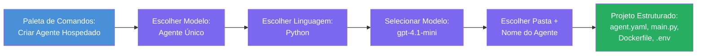

# Módulo 3 - Criar um Novo Agente Hospedado (Auto-Escaffolded pela Extensão Foundry)

Neste módulo, você usa a extensão Microsoft Foundry para **escaffoldar um novo projeto de [agente hospedado](https://learn.microsoft.com/azure/foundry/agents/concepts/hosted-agents)**. A extensão gera toda a estrutura do projeto para você - incluindo `agent.yaml`, `main.py`, `Dockerfile`, `requirements.txt`, um arquivo `.env` e uma configuração de depuração no VS Code. Após o scaffold, você personaliza esses arquivos com as instruções, ferramentas e configurações do seu agente.

> **Conceito chave:** A pasta `agent/` neste laboratório é um exemplo do que a extensão Foundry gera quando você executa este comando de scaffold. Você não escreve esses arquivos do zero - a extensão os cria, e então você os modifica.

### Fluxo do assistente de scaffold


---

## Passo 1: Abrir o assistente Criar Agente Hospedado

1. Pressione `Ctrl+Shift+P` para abrir a **Paleta de Comandos**.
2. Digite: **Microsoft Foundry: Create a New Hosted Agent** e selecione.
3. O assistente de criação do agente hospedado será aberto.

> **Caminho alternativo:** Você também pode acessar este assistente pela barra lateral Microsoft Foundry → clique no ícone **+** ao lado de **Agents** ou clique com o botão direito e selecione **Create New Hosted Agent**.

---

## Passo 2: Escolha seu template

O assistente pede para você selecionar um template. Você verá opções como:

| Template | Descrição | Quando usar |
|----------|------------|-------------|
| **Single Agent** | Um agente com seu próprio modelo, instruções e ferramentas opcionais | Este workshop (Lab 01) |
| **Multi-Agent Workflow** | Múltiplos agentes que colaboram em sequência | Lab 02 |

1. Selecione **Single Agent**.
2. Clique em **Next** (ou a seleção prossegue automaticamente).

---

## Passo 3: Escolha a linguagem de programação

1. Selecione **Python** (recomendado para este workshop).
2. Clique em **Next**.

> **C# também é suportado** se você preferir .NET. A estrutura de scaffold é semelhante (usa `Program.cs` em vez de `main.py`).

---

## Passo 4: Selecione seu modelo

1. O assistente mostra os modelos implantados no seu projeto Foundry (do Módulo 2).
2. Selecione o modelo que você implantou - por exemplo, **gpt-4.1-mini**.
3. Clique em **Next**.

> Se não ver nenhum modelo, volte para [Módulo 2](02-create-foundry-project.md) e implante um primeiro.

---

## Passo 5: Escolha a localização da pasta e nome do agente

1. Uma caixa de diálogo de arquivo abrirá - escolha uma **pasta de destino** onde o projeto será criado. Para este workshop:
   - Se está começando do zero: escolha qualquer pasta (exemplo: `C:\Projects\my-agent`)
   - Se estiver trabalhando dentro do repositório do workshop: crie uma subpasta nova dentro de `workshop/lab01-single-agent/agent/`
2. Digite um **nome** para o agente hospedado (exemplo: `executive-summary-agent` ou `my-first-agent`).
3. Clique em **Create** (ou pressione Enter).

---

## Passo 6: Aguarde a conclusão do scaffold

1. O VS Code abrirá uma **nova janela** com o projeto scaffoldado.
2. Aguarde alguns segundos até o projeto estar totalmente carregado.
3. Você deverá ver os seguintes arquivos no painel Explorer (`Ctrl+Shift+E`):

```
📂 my-first-agent/
├── .env                ← Environment variables (auto-generated with placeholders)
├── .vscode/
│   └── launch.json     ← Debug configuration (F5 to run + Agent Inspector)
├── agent.yaml          ← Agent definition (kind: hosted)
├── Dockerfile          ← Container configuration for deployment
├── main.py             ← Agent entry point (your main code file)
└── requirements.txt    ← Python dependencies
```

> **Esta é a mesma estrutura da pasta `agent/`** neste laboratório. A extensão Foundry gera esses arquivos automaticamente - você não precisa criá-los manualmente.

> **Nota do workshop:** Neste repositório do workshop, a pasta `.vscode/` está na **raiz do workspace** (não dentro de cada projeto). Ela contém um `launch.json` e `tasks.json` compartilhados com duas configurações de depuração - **"Lab01 - Single Agent"** e **"Lab02 - Multi-Agent"** - cada uma apontando para o `cwd` correto do respectivo laboratório. Ao pressionar F5, selecione a configuração correspondente ao laboratório que está trabalhando no menu suspenso.

---

## Passo 7: Entenda cada arquivo gerado

Reserve um momento para inspecionar cada arquivo que o assistente criou. Entendê-los é importante para o Módulo 4 (customização).

### 7.1 `agent.yaml` - Definição do agente

Abra o `agent.yaml`. Ele se parece com isto:

```yaml
# yaml-language-server: $schema=https://raw.githubusercontent.com/microsoft/AgentSchema/refs/heads/main/schemas/v1.0/ContainerAgent.yaml

kind: hosted
name: my-first-agent
description: >
  A hosted agent deployed to Microsoft Foundry Agent Service.
metadata:
  authors:
    - Microsoft
  tags:
    - Azure AI AgentServer
    - Microsoft Agent Framework
    - Hosted Agent
protocols:
  - protocol: responses
    version: v1
environment_variables:
  - name: AZURE_AI_PROJECT_ENDPOINT
    value: ${PROJECT_ENDPOINT}
  - name: AZURE_AI_MODEL_DEPLOYMENT_NAME
    value: ${MODEL_DEPLOYMENT_NAME}
dockerfile_path: Dockerfile
resources:
  cpu: '0.25'
  memory: 0.5Gi
```

**Campos chave:**

| Campo | Propósito |
|-------|-----------|
| `kind: hosted` | Declara que este é um agente hospedado (baseado em container, implantado no [Foundry Agent Service](https://learn.microsoft.com/azure/foundry/agents/overview)) |
| `protocols: responses v1` | O agente expõe o endpoint HTTP `/responses` compatível com OpenAI |
| `environment_variables` | Mapeia valores do `.env` para variáveis de ambiente do container no momento da implantação |
| `dockerfile_path` | Aponta para o Dockerfile usado para construir a imagem do container |
| `resources` | Alocação de CPU e memória para o container (0.25 CPU, 0.5Gi memória) |

### 7.2 `main.py` - Ponto de entrada do agente

Abra o `main.py`. Este é o arquivo Python principal onde a lógica do seu agente reside. O scaffold inclui:

```python
from agent_framework.azure import AzureAIAgentClient
from azure.ai.agentserver.agentframework import from_agent_framework
from azure.identity.aio import DefaultAzureCredential
```

**Importações chave:**

| Importação | Propósito |
|------------|-----------|
| `AzureAIAgentClient` | Conecta ao seu projeto Foundry e cria agentes via `.as_agent()` |
| [`DefaultAzureCredential`](https://learn.microsoft.com/azure/developer/python/sdk/authentication/credential-chains#defaultazurecredential-overview) | Gerencia autenticação (Azure CLI, login pelo VS Code, identidade gerenciada ou principal de serviço) |
| `from_agent_framework` | Encapsula o agente como um servidor HTTP expondo o endpoint `/responses` |

O fluxo principal é:
1. Criar uma credencial → criar um cliente → chamar `.as_agent()` para obter um agente (gerenciador de contexto async) → encapsular como servidor → executar

### 7.3 `Dockerfile` - Imagem do container

```dockerfile
FROM python:3.14-slim

WORKDIR /app

COPY ./ .

RUN pip install --upgrade pip && \
    if [ -f requirements.txt ]; then \
        pip install -r requirements.txt; \
    else \
        echo "No requirements.txt found" >&2; exit 1; \
    fi

EXPOSE 8088

CMD ["python", "main.py"]
```

**Detalhes principais:**
- Usa `python:3.14-slim` como imagem base.
- Copia todos os arquivos do projeto para `/app`.
- Atualiza `pip`, instala dependências do `requirements.txt`, falha rapidamente se esse arquivo estiver faltando.
- **Expõe a porta 8088** - esta é a porta requerida para agentes hospedados. Não a altere.
- Inicia o agente com `python main.py`.

### 7.4 `requirements.txt` - Dependências

```
agent-framework-azure-ai==1.0.0rc3
agent-framework-core==1.0.0rc3
azure-ai-agentserver-agentframework==1.0.0b16
azure-ai-agentserver-core==1.0.0b16
debugpy
agent-dev-cli
```

| Pacote | Propósito |
|--------|-----------|
| `agent-framework-azure-ai` | Integração Azure AI para o Microsoft Agent Framework |
| `agent-framework-core` | Runtime núcleo para construir agentes (inclui `python-dotenv`) |
| `azure-ai-agentserver-agentframework` | Runtime de servidor para agentes hospedados no Foundry Agent Service |
| `azure-ai-agentserver-core` | Abstrações núcleo do servidor de agentes |
| `debugpy` | Suporte para depuração em Python (permite depuração F5 no VS Code) |
| `agent-dev-cli` | CLI de desenvolvimento local para testar agentes (usado pela configuração de depuração/execução) |

---

## Entendendo o protocolo do agente

Agentes hospedados se comunicam via o protocolo da **OpenAI Responses API**. Quando está em execução (local ou na nuvem), o agente expõe um único endpoint HTTP:

```
POST http://localhost:8088/responses
Content-Type: application/json

{
  "input": "Your prompt here",
  "stream": false
}
```

O Foundry Agent Service chama este endpoint para enviar prompts do usuário e receber respostas do agente. Este é o mesmo protocolo usado pela API OpenAI, então seu agente é compatível com qualquer cliente que utilize o formato OpenAI Responses.

---

### Ponto de verificação

- [ ] O assistente de scaffold completou com sucesso e uma **nova janela do VS Code** foi aberta
- [ ] Você pode ver todos os 5 arquivos: `agent.yaml`, `main.py`, `Dockerfile`, `requirements.txt`, `.env`
- [ ] O arquivo `.vscode/launch.json` existe (permite depuração F5 - neste workshop está na raiz do workspace com configurações específicas do laboratório)
- [ ] Você leu cada arquivo e entende seu propósito
- [ ] Você entende que a porta `8088` é obrigatória e que o endpoint `/responses` é o protocolo

---

**Anterior:** [02 - Criar Projeto Foundry](02-create-foundry-project.md) · **Próximo:** [04 - Configurar & Código →](04-configure-and-code.md)

---

<!-- CO-OP TRANSLATOR DISCLAIMER START -->
**Aviso Legal**:  
Este documento foi traduzido usando o serviço de tradução por IA [Co-op Translator](https://github.com/Azure/co-op-translator). Embora nos esforcemos pela precisão, esteja ciente de que traduções automatizadas podem conter erros ou imprecisões. O documento original em seu idioma nativo deve ser considerado a fonte autoritativa. Para informações críticas, recomenda-se tradução profissional humana. Não nos responsabilizamos por quaisquer mal-entendidos ou interpretações equivocadas decorrentes do uso desta tradução.
<!-- CO-OP TRANSLATOR DISCLAIMER END -->