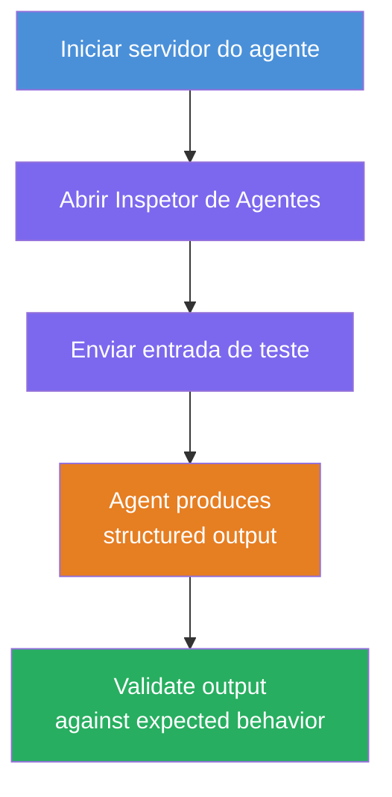
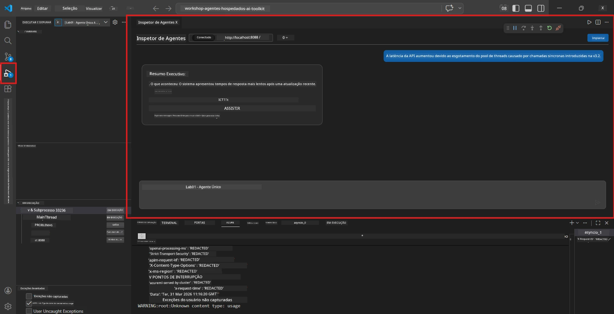
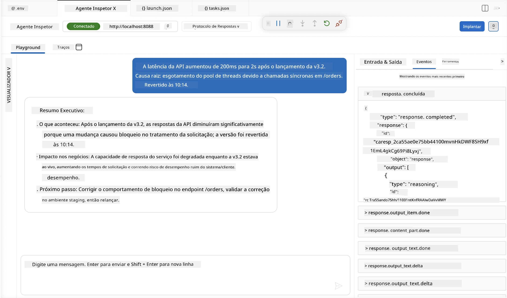

# Módulo 4 - Testar Localmente

⏱️ ~10 min

Neste módulo, você executa seu agente localmente e valida se ele funciona corretamente usando **testes funcionais no caminho feliz**. Você usará o Agent Inspector (interface visual) ou chamadas HTTP diretas para confirmar que o agente produz respostas estruturadas e precisas.

### Fluxo de testes local



---

## Opção 1: Pressione F5 - Depuração com Agent Inspector (recomendado)

### Iniciar o depurador

1. Abra a pasta **executive-summary-agent/** diretamente no VS Code (`Arquivo → Abrir pasta`).
2. Abra o painel **Executar e Depurar** (`Ctrl+Shift+D`).
3. Selecione **Depurar Servidor de Agente Local** no menu suspenso.
4. Pressione **F5** (ou clique em ▶ Iniciar Depuração).

> ⚠️ **Crítico: Selecione seu Interpretador Python**
> Se aparecer "ModuleNotFoundError" ou o depurador não iniciar, você deve informar ao VS Code para usar seu ambiente virtual:
  > 1. Pressione `Ctrl+Shift+P` $\rightarrow$ digite **Python: Selecionar Interpretador**.
  > 2. Selecione o interpretador localizado na pasta `.venv` do seu projeto (ex: `.\.venv\Scripts\python.exe` no Windows).
  > 3. Reinicie a sessão de depuração.
> Se continuar obtendo erros, atualize manualmente seu arquivo `tasks.json` da seguinte forma:
  > 1. Navegue até o arquivo `.vscode/tasks.json`
  > 2. Vá até o comando rotulado: `Executar Servidor HTTP de Agente/Workflow`
  > 3. Atualize o valor do comando assim: `"value": "${workspaceFolder}/.venv/bin/python",`

### O que acontece

1. O servidor HTTP inicia em `http://localhost:8088/responses`.
2. O painel **Agent Inspector** abre automaticamente - uma interface visual de chat para testes.
3. Pontos de interrupção são ativados em `main.py`.

Observe o Terminal para:
```
Starting executive summary hosted agent
Executive agent server running on http://localhost:8088
```

> **Se o Agent Inspector não abrir:** Pressione `Ctrl+Shift+P` → **Foundry Toolkit: Abrir Agent Inspector**.



> *A captura de tela pode mostrar a marca antiga 'AI TOOLKIT' de uma versão anterior da extensão.*

---

## Opção 2: Testar via Terminal (alternativa)

Inicie o agente em um terminal, envie requisições de outro:

```bash
# Terminal 1: Iniciar agente
cd executive-summary-agent/
source .venv/bin/activate
python main.py
```

```bash
# Terminal 2: Enviar teste (curl)
curl -sS -X POST http://localhost:8088/responses \
  -H "Content-Type: application/json" \
  -d '{"input": "The API latency increased due to thread pool exhaustion caused by sync calls in v3.2.", "stream": false}'
```

---

## Testes de cenário: Validação funcional no caminho feliz

Execute **todos os três** cenários abaixo. Eles validam que seu agente produz saídas corretas e estruturadas para entradas realistas.



### Cenário 1: Incidente de TI - Pico de latência na API

**Entrada:**
```
The API latency increased from 200ms to 2s after deploying v3.2.
Root cause: thread pool starvation from synchronous calls in /orders.
Rolled back at 10:14.
```

**Comportamento esperado:**
- ✅ Segue a estrutura do "Resumo Executivo" (O que aconteceu / Impacto no negócio / Próximo passo)
- ✅ Sem jargão técnico (sem "thread pool", sem "/orders", sem "v3.2")
- ✅ Declara claramente o impacto no negócio (ex: usuários sofreram atrasos)
- ✅ Inclui um próximo passo (ex: correção implementada, monitoramento ativo)

---

### Cenário 2: Pipeline de Dados - Falha no ETL

**Entrada:**
```
The nightly ETL job failed because the upstream schema changed. APAC dashboards show missing data.
```

**Comportamento esperado:**
- ✅ Resume a falha na atualização dos dados em linguagem simples
- ✅ Menciona o impacto no dashboard APAC
- ✅ Inclui um próximo passo de remediação
- ✅ NÃO menciona "ETL", "esquema" ou outros termos técnicos

---

### Cenário 3: Segurança - Credencial exposta

**Entrada:**
```
Static analysis flagged a hardcoded secret in the repository.
The secret may have been exposed in commit history.
```

**Comportamento esperado:**
- ✅ Descreve um problema de credencial/segurança em linguagem acessível a executivos
- ✅ Destaca risco potencial (acesso não autorizado)
- ✅ Informa ação de remediação (rotacionar credencial, auditoria)
- ✅ NÃO inclui termos como "análise estática", "histórico de commit" ou "código fixo"

---

## Critérios de validação

Para cada cenário, verifique:

| # | Critério | Condição para aprovação |
|---|----------|-----------------------|
| 1 | **Estrutura** | A resposta usa formato "Resumo Executivo" com os três tópicos |
| 2 | **Linguagem simples** | Sem jargão técnico que um executivo não entenderia |
| 3 | **Precisão** | Resumo reflete a entrada - sem detalhes fabricados |
| 4 | **Brevidade** | Resposta com menos de 100 palavras |
| 5 | **Próximo passo** | Uma ação ou mitigação clara é informada |

---

## Dicas de depuração

| Problema | Solução |
|---------|---------|
| Agente não inicia | Verifique os valores em `.env`, confirme se o venv está ativado, execute `pip install -r requirements.txt` |
| Resposta vazia ou genérica | Reveja as instruções em `main.py` - certifique-se de que o formato de saída está especificado |
| Resposta inclui jargão | Reforce as regras para "remover termos técnicos" nas instruções |
| Agent Inspector não abre | `Ctrl+Shift+P` → **Foundry Toolkit: Abrir Agent Inspector** |
| Erros do modelo no Terminal | Verifique se `AZURE_AI_MODEL_DEPLOYMENT_NAME` corresponde exatamente (case-sensitive) |

---

### ✅ Ponto de verificação

- [ ] Agente inicia localmente sem erros
- [ ] Agent Inspector abre e mostra uma interface de chat (se usar F5)
- [ ] **Cenário 1** (incidente de TI) - Resumo Executivo estruturado, sem jargão
- [ ] **Cenário 2** (pipeline de dados) - resumo relevante com impacto no negócio
- [ ] **Cenário 3** (alerta de segurança) - comunicação de risco adequada
- [ ] Todas as respostas seguem a estrutura definida de saída

> **Salve suas respostas** (copie ou faça captura de tela) - você as comparará com resultados na nuvem no Módulo 06.

---

**Anterior:** [03 - Configurar & Codificar](03-configure-and-code.md) · **Próximo:** [05 - Implantar no Foundry →](05-deploy-to-foundry.md)

---

<!-- CO-OP TRANSLATOR DISCLAIMER START -->
**Aviso Legal**:
Este documento foi traduzido usando o serviço de tradução por IA [Co-op Translator](https://github.com/Azure/co-op-translator). Embora nos esforcemos pela precisão, por favor, esteja ciente de que traduções automatizadas podem conter erros ou imprecisões. O documento original em seu idioma nativo deve ser considerado a fonte autorizada. Para informações críticas, recomenda-se tradução profissional humana. Não nos responsabilizamos por quaisquer mal-entendidos ou interpretações incorretas decorrentes do uso desta tradução.
<!-- CO-OP TRANSLATOR DISCLAIMER END -->