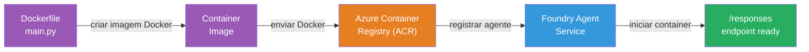
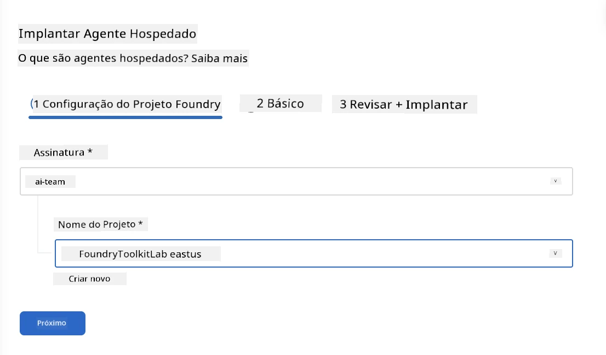
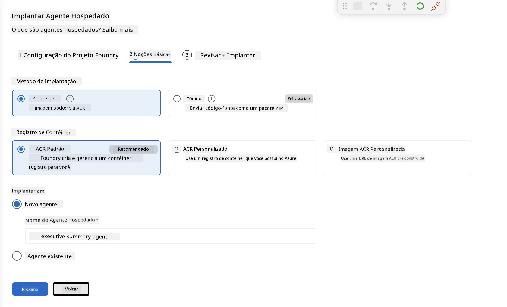
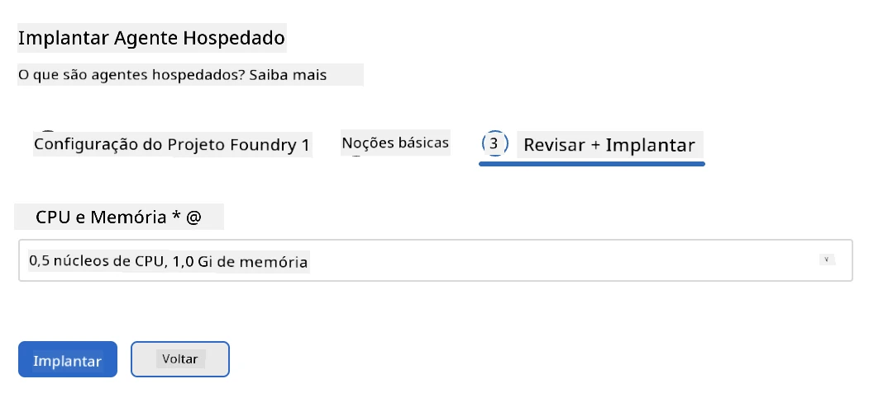
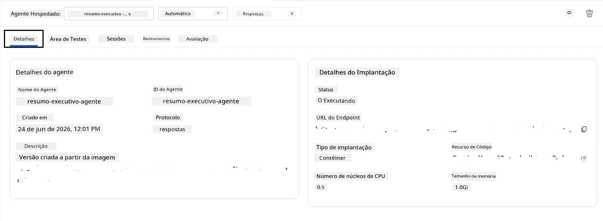

# Módulo 5 - Implantar no Serviço Foundry Agent

⏱️ ~10 min

> ⚠️ **Usuários do Caminho B:** Este módulo requer uma assinatura Foundry. Se você estiver usando o Foundry Local, pule para [Módulo 07 - Resumo](07-summary.md). Você concluiu com sucesso o fluxo de trabalho de desenvolvimento local!

Neste módulo, você implanta seu agente testado localmente no Microsoft Foundry como um **Agente Hospedado**. A implantação monta uma imagem de contêiner, a envia para o Azure Container Registry e inicia o agente na infraestrutura gerenciada do Foundry.

### Pipeline de implantação

---

## Verificação de pré-requisitos

Antes de implantar, verifique:

- [ ] O agente passou por todos os 3 cenários locais do [Módulo 04](04-test-locally.md)
- [ ] Você tem a função **Azure AI User** no nível do projeto ([Módulo 01, Atribuir RBAC](01-setup.md#deploy-a-model--assign-rbac))
- [ ] Você está conectado ao Azure no VS Code (o ícone de Contas mostra seu nome)

---

## Passo 1: Iniciar a implantação

### Opção A: Implantar pelo Agent Inspector (recomendado)

Se o Agent Inspector estiver aberto (da fase de teste):
1. Clique no botão **Deploy** no canto superior direito (ícone de nuvem ↑).

### Opção B: Implantar pela Paleta de Comandos

1. Pressione `Ctrl+Shift+P` → **Foundry Toolkit: Deploy Hosted Agent**.

---

## Passo 2: Configurar a implantação

O assistente solicitará que você informe:

| Prompt | Seleção |
|--------|-----------|
| **Assinatura** | Sua Assinatura do Azure |
| **Projeto alvo** | Seu projeto Foundry (ex.: `workshop-agents`) |

Clique em **próximo** para configurar seu agente.

| Prompt | Seleção |
|--------|-----------|
| **Método de implantação** | Contêiner |
| **Registro do contêiner** | **ACR Padrão** (Microsoft Foundry cria e gerencia um para você) |
| **Implantar em** | Novo Agente (nome, `executive-summary-agent`) |

Clique em **próximo** para revisar e implantar seu agente.

| Prompt | Seleção |
|--------|-----------|
| **CPU e memória** | **0.25 núcleos de CPU, 0.5 Gi de memória** (suficiente para o workshop) |

---

## Passo 3: Implantar e monitorar

1. Clique em **Deploy**.
2. Observe o painel **Output** (selecione **Microsoft Foundry** no menu suspenso).
3. A implantação passa pelas seguintes etapas:
   - **Docker build** - constrói o contêiner a partir do seu Dockerfile
   - **Docker push** - envia a imagem para o ACR (1–3 min na primeira implantação)
   - **Registro do agente** - cria o agente hospedado no Foundry
   - **Início do contêiner** - inicia com identidade gerenciada pelo sistema

4. Quando concluído, uma notificação aparece:
   > **my-agent foi implantado com sucesso.** `Ver logs` `Executar agente`

5. Clique em **Executar agente** para abrir o Agent Playground.

### Valores de status da implantação

| Status | Significado |
|--------|---------|
| **Running** | Contêiner pronto, agente respondendo |
| **Pending** | Contêiner iniciando - aguarde 30–60 segundos |
| **Failed** | Verifique os logs (veja solução de problemas abaixo) |

---

## Erros comuns na implantação

| Erro | Causa raiz | Correção |
|-------|-----------|-----|
| Permissão `agents/write` negada | Falta a função **Azure AI User** no nível do projeto | [Módulo 01, Atribuir RBAC](01-setup.md#deploy-a-model--assign-rbac) |
| Docker não está em execução | Docker Desktop não iniciado | Inicie o Docker Desktop → verifique `docker info` |
| Autorização do ACR | Identidade gerenciada não consegue puxar a imagem | Veja [Módulo 08 - Solução de problemas](08-troubleshooting.md) |

---

### ✅ Ponto de verificação

- [ ] Implantação concluída sem erros
- [ ] Agente aparece sob **Hosted Agents (Preview)** na barra lateral do Foundry
- [ ] Status do contêiner mostra **Running**
- [ ] Aba Agent Playground aberta mostrando detalhes do agente e URL do endpoint

---

**Anterior:** [04 - Testar Localmente](04-test-locally.md) · **Próximo:** [06 - Verificar no Playground →](06-verify-in-playground.md)

---

<!-- CO-OP TRANSLATOR DISCLAIMER START -->
**Aviso Legal**:
Este documento foi traduzido usando o serviço de tradução por IA [Co-op Translator](https://github.com/Azure/co-op-translator). Embora nos esforcemos pela precisão, por favor, esteja ciente de que traduções automatizadas podem conter erros ou imprecisões. O documento original em seu idioma nativo deve ser considerado a fonte autorizada. Para informações críticas, recomenda-se tradução profissional humana. Não nos responsabilizamos por quaisquer mal-entendidos ou interpretações incorretas decorrentes do uso desta tradução.
<!-- CO-OP TRANSLATOR DISCLAIMER END -->