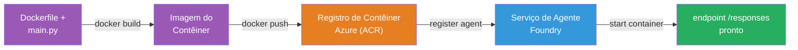
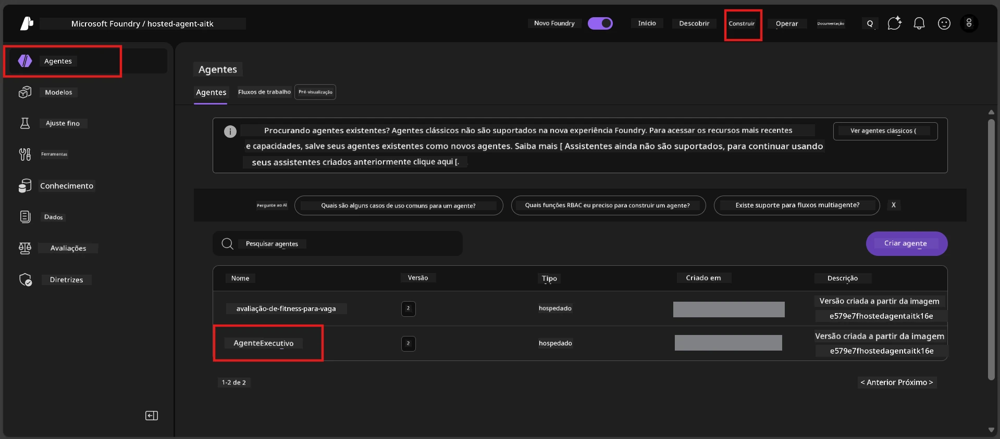

# Módulo 6 - Implantar no Serviço de Agente do Foundry

Neste módulo, você implanta seu agente testado localmente no Microsoft Foundry como um [**Agente Hospedado**](https://learn.microsoft.com/azure/foundry/agents/concepts/hosted-agents). O processo de implantação constrói uma imagem de contêiner Docker a partir do seu projeto, envia-a para o [Azure Container Registry (ACR)](https://learn.microsoft.com/azure/container-registry/container-registry-intro) e cria uma versão de agente hospedado no [Foundry Agent Service](https://learn.microsoft.com/azure/foundry/agents/overview).

### Pipeline de implantação


---

## Verificação de pré-requisitos

Antes de implantar, verifique cada item abaixo. Pular estes é a causa mais comum de falhas na implantação.

1. **O agente passa nos testes locais rápidos:**
   - Você completou todos os 4 testes no [Módulo 5](05-test-locally.md) e o agente respondeu corretamente.

2. **Você tem a função [Azure AI User](https://learn.microsoft.com/azure/foundry/concepts/rbac-foundry#built-in-roles):**
   - Esta foi atribuída no [Módulo 2, Etapa 3](02-create-foundry-project.md). Se não tiver certeza, verifique agora:
   - Portal Azure → recurso do seu projeto Foundry → **Controle de Acesso (IAM)** → aba **Atribuições de função** → pesquise seu nome → confirme que **Azure AI User** está listado.

3. **Você está logado no Azure no VS Code:**
   - Verifique o ícone de Contas no canto inferior esquerdo do VS Code. Seu nome de conta deve estar visível.

4. **(Opcional) Docker Desktop está em execução:**
   - O Docker é necessário apenas se a extensão do Foundry solicitar uma compilação local. Na maioria dos casos, a extensão lida automaticamente com a construção dos contêineres durante a implantação.
   - Se você tiver Docker instalado, verifique se está funcionando: `docker info`

---

## Etapa 1: Inicie a implantação

Você tem duas maneiras de implantar - ambas levam ao mesmo resultado.

### Opção A: Implantar pelo Agent Inspector (recomendado)

Se você estiver executando o agente com o depurador (F5) e o Agent Inspector estiver aberto:

1. Olhe para o **canto superior direito** do painel do Agent Inspector.
2. Clique no botão **Implantar** (ícone de nuvem com seta para cima ↑).
3. O assistente de implantação será aberto.

### Opção B: Implantar pelo Command Palette

1. Pressione `Ctrl+Shift+P` para abrir o **Command Palette**.
2. Digite: **Microsoft Foundry: Deploy Hosted Agent** e selecione.
3. O assistente de implantação será aberto.

---

## Etapa 2: Configure a implantação

O assistente guiará você pela configuração. Preencha cada solicitação:

### 2.1 Selecione o projeto alvo

1. Um dropdown mostra seus projetos Foundry.
2. Selecione o projeto que você criou no Módulo 2 (ex.: `workshop-agents`).

### 2.2 Selecione o arquivo agente para o contêiner

1. Será solicitado que você selecione o ponto de entrada do agente.
2. Escolha **`main.py`** (Python) - este é o arquivo que o assistente usa para identificar seu projeto de agente.

### 2.3 Configure os recursos

| Configuração | Valor recomendado | Observações |
|--------------|-------------------|-------------|
| **CPU**      | `0.25`            | Padrão, suficiente para o workshop. Aumente para cargas de produção |
| **Memória**  | `0.5Gi`           | Padrão, suficiente para o workshop |

Estes valores correspondem aos do `agent.yaml`. Você pode aceitar os padrões.

---

## Etapa 3: Confirme e implante

1. O assistente mostra um resumo da implantação com:
   - Nome do projeto alvo
   - Nome do agente (do `agent.yaml`)
   - Arquivo do contêiner e recursos
2. Revise o resumo e clique em **Confirmar e Implantar** (ou **Implantar**).
3. Acompanhe o progresso no VS Code.

### O que acontece durante a implantação (passo a passo)

A implantação é um processo em várias etapas. Acompanhe o painel **Output** do VS Code (selecione "Microsoft Foundry" no dropdown) para seguir:

1. **Build do Docker** - O VS Code constrói uma imagem de contêiner Docker a partir do seu `Dockerfile`. Você verá mensagens das camadas do Docker:
   ```
   Step 1/6 : FROM python:<version>-slim
   Step 2/6 : WORKDIR /app
   ...
   Successfully built abc123def456
   ```

2. **Push do Docker** - A imagem é enviada para o **Azure Container Registry (ACR)** associado ao seu projeto Foundry. Isso pode levar 1-3 minutos na primeira implantação (a imagem base tem mais de 100MB).

3. **Registro do agente** - O Foundry Agent Service cria um novo agente hospedado (ou uma nova versão se o agente já existir). Os metadados do agente do `agent.yaml` são usados.

4. **Início do contêiner** - O contêiner inicia na infraestrutura gerenciada do Foundry. A plataforma atribui uma [identidade gerenciada pelo sistema](https://learn.microsoft.com/azure/foundry/agents/concepts/agent-identity) e expõe o endpoint `/responses`.

> **A primeira implantação é mais lenta** (o Docker precisa enviar todas as camadas). Implantações subsequentes são mais rápidas porque o Docker usa cache para camadas não alteradas.

---

## Etapa 4: Verifique o status da implantação

Após o comando de implantação ser concluído:

1. Abra a barra lateral **Microsoft Foundry** clicando no ícone do Foundry na Barra de Atividades.
2. Expanda a seção **Hosted Agents (Preview)** dentro do seu projeto.
3. Você deve ver o nome do seu agente (ex.: `ExecutiveAgent` ou o nome do `agent.yaml`).
4. **Clique no nome do agente** para expandi-lo.
5. Você verá uma ou mais **versões** (ex.: `v1`).
6. Clique na versão para ver os **Detalhes do Contêiner**.
7. Verifique o campo **Status**:

   | Status | Significado |
   |--------|-------------|
   | **Started** ou **Running** | O contêiner está em execução e o agente está pronto |
   | **Pending** | O contêiner está iniciando (aguarde 30-60 segundos) |
   | **Failed** | Falha ao iniciar o contêiner (verifique os logs - veja a solução de problemas abaixo) |



> **Se o status ficar "Pending" por mais de 2 minutos:** O contêiner pode estar puxando a imagem base. Aguarde um pouco mais. Se continuar pendente, verifique os logs do contêiner.

---

## Erros comuns de implantação e correções

### Erro 1: Permissão negada - `agents/write`

```
Error: lacks the required data action 
Microsoft.CognitiveServices/accounts/AIServices/agents/write 
to perform POST /api/projects/{projectName}/assistants operation.
```

**Causa raiz:** Você não tem a função `Azure AI User` no nível do **projeto**.

**Passo a passo para corrigir:**

1. Abra [https://portal.azure.com](https://portal.azure.com).
2. Na barra de pesquisa, digite o nome do seu **projeto** Foundry e clique nele.
   - **Crítico:** Certifique-se de navegar para o recurso do **projeto** (tipo: "Microsoft Foundry project"), NÃO para o recurso pai da conta/hub.
3. Na navegação à esquerda, clique em **Controle de acesso (IAM)**.
4. Clique em **+ Adicionar** → **Adicionar atribuição de função**.
5. Na aba **Função**, pesquise por [**Azure AI User**](https://learn.microsoft.com/azure/foundry/concepts/rbac-foundry#built-in-roles) e selecione. Clique em **Avançar**.
6. Na aba **Membros**, selecione **Usuário, grupo ou entidade de serviço**.
7. Clique em **+ Selecionar membros**, pesquise seu nome/email, selecione-se e clique em **Selecionar**.
8. Clique em **Revisar + atribuir** → **Revisar + atribuir** novamente.
9. Aguarde 1-2 minutos para que a atribuição de função seja propagada.
10. **Tente implantar novamente** a partir da Etapa 1.

> A função deve estar no escopo do **projeto**, e não apenas no escopo da conta. Esta é a causa #1 mais comum de falhas na implantação.

### Erro 2: Docker não está em execução

```
Error: Docker build failed / Cannot connect to Docker daemon
```

**Correção:**
1. Inicie o Docker Desktop (encontre-o no menu Iniciar ou na bandeja do sistema).
2. Aguarde até mostrar "Docker Desktop is running" (30-60 segundos).
3. Verifique: `docker info` em um terminal.
4. **Específico para Windows:** Assegure que o backend WSL 2 está habilitado nas configurações do Docker Desktop → **Geral** → **Usar o mecanismo baseado em WSL 2**.
5. Tente implantar novamente.

### Erro 3: Autorização ACR - `AcrPullUnauthorized`

```
Error: AcrPullUnauthorized
```

**Causa raiz:** A identidade gerenciada do projeto Foundry não tem acesso para puxar a imagem do registro do contêiner.

**Correção:**
1. No Portal Azure, navegue até o seu **[Container Registry](https://learn.microsoft.com/azure/container-registry/container-registry-intro)** (ele está no mesmo grupo de recursos do seu projeto Foundry).
2. Vá para **Controle de acesso (IAM)** → **Adicionar** → **Adicionar atribuição de função**.
3. Selecione a função **[AcrPull](https://learn.microsoft.com/azure/container-registry/container-registry-roles)**.
4. Em Membros, selecione **Identidade gerenciada** → encontre a identidade gerenciada do projeto Foundry.
5. **Revisar + atribuir**.

> Isso normalmente é configurado automaticamente pela extensão Foundry. Se você vir este erro, pode indicar que a configuração automática falhou.

### Erro 4: Incompatibilidade de plataforma do contêiner (Apple Silicon)

Se estiver implantando a partir de um Mac Apple Silicon (M1/M2/M3), o contêiner deve ser construído para `linux/amd64`:

```bash
docker build --platform linux/amd64 -t myagent:v1 .
```

> A extensão Foundry lida com isso automaticamente para a maioria dos usuários.

---

### Checkpoint

- [ ] Comando de implantação concluído sem erros no VS Code
- [ ] O agente aparece em **Hosted Agents (Preview)** na barra lateral do Foundry
- [ ] Você clicou no agente → selecionou uma versão → visualizou os **Detalhes do Contêiner**
- [ ] O status do contêiner mostra **Started** ou **Running**
- [ ] (Se ocorreram erros) Você identificou o erro, aplicou a correção e reimplantou com sucesso

---

**Anterior:** [05 - Teste Localmente](05-test-locally.md) · **Próximo:** [07 - Verificar no Playground →](07-verify-in-playground.md)

---

<!-- CO-OP TRANSLATOR DISCLAIMER START -->
**Aviso Legal**:  
Este documento foi traduzido utilizando o serviço de tradução por IA [Co-op Translator](https://github.com/Azure/co-op-translator). Embora nos esforcemos pela precisão, esteja ciente de que traduções automatizadas podem conter erros ou imprecisões. O documento original em sua língua nativa deve ser considerado a fonte autorizada. Para informações críticas, recomenda-se tradução profissional humana. Não nos responsabilizamos por quaisquer mal-entendidos ou interpretações errôneas decorrentes do uso desta tradução.
<!-- CO-OP TRANSLATOR DISCLAIMER END -->