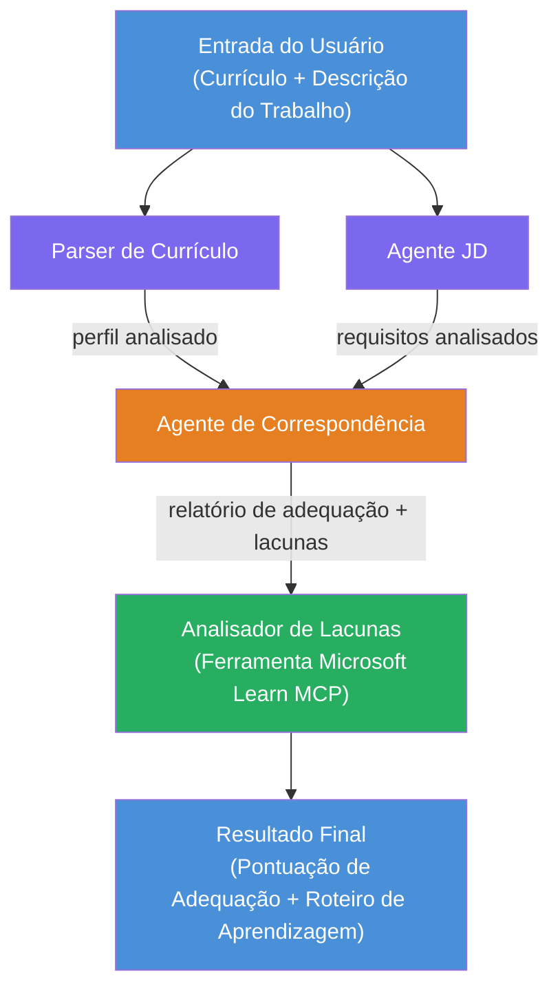

# Lab 02 - Fluxo de Trabalho Multi-Agente: Avaliador de Compatibilidade Currículo → Vaga

---

## O que você vai construir

Um **Avaliador de Compatibilidade Currículo → Vaga** - um fluxo de trabalho multi-agente onde quatro agentes especializados colaboram para avaliar o quão bem o currículo de um candidato corresponde a uma descrição de vaga, e então geram um roteiro personalizado de aprendizado para fechar as lacunas.

### Os agentes

| Agente | Função |
|--------|--------|
| **Parser de Currículo** | Extrai habilidades estruturadas, experiência, certificações do texto do currículo |
| **Agente de Descrição da Vaga** | Extrai habilidades requeridas/preferidas, experiência, certificações de uma descrição de vaga |
| **Agente de Compatibilidade** | Compara perfil versus requisitos → pontuação de compatibilidade (0-100) + habilidades correspondentes/faltantes |
| **Analisador de Lacunas** | Constrói um roteiro de aprendizado personalizado com recursos, cronogramas e projetos de ganhos rápidos |

### Fluxo da demonstração

Faça upload de um **currículo + descrição da vaga** → obtenha uma **pontuação de compatibilidade + habilidades faltantes** → receba um **roteiro personalizado de aprendizado**.

### Arquitetura do fluxo de trabalho

> Roxo = agentes em paralelo | Laranja = ponto de agregação | Verde = agente final com ferramentas. Veja [Módulo 1 - Entender a Arquitetura](docs/01-understand-multi-agent.md) e [Módulo 4 - Padrões de Orquestração](docs/04-orchestration-patterns.md) para diagramas detalhados e fluxo de dados.

### Tópicos abordados

- Criando um fluxo de trabalho multi-agente usando **WorkflowBuilder**
- Definindo papéis dos agentes e fluxo de orquestração (paralelo + sequencial)
- Padrões de comunicação inter-agentes
- Teste local com o Agent Inspector
- Implantando fluxos multi-agentes no Foundry Agent Service

---

## Pré-requisitos

Complete o Lab 01 antes:

- [Lab 01 - Agente Único](../lab01-single-agent/README.md)

---

## Começando

Veja as instruções completas de configuração, walkthrough do código e comandos de teste em:

- [Documentação Lab 2 - Pré-requisitos](docs/00-prerequisites.md)
- [Documentação Lab 2 - Caminho Completo de Aprendizado](docs/README.md)
- [Guia de execução do PersonalCareerCopilot](PersonalCareerCopilot/README.md)

## Padrões de orquestração (alternativas agenticas)

O Lab 2 inclui o fluxo padrão **paralelo → agregador → planejador**, e a documentação
também descreve padrões alternativos para demonstrar comportamento agentico mais forte:

- **Fan-out/Fan-in com consenso ponderado**
- **Passagem de revisor/crítico antes do roteiro final**
- **Roteador condicional** (seleção de caminho com base na pontuação de compatibilidade e habilidades faltantes)

Veja [docs/04-orchestration-patterns.md](docs/04-orchestration-patterns.md).

---

**Anterior:** [Lab 01 - Agente Único](../lab01-single-agent/README.md) · **Voltar para:** [Início do Workshop](../../README.md)

---

<!-- CO-OP TRANSLATOR DISCLAIMER START -->
**Aviso Legal**:  
Este documento foi traduzido utilizando o serviço de tradução automática [Co-op Translator](https://github.com/Azure/co-op-translator). Embora nos esforcemos para garantir a precisão, esteja ciente de que traduções automáticas podem conter erros ou imprecisões. O documento original em seu idioma nativo deve ser considerado a fonte autorizada. Para informações críticas, recomenda-se a tradução profissional humana. Não nos responsabilizamos por quaisquer mal-entendidos ou interpretações equivocadas decorrentes do uso desta tradução.
<!-- CO-OP TRANSLATOR DISCLAIMER END -->