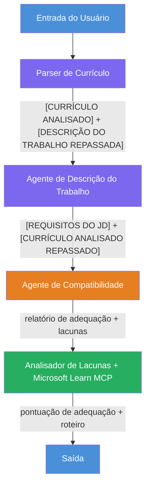

# Laboratório 02 - Fluxo de Trabalho Multiagente: Avaliador de Adequação de Currículo → Vaga

## Visão Geral

Neste laboratório prático, você construirá um **app multiagente com foco em fluxo de trabalho** usando Foundry Toolkit no VS Code e o implantará no Microsoft Foundry Agent Service.

**O que você construirá:** um Avaliador de Adequação de Currículo → Vaga que analisa um currículo e descrição da vaga, pontua a compatibilidade e cria um roteiro personalizado de aprendizado usando recursos do Microsoft Learn.

---

## Arquitetura

```mermaid
flowchart TD
    A["Entrada do Usuário"] --> B["Parser de Currículo"]
    B -->|"[CURRÍCULO ANALISADO] + [DESCRIÇÃO DO TRABALHO REPASSADA]"| C["Agente de Descrição do Trabalho"]
    C -->|"[REQUISITOS DO JD] + [CURRÍCULO ANALISADO REPASSADO]"| D["Agente de Compatibilidade"]
    D -->|relatório de adequação + lacunas| E["Analisador de Lacunas + Microsoft Learn MCP"]
    E -->|pontuação de adequação + roteiro| F["Saída"]

    style A fill:#4A90D9,color:#fff
    style B fill:#7B68EE,color:#fff
    style C fill:#7B68EE,color:#fff
    style D fill:#E67E22,color:#fff
    style E fill:#27AE60,color:#fff
    style F fill:#4A90D9,color:#fff
```

**Como funciona:**
1. O usuário cola um currículo e uma descrição da vaga.
2. **ResumeParser** analisa o currículo e copia a descrição da vaga literalmente para uma seção `[PASSAGEM DA DESCRIÇÃO DA VAGA]`.
3. **JD Agent** extrai os requisitos estruturados da passagem, depois encaminha o `[CURRÍCULO ANALISADO]` como `[PASSAGEM DO CURRÍCULO ANALISADO]`.
4. **MatchingAgent** compara `[PASSAGEM DO CURRÍCULO ANALISADO]` com `[REQUISITOS DA VAGA]` e gera uma pontuação de adequação.
5. **GapAnalyzer** transforma as lacunas em um roteiro prático e busca links reais do Microsoft Learn via MCP.

---

## Pré-requisitos

Complete primeiro o Laboratório 01:

- [Laboratório 01 - Agente Único](../lab01-single-agent/README.md)

---

## Parte 1: Leia os módulos em ordem

Veja o caminho completo de aprendizado em:

- [Documentação do Lab 2 - Pré-requisitos](docs/00-prerequisites.md)
- [Documentação do Lab 2 - Caminho Completo de Aprendizado](docs/README.md)
- [Guia de execução do PersonalCareerCopilot](PersonalCareerCopilot/README.md)

---

## Parte 2: Construa e teste o fluxo de trabalho

1. Use o assistente Foundry Toolkit para criar a base do projeto orientado ao fluxo de trabalho.
2. Copie os blocos de prompt e o gráfico do fluxo de trabalho de `PersonalCareerCopilot/main.py` para seu espaço de trabalho.
3. Execute localmente com o Agent Inspector e verifique todos os quatro agentes mais a ferramenta MCP.
4. Implante o agente hospedado no Foundry após passar nos testes locais.

---

## Padrões de orquestração

O Lab 02 inclui o fluxo padrão **fan-out → fan-in → sequencial**, e a documentação também descreve padrões alternativos de orquestração para experimentação.

- **Fan-out/Fan-in com consenso ponderado**
- **Passe de revisor/crítico antes do roteiro final**
- **Roteador condicional** baseado na pontuação de adequação e habilidades faltantes

Veja [docs/04-orchestration-patterns.md](docs/04-orchestration-patterns.md).

---

**Anterior:** [Laboratório 01 - Agente Único](../lab01-single-agent/README.md) · **Voltar para:** [Página Principal do Workshop](../../README.md)

---

<!-- CO-OP TRANSLATOR DISCLAIMER START -->
**Aviso Legal**:
Este documento foi traduzido usando o serviço de tradução por IA [Co-op Translator](https://github.com/Azure/co-op-translator). Embora nos esforcemos pela precisão, por favor, esteja ciente de que traduções automatizadas podem conter erros ou imprecisões. O documento original em seu idioma nativo deve ser considerado a fonte autorizada. Para informações críticas, recomenda-se tradução profissional humana. Não nos responsabilizamos por quaisquer mal-entendidos ou interpretações incorretas decorrentes do uso desta tradução.
<!-- CO-OP TRANSLATOR DISCLAIMER END -->