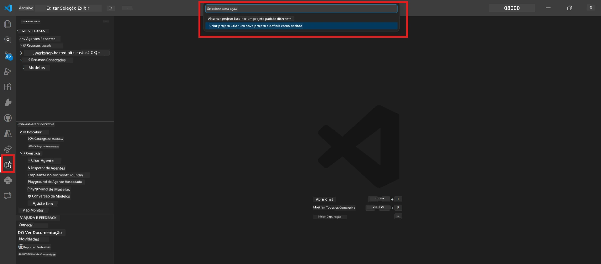

# Módulo 0 - Introdução

⏱️ ~10 min

> [!WARNING]
> **Prévia e limitações:** [Agentes hospedados](https://learn.microsoft.com/azure/foundry/agents/concepts/hosted-agents) estão atualmente em **prévia pública** - não recomendado para cargas de trabalho em produção. Alguns recursos mostrados neste workshop podem mudar conforme o serviço avança para GA.

## O que você vai construir

Neste laboratório, você vai estender as habilidades de agente único do Lab 01 para construir um **fluxo de trabalho multiagente** - o Avaliador de Compatibilidade Currículo → Vaga.

Você cola um **currículo** e uma **descrição de vaga**. Quatro agentes especializados processam a entrada sequencialmente e então retornam:
- Uma pontuação de compatibilidade (0–100 com detalhamento da pontuação)
- Uma lista de lacunas de habilidades e certificações
- Um roteiro personalizado de aprendizado com links reais do Microsoft Learn para cada lacuna

**O fluxo de trabalho utiliza:**
- **Microsoft Agent Framework** - `WorkflowBuilder` para orquestração sequencial de pipeline
- **Foundry Toolkit para VS Code** - scaffold, teste local, deploy
- **Um modelo de IA** (ex: `gpt-4.1-mini`) - usado pelos quatro agentes
- **Servidor Microsoft Learn MCP** - fornece links reais de recursos de aprendizado para cada lacuna de habilidade

---

## Escolha seu caminho

> ⚠️ **Continue com o mesmo caminho que usou no Lab 01.**

<details open>
<summary><strong>🅰️ Caminho A - Nuvem Azure (requer assinatura Azure)</strong></summary>

| | Detalhes |
|---|---|
| **Para quem é?** | Você completou o Lab 01 usando uma assinatura Azure |
| **Modelo** | Azure OpenAI via Foundry (ex: `gpt-4.1-mini`) |
| **Módulos cobertos** | Todos os módulos (00–09) |
| **Implantar na nuvem?** | ✅ Sim - implantação completa de ponta a ponta |

</details>

<details open>
<summary><strong>🅱️ Caminho B - Foundry Local (não precisa de assinatura Azure)</strong></summary>

| | Detalhes |
|---|---|
| **Para quem é?** | Você completou o Lab 01 usando Foundry Local |
| **Modelo** | Foundry Local (gratuito, roda na sua máquina) |
| **Módulos cobertos** | Módulos 00–05 (pula 06–07 - deploy e verificação na nuvem) |
| **Implantar na nuvem?** | ❌ Não - apenas testes locais via Agent Inspector |

</details>

---

## Verificação do Lab 01

O Lab 02 depende diretamente do Lab 01. Complete o Lab 01 antes de iniciar aqui.

Ainda não fez o Lab 01? Comece aqui: [Lab 01 - Introdução](../../lab01-single-agent/docs/00-prerequisites.md)

<details open>
<summary><strong>🅰️ Caminho A - Nuvem Azure</strong></summary>

```powershell
az account show --query "{name:name, id:id}" --output table
```

Se isso falhar, execute `az login`. Depois verifique no VS Code:

1. `Ctrl+Shift+P` → digite **Foundry Toolkit** → confirme que os comandos aparecem.
2. Clique no ícone **Foundry Toolkit** → seu projeto e modelo implantado mostram **Succeeded**.



> **RBAC:** Você atribuiu **Foundry User** no Lab 01. Se precisar reatribuir, veja [Lab 01, Módulo 1](../../lab01-single-agent/docs/01-setup.md#deploy-a-model--assign-rbac). O papel anteriormente era chamado de **Azure AI User** - mesmas permissões.

</details>

<details open>
<summary><strong>🅱️ Caminho B - Foundry Local</strong></summary>

```powershell
Invoke-WebRequest -Uri "http://localhost:5273/v1/health" -UseBasicParsing | Select-Object StatusCode
```

Esperado: `StatusCode: 200`. Se não, reinicie o Foundry Local pela barra lateral do Foundry Toolkit.

> Toda inferência roda na sua máquina. A única chamada externa é a ferramenta MCP para `https://learn.microsoft.com/api/mcp`.

</details>

---

## Novidades no Lab 02

| | Lab 01 | Lab 02 |
|--|--------|--------|
| Agentes | 1 | 4 (encadeados com WorkflowBuilder) |
| Modelo de scaffold | Básico - Agent Framework | Workflows - Agent Framework |
| Novo pacote | - | `mcp` |
| Orquestração | Agente conversacional único | Pipeline sequencial (WorkflowBuilder) |
| Nova ferramenta | - | `search_microsoft_learn_for_plan` (MCP) |

---

**Próximo:** [01 - Entenda a Arquitetura →](01-understand-multi-agent.md)

---

<!-- CO-OP TRANSLATOR DISCLAIMER START -->
**Aviso Legal**:
Este documento foi traduzido usando o serviço de tradução por IA [Co-op Translator](https://github.com/Azure/co-op-translator). Embora nos esforcemos pela precisão, por favor, esteja ciente de que traduções automatizadas podem conter erros ou imprecisões. O documento original em seu idioma nativo deve ser considerado a fonte autorizada. Para informações críticas, recomenda-se tradução profissional humana. Não nos responsabilizamos por quaisquer mal-entendidos ou interpretações incorretas decorrentes do uso desta tradução.
<!-- CO-OP TRANSLATOR DISCLAIMER END -->