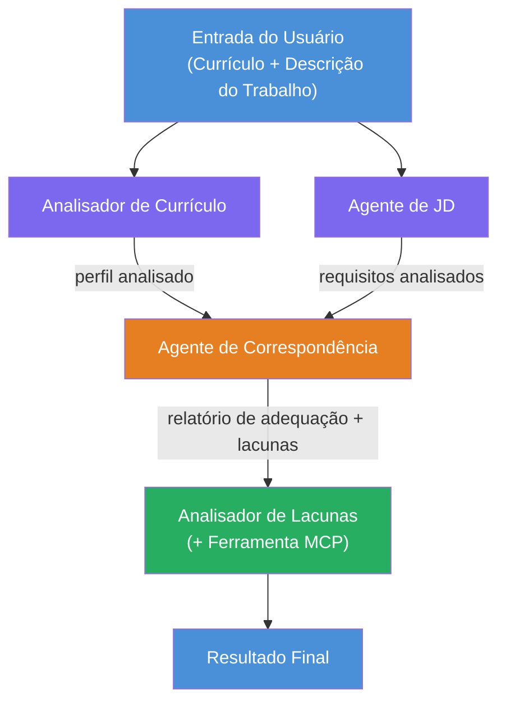
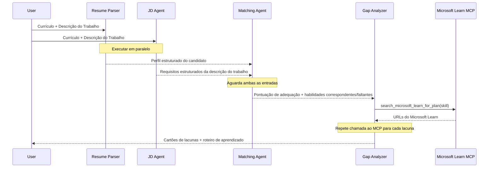
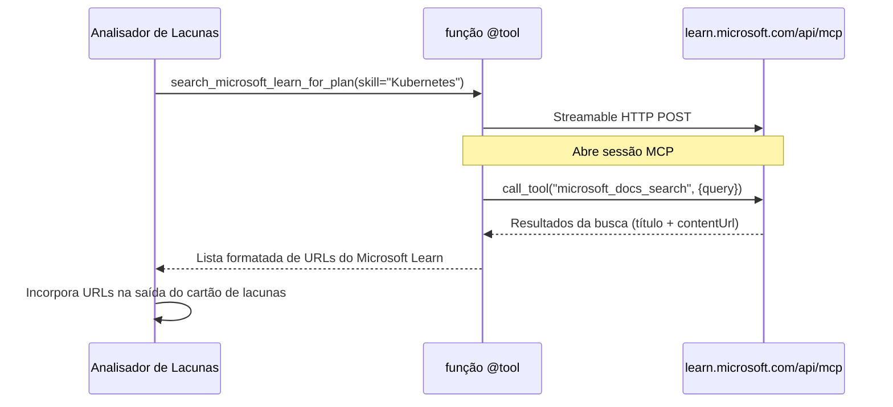

# Módulo 1 - Entenda a Arquitetura Multi-Agente

Neste módulo, você aprende a arquitetura do Avaliador de Compatibilidade Currículo → Vaga antes de escrever qualquer código. Entender o gráfico de orquestração, os papéis dos agentes e o fluxo de dados é fundamental para depurar e expandir [fluxos de trabalho multiagentes](https://learn.microsoft.com/azure/architecture/ai-ml/idea/multiple-agent-workflow-automation).

---

## O problema que isso resolve

Combinar um currículo com uma descrição de vaga envolve várias habilidades distintas:

1. **Parsing** - Extrair dados estruturados de texto não estruturado (currículo)
2. **Análise** - Extrair requisitos da descrição da vaga
3. **Comparação** - Avaliar o alinhamento entre os dois
4. **Planejamento** - Construir um roadmap de aprendizado para fechar lacunas

Um único agente fazendo todas as quatro tarefas em um único prompt frequentemente produz:
- Extração incompleta (ele corre na análise para chegar à pontuação)
- Pontuação superficial (sem detalhamento baseado em evidências)
- Roadmaps genéricos (não personalizados para as lacunas específicas)

Dividindo em **quatro agentes especializados**, cada um foca em sua tarefa com instruções dedicadas, produzindo saída de maior qualidade em cada etapa.

---

## Os quatro agentes

Cada agente é um agente completo do [Microsoft Foundry](https://learn.microsoft.com/azure/foundry/agents/concepts/hosted-agents) criado via `AzureAIAgentClient.as_agent()`. Eles compartilham o mesmo deployment de modelo, mas têm instruções diferentes e (opcionalmente) ferramentas distintas.

| # | Nome do Agente | Papel | Entrada | Saída |
|---|-----------|------|-------|--------|
| 1 | **ResumeParser** | Extrai perfil estruturado do texto do currículo | Texto bruto do currículo (do usuário) | Perfil do candidato, Habilidades técnicas, Habilidades interpessoais, Certificações, Experiência no domínio, Realizações |
| 2 | **JobDescriptionAgent** | Extrai requisitos estruturados de uma descrição de vaga | Texto bruto da vaga (do usuário, encaminhado via ResumeParser) | Visão geral do cargo, Habilidades requeridas, Habilidades preferidas, Experiência, Certificações, Educação, Responsabilidades |
| 3 | **MatchingAgent** | Calcula pontuação de compatibilidade baseada em evidências | Saídas do ResumeParser + JobDescriptionAgent | Pontuação de compatibilidade (0-100 com detalhamento), Habilidades correspondentes, Habilidades faltantes, Lacunas |
| 4 | **GapAnalyzer** | Constrói roadmap de aprendizado personalizado | Saída do MatchingAgent | Cartões de lacunas (por habilidade), Ordem de aprendizado, Cronograma, Recursos do Microsoft Learn |

---

## O gráfico de orquestração

O fluxo de trabalho usa **distribuição paralela (fan-out)** seguida de **agregação sequencial**:


> **Legenda:** Roxo = agentes paralelos, Laranja = ponto de agregação, Verde = agente final com ferramentas

### Como os dados fluem


1. **O usuário envia** uma mensagem contendo currículo e descrição da vaga.
2. **ResumeParser** recebe a entrada completa do usuário e extrai um perfil estruturado do candidato.
3. **JobDescriptionAgent** recebe a entrada do usuário em paralelo e extrai requisitos estruturados.
4. **MatchingAgent** recebe saídas de **ambos** ResumeParser e JobDescriptionAgent (o framework espera ambos completarem antes de executar MatchingAgent).
5. **GapAnalyzer** recebe a saída do MatchingAgent e chama a **ferramenta Microsoft Learn MCP** para buscar recursos reais de aprendizado para cada lacuna.
6. A **saída final** é a resposta do GapAnalyzer, que inclui a pontuação de compatibilidade, cartões de lacunas e um roadmap de aprendizado completo.

### Por que a distribuição paralela importa

ResumeParser e JobDescriptionAgent executam **em paralelo** porque nenhum depende do outro. Isso:
- Reduz a latência total (ambos rodam simultaneamente em vez de sequencialmente)
- É uma divisão natural (analisar currículo vs analisar descrição da vaga são tarefas independentes)
- Demonstra um padrão comum multi-agente: **fan-out → agregar → agir**

---

## WorkflowBuilder no código

Veja como o gráfico acima mapeia para chamadas da API [`WorkflowBuilder`](https://learn.microsoft.com/agent-framework/workflows/agents-in-workflows) em `main.py`:

```python
from agent_framework import WorkflowBuilder

workflow = (
    WorkflowBuilder(
        name="ResumeJobFitEvaluator",
        start_executor=resume_parser,       # Primeiro agente a receber a entrada do usuário
        output_executors=[gap_analyzer],     # Agente final cujo resultado é retornado
    )
    .add_edge(resume_parser, jd_agent)      # ResumeParser → Agente de Descrição de Vaga
    .add_edge(resume_parser, matching_agent) # ResumeParser → Agente de Correspondência
    .add_edge(jd_agent, matching_agent)      # Agente de Descrição de Vaga → Agente de Correspondência
    .add_edge(matching_agent, gap_analyzer)  # Agente de Correspondência → Analisador de Lacunas
    .build()
)
```

**Entendendo as bordas:**

| Borda | O que significa |
|------|--------------|
| `resume_parser → jd_agent` | O agente de descrição de vaga recebe a saída do ResumeParser |
| `resume_parser → matching_agent` | MatchingAgent recebe a saída do ResumeParser |
| `jd_agent → matching_agent` | MatchingAgent também recebe a saída do agente de descrição de vaga (espera ambos) |
| `matching_agent → gap_analyzer` | GapAnalyzer recebe a saída do MatchingAgent |

Como `matching_agent` tem **duas bordas de entrada** (`resume_parser` e `jd_agent`), o framework automaticamente espera os dois terminarem antes de rodar o agente Matching.

---

## A ferramenta MCP

O agente GapAnalyzer tem uma ferramenta: `search_microsoft_learn_for_plan`. Esta é uma **[ferramenta MCP](https://learn.microsoft.com/agent-framework/agents/tools/hosted-mcp-tools)** que chama a API do Microsoft Learn para buscar recursos de aprendizado curados.

### Como funciona

```python
@tool
async def search_microsoft_learn_for_plan(
    skill: str, role: str = "", max_results: int = 5
) -> str:
    """Search Microsoft Learn MCP and return curated official links."""
    # Conecta-se a https://learn.microsoft.com/api/mcp via HTTP transmissível
    # Chama a ferramenta 'microsoft_docs_search' no servidor MCP
    # Retorna lista formatada de URLs do Microsoft Learn
```

### Fluxo da chamada MCP


1. GapAnalyzer decide que precisa de recursos de aprendizado para uma habilidade (ex.: "Kubernetes")
2. O framework chama `search_microsoft_learn_for_plan(skill="Kubernetes")`
3. A função abre uma conexão [Streamable HTTP](https://learn.microsoft.com/agent-framework/agents/tools/hosted-mcp-tools) para `https://learn.microsoft.com/api/mcp`
4. Ela chama a ferramenta `microsoft_docs_search` no [servidor MCP](https://learn.microsoft.com/azure/foundry/agents/how-to/tools/model-context-protocol)
5. O servidor MCP retorna resultados de busca (título + URL)
6. A função formata os resultados e os retorna como string
7. GapAnalyzer usa os URLs retornados na saída dos cartões de lacunas

### Logs MCP esperados

Quando a ferramenta roda, você verá entradas de log como:

```
GET https://learn.microsoft.com/api/mcp → 405 (Method Not Allowed)
POST https://learn.microsoft.com/api/mcp → 200
DELETE https://learn.microsoft.com/api/mcp → 405 (Method Not Allowed)
```

**Estes são normais.** O cliente MCP faz sondagens com GET e DELETE durante a inicialização - esses retornando 405 são comportamento esperado. A chamada real da ferramenta usa POST e retorna 200. Só se preocupe se as chamadas POST falharem.

---

## Padrão de criação de agentes

Cada agente é criado usando o **gerenciador de contexto assíncrono [`AzureAIAgentClient.as_agent()`](https://learn.microsoft.com/python/api/overview/azure/ai-agents-readme)**. Este é o padrão do Foundry SDK para criar agentes que são automaticamente limpos:

```python
async with (
    get_credential() as credential,
    AzureAIAgentClient(
        project_endpoint=PROJECT_ENDPOINT,
        model_deployment_name=MODEL_DEPLOYMENT_NAME,
        credential=credential,
    ).as_agent(
        name="ResumeParser",
        instructions=RESUME_PARSER_INSTRUCTIONS,
    ) as resume_parser,
    # ... repetir para cada agente ...
):
    # Todos os 4 agentes existem aqui
    workflow = create_workflow(resume_parser, jd_agent, matching_agent, gap_analyzer)
```

**Pontos-chave:**
- Cada agente obtém sua própria instância de `AzureAIAgentClient` (o SDK requer que o nome do agente esteja escopado ao cliente)
- Todos os agentes compartilham o mesmo `credential`, `PROJECT_ENDPOINT` e `MODEL_DEPLOYMENT_NAME`
- O bloco `async with` garante que todos os agentes sejam limpos quando o servidor for encerrado
- O GapAnalyzer adicionalmente recebe `tools=[search_microsoft_learn_for_plan]`

---

## Inicialização do servidor

Após criar agentes e construir o workflow, o servidor inicia:

```python
from azure.ai.agentserver.agentframework import from_agent_framework

agent = create_workflow(resume_parser, jd_agent, matching_agent, gap_analyzer)
await from_agent_framework(agent).run_async()
```

`from_agent_framework()` encapsula o workflow como um servidor HTTP expondo o endpoint `/responses` na porta 8088. Este é o mesmo padrão do Lab 01, mas o "agente" agora é o gráfico completo do [workflow](https://learn.microsoft.com/agent-framework/workflows/as-agents).

---

### Checkpoint

- [ ] Você entende a arquitetura com 4 agentes e o papel de cada agente
- [ ] Você pode traçar o fluxo de dados: Usuário → ResumeParser → (paralelo) Agente JD + MatchingAgent → GapAnalyzer → Saída
- [ ] Você entende por que MatchingAgent espera tanto ResumeParser quanto Agente JD (duas bordas de entrada)
- [ ] Você entende a ferramenta MCP: o que faz, como é chamada e que logs GET 405 são normais
- [ ] Você entende o padrão `AzureAIAgentClient.as_agent()` e por que cada agente tem sua própria instância cliente
- [ ] Você consegue ler o código `WorkflowBuilder` e mapear para o gráfico visual

---

**Anterior:** [00 - Prerequisites](00-prerequisites.md) · **Próximo:** [02 - Scaffold the Multi-Agent Project →](02-scaffold-multi-agent.md)

---

<!-- CO-OP TRANSLATOR DISCLAIMER START -->
**Aviso Legal**:  
Este documento foi traduzido utilizando o serviço de tradução por IA [Co-op Translator](https://github.com/Azure/co-op-translator). Embora nos esforcemos para garantir a precisão, esteja ciente de que traduções automáticas podem conter erros ou imprecisões. O documento original em seu idioma nativo deve ser considerado a fonte autorizada. Para informações críticas, recomenda-se a tradução profissional realizada por humanos. Não nos responsabilizamos por quaisquer mal-entendidos ou interpretações equivocadas decorrentes do uso desta tradução.
<!-- CO-OP TRANSLATOR DISCLAIMER END -->