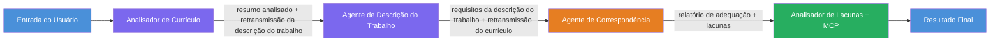

# Módulo 1 - Entenda a Arquitetura

⏱️ ~5 min

Antes de escrever qualquer código, aqui está uma visão rápida do que você está construindo e como funciona.

---

## O que você está construindo

Você cola um **currículo** e uma **descrição de vaga**. O fluxo retorna:

- Uma pontuação de adequação (0–100 com detalhamento)
- Uma lista de lacunas de habilidades e certificações
- Um roteiro de aprendizado personalizado com links do Microsoft Learn para cada lacuna

---

## Os quatro agentes

Um único agente tentando analisar, pontuar e planejar tudo ao mesmo tempo tende a se apressar e produzir um resultado superficial. Dividir o trabalho em quatro agentes especializados traz melhores resultados:

| Agente | O que ele faz |
|-------|-------------|
| **ResumeParser** | Analisa o currículo; copia a descrição de vaga verbatim para `[JOB DESCRIPTION PASS-THROUGH]` para os agentes seguintes |
| **JobDescriptionAgent** | Extrai os requisitos da descrição de vaga do pass-through; encaminha `[PARSED RESUME]` à frente como `[PARSED RESUME PASS-THROUGH]` |
| **MatchingAgent** | Compara as duas seções rotuladas; produz uma pontuação de adequação de 0–100 e lista de lacunas |
| **GapAnalyzer** | Constrói um roteiro de aprendizado; busca no Microsoft Learn para cada lacuna |

---

## O gráfico de orquestração

O fluxo é um **pipeline sequencial** - cada agente passa sua saída para o próximo:


```mermaid
flowchart LR
    A["Entrada do Usuário"] --> B["Analisador de Currículo"]
    B -- "resumo analisado + retransmissão da descrição do trabalho" --> C["Agente de Descrição do Trabalho"]
    C -- "requisitos da descrição do trabalho + retransmissão do currículo" --> D["Agente de Correspondência"]
    D -- "relatório de adequação + lacunas" --> E["Analisador de Lacunas + MCP"]
    E --> F["Resultado Final"]

    style A fill:#4A90D9,color:#fff
    style B fill:#7B68EE,color:#fff
    style C fill:#7B68EE,color:#fff
    style D fill:#E67E22,color:#fff
    style E fill:#27AE60,color:#fff
    style F fill:#4A90D9,color:#fff
```

1. **ResumeParser** recebe a entrada do usuário, analisa o currículo e copia a descrição de vaga para `[JOB DESCRIPTION PASS-THROUGH]`.
2. **JD Agent** extrai requisitos estruturados e encaminha `[PARSED RESUME PASS-THROUGH]` à frente.
3. **MatchingAgent** compara as duas seções e produz uma pontuação de adequação e uma lista de lacunas.
4. **GapAnalyzer** constrói o roteiro e chama a ferramenta Microsoft Learn MCP para cada lacuna.

---

## Como isso se mapeia para o código

Em `main.py`, você descreve esse gráfico com `WorkflowBuilder`:

```python
workflow_agent = (
    WorkflowBuilder(
        start_executor=resume_executor,       # primeiro agente a receber a entrada do usuário
        output_executors=[gap_executor],      # último agente - sua saída é a resposta
    )
    .add_edge(resume_executor, jd_executor)       # ResumeParser → Agente JD
    .add_edge(jd_executor, matching_executor)     # Agente JD → MatchingAgent
    .add_edge(matching_executor, gap_executor)    # MatchingAgent → GapAnalyzer
    .build()
    .as_agent()
)
```

Cada `Agent` é encapsulado em um `AgentExecutor`. As chamadas `add_edge()` definem um pipeline estritamente sequencial - cada agente recebe apenas a saída do seu predecessor direto.

> `context_mode="last_agent"` significa que cada executor vê apenas a saída do seu predecessor direto. ResumeParser e JD Agent encaminham dados à frente em seções rotuladas para que cada agente a jusante tenha exatamente o que precisa.

---

## A ferramenta MCP

GapAnalyzer tem uma ferramenta: `search_microsoft_learn_for_plan`. Ela conecta-se a `https://learn.microsoft.com/api/mcp` e retorna links reais do Microsoft Learn para cada lacuna de habilidade.

Quando a ferramenta é executada, você verá estes logs - todos esperados:

```
GET  https://learn.microsoft.com/api/mcp → 405   ← connection probe, normal
POST https://learn.microsoft.com/api/mcp → 200   ← actual tool call
DELETE https://learn.microsoft.com/api/mcp → 405 ← cleanup probe, normal
```

Preocupe-se somente se o `POST` retornar um erro.

---

**Anterior:** [00 - Pré-requisitos](00-prerequisites.md) · **Próximo:** [02 - Estruture o Projeto →](02-scaffold-multi-agent.md)

---

<!-- CO-OP TRANSLATOR DISCLAIMER START -->
**Aviso Legal**:
Este documento foi traduzido usando o serviço de tradução por IA [Co-op Translator](https://github.com/Azure/co-op-translator). Embora nos esforcemos pela precisão, por favor, esteja ciente de que traduções automatizadas podem conter erros ou imprecisões. O documento original em seu idioma nativo deve ser considerado a fonte autorizada. Para informações críticas, recomenda-se tradução profissional humana. Não nos responsabilizamos por quaisquer mal-entendidos ou interpretações incorretas decorrentes do uso desta tradução.
<!-- CO-OP TRANSLATOR DISCLAIMER END -->