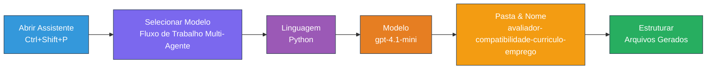
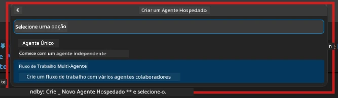

# Módulo 2 - Estruture o Projeto Multi-Agente

Neste módulo, você usa a [extensão Microsoft Foundry](https://marketplace.visualstudio.com/items?itemName=TeamsDevApp.vscode-ai-foundry) para **estruturar um projeto de fluxo de trabalho multi-agente**. A extensão gera toda a estrutura do projeto - `agent.yaml`, `main.py`, `Dockerfile`, `requirements.txt`, `.env` e configuração de depuração. Você então personaliza esses arquivos nos Módulos 3 e 4.

> **Nota:** A pasta `PersonalCareerCopilot/` neste laboratório é um exemplo completo e funcional de um projeto multi-agente personalizado. Você pode criar um projeto novo (recomendado para aprendizado) ou estudar o código existente diretamente.

---

## Passo 1: Abra o assistente Create Hosted Agent


1. Pressione `Ctrl+Shift+P` para abrir a **Paleta de Comandos**.
2. Digite: **Microsoft Foundry: Create a New Hosted Agent** e selecione.
3. O assistente de criação de agente hospedado é aberto.

> **Alternativa:** Clique no ícone **Microsoft Foundry** na Barra de Atividades → clique no ícone **+** ao lado de **Agents** → **Create New Hosted Agent**.

---

## Passo 2: Escolha o template Multi-Agent Workflow

O assistente pede para selecionar um template:

| Template | Descrição | Quando usar |
|----------|-------------|-------------|
| Single Agent | Um agente com instruções e ferramentas opcionais | Laboratório 01 |
| **Multi-Agent Workflow** | Múltiplos agentes que colaboram via WorkflowBuilder | **Este laboratório (Lab 02)** |

1. Selecione **Multi-Agent Workflow**.
2. Clique em **Next**.



---

## Passo 3: Escolha a linguagem de programação

1. Selecione **Python**.
2. Clique em **Next**.

---

## Passo 4: Selecione seu modelo

1. O assistente mostra os modelos implantados no seu projeto Foundry.
2. Selecione o mesmo modelo usado no Laboratório 01 (ex.: **gpt-4.1-mini**).
3. Clique em **Next**.

> **Dica:** [`gpt-4.1-mini`](https://learn.microsoft.com/azure/foundry/foundry-models/concepts/models-sold-directly-by-azure#gpt-41-series) é recomendado para desenvolvimento - é rápido, barato e lida bem com fluxos de trabalho multi-agente. Troque para `gpt-4.1` para implantação final em produção se desejar saída de maior qualidade.

---

## Passo 5: Escolha a localização da pasta e nome do agente

1. Uma janela de seleção de arquivos abre. Escolha uma pasta destino:
   - Se estiver seguindo o repositório do workshop: navegue até `workshop/lab02-multi-agent/` e crie uma nova subpasta
   - Se estiver começando do zero: escolha qualquer pasta
2. Digite um **nome** para o agente hospedado (ex.: `resume-job-fit-evaluator`).
3. Clique em **Create**.

---

## Passo 6: Aguarde o término da criação da estrutura

1. O VS Code abre uma nova janela (ou atualiza a janela atual) com o projeto estruturado.
2. Você deve ver esta estrutura de arquivos:

```
resume-job-fit-evaluator/
├── .env                ← Environment variables (placeholders)
├── .vscode/
│   └── launch.json     ← Debug configuration
├── agent.yaml          ← Agent definition (kind: hosted)
├── Dockerfile          ← Container configuration
├── main.py             ← Multi-agent workflow code (scaffold)
└── requirements.txt    ← Python dependencies
```

> **Nota do workshop:** No repositório do workshop, a pasta `.vscode/` está na **raiz do workspace** com `launch.json` e `tasks.json` compartilhados. As configurações de depuração do Laboratório 01 e 02 estão ambas incluídas. Ao pressionar F5, selecione **"Lab02 - Multi-Agent"** no menu suspenso.

---

## Passo 7: Entenda os arquivos estruturados (específicos multi-agente)

A estrutura multi-agente difere da estrutura single-agent em vários aspectos importantes:

### 7.1 `agent.yaml` - Definição do agente

```yaml
kind: hosted
name: resume-job-fit-evaluator
description: >
  A multi-agent workflow that evaluates resume-to-job fit.
metadata:
  authors:
    - Microsoft
  tags:
    - Multi-Agent Workflow
    - Resume Evaluator
protocols:
  - protocol: responses
    version: v1
environment_variables:
  - name: PROJECT_ENDPOINT
    value: ${PROJECT_ENDPOINT}
  - name: MODEL_DEPLOYMENT_NAME
    value: ${MODEL_DEPLOYMENT_NAME}
```

**Diferença chave do Laboratório 01:** A seção `environment_variables` pode incluir variáveis adicionais para endpoints MCP ou outras configurações de ferramentas. O `name` e `description` refletem o uso multi-agente.

### 7.2 `main.py` - Código do fluxo de trabalho multi-agente

A estrutura inclui:
- **Múltiplas strings de instrução para agentes** (uma constante por agente)
- **Múltiplos gerenciadores de contexto [`AzureAIAgentClient.as_agent()`](https://learn.microsoft.com/python/api/overview/azure/ai-agents-readme)** (um para cada agente)
- **[`WorkflowBuilder`](https://learn.microsoft.com/agent-framework/workflows/agents-in-workflows)** para conectar os agentes
- **`from_agent_framework()`** para servir o fluxo de trabalho como endpoint HTTP

```python
from agent_framework import WorkflowBuilder, tool
from agent_framework.azure import AzureAIAgentClient
from azure.ai.agentserver.agentframework import from_agent_framework
```

A importação adicional [`WorkflowBuilder`](https://learn.microsoft.com/agent-framework/workflows/agents-in-workflows) é novidade em relação ao Laboratório 01.

### 7.3 `requirements.txt` - Dependências adicionais

O projeto multi-agente usa os mesmos pacotes base do Laboratório 01, além de quaisquer pacotes relacionados ao MCP:

```
agent-framework-azure-ai==1.0.0rc3
agent-framework-core==1.0.0rc3
azure-ai-agentserver-agentframework==1.0.0b16
azure-ai-agentserver-core==1.0.0b16
debugpy
agent-dev-cli --pre
```

> **Importante sobre versões:** O pacote `agent-dev-cli` requer a flag `--pre` no `requirements.txt` para instalar a última versão preview. Isso é necessário para compatibilidade do Agent Inspector com `agent-framework-core==1.0.0rc3`. Veja [Módulo 8 - Solução de Problemas](08-troubleshooting.md) para detalhes de versões.

| Pacote | Versão | Propósito |
|---------|---------|---------|
| [`agent-framework-azure-ai`](https://learn.microsoft.com/agent-framework/overview/) | `1.0.0rc3` | Integração Azure AI para [Microsoft Agent Framework](https://github.com/microsoft/agent-framework) |
| [`agent-framework-core`](https://learn.microsoft.com/agent-framework/overview/) | `1.0.0rc3` | Runtime central (inclui WorkflowBuilder) |
| `azure-ai-agentserver-agentframework` | `1.0.0b16` | Runtime do servidor de agente hospedado |
| `azure-ai-agentserver-core` | `1.0.0b16` | Abstrações centrais do servidor de agentes |
| `debugpy` | latest | Depuração Python (F5 no VS Code) |
| `agent-dev-cli` | `--pre` | CLI de desenvolvimento local + backend Agent Inspector |

### 7.4 `Dockerfile` - Igual ao Laboratório 01

O Dockerfile é idêntico ao do Laboratório 01 - copia arquivos, instala dependências do `requirements.txt`, expõe a porta 8088 e executa `python main.py`.

```dockerfile
FROM python:3.14-slim
WORKDIR /app
COPY ./ .
RUN pip install --upgrade pip && \
    if [ -f requirements.txt ]; then \
        pip install -r requirements.txt; \
    else \
      echo "No requirements.txt found" >&2; exit 1; \
    fi
EXPOSE 8088
CMD ["python", "main.py"]
```

---

### Ponto de verificação

- [ ] Assistente de estruturação concluído → nova estrutura do projeto visível
- [ ] Você consegue ver todos os arquivos: `agent.yaml`, `main.py`, `Dockerfile`, `requirements.txt`, `.env`
- [ ] `main.py` inclui a importação de `WorkflowBuilder` (confirma que o template multi-agente foi selecionado)
- [ ] `requirements.txt` inclui tanto `agent-framework-core` quanto `agent-framework-azure-ai`
- [ ] Você entende como a estrutura multi-agente difere da single-agent (múltiplos agentes, WorkflowBuilder, ferramentas MCP)

---

**Anterior:** [01 - Entender a Arquitetura Multi-Agente](01-understand-multi-agent.md) · **Próximo:** [03 - Configurar Agentes & Ambiente →](03-configure-agents.md)

---

<!-- CO-OP TRANSLATOR DISCLAIMER START -->
**Aviso Legal**:
Este documento foi traduzido utilizando o serviço de tradução por IA [Co-op Translator](https://github.com/Azure/co-op-translator). Embora nos esforcemos para garantir a precisão, esteja ciente de que traduções automatizadas podem conter erros ou imprecisões. O documento original em seu idioma nativo deve ser considerado a fonte autorizada. Para informações críticas, recomenda-se tradução profissional humana. Não nos responsabilizamos por quaisquer mal-entendidos ou interpretações equivocadas decorrentes do uso desta tradução.
<!-- CO-OP TRANSLATOR DISCLAIMER END -->