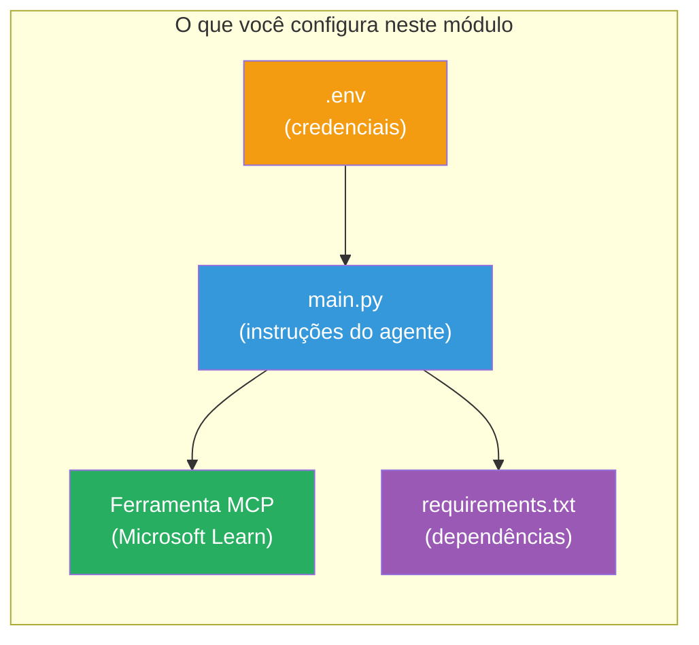

# Módulo 3 - Configurar Agentes, Ferramenta MCP e Ambiente

Neste módulo, você personaliza o projeto multiagente gerado. Você escreverá instruções para os quatro agentes, configurará a ferramenta MCP para Microsoft Learn, definirá variáveis de ambiente e instalará dependências.


> **Referência:** O código completo funcional está em [`PersonalCareerCopilot/main.py`](../../../../../workshop/lab02-multi-agent/PersonalCareerCopilot/main.py). Use-o como referência ao construir o seu próprio.

---

## Passo 1: Configurar variáveis de ambiente

1. Abra o arquivo **`.env`** na raiz do seu projeto.
2. Preencha os detalhes do seu projeto Foundry:

   ```env
   PROJECT_ENDPOINT=https://<your-account>.services.ai.azure.com/api/projects/<your-project>
   MODEL_DEPLOYMENT_NAME=gpt-4.1-mini
   ```

3. Salve o arquivo.

### Onde encontrar esses valores

| Valor | Como encontrar |
|-------|----------------|
| **Endpoint do projeto** | Barra lateral do Microsoft Foundry → clique no seu projeto → URL do endpoint na visualização de detalhes |
| **Nome do deployment do modelo** | Barra lateral do Foundry → expanda o projeto → **Models + endpoints** → nome ao lado do modelo implantado |

> **Segurança:** Nunca faça commit de `.env` no controle de versão. Adicione-o ao `.gitignore` caso ainda não esteja.

### Mapeamento das variáveis de ambiente

O `main.py` multiagente lê tanto os nomes padrão quanto os específicos do workshop:

```python
PROJECT_ENDPOINT = os.getenv("AZURE_AI_PROJECT_ENDPOINT") or os.getenv("PROJECT_ENDPOINT")
MODEL_DEPLOYMENT_NAME = os.getenv(
    "AZURE_AI_MODEL_DEPLOYMENT_NAME",
    os.getenv("MODEL_DEPLOYMENT_NAME", "gpt-4.1-mini"),
)
MICROSOFT_LEARN_MCP_ENDPOINT = os.getenv(
    "MICROSOFT_LEARN_MCP_ENDPOINT", "https://learn.microsoft.com/api/mcp"
)
```

O endpoint do MCP tem um padrão sensato - você não precisa defini-lo no `.env` a menos que queira sobrescrevê-lo.

---

## Passo 2: Escrever instruções para os agentes

Este é o passo mais crítico. Cada agente precisa de instruções cuidadosamente elaboradas que definem seu papel, formato de saída e regras. Abra `main.py` e crie (ou modifique) as constantes de instrução.

### 2.1 Agente de Análise de Currículo

```python
RESUME_PARSER_INSTRUCTIONS = """\
You are the Resume Parser.
Extract resume text into a compact, structured profile for downstream matching.

Output exactly these sections:
1) Candidate Profile
2) Technical Skills (grouped categories)
3) Soft Skills
4) Certifications & Awards
5) Domain Experience
6) Notable Achievements

Rules:
- Use only explicit or strongly implied evidence.
- Do not invent skills, titles, or experience.
- Keep concise bullets; no long paragraphs.
- If input is not a resume, return a short warning and request resume text.
"""
```

**Por que essas seções?** O MatchingAgent precisa de dados estruturados para pontuar. Seções consistentes tornam a passagem entre agentes confiável.

### 2.2 Agente de Descrição de Vaga

```python
JOB_DESCRIPTION_INSTRUCTIONS = """\
You are the Job Description Analyst.
Extract a structured requirement profile from a JD.

Output exactly these sections:
1) Role Overview
2) Required Skills
3) Preferred Skills
4) Experience Required
5) Certifications Required
6) Education
7) Domain / Industry
8) Key Responsibilities

Rules:
- Keep required vs preferred clearly separated.
- Only use what the JD states; do not invent hidden requirements.
- Flag vague requirements briefly.
- If input is not a JD, return a short warning and request JD text.
"""
```

**Por que separar obrigatório vs preferencial?** O MatchingAgent usa pesos diferentes para cada um (Habilidades Obrigatórias = 40 pontos, Habilidades Preferenciais = 10 pontos).

### 2.3 Agente de Correspondência

```python
MATCHING_AGENT_INSTRUCTIONS = """\
You are the Matching Agent.
Compare parsed resume output vs JD output and produce an evidence-based fit report.

Scoring (100 total):
- Required Skills 40
- Experience 25
- Certifications 15
- Preferred Skills 10
- Domain Alignment 10

Output exactly these sections:
1) Fit Score (with breakdown math)
2) Matched Skills
3) Missing Skills
4) Partially Matched
5) Experience Alignment
6) Certification Gaps
7) Overall Assessment

Rules:
- Be objective and evidence-only.
- Keep partial vs missing separate.
- Keep Missing Skills precise; it feeds roadmap planning.
"""
```

**Por que pontuação explícita?** Pontuação reprodutível possibilita comparar execuções e depurar problemas. A escala de 100 pontos é fácil de interpretar para usuários finais.

### 2.4 Agente de Análise de Lacunas

```python
GAP_ANALYZER_INSTRUCTIONS = """\
You are the Gap Analyzer and Roadmap Planner.
Create a practical upskilling plan from the matching report.

Microsoft Learn MCP usage (required):
- For EVERY High and Medium priority gap, call tool `search_microsoft_learn_for_plan`.
- Use returned Learn links in Suggested Resources.
- Prefer Microsoft Learn for free resources.

CRITICAL: You MUST produce a SEPARATE detailed gap card for EVERY skill listed in
the Missing Skills and Certification Gaps sections of the matching report. Do NOT
skip or combine gaps. Do NOT summarize multiple gaps into one card.

Output format:
1) Personalized Learning Roadmap for [Role Title]
2) One DETAILED card per gap (produce ALL cards, not just the first):
   - Skill
   - Priority (High/Medium/Low)
   - Current Level
   - Target Level
   - Suggested Resources (include Learn URL from tool results)
   - Estimated Time
   - Quick Win Project
3) Recommended Learning Order (numbered list)
4) Timeline Summary (week-by-week)
5) Motivational Note

Rules:
- Produce every gap card before writing the summary sections.
- Keep it specific, realistic, and actionable.
- Tailor to candidate's existing stack.
- If fit >= 80, focus on polish/interview readiness.
- If fit < 40, be honest and provide a staged path.
"""
```

**Por que ênfase em "CRÍTICO"?** Sem instruções explícitas para produzir TODAS as cartas de lacunas, o modelo tende a gerar apenas 1-2 cartas e resumir o restante. O bloco "CRÍTICO" previne essa truncagem.

---

## Passo 3: Definir a ferramenta MCP

O GapAnalyzer usa uma ferramenta que chama o [servidor MCP do Microsoft Learn](https://learn.microsoft.com/azure/foundry/agents/how-to/tools/model-context-protocol). Adicione isso em `main.py`:

```python
import json
from agent_framework import tool
from mcp.client.session import ClientSession
from mcp.client.streamable_http import streamable_http_client

@tool
async def search_microsoft_learn_for_plan(
    skill: str, role: str = "", max_results: int = 5
) -> str:
    """Search Microsoft Learn MCP and return curated official links for roadmap planning."""
    query = " ".join(part for part in [skill, role, "learning path module"] if part).strip()
    query = query or "job skills learning path"

    try:
        async with streamable_http_client(MICROSOFT_LEARN_MCP_ENDPOINT) as (
            read_stream, write_stream, _,
        ):
            async with ClientSession(read_stream, write_stream) as session:
                await session.initialize()
                result = await session.call_tool(
                    "microsoft_docs_search", {"query": query}
                )

        if not result.content:
            return (
                "No results returned from Microsoft Learn MCP. "
                "Fallback: https://learn.microsoft.com/training/support/catalog-api"
            )

        payload_text = getattr(result.content[0], "text", "")
        data = json.loads(payload_text) if payload_text else {}
        items = data.get("results", [])[:max(1, min(max_results, 10))]

        if not items:
            return f"No direct Microsoft Learn results found for '{skill}'."

        lines = [f"Microsoft Learn resources for '{skill}':"]
        for i, item in enumerate(items, start=1):
            title = item.get("title") or item.get("url") or "Microsoft Learn Resource"
            url = item.get("url") or item.get("link") or ""
            lines.append(f"{i}. {title} - {url}".rstrip(" -"))
        return "\n".join(lines)
    except Exception as ex:
        return (
            f"Microsoft Learn MCP lookup unavailable. Reason: {ex}. "
            "Fallbacks: https://learn.microsoft.com/api/mcp"
        )
```

### Como a ferramenta funciona

| Passo | O que acontece |
|-------|----------------|
| 1 | GapAnalyzer decide que precisa de recursos para uma habilidade (ex.: "Kubernetes") |
| 2 | Framework chama `search_microsoft_learn_for_plan(skill="Kubernetes")` |
| 3 | A função abre conexão [HTTP Streamable](https://learn.microsoft.com/agent-framework/agents/tools/hosted-mcp-tools) para `https://learn.microsoft.com/api/mcp` |
| 4 | Chama `microsoft_docs_search` no [servidor MCP](https://learn.microsoft.com/azure/foundry/agents/how-to/tools/model-context-protocol) |
| 5 | O servidor MCP retorna resultados de busca (título + URL) |
| 6 | A função formata os resultados como lista numerada |
| 7 | GapAnalyzer incorpora os URLs na carta de lacuna |

### Dependências MCP

As bibliotecas cliente MCP são incluídas transitoriamente via [`agent-framework-core`](https://learn.microsoft.com/agent-framework/overview/). Você **não** precisa adicioná-las separadamente no `requirements.txt`. Se ocorrerem erros de importação, verifique:

```powershell
pip list | Select-String "mcp"
```

Esperado: pacote `mcp` está instalado (versão 1.x ou superior).

---

## Passo 4: Conectar os agentes e o fluxo de trabalho

### 4.1 Criar agentes com gerenciadores de contexto

```python
from contextlib import asynccontextmanager

@asynccontextmanager
async def create_agents():
    async with (
        get_credential() as credential,
        AzureAIAgentClient(
            project_endpoint=PROJECT_ENDPOINT,
            model_deployment_name=MODEL_DEPLOYMENT_NAME,
            credential=credential,
        ).as_agent(
            name="ResumeParser",
            instructions=RESUME_PARSER_INSTRUCTIONS,
        ) as resume_parser,
        AzureAIAgentClient(
            project_endpoint=PROJECT_ENDPOINT,
            model_deployment_name=MODEL_DEPLOYMENT_NAME,
            credential=credential,
        ).as_agent(
            name="JobDescriptionAgent",
            instructions=JOB_DESCRIPTION_INSTRUCTIONS,
        ) as jd_agent,
        AzureAIAgentClient(
            project_endpoint=PROJECT_ENDPOINT,
            model_deployment_name=MODEL_DEPLOYMENT_NAME,
            credential=credential,
        ).as_agent(
            name="MatchingAgent",
            instructions=MATCHING_AGENT_INSTRUCTIONS,
        ) as matching_agent,
        AzureAIAgentClient(
            project_endpoint=PROJECT_ENDPOINT,
            model_deployment_name=MODEL_DEPLOYMENT_NAME,
            credential=credential,
        ).as_agent(
            name="GapAnalyzer",
            instructions=GAP_ANALYZER_INSTRUCTIONS,
            tools=[search_microsoft_learn_for_plan],
        ) as gap_analyzer,
    ):
        yield resume_parser, jd_agent, matching_agent, gap_analyzer
```

**Pontos-chave:**
- Cada agente tem sua **própria** instância `AzureAIAgentClient`
- Apenas o GapAnalyzer recebe `tools=[search_microsoft_learn_for_plan]`
- `get_credential()` retorna [`ManagedIdentityCredential`](https://learn.microsoft.com/python/api/overview/azure/identity-readme#managed-identity-support) no Azure, [`DefaultAzureCredential`](https://learn.microsoft.com/azure/developer/python/sdk/authentication/credential-chains#defaultazurecredential-overview) localmente

### 4.2 Construir o grafo do fluxo de trabalho

```python
def create_workflow(resume_parser, jd_agent, matching_agent, gap_analyzer):
    workflow = (
        WorkflowBuilder(
            name="ResumeJobFitEvaluator",
            start_executor=resume_parser,
            output_executors=[gap_analyzer],
        )
        .add_edge(resume_parser, jd_agent)
        .add_edge(resume_parser, matching_agent)
        .add_edge(jd_agent, matching_agent)
        .add_edge(matching_agent, gap_analyzer)
        .build()
    )
    return workflow.as_agent()
```

> Veja [Workflows as Agents](https://learn.microsoft.com/agent-framework/workflows/as-agents) para entender o padrão `.as_agent()`.

### 4.3 Iniciar o servidor

```python
async def main() -> None:
    validate_configuration()
    async with create_agents() as (resume_parser, jd_agent, matching_agent, gap_analyzer):
        agent = create_workflow(resume_parser, jd_agent, matching_agent, gap_analyzer)
        from azure.ai.agentserver.agentframework import from_agent_framework
        await from_agent_framework(agent).run_async()

if __name__ == "__main__":
    asyncio.run(main())
```

---

## Passo 5: Criar e ativar o ambiente virtual

### 5.1 Criar o ambiente

```powershell
cd workshop\lab02-multi-agent\PersonalCareerCopilot
python -m venv .venv
```

### 5.2 Ativá-lo

**PowerShell (Windows):**
```powershell
.\.venv\Scripts\Activate.ps1
```

**macOS/Linux:**
```bash
source .venv/bin/activate
```

### 5.3 Instalar dependências

```powershell
pip install -r requirements.txt
```

> **Nota:** A linha `agent-dev-cli --pre` no `requirements.txt` garante a instalação da versão preview mais recente. Isto é necessário para compatibilidade com `agent-framework-core==1.0.0rc3`.

### 5.4 Verificar instalação

```powershell
pip list | Select-String "agent-framework|agentserver|agent-dev"
```

Saída esperada:
```
agent-dev-cli                  0.0.1b260316
agent-framework-azure-ai       1.0.0rc3
agent-framework-core            1.0.0rc3
azure-ai-agentserver-agentframework 1.0.0b16
azure-ai-agentserver-core      1.0.0b16
```

> **Se o `agent-dev-cli` mostrar uma versão antiga** (ex.: `0.0.1b260119`), o Agent Inspector falhará com erros 403/404. Atualize: `pip install agent-dev-cli --pre --upgrade`

---

## Passo 6: Verificar autenticação

Execute a mesma verificação de autenticação do Lab 01:

```powershell
az account show --query "{name:name, id:id}" --output table
```

Se falhar, execute [`az login`](https://learn.microsoft.com/cli/azure/authenticate-azure-cli-interactively).

Para fluxos multiagentes, os quatro agentes compartilham a mesma credencial. Se a autenticação funcionar para um, funciona para todos.

---

### Ponto de verificação

- [ ] `.env` tem valores válidos para `PROJECT_ENDPOINT` e `MODEL_DEPLOYMENT_NAME`
- [ ] Todas as 4 constantes de instrução dos agentes estão definidas em `main.py` (ResumeParser, JD Agent, MatchingAgent, GapAnalyzer)
- [ ] A ferramenta MCP `search_microsoft_learn_for_plan` está definida e registrada com o GapAnalyzer
- [ ] `create_agents()` cria os 4 agentes com instâncias individuais `AzureAIAgentClient`
- [ ] `create_workflow()` constrói o grafo correto com `WorkflowBuilder`
- [ ] Ambiente virtual criado e ativado (`(.venv)` visível)
- [ ] `pip install -r requirements.txt` executado sem erros
- [ ] `pip list` mostra todos os pacotes esperados nas versões corretas (rc3 / b16)
- [ ] `az account show` retorna sua assinatura

---

**Anterior:** [02 - Scaffold Multi-Agent Project](02-scaffold-multi-agent.md) · **Próximo:** [04 - Orchestration Patterns →](04-orchestration-patterns.md)

---

<!-- CO-OP TRANSLATOR DISCLAIMER START -->
**Aviso Legal**:
Este documento foi traduzido utilizando o serviço de tradução por IA [Co-op Translator](https://github.com/Azure/co-op-translator). Embora nos esforcemos pela precisão, por favor, esteja ciente de que traduções automáticas podem conter erros ou imprecisões. O documento original em seu idioma nativo deve ser considerado a fonte autoritativa. Para informações críticas, recomenda-se a tradução profissional feita por humanos. Não nos responsabilizamos por quaisquer mal-entendidos ou interpretações incorretas decorrentes do uso desta tradução.
<!-- CO-OP TRANSLATOR DISCLAIMER END -->