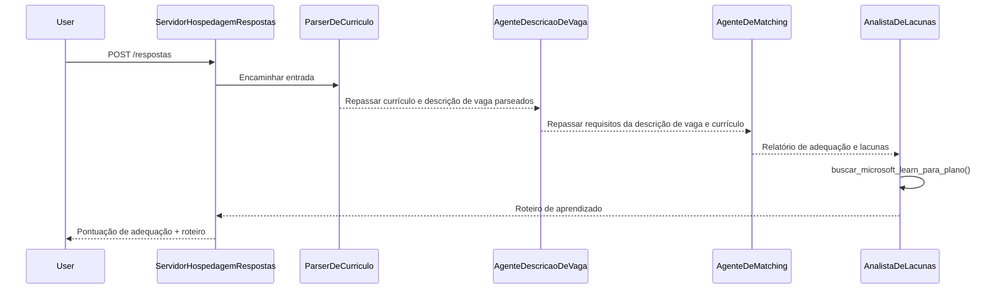

# Módulo 3 - Configurar Instruções, Ambiente e Instalar Dependências

⏱️ ~15 min

Neste módulo, você transforma o esqueleto criado no scaffold em **seu** fluxo de trabalho multiagente - definindo variáveis de ambiente, escrevendo instruções para agentes, adicionando a ferramenta MCP, conectando o grafo do fluxo de trabalho e instalando dependências.

> **Referência:** O código completo funcionando está em [`PersonalCareerCopilot/main.py`](../../../../../workshop/lab02-multi-agent/PersonalCareerCopilot/main.py). Use-o como referência enquanto constrói seu próprio grafo de fluxo de trabalho e blocos de prompt.

---

## Como os quatro agentes se encaixam


```mermaid
sequenceDiagram
    participant User
    participant Server as ServidorHospedagemRespostas
    participant RP as ParserDeCurriculo
    participant JD as AgenteDescricaoDeVaga
    participant MA as AgenteDeMatching
    participant GA as AnalistaDeLacunas

    User->>Server: POST /respostas
    Server->>RP: Encaminhar entrada
    RP-->>JD: Repassar currículo e descrição de vaga parseados
    JD-->>MA: Repassar requisitos da descrição de vaga e currículo
    MA-->>GA: Relatório de adequação e lacunas
    GA->>GA: buscar_microsoft_learn_para_plano()
    GA-->>Server: Roteiro de aprendizado
    Server-->>User: Pontuação de adequação + roteiro
```

---

## Passo 1: Configurar variáveis de ambiente

1. Abra o arquivo **`.env`** na raiz do seu projeto (criado pelo assistente de scaffold).
2. Substitua os espaços reservados pelos seus valores reais do Lab 01.

<details open>
<summary><strong>🅰️ Caminho A - assinatura Foundry</strong></summary>

```env
FOUNDRY_PROJECT_ENDPOINT=https://<your-account>.services.ai.azure.com/api/projects/<your-project>
AZURE_AI_MODEL_DEPLOYMENT_NAME=gpt-4.1-mini
```

> **Onde encontrar os valores:** Veja [Lab 01, Módulo 1](../../lab01-single-agent/docs/01-setup.md#deploy-a-model--assign-rbac).

</details>

<details open>
<summary><strong>🅱️ Caminho B - Foundry Local</strong></summary>

```env
FOUNDRY_PROJECT_ENDPOINT=http://localhost:5273/v1
AZURE_AI_MODEL_DEPLOYMENT_NAME=phi-4-mini
```

> Toda a inferência acontece em sua máquina - nenhum dado sai do seu dispositivo. Execute `foundry model list` para confirmar o alias exato do modelo. A única requisição externa é a chamada da ferramenta MCP para `https://learn.microsoft.com/api/mcp`.

> **Onde encontrar os valores:** Veja [Lab 01, Módulo 1 - caminho local](../../lab01-single-agent/docs/01-setup.md#step-2-set-up-based-on-your-access).

</details>

> **Segurança:** Nunca envie o `.env` para o controle de versão. Ele já deve estar no `.gitignore`.

---

## Passo 2: Escrever instruções para agentes

As instruções definem o papel de cada agente, formato de saída e regras. Abra o `main.py` e defina (ou substitua) as quatro constantes de instrução - as strings completas estão em [`PersonalCareerCopilot/main.py`](../../../../../workshop/lab02-multi-agent/PersonalCareerCopilot/main.py).

### 2.1 `RESUME_PARSER_INSTRUCTIONS`
Analisa o currículo em um perfil estruturado do candidato **e** copia a descrição do trabalho fielmente para `[JOB DESCRIPTION PASS-THROUGH]`. Ambas as seções rotuladas devem aparecer na saída.

> **Por que o pass-through?** Com `context_mode="last_agent"`, o ResumeParser é o **único** agente que vê a mensagem original do usuário. Se ele não copiar a descrição do trabalho para frente, os agentes seguintes nunca a verão.

### 2.2 `JOB_DESCRIPTION_INSTRUCTIONS`
Lê `[PARSED RESUME]` e `[JOB DESCRIPTION PASS-THROUGH]` da saída do ResumeParser. Produz `[JD REQUIREMENTS]` (requisitos estruturados) e `[PARSED RESUME PASS-THROUGH]` (cópia do currículo literal para o MatchingAgent).

### 2.3 `MATCHING_AGENT_INSTRUCTIONS`
Lê `[JD REQUIREMENTS]` e `[PARSED RESUME PASS-THROUGH]`. Produz um relatório de adequação pontuado (0–100) com matemática detalhada, habilidades coincidentes, habilidades ausentes e alinhamento de experiência.

### 2.4 `GAP_ANALYZER_INSTRUCTIONS`
Lê o relatório de adequação. Para **cada** habilidade faltante, chama `search_microsoft_learn_for_plan` para buscar recursos Microsoft Learn. Produz um cartão detalhado sobre a lacuna para cada habilidade mais um roteiro de aprendizado semana a semana.

---

## Passo 3: Adicionar a ferramenta MCP

O GapAnalyzer chama o [servidor MCP do Microsoft Learn](https://learn.microsoft.com/azure/foundry/agents/how-to/tools/model-context-protocol) para buscar recursos reais de aprendizado para cada lacuna de habilidade. A função completa `search_microsoft_learn_for_plan` está em [`PersonalCareerCopilot/main.py`](../../../../../workshop/lab02-multi-agent/PersonalCareerCopilot/main.py).

Registre a ferramenta no GapAnalyzer ao criar o agente:

```python
gap_analyzer = Agent(
    client=client,
    instructions=GAP_ANALYZER_INSTRUCTIONS,
    name="GapAnalyzer",
    tools=[search_microsoft_learn_for_plan],
)
```

> Veja [`PersonalCareerCopilot/main.py`](../../../../../workshop/lab02-multi-agent/PersonalCareerCopilot/main.py) para o grafo completo `WorkflowBuilder` com `FoundryChatClient`, `AgentExecutor` e todas as chamadas `add_edge()`.

---

## Passo 4: Criar ambiente virtual e instalar dependências

> ⚠️ **Não pule esta etapa.** Sem as dependências instaladas, o debug pelo F5 falhará.

### 4.1 Criar o ambiente virtual

```powershell
python -m venv .venv
```

### 4.2 Ativá-lo

| SO | Comando |
|----|---------|
| **Windows (PowerShell)** | `.\.venv\Scripts\Activate.ps1` |
| **Windows (CMD)** | `.venv\Scripts\activate.bat` |
| **macOS / Linux** | `source .venv/bin/activate` |

Você deve ver `(.venv)` no prompt do seu terminal.

### 4.3 Instalar dependências

```powershell
pip install -r requirements.txt
```

### 4.4 Verificar

```powershell
pip list | Select-String "agent-framework|mcp|debugpy"
```

Esperado: `agent-framework-foundry`, `agent-framework-foundry-hosting`, `mcp` e `debugpy` listados.

---

## Passo 5: Verificar autenticação

<details open>
<summary><strong>🅰️ Caminho A - credencial Azure</strong></summary>

```powershell
az account show --query "{name:name, id:id}" --output table
```

Se falhar, execute [`az login`](https://learn.microsoft.com/cli/azure/authenticate-azure-cli-interactively).

Todos os quatro agentes compartilham um `FoundryChatClient` e uma `DefaultAzureCredential`. Se a autenticação funcionar para um, funciona para todos.

</details>

<details open>
<summary><strong>🅱️ Caminho B - Foundry Local</strong></summary>

Nenhuma autenticação é necessária para testes locais.

</details>

---

### ✅ Checkpoint

> Não **avance** para o Módulo 04 até: **(1)** `(.venv)` ser visível no prompt E **(2)** `pip install -r requirements.txt` completar com sucesso.

- [ ] `.env` tem endpoint válido e nome de deployment do modelo (não placeholders)
- [ ] Todas as 4 constantes de instrução dos agentes definidas em `main.py` (ResumeParser, JD Agent, MatchingAgent, GapAnalyzer)
- [ ] Ferramenta MCP `search_microsoft_learn_for_plan` definida e registrada no GapAnalyzer
- [ ] Objetos `FoundryChatClient` + 4 `Agent` + 4 `AgentExecutor` criados em `main()`
- [ ] `WorkflowBuilder` constrói o grafo sequencial correto com todas as 3 chamadas `add_edge()`
- [ ] Ambiente virtual criado e ativado (`(.venv)` visível no prompt)
- [ ] `pip install -r requirements.txt` completado sem erros
- [ ] **Caminho A:** `az account show` executa com sucesso OU o ícone Contas do VS Code mostra a conta conectada

---

**Anterior:** [02 - Scaffold Multi-Agent Project](02-scaffold-multi-agent.md) · **Próximo:** [04 - Padrões de Orquestração →](04-orchestration-patterns.md)

---

<!-- CO-OP TRANSLATOR DISCLAIMER START -->
**Aviso Legal**:
Este documento foi traduzido usando o serviço de tradução por IA [Co-op Translator](https://github.com/Azure/co-op-translator). Embora nos esforcemos pela precisão, por favor, esteja ciente de que traduções automatizadas podem conter erros ou imprecisões. O documento original em seu idioma nativo deve ser considerado a fonte autorizada. Para informações críticas, recomenda-se tradução profissional humana. Não nos responsabilizamos por quaisquer mal-entendidos ou interpretações incorretas decorrentes do uso desta tradução.
<!-- CO-OP TRANSLATOR DISCLAIMER END -->