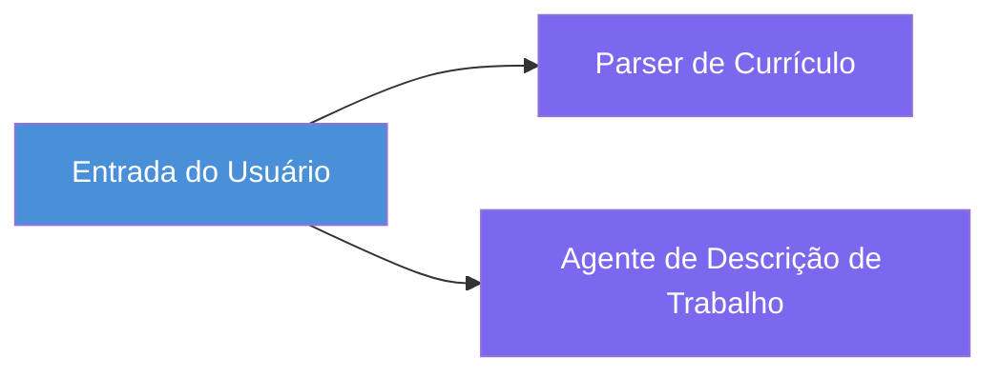
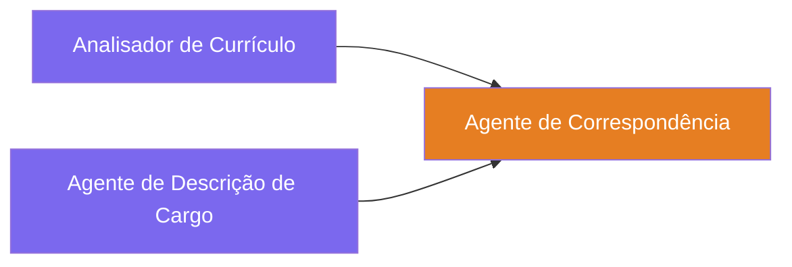
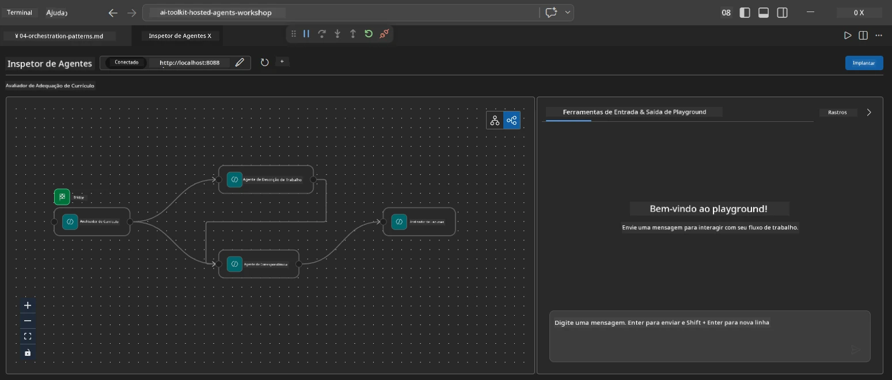
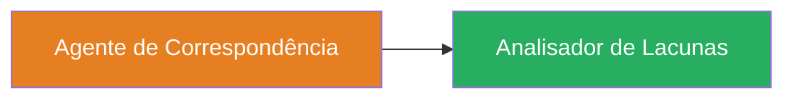
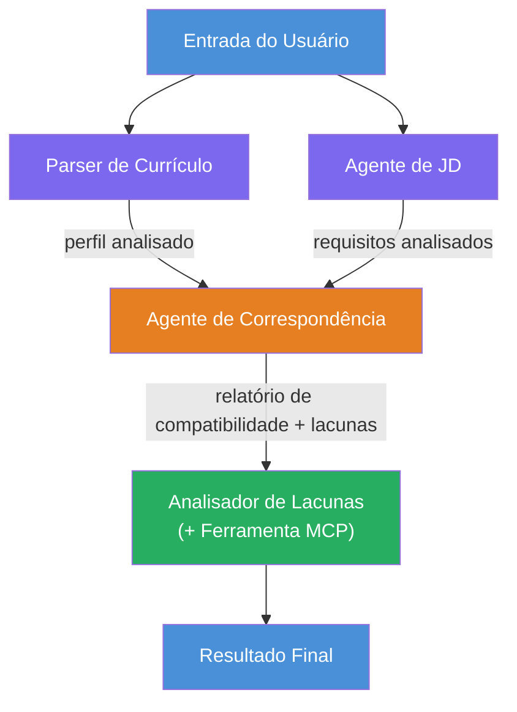
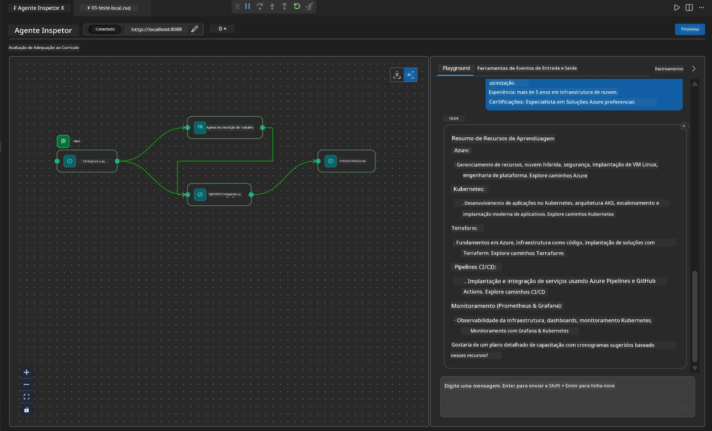

# Módulo 4 - Padrões de Orquestração

Neste módulo, você explora os padrões de orquestração usados no Avaliador de Compatibilidade de Currículos e aprende como ler, modificar e estender o gráfico do fluxo de trabalho. Entender esses padrões é essencial para depurar problemas no fluxo de dados e construir seus próprios [fluxos de trabalho multiagentes](https://learn.microsoft.com/agent-framework/workflows/).

---

## Padrão 1: Fan-out (divisão paralela)

O primeiro padrão no fluxo de trabalho é o **fan-out** - uma única entrada é enviada para múltiplos agentes simultaneamente.


No código, isso ocorre porque `resume_parser` é o `start_executor` - ele recebe a mensagem do usuário primeiro. Então, como tanto `jd_agent` quanto `matching_agent` possuem arestas vindas de `resume_parser`, a estrutura roteia a saída de `resume_parser` para ambos os agentes:

```python
.add_edge(resume_parser, jd_agent)         # Saída do ResumeParser → Agente de JD
.add_edge(resume_parser, matching_agent)   # Saída do ResumeParser → Agente de Correspondência
```

**Por que isso funciona:** ResumeParser e JD Agent processam aspectos diferentes da mesma entrada. Executá-los em paralelo reduz a latência total em comparação a executá-los sequencialmente.

### Quando usar fan-out

| Caso de uso | Exemplo |
|----------|---------|
| Subtarefas independentes | Análise do currículo vs. análise da descrição do trabalho |
| Redundância / votação | Dois agentes analisam os mesmos dados, um terceiro escolhe a melhor resposta |
| Saída em múltiplos formatos | Um agente gera texto, outro gera JSON estruturado |

---

## Padrão 2: Fan-in (agregação)

O segundo padrão é o **fan-in** - múltiplas saídas de agentes são coletadas e enviadas para um único agente downstream.


No código:

```python
.add_edge(resume_parser, matching_agent)   # Saída do ResumeParser → MatchingAgent
.add_edge(jd_agent, matching_agent)        # Saída do agente JD → MatchingAgent
```

**Comportamento chave:** Quando um agente tem **duas ou mais arestas de entrada**, o framework automaticamente espera que **todos** os agentes upstream terminem antes de executar o agente downstream. MatchingAgent não inicia até que tanto ResumeParser quanto JD Agent tenham terminado.

### O que MatchingAgent recebe

O framework concatena as saídas de todos os agentes upstream. A entrada do MatchingAgent parece com:

```
[ResumeParser output]
---
Candidate Profile:
  Name: Jane Doe
  Technical Skills: Python, Azure, Kubernetes, ...
  ...

[JobDescriptionAgent output]
---
Role Overview: Senior Cloud Engineer
Required Skills: Python, Azure, Terraform, ...
...
```

> **Nota:** O formato exato da concatenação depende da versão do framework. As instruções do agente devem ser escritas para lidar tanto com saída estruturada quanto não estruturada dos agentes upstream.



---

## Padrão 3: Cadeia sequencial

O terceiro padrão é a **cadeia sequencial** - a saída de um agente alimenta diretamente o próximo.


No código:

```python
.add_edge(matching_agent, gap_analyzer)    # Saída do MatchingAgent → GapAnalyzer
```

Este é o padrão mais simples. GapAnalyzer recebe a pontuação de compatibilidade de MatchingAgent, habilidades correspondentes/faltantes e lacunas. Então chama a [ferramenta MCP](https://learn.microsoft.com/azure/foundry/agents/how-to/tools/model-context-protocol) para cada lacuna para buscar recursos da Microsoft Learn.

---

## O gráfico completo

Combinando os três padrões produz o fluxo de trabalho completo:


### Linha do tempo de execução

```mermaid
gantt
    title Linha do Tempo de Execução do Agente
    dateFormat X
    axisFormat %s

    section Paralelo
    Resume Parser       :rp, 0, 3
    JD Agent            :jd, 0, 2

    section Sequencial
    Matching Agent      :ma, 3, 5
    Gap Analyzer        :ga, 5, 9
```


> O tempo total de execução é aproximadamente `max(ResumeParser, JD Agent) + MatchingAgent + GapAnalyzer`. GapAnalyzer é tipicamente o mais lento porque faz múltiplas chamadas à ferramenta MCP (uma por lacuna).

---

## Lendo o código do WorkflowBuilder

Aqui está a função completa `create_workflow()` de `main.py`, anotada:

```python
def create_workflow(resume_parser, jd_agent, matching_agent, gap_analyzer):
    workflow = (
        WorkflowBuilder(
            name="ResumeJobFitEvaluator",

            # O primeiro agente a receber a entrada do usuário
            start_executor=resume_parser,

            # O(s) agente(s) cuja saída se torna a resposta final
            output_executors=[gap_analyzer],
        )
        # Distribuição: a saída do ResumeParser vai tanto para o agente JD quanto para o MatchingAgent
        .add_edge(resume_parser, jd_agent)
        .add_edge(resume_parser, matching_agent)

        # Convergência: MatchingAgent espera tanto pelo ResumeParser quanto pelo agente JD
        .add_edge(jd_agent, matching_agent)

        # Sequencial: a saída do MatchingAgent alimenta o GapAnalyzer
        .add_edge(matching_agent, gap_analyzer)

        .build()
    )
    return workflow.as_agent()
```

### Tabela resumo de arestas

| # | Aresta | Padrão | Efeito |
|---|--------|---------|--------|
| 1 | `resume_parser → jd_agent` | Fan-out | JD Agent recebe a saída do ResumeParser (mais a entrada original do usuário) |
| 2 | `resume_parser → matching_agent` | Fan-out | MatchingAgent recebe a saída do ResumeParser |
| 3 | `jd_agent → matching_agent` | Fan-in | MatchingAgent também recebe a saída do JD Agent (espera ambas) |
| 4 | `matching_agent → gap_analyzer` | Sequencial | GapAnalyzer recebe relatório de compatibilidade + lista de lacunas |

---

## Modificando o gráfico

### Adicionando um novo agente

Para adicionar um quinto agente (por exemplo, um **InterviewPrepAgent** que gera perguntas de entrevista baseadas na análise das lacunas):

```python
# 1. Definir instruções
INTERVIEW_PREP_INSTRUCTIONS = """\
You are the Interview Prep Agent.
Given a gap analysis and fit report, generate 10 targeted interview questions
the candidate should prepare for.
"""

# 2. Criar o agente (dentro do bloco async with)
AzureAIAgentClient(
    project_endpoint=PROJECT_ENDPOINT,
    model_deployment_name=MODEL_DEPLOYMENT_NAME,
    credential=credential,
).as_agent(
    name="InterviewPrepAgent",
    instructions=INTERVIEW_PREP_INSTRUCTIONS,
) as interview_prep,

# 3. Adicionar conexões em create_workflow()
.add_edge(matching_agent, interview_prep)   # recebe relatório de ajuste
.add_edge(gap_analyzer, interview_prep)     # também recebe cartões de lacunas

# 4. Atualizar output_executors
output_executors=[interview_prep],  # agora o agente final
```

### Alterando a ordem de execução

Para fazer o JD Agent rodar **depois** do ResumeParser (sequencial em vez de paralelo):

```python
# Remover: .add_edge(resume_parser, jd_agent)  ← já existe, mantenha-o
# Remova o paralelismo implícito não fazendo com que jd_agent receba entrada do usuário diretamente
# O start_executor envia primeiro para resume_parser, e jd_agent só recebe
# a saída do resume_parser via a aresta. Isso os torna sequenciais.
```

> **Importante:** O `start_executor` é o único agente que recebe a entrada bruta do usuário. Todos os outros agentes recebem a saída das suas arestas de entrada. Se você quiser que um agente também receba a entrada bruta do usuário, ele precisa ter uma aresta vindo do `start_executor`.

---

## Erros comuns no gráfico

| Erro | Sintoma | Correção |
|---------|---------|-----------|
| Aresta faltando para `output_executors` | Agente executa mas saída está vazia | Garanta que exista um caminho do `start_executor` para cada agente em `output_executors` |
| Dependência circular | Loop infinito ou timeout | Verifique se nenhum agente alimenta um agente upstream |
| Agente em `output_executors` sem aresta de entrada | Saída vazia | Adicione pelo menos uma `add_edge(fonte, esse_agente)` |
| Múltiplos `output_executors` sem fan-in | Saída contém resposta de apenas um agente | Use um agente de saída único que agregue, ou aceite múltiplas saídas |
| `start_executor` faltando | `ValueError` na hora da build | Sempre especifique `start_executor` em `WorkflowBuilder()` |

---

## Depurando o gráfico

### Usando o Agent Inspector

1. Inicie o agente localmente (F5 ou terminal - veja [Módulo 5](05-test-locally.md)).
2. Abra o Agent Inspector (`Ctrl+Shift+P` → **Foundry Toolkit: Open Agent Inspector**).
3. Envie uma mensagem de teste.
4. No painel de respostas do Inspector, procure pela **saída em streaming** - ela mostra a contribuição de cada agente em sequência.



### Usando logging

Adicione logging ao `main.py` para rastrear o fluxo de dados:

```python
import logging
logger = logging.getLogger("resume-job-fit")

# Em create_workflow(), após construir:
logger.info("Workflow graph built with edges: RP→JD, RP→MA, JD→MA, MA→GA")
```

Os logs do servidor mostram ordem de execução dos agentes e chamadas à ferramenta MCP:

```
INFO:resume-job-fit:Starting Resume -> Job Fit Evaluator HTTP server...
INFO:resume-job-fit:Server running on http://localhost:8088
INFO:agent_framework:Executing agent: ResumeParser
INFO:agent_framework:Executing agent: JobDescriptionAgent
INFO:agent_framework:Waiting for upstream agents: ResumeParser, JobDescriptionAgent
INFO:agent_framework:Executing agent: MatchingAgent
INFO:agent_framework:Executing agent: GapAnalyzer
INFO:agent_framework:Tool call: search_microsoft_learn_for_plan(skill="Kubernetes")
POST https://learn.microsoft.com/api/mcp → 200
INFO:agent_framework:Tool call: search_microsoft_learn_for_plan(skill="Terraform")
POST https://learn.microsoft.com/api/mcp → 200
```

---

### Verificação

- [ ] Você pode identificar os três padrões de orquestração no fluxo de trabalho: fan-out, fan-in e cadeia sequencial
- [ ] Você entende que agentes com múltiplas arestas de entrada esperam todos os agentes upstream completarem
- [ ] Você consegue ler o código do `WorkflowBuilder` e mapear cada chamada `add_edge()` para o gráfico visual
- [ ] Você entende a linha do tempo de execução: agentes paralelos rodam primeiro, depois agregação, depois sequencial
- [ ] Você sabe como adicionar um novo agente ao gráfico (definir instruções, criar agente, adicionar arestas, atualizar saída)
- [ ] Você pode identificar erros comuns no gráfico e seus sintomas

---

**Anterior:** [03 - Configurar Agentes e Ambiente](03-configure-agents.md) · **Próximo:** [05 - Testar Localmente →](05-test-locally.md)

---

<!-- CO-OP TRANSLATOR DISCLAIMER START -->
**Aviso Legal**:
Este documento foi traduzido usando o serviço de tradução por IA [Co-op Translator](https://github.com/Azure/co-op-translator). Embora nos esforcemos pela precisão, esteja ciente de que traduções automatizadas podem conter erros ou imprecisões. O documento original em sua língua nativa deve ser considerado a fonte autoritária. Para informações críticas, recomenda-se tradução profissional humana. Não nos responsabilizamos por quaisquer mal-entendidos ou interpretações equivocadas decorrentes do uso desta tradução.
<!-- CO-OP TRANSLATOR DISCLAIMER END -->