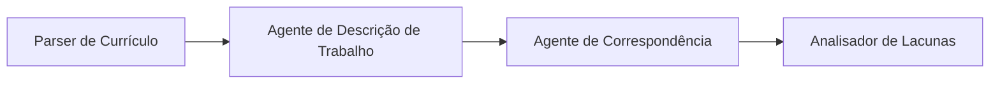
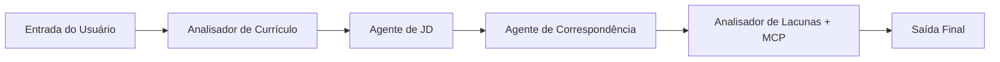

# Módulo 4 - Padrões de Orquestração

⏱️ ~10 min

Neste módulo, você explora os padrões de orquestração usados no Avaliador de Adequação de Currículos e aprende como ler, modificar e estender o gráfico do fluxo de trabalho. Compreender esses padrões é essencial para depurar problemas no fluxo de dados e construir seus próprios [fluxos de trabalho multiagente](https://learn.microsoft.com/agent-framework/workflows/).

---

## Padrão 1: Cadeia sequencial

O padrão fundamental no fluxo de trabalho é uma **cadeia sequencial** – a saída de cada agente alimenta diretamente o próximo.


```mermaid
flowchart LR
    RP[Parser de Currículo] --> JD[Agente de Descrição de Trabalho]
    JD --> MA[Agente de Correspondência]
    MA --> GA[Analisador de Lacunas]
```

No código, cada chamada `add_edge()` cria um passo na cadeia:

```python
.add_edge(resume_executor, jd_executor)       # Saída do ResumeParser → JD Agent
.add_edge(jd_executor, matching_executor)     # Saída do JD Agent → MatchingAgent
.add_edge(matching_executor, gap_executor)    # Saída do MatchingAgent → GapAnalyzer
```

> **Por que sequencial, e não fan-out/fan-in?** `WorkflowBuilder` usa **semântica OR** para as arestas de entrada: um executor a jusante dispara assim que **qualquer** predecessor conclui. Se `matching_executor` tivesse duas arestas de entrada (tanto de `resume_executor` quanto de `jd_executor`), ele dispararia duas vezes – uma quando ResumeParser termina e outra quando o Agência JD termina – fazendo com que GapAnalyzer também execute duas vezes e a saída apareça duas vezes. O pipeline sequencial evita isso completamente.

## Padrão 2: Repassar conteúdo

Porque `context_mode="last_agent"` significa que cada executor vê apenas a **saída direta do predecessor**, agentes em uma cadeia sequencial devem passar explicitamente adiante quaisquer dados que os agentes a jusante precisem.

Neste fluxo de trabalho:
- **ResumeParser** copia o JD literalmente em `[PASSAGEM DA DESCRIÇÃO DO TRABALHO]` (para que o Agência JD possa encontrá-lo).
- **Agente JD** copia o `[CURRÍCULO ANALISADO]` literalmente em `[PASSAGEM DO CURRÍCULO ANALISADO]` (para que MatchingAgent possa comparar ambos os perfis).

```
ResumeParser output
└─ [PARSED RESUME]               ← extracted by JD Agent
└─ [JOB DESCRIPTION PASS-THROUGH] ← extracted by JD Agent

JD Agent output
└─ [JD REQUIREMENTS]             ← extracted by MatchingAgent
└─ [PARSED RESUME PASS-THROUGH]  ← extracted by MatchingAgent
```

Cada seção de retransmissão deve ser copiada **literalmente** – resumir ou parafrasear quebra o agente a jusante que depende dela.

---

## O gráfico completo

Combinando os padrões de cadeia sequencial e repasse de conteúdo produz o fluxo de trabalho completo:


```mermaid
flowchart LR
    U[Entrada do Usuário] --> RP[Analisador de Currículo]
    RP --> JD[Agente de JD]
    JD --> MA[Agente de Correspondência]
    MA --> GA[Analisador de Lacunas + MCP]
    GA --> O[Saída Final]
```

O Inspector de Agentes mostra essa mesma estrutura gráfica quando o agente está sendo executado localmente. Consulte [Módulo 5 - Testar Localmente](05-test-locally.md) para capturas de tela.

---

## Lendo o código WorkflowBuilder

A função completa `create_workflow()` está em [`PersonalCareerCopilot/main.py`](../../../../../workshop/lab02-multi-agent/PersonalCareerCopilot/main.py). As três chamadas `add_edge()` constroem o pipeline sequencial:

| # | Aresta | Efeito |
|---|-------|---------|
| 1 | `resume_executor → jd_executor` | Agência JD recebe `[CURRÍCULO ANALISADO]` + `[PASSAGEM DA DESCRIÇÃO DO TRABALHO]` |
| 2 | `jd_executor → matching_executor` | MatchingAgent recebe `[REQUISITOS DO JD]` + `[PASSAGEM DO CURRÍCULO ANALISADO]` |
| 3 | `matching_executor → gap_executor` | GapAnalyzer recebe relatório de adequação + lista de lacunas |

---

## Modificando o gráfico

### Adicionando um novo agente

Para adicionar um quinto agente (por exemplo, um **Agente de Preparação para Entrevista** após o GapAnalyzer):

1. Defina uma constante `INTERVIEW_PREP_INSTRUCTIONS`.
2. Crie objetos `Agent` + `AgentExecutor` (mesmo padrão dos quatro existentes).
3. Adicione `.add_edge(gap_executor, interview_exec)` em `WorkflowBuilder`.
4. Atualize `output_executors=[interview_exec]`.

> **Importante:** `start_executor` é o único agente que recebe a entrada bruta do usuário. Todos os outros agentes recebem a saída da sua aresta a montante.

---

## Erros comuns no gráfico

| Erro | Sintoma | Correção |
|------|---------|---------|
| Falta de aresta para `output_executors` | Agente executa mas a saída está vazia | Certifique-se de que existe um caminho do `start_executor` a cada agente em `output_executors` |
| Dependência circular | Loop infinito ou timeout | Verifique se nenhum agente alimenta um agente a montante |
| Agente em `output_executors` sem aresta de entrada | Saída vazia | Adicione pelo menos um `add_edge(fonte, esse_agente)` |
| Vários `output_executors` sem fan-in | A saída contém apenas a resposta de um agente | Use um único agente de saída que agregue, ou aceite múltiplas saídas |
| Falta de `start_executor` | `ValueError` em tempo de build | Sempre especifique o `start_executor` em `WorkflowBuilder()` |

---

## Depurando o gráfico

### Usando o Agent Inspector

1. Inicie o agente localmente com F5.
2. Abra o Agent Inspector (`Ctrl+Shift+P` → **Foundry Toolkit: Open Agent Inspector**).
3. Envie uma mensagem de teste.
4. No painel de resposta do Inspector, observe a **saída em streaming** – ela mostra a contribuição de cada agente em sequência.


### Usando logging

Adicione logging em `main.py` para rastrear o fluxo de dados:

```python
import logging
logger = logging.getLogger("resume-job-fit")

# Em main(), após construir o fluxo de trabalho:
logger.info("Workflow graph built with edges: RP→JD, JD→MA, MA→GA")
```

Os logs do servidor mostram a ordem de execução dos agentes e chamadas para as ferramentas MCP:

```
INFO:agent_framework:Executing agent: ResumeParser
INFO:agent_framework:Executing agent: JobDescriptionAgent
INFO:agent_framework:Executing agent: MatchingAgent
INFO:agent_framework:Executing agent: GapAnalyzer
INFO:agent_framework:Tool call: search_microsoft_learn_for_plan(skill="Kubernetes")
POST https://learn.microsoft.com/api/mcp → 200
INFO:agent_framework:Tool call: search_microsoft_learn_for_plan(skill="Terraform")
POST https://learn.microsoft.com/api/mcp → 200
```

---

### Ponto de verificação

- [ ] Você consegue identificar os dois padrões de orquestração no fluxo de trabalho: cadeia sequencial e repasse de conteúdo
- [ ] Você entende por que `context_mode="last_agent"` requer repasse explícito de dados entre agentes
- [ ] Você pode ler o código `WorkflowBuilder` e mapear cada chamada `add_edge()` para o gráfico visual
- [ ] Você sabe como adicionar um novo agente no final do pipeline
- [ ] Você pode identificar erros comuns no gráfico e seus sintomas

---

**Anterior:** [03 - Configurar Agentes & Ambiente](03-configure-agents.md) · **Próximo:** [05 - Testar Localmente →](05-test-locally.md)

---

<!-- CO-OP TRANSLATOR DISCLAIMER START -->
**Aviso Legal**:
Este documento foi traduzido usando o serviço de tradução por IA [Co-op Translator](https://github.com/Azure/co-op-translator). Embora nos esforcemos pela precisão, por favor, esteja ciente de que traduções automatizadas podem conter erros ou imprecisões. O documento original em seu idioma nativo deve ser considerado a fonte autorizada. Para informações críticas, recomenda-se tradução profissional humana. Não nos responsabilizamos por quaisquer mal-entendidos ou interpretações incorretas decorrentes do uso desta tradução.
<!-- CO-OP TRANSLATOR DISCLAIMER END -->