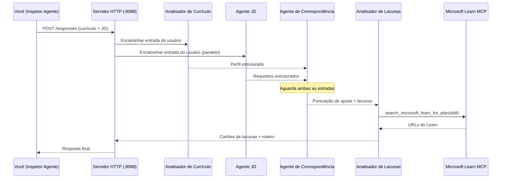
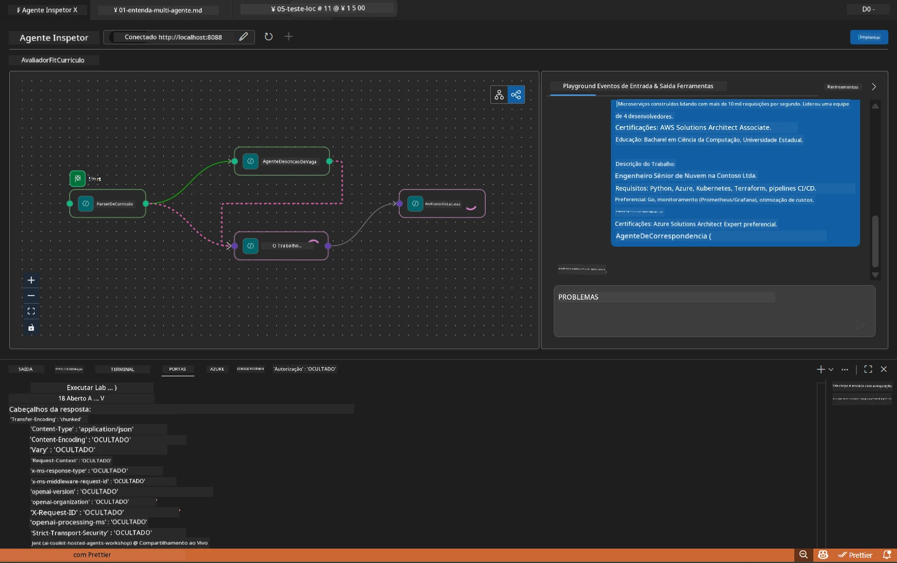

# Módulo 5 - Testar Localmente (Multi-Agente)

Neste módulo, você executa o fluxo de trabalho multi-agente localmente, testa com o Agent Inspector e verifica se os quatro agentes e a ferramenta MCP funcionam corretamente antes de implantar no Foundry.

### O que acontece durante uma execução de teste local


---

## Passo 1: Iniciar o servidor do agente

### Opção A: Usando a tarefa do VS Code (recomendado)

1. Pressione `Ctrl+Shift+P` → digite **Tasks: Run Task** → selecione **Run Lab02 HTTP Server**.
2. A tarefa inicia o servidor com debugpy anexado na porta `5679` e o agente na porta `8088`.
3. Aguarde a saída mostrar:

```
INFO:resume-job-fit:Starting Resume -> Job Fit Evaluator HTTP server...
INFO:resume-job-fit:Server running on http://localhost:8088
```

### Opção B: Usando o terminal manualmente

```powershell
cd workshop\lab02-multi-agent\PersonalCareerCopilot
```

Ative o ambiente virtual:

**PowerShell (Windows):**
```powershell
.\.venv\Scripts\Activate.ps1
```

**macOS/Linux:**
```bash
source .venv/bin/activate
```

Inicie o servidor:

```powershell
python -m debugpy --listen 127.0.0.1:5679 -m agentdev run main.py --verbose --port 8088
```

### Opção C: Usando F5 (modo de depuração)

1. Pressione `F5` ou vá para **Run and Debug** (`Ctrl+Shift+D`).
2. Selecione a configuração de inicialização **Lab02 - Multi-Agent** no menu suspenso.
3. O servidor inicia com suporte completo a pontos de interrupção.

> **Dica:** O modo de depuração permite definir pontos de interrupção dentro de `search_microsoft_learn_for_plan()` para inspecionar respostas do MCP, ou dentro das strings de instruções dos agentes para ver o que cada agente recebe.

---

## Passo 2: Abrir o Agent Inspector

1. Pressione `Ctrl+Shift+P` → digite **Foundry Toolkit: Open Agent Inspector**.
2. O Agent Inspector abre em uma aba do navegador em `http://localhost:5679`.
3. Você deve ver a interface do agente pronta para receber mensagens.

> **Se o Agent Inspector não abrir:** Certifique-se de que o servidor está totalmente iniciado (você vê o log "Server running"). Se a porta 5679 estiver ocupada, veja [Módulo 8 - Resolução de Problemas](08-troubleshooting.md).

---

## Passo 3: Executar testes iniciais

Execute estes três testes na ordem. Cada um testa progressivamente mais do fluxo de trabalho.

### Teste 1: Currículo básico + descrição de vaga

Cole o seguinte no Agent Inspector:

```
Resume:
Jane Doe
Senior Software Engineer with 5 years of experience in Python, Django, and AWS.
Built microservices handling 10K+ requests/second. Led a team of 4 developers.
Certifications: AWS Solutions Architect Associate.
Education: B.S. Computer Science, State University.

Job Description:
Senior Cloud Engineer at Contoso Ltd.
Required: Python, Azure, Kubernetes, Terraform, CI/CD pipelines.
Preferred: Go, monitoring (Prometheus/Grafana), cost optimization.
Experience: 5+ years in cloud infrastructure.
Certifications: Azure Solutions Architect Expert preferred.
```

**Estrutura de saída esperada:**

A resposta deve conter a saída dos quatro agentes em sequência:

1. **Saída do Parser de Currículo** - Perfil estruturado do candidato com habilidades agrupadas por categoria
2. **Saída do Agente de JD** - Requisitos estruturados com habilidades obrigatórias vs. preferenciais separadas
3. **Saída do Agente de Correspondência** - Pontuação de adequação (0-100) com detalhamento, habilidades combinadas, faltantes e lacunas
4. **Saída do Analisador de Lacunas** - Cartões de lacunas individuais para cada habilidade faltante, cada um com URLs do Microsoft Learn



### O que verificar no Teste 1

| Verificação | Esperado | Passou? |
|-------------|----------|---------|
| Resposta contém pontuação de adequação | Número entre 0-100 com detalhamento | |
| Habilidades combinadas estão listadas | Python, CI/CD (parcial), etc. | |
| Habilidades faltantes estão listadas | Azure, Kubernetes, Terraform, etc. | |
| Cartões de lacunas existem para cada habilidade faltante | Um cartão por habilidade | |
| URLs do Microsoft Learn estão presentes | Links reais `learn.microsoft.com` | |
| Sem mensagens de erro na resposta | Saída estruturada limpa | |

### Teste 2: Verificar execução da ferramenta MCP

Enquanto o Teste 1 roda, confira o **terminal do servidor** para entradas de log do MCP:

```
GET https://learn.microsoft.com/api/mcp → 405 (Method Not Allowed)
POST https://learn.microsoft.com/api/mcp → 200
DELETE https://learn.microsoft.com/api/mcp → 405 (Method Not Allowed)
```

| Entrada de log | Significado | Esperado? |
|---------------|-------------|-----------|
| `GET ... → 405` | Cliente MCP testa com GET durante inicialização | Sim - normal |
| `POST ... → 200` | Chamada real da ferramenta ao servidor MCP do Microsoft Learn | Sim - essa é a chamada real |
| `DELETE ... → 405` | Cliente MCP testa com DELETE durante limpeza | Sim - normal |
| `POST ... → 4xx/5xx` | Chamada da ferramenta falhou | Não - veja [Resolução de Problemas](08-troubleshooting.md) |

> **Ponto chave:** As linhas `GET 405` e `DELETE 405` são **comportamento esperado**. Preocupe-se somente se as chamadas `POST` retornarem códigos de status diferentes de 200.

### Teste 3: Caso extremo - candidato com alta adequação

Cole um currículo que combine muito com a vaga para verificar se o GapAnalyzer trata cenários de alta adequação:

```
Resume:
Alex Chen
Senior Cloud Engineer with 7 years of experience.
Skills: Python, Azure (AKS, Functions, DevOps), Kubernetes, Terraform, CI/CD (GitHub Actions, Azure Pipelines), Go, Prometheus, Grafana, cost optimization.
Certifications: Azure Solutions Architect Expert, Azure DevOps Engineer Expert.
Led infrastructure migration to Azure for 3 enterprise clients.
Education: M.S. Computer Science, Tech University.

Job Description:
Senior Cloud Engineer at Contoso Ltd.
Required: Python, Azure, Kubernetes, Terraform, CI/CD pipelines.
Preferred: Go, monitoring (Prometheus/Grafana), cost optimization.
Experience: 5+ years in cloud infrastructure.
Certifications: Azure Solutions Architect Expert preferred.
```

**Comportamento esperado:**
- Pontuação de adequação deve ser **80+** (a maioria das habilidades combinam)
- Os cartões de lacunas devem focar mais em polimento/preparação para entrevista do que em aprendizado básico
- As instruções do GapAnalyzer dizem: "Se adequação >= 80, foque em polimento/preparação para entrevista"

---

## Passo 4: Verifique a completude da saída

Após executar os testes, verifique se a saída atende a estes critérios:

### Checklist da estrutura de saída

| Seção | Agente | Presente? |
|-------|--------|-----------|
| Perfil do Candidato | Parser de Currículo | |
| Habilidades Técnicas (agrupadas) | Parser de Currículo | |
| Visão geral do cargo | Agente de JD | |
| Habilidades obrigatórias vs. preferenciais | Agente de JD | |
| Pontuação de adequação com detalhamento | Agente de Correspondência | |
| Habilidades combinadas / faltantes / parciais | Agente de Correspondência | |
| Cartão de lacuna por habilidade faltante | Analisador de Lacunas | |
| URLs do Microsoft Learn nos cartões de lacunas | Analisador de Lacunas (MCP) | |
| Ordem de aprendizado (numerada) | Analisador de Lacunas | |
| Resumo do cronograma | Analisador de Lacunas | |

### Problemas comuns nesta etapa

| Problema | Causa | Correção |
|----------|--------|----------|
| Apenas 1 cartão de lacuna (restante truncado) | Instruções do GapAnalyzer faltando bloco CRÍTICO | Adicione o parágrafo `CRITICAL:` em `GAP_ANALYZER_INSTRUCTIONS` - veja [Módulo 3](03-configure-agents.md) |
| Sem URLs do Microsoft Learn | Endpoint MCP inacessível | Verifique a conexão com a internet. Confirme que `MICROSOFT_LEARN_MCP_ENDPOINT` no `.env` seja `https://learn.microsoft.com/api/mcp` |
| Resposta vazia | `PROJECT_ENDPOINT` ou `MODEL_DEPLOYMENT_NAME` não configurados | Verifique os valores no arquivo `.env`. Rode `echo $env:PROJECT_ENDPOINT` no terminal |
| Pontuação de adequação é 0 ou está faltando | MatchingAgent não recebeu dados upstream | Verifique se `add_edge(resume_parser, matching_agent)` e `add_edge(jd_agent, matching_agent)` existem em `create_workflow()` |
| Agente inicia mas sai imediatamente | Erro de importação ou dependência faltando | Rode `pip install -r requirements.txt` novamente. Verifique o terminal para rastros de erro |
| Erro `validate_configuration` | Variáveis de ambiente ausentes | Crie `.env` com `PROJECT_ENDPOINT=<seu-endpoint>` e `MODEL_DEPLOYMENT_NAME=<seu-modelo>` |

---

## Passo 5: Teste com seus próprios dados (opcional)

Tente colar seu próprio currículo e uma descrição real de vaga. Isso ajuda a verificar:

- Os agentes lidam com diferentes formatos de currículo (cronológico, funcional, híbrido)
- O Agente de JD lida com diferentes estilos de descrição de vaga (tópicos, parágrafos, estruturado)
- A ferramenta MCP retorna recursos relevantes para habilidades reais
- Os cartões de lacunas são personalizados para seu histórico específico

> **Nota de privacidade:** Ao testar localmente, seus dados permanecem no seu computador e são enviados apenas para sua implantação do Azure OpenAI. Eles não são registrados ou armazenados pela infraestrutura do workshop. Use nomes fictícios se preferir (ex.: "Maria Silva" em vez do nome real).

---

### Ponto de verificação

- [ ] Servidor iniciado com sucesso na porta `8088` (log mostra "Server running")
- [ ] Agent Inspector aberto e conectado ao agente
- [ ] Teste 1: Resposta completa com pontuação, habilidades combinadas/faltantes, cartões de lacunas e URLs do Microsoft Learn
- [ ] Teste 2: Logs MCP mostram `POST ... → 200` (chamadas da ferramenta bem-sucedidas)
- [ ] Teste 3: Candidato com alta adequação recebe pontuação 80+ com recomendações focadas em polimento
- [ ] Todos os cartões de lacunas presentes (um para cada habilidade faltante, sem truncamento)
- [ ] Sem erros ou rastros de pilha no terminal do servidor

---

**Anterior:** [04 - Padrões de Orquestração](04-orchestration-patterns.md) · **Próximo:** [06 - Implantar no Foundry →](06-deploy-to-foundry.md)

---

<!-- CO-OP TRANSLATOR DISCLAIMER START -->
**Aviso Legal**:  
Este documento foi traduzido utilizando o serviço de tradução automática [Co-op Translator](https://github.com/Azure/co-op-translator). Embora nos esforcemos para garantir a precisão, por favor, esteja ciente de que traduções automáticas podem conter erros ou imprecisões. O documento original em seu idioma nativo deve ser considerado a fonte autorizada. Para informações críticas, recomenda-se tradução profissional humana. Não nos responsabilizamos por quaisquer mal-entendidos ou interpretações incorretas decorrentes do uso desta tradução.
<!-- CO-OP TRANSLATOR DISCLAIMER END -->