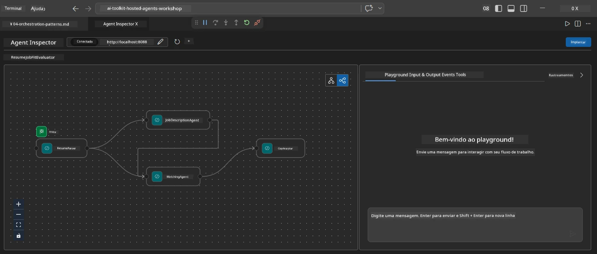
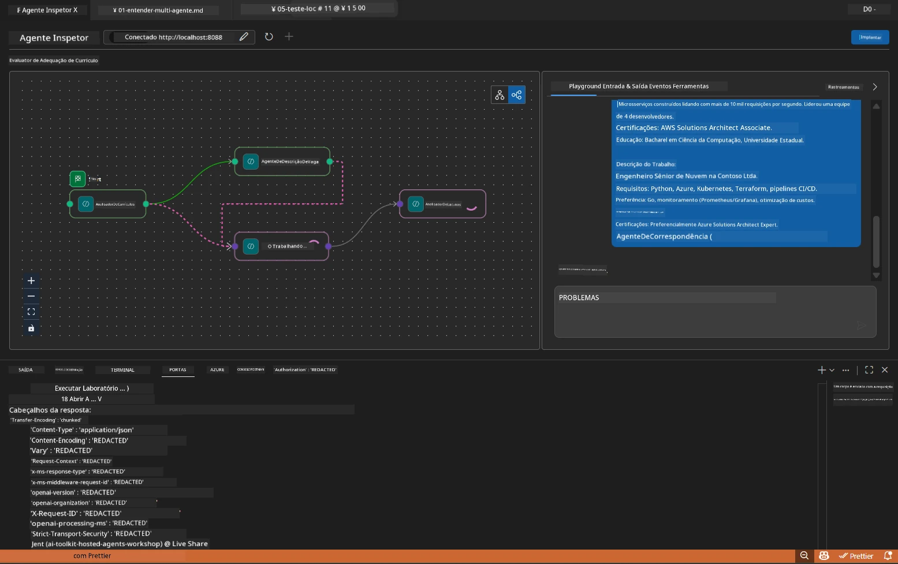
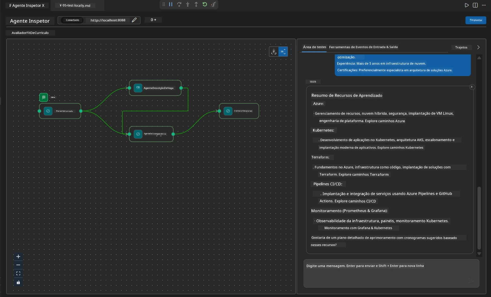

# Módulo 5 - Testar Localmente

⏱️ ~15 min

Neste módulo, você executa o fluxo de trabalho multiagente localmente, testa com o Agent Inspector e verifica se todos os quatro agentes e a ferramenta MCP funcionam corretamente antes de implantar.

---

## Passo 1: Iniciar o servidor do agente

### Opção A: Usando a tarefa do VS Code (recomendado)

1. Abra `workshop/lab02-multi-agent/PersonalCareerCopilot/` como sua pasta no VS Code.
2. Pressione `Ctrl+Shift+P` → digite **Tasks: Run Task** → selecione **Run Agent HTTP Server**.
3. A tarefa inicia o servidor com debugpy anexado na porta `5679` e o agente na porta `8088`.
4. Aguarde a saída mostrar:

```
INFO:resume-job-fit:Starting Resume -> Job Fit Evaluator HTTP server...
INFO:resume-job-fit:Server running on http://localhost:8088
```

### Opção B: Usando F5 (modo de depuração)

1. Pressione `F5` → selecione **Debug Local Agent HTTP Server**.
2. O servidor inicia com suporte completo a pontos de interrupção - útil para inspecionar respostas do MCP ou saídas do agente.

---

## Passo 2: Abrir o Agent Inspector

1. Pressione `Ctrl+Shift+P` → digite **Foundry Toolkit: Open Agent Inspector**.
2. O Agent Inspector abre como um painel do VS Code conectado a `http://localhost:8088`.
3. Você deve ver a interface do agente pronta para receber mensagens.



> **Se o Agent Inspector não abrir:** Certifique-se de que o servidor foi totalmente iniciado (você vê o log "Server running"). Se a porta 5679 estiver ocupada, veja [Módulo 8 - Solução de problemas](08-troubleshooting.md).

---

## Passo 2b: (Opcional) Abrir o Visualizador de Fluxo de Trabalho

O Foundry Toolkit inclui um **Visualizador de Fluxo de Trabalho** em tempo real que mostra como os agentes interagem enquanto o gráfico é executado. Isso é especialmente útil para depuração multiagente.

1. Pressione `Ctrl+Shift+P` → digite **Foundry Toolkit: Open Visualizer for Hosted Agents**.
2. Uma nova aba do VS Code abre mostrando o gráfico de execução ao vivo.
3. Conforme você envia mensagens no Agent Inspector, o visualizador atualiza automaticamente - nós verdes indicam agentes concluídos, e arestas animadas mostram dados fluindo entre eles.

> **Conflito de porta:** Se a porta do visualizador já estiver em uso, altere-a em Configurações do VS Code → **Extensões** → **Microsoft Foundry Configuration** → **Hosted Agents: Visualizer Port**.

---

## Passo 3: Executar testes básicos

Execute estes três testes em ordem. Cada um testa progressivamente mais do fluxo de trabalho.

### Teste 1: Currículo básico + descrição de emprego

Cole o seguinte no Agent Inspector:

```
Resume:
Jane Doe
Senior Software Engineer with 5 years of experience in Python, Django, and AWS.
Built microservices handling 10K+ requests/second. Led a team of 4 developers.
Certifications: AWS Solutions Architect Associate.
Education: B.S. Computer Science, State University.

Job Description:
Senior Cloud Engineer at Contoso Ltd.
Required: Python, Azure, Kubernetes, Terraform, CI/CD pipelines.
Preferred: Go, monitoring (Prometheus/Grafana), cost optimization.
Experience: 5+ years in cloud infrastructure.
Certifications: Azure Solutions Architect Expert preferred.
```

**Estrutura esperada da resposta:**

A resposta deve conter a saída de todos os quatro agentes em sequência:

1. **Saída do Resume Parser** - Duas seções rotuladas: `[PARSED RESUME]` (perfil do candidato com habilidades agrupadas) e `[JOB DESCRIPTION PASS-THROUGH]` (texto literal da JD que alimenta o Agente de JD)
2. **Saída do Agente de JD** - Requisitos estruturados com habilidades obrigatórias vs. preferenciais separadas
3. **Saída do Agente de Matching** - Pontuação de adequação (0-100) com detalhamento, habilidades correspondentes, habilidades faltantes, lacunas
4. **Saída do Gap Analyzer** - Cartões individuais de lacunas para cada habilidade faltante, cada um com URLs do Microsoft Learn





### O que verificar no Teste 1

| Verificação | Esperado | Passou? |
|-------|----------|-------|
| Resposta contém pontuação de adequação | Número entre 0-100 com detalhamento | |
| Habilidades correspondentes são listadas | Python, CI/CD (parcial), etc. | |
| Habilidades faltantes são listadas | Azure, Kubernetes, Terraform, etc. | |
| Cartões de lacunas existem para cada habilidade faltante | Um cartão por habilidade | |
| URLs do Microsoft Learn estão presentes | Links reais do `learn.microsoft.com` | |
| Nenhuma mensagem de erro na resposta | Saída estruturada limpa | |

### Teste 2: Caso extremo - candidato com alta adequação

Cole um currículo que combine muito com a JD para verificar se o GapAnalyzer lida com cenários de alta adequação:

```
Resume:
Alex Chen
Senior Cloud Engineer with 7 years of experience.
Skills: Python, Azure (AKS, Functions, DevOps), Kubernetes, Terraform, CI/CD (GitHub Actions, Azure Pipelines), Go, Prometheus, Grafana, cost optimization.
Certifications: Azure Solutions Architect Expert, Azure DevOps Engineer Expert.
Led infrastructure migration to Azure for 3 enterprise clients.
Education: M.S. Computer Science, Tech University.

Job Description:
Senior Cloud Engineer at Contoso Ltd.
Required: Python, Azure, Kubernetes, Terraform, CI/CD pipelines.
Preferred: Go, monitoring (Prometheus/Grafana), cost optimization.
Experience: 5+ years in cloud infrastructure.
Certifications: Azure Solutions Architect Expert preferred.
```

**Comportamento esperado:**
- A pontuação de adequação deve ser **80+** (a maioria das habilidades corresponde)
- Cartões de lacunas devem focar em aperfeiçoamento/preparação para entrevista em vez de aprendizado básico
- As instruções do GapAnalyzer dizem: "Se adequação >= 80, foque em aperfeiçoamento/preparação para entrevista"

---

## Passo 4: Testar com seus próprios dados (opcional)

Tente colar seu próprio currículo e uma descrição real de vaga. Isso ajuda a verificar:

- Os agentes lidam com diferentes formatos de currículo (cronológico, funcional, híbrido)
- O Agente de JD lida com diferentes estilos de JD (tópicos, parágrafos, estruturado)
- A ferramenta MCP retorna recursos relevantes para habilidades reais
- Os cartões de lacunas são personalizados para seu histórico específico

> **Privacidade - Caminho A (Foundry cloud):** Texto do currículo e da JD é enviado para seu deploy Azure OpenAI para inferência. Não é registrado nem armazenado pela infraestrutura do workshop. Use nomes fictícios (ex.: "Jane Doe") se preferir.
>
> **Privacidade - Caminho B (Foundry Local):** Todas as quatro inferências dos agentes rodam inteiramente no seu dispositivo. Seu texto de currículo e descrição de vaga **nunca sai da sua máquina**. A única chamada externa é a ferramenta MCP buscando recursos de `https://learn.microsoft.com/api/mcp`; essa consulta contém apenas o nome da habilidade, não seus dados pessoais.

---

### Ponto de verificação

- [ ] Servidor iniciado com sucesso na porta `8088` (log mostra "Server running")
- [ ] Agent Inspector aberto e conectado ao agente
- [ ] Teste 1: Resposta completa com pontuação de adequação, habilidades correspondentes/faltantes, cartões de lacunas e URLs do Microsoft Learn
- [ ] Teste 2: Candidato com alta adequação recebe pontuação 80+ com recomendações focadas em aperfeiçoamento
- [ ] Todos os cartões de lacunas presentes (um por habilidade faltante, sem truncamento)
- [ ] Nenhum erro ou rastreamento de pilha no terminal do servidor

---

**Anterior:** [04 - Orchestration Patterns](04-orchestration-patterns.md) · **Próximo:** [06 - Deploy to Foundry →](06-deploy-to-foundry.md)

---

<!-- CO-OP TRANSLATOR DISCLAIMER START -->
**Aviso Legal**:
Este documento foi traduzido usando o serviço de tradução por IA [Co-op Translator](https://github.com/Azure/co-op-translator). Embora nos esforcemos pela precisão, por favor, esteja ciente de que traduções automatizadas podem conter erros ou imprecisões. O documento original em seu idioma nativo deve ser considerado a fonte autorizada. Para informações críticas, recomenda-se tradução profissional humana. Não nos responsabilizamos por quaisquer mal-entendidos ou interpretações incorretas decorrentes do uso desta tradução.
<!-- CO-OP TRANSLATOR DISCLAIMER END -->