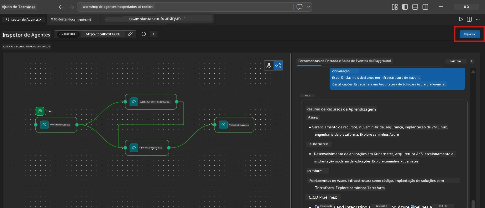
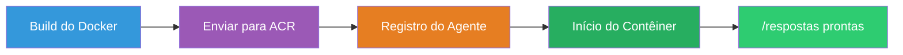
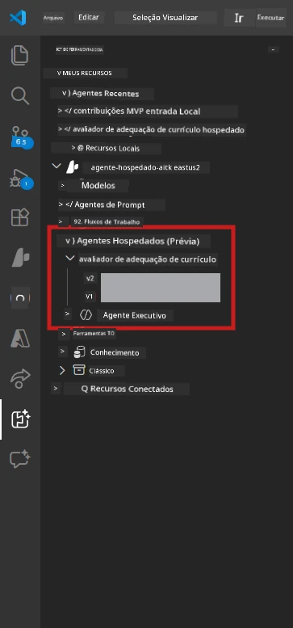

# Módulo 6 - Implantar no Foundry Agent Service

Neste módulo, você implanta seu fluxo de trabalho multiagente testado localmente no [Microsoft Foundry](https://learn.microsoft.com/azure/foundry/agents/concepts/hosted-agents) como um **Hosted Agent**. O processo de implantação cria uma imagem de contêiner Docker, a envia para o [Azure Container Registry (ACR)](https://learn.microsoft.com/azure/container-registry/container-registry-intro) e cria uma versão de agente hospedado no [Foundry Agent Service](https://learn.microsoft.com/azure/foundry/agents/how-to/publish-agent).

> **Diferença chave em relação ao Lab 01:** O processo de implantação é idêntico. O Foundry trata seu fluxo de trabalho multiagente como um único agente hospedado – a complexidade está dentro do contêiner, mas a superfície de implantação é o mesmo endpoint `/responses`.

---

## Verificação de pré-requisitos

Antes de implantar, verifique cada item abaixo:

1. **O agente passou nos testes locais básicos:**
   - Você completou todos os 3 testes no [Módulo 5](05-test-locally.md) e o fluxo de trabalho produziu saída completa com cartões de lacunas e URLs do Microsoft Learn.

2. **Você tem a função [Azure AI User](https://learn.microsoft.com/azure/foundry/concepts/rbac-foundry):**
   - Atribuída no [Lab 01, Módulo 2](../../lab01-single-agent/docs/02-create-foundry-project.md). Verifique:
   - [Portal Azure](https://portal.azure.com) → recurso do **projeto** Foundry → **Controle de acesso (IAM)** → **Atribuições de função** → confirme que **[Azure AI User](https://aka.ms/foundry-ext-project-role)** está listado para sua conta.

3. **Você está logado no Azure no VS Code:**
   - Verifique o ícone de Contas no canto inferior esquerdo do VS Code. O nome da sua conta deve estar visível.

4. **`agent.yaml` tem os valores corretos:**
   - Abra `PersonalCareerCopilot/agent.yaml` e verifique:
     ```yaml
     environment_variables:
       - name: PROJECT_ENDPOINT
         value: ${PROJECT_ENDPOINT}
       - name: MODEL_DEPLOYMENT_NAME
         value: ${MODEL_DEPLOYMENT_NAME}
     ```
   - Estes devem corresponder às variáveis de ambiente que seu `main.py` lê.

5. **`requirements.txt` tem as versões corretas:**
   ```
   agent-framework-azure-ai==1.0.0rc3
   agent-framework-core==1.0.0rc3
   azure-ai-agentserver-agentframework==1.0.0b16
   azure-ai-agentserver-core==1.0.0b16
   debugpy
   agent-dev-cli --pre
   ```

---

## Passo 1: Iniciar a implantação

### Opção A: Implantar pelo Agent Inspector (recomendado)

Se o agente estiver em execução via F5 com o Agent Inspector aberto:

1. Olhe no **canto superior direito** do painel do Agent Inspector.
2. Clique no botão **Deploy** (ícone de nuvem com uma seta para cima ↑).
3. O assistente de implantação será aberto.



### Opção B: Implantar pela Paleta de Comandos

1. Pressione `Ctrl+Shift+P` para abrir a **Paleta de Comandos**.
2. Digite: **Microsoft Foundry: Deploy Hosted Agent** e selecione.
3. O assistente de implantação será aberto.

---

## Passo 2: Configurar a implantação

### 2.1 Selecione o projeto alvo

1. Um dropdown mostrará seus projetos Foundry.
2. Selecione o projeto que você usou durante o workshop (e.g., `workshop-agents`).

### 2.2 Selecione o arquivo do agente contêiner

1. Você será solicitado a selecionar o ponto de entrada do agente.
2. Navegue para `workshop/lab02-multi-agent/PersonalCareerCopilot/` e escolha **`main.py`**.

### 2.3 Configurar recursos

| Configuração | Valor recomendado | Notas |
|---------|------------------|-------|
| **CPU** | `0.25` | Padrão. Fluxos de trabalho multiagente não precisam de mais CPU porque chamadas ao modelo são I/O-bound |
| **Memória** | `0.5Gi` | Padrão. Aumente para `1Gi` se adicionar ferramentas pesadas de processamento de dados |

---

## Passo 3: Confirmar e implantar

1. O assistente mostra um resumo da implantação.
2. Revise e clique em **Confirm and Deploy**.
3. Acompanhe o progresso no VS Code.

### O que acontece durante a implantação

Acompanhe o painel **Output** do VS Code (selecione o dropdown "Microsoft Foundry"):


1. **Construção Docker** - Constrói o contêiner a partir do seu `Dockerfile`:
   ```
   Step 1/6 : FROM python:3.14-slim
   Step 2/6 : WORKDIR /app
   ...
   Successfully built abc123def456
   ```

2. **Envio Docker** - Envia a imagem para o ACR (1–3 minutos na primeira implantação).

3. **Registro do agente** - Foundry cria um agente hospedado usando os metadados de `agent.yaml`. O nome do agente é `resume-job-fit-evaluator`.

4. **Inicialização do contêiner** - O contêiner inicia na infraestrutura gerenciada do Foundry com identidade gerenciada pelo sistema.

> **A primeira implantação é mais lenta** (Docker envia todas as camadas). Implantações subsequentes reutilizam camadas em cache e são mais rápidas.

### Notas específicas para multiagente

- **Todos os quatro agentes estão dentro de um único contêiner.** O Foundry vê um único agente hospedado. O grafo do WorkflowBuilder roda internamente.
- **Chamadas MCP saem para fora.** O contêiner precisa de acesso à internet para alcançar `https://learn.microsoft.com/api/mcp`. A infraestrutura gerenciada do Foundry oferece isso por padrão.
- **[Managed Identity](https://learn.microsoft.com/python/api/overview/azure/identity-readme#managed-identity-support).** No ambiente hospedado, `get_credential()` em `main.py` retorna `ManagedIdentityCredential()` (pois `MSI_ENDPOINT` está definido). Isso é automático.

---

## Passo 4: Verificar o status da implantação

1. Abra a barra lateral **Microsoft Foundry** (clique no ícone Foundry na Activity Bar).
2. Expanda **Hosted Agents (Preview)** sob seu projeto.
3. Encontre **resume-job-fit-evaluator** (ou o nome do seu agente).
4. Clique no nome do agente → expanda as versões (e.g., `v1`).
5. Clique na versão → verifique **Detalhes do Contêiner** → **Status**:



| Status | Significado |
|--------|------------|
| **Started** / **Running** | Contêiner está rodando, agente está pronto |
| **Pending** | Contêiner está iniciando (aguarde 30-60 segundos) |
| **Failed** | Contêiner falhou ao iniciar (verifique logs - veja abaixo) |

> **Inicialização multiagente leva mais tempo** que single-agent porque o contêiner cria 4 instâncias de agente na inicialização. "Pending" por até 2 minutos é normal.

---

## Erros comuns na implantação e como corrigir

### Erro 1: Permissão negada - `agents/write`

```
Error: lacks the required data action 
Microsoft.CognitiveServices/accounts/AIServices/agents/write
```

**Correção:** Atribua a função **[Azure AI User](https://learn.microsoft.com/azure/foundry/concepts/rbac-foundry)** no nível do **projeto**. Veja o [Módulo 8 - Troubleshooting](08-troubleshooting.md) para instruções passo a passo.

### Erro 2: Docker não está rodando

```
Error: Docker build failed / Cannot connect to Docker daemon
```

**Correção:**
1. Inicie o Docker Desktop.
2. Aguarde a mensagem "Docker Desktop is running".
3. Verifique: `docker info`
4. **Windows:** Certifique-se que o backend WSL 2 está habilitado nas configurações do Docker Desktop.
5. Tente novamente.

### Erro 3: falha no pip install durante a construção Docker

```
Error: Could not find a version that satisfies the requirement agent-dev-cli
```

**Correção:** A flag `--pre` no `requirements.txt` é tratada diferente no Docker. Certifique-se que seu `requirements.txt` contém:
```
agent-dev-cli --pre
```

Se o Docker ainda falhar, crie um `pip.conf` ou passe `--pre` via argumento de build. Veja o [Módulo 8](08-troubleshooting.md).

### Erro 4: Ferramenta MCP falha no agente hospedado

Se o Gap Analyzer parar de produzir URLs do Microsoft Learn após a implantação:

**Causa raiz:** A política de rede pode estar bloqueando o HTTPS de saída do contêiner.

**Correção:**
1. Normalmente isso não ocorre na configuração padrão do Foundry.
2. Se ocorrer, verifique se a rede virtual do projeto Foundry tem um NSG bloqueando HTTPS de saída.
3. A ferramenta MCP tem URLs de fallback embutidos, então o agente ainda produzirá saída (sem URLs ao vivo).

---

### Checkpoint

- [ ] Comando de implantação completado sem erros no VS Code
- [ ] Agente aparece sob **Hosted Agents (Preview)** na barra lateral do Foundry
- [ ] Nome do agente é `resume-job-fit-evaluator` (ou o nome escolhido)
- [ ] Status do contêiner mostra **Started** ou **Running**
- [ ] (Se erros) Você identificou o erro, aplicou a correção e reimplantou com sucesso

---

**Anterior:** [05 - Testar Localmente](05-test-locally.md) · **Próximo:** [07 - Verificar no Playground →](07-verify-in-playground.md)

---

<!-- CO-OP TRANSLATOR DISCLAIMER START -->
**Aviso Legal**:  
Este documento foi traduzido usando o serviço de tradução automática [Co-op Translator](https://github.com/Azure/co-op-translator). Embora nos esforcemos pela precisão, esteja ciente de que traduções automáticas podem conter erros ou imprecisões. O documento original em seu idioma nativo deve ser considerado a fonte autoritativa. Para informações críticas, recomenda-se tradução profissional humana. Não nos responsabilizamos por quaisquer mal-entendidos ou interpretações equivocadas decorrentes do uso desta tradução.
<!-- CO-OP TRANSLATOR DISCLAIMER END -->