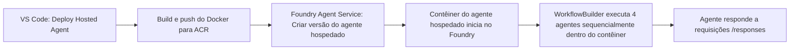
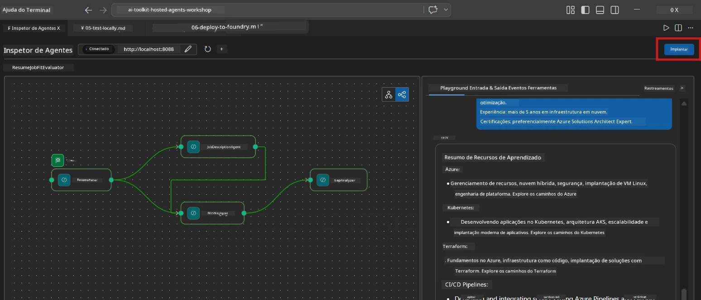
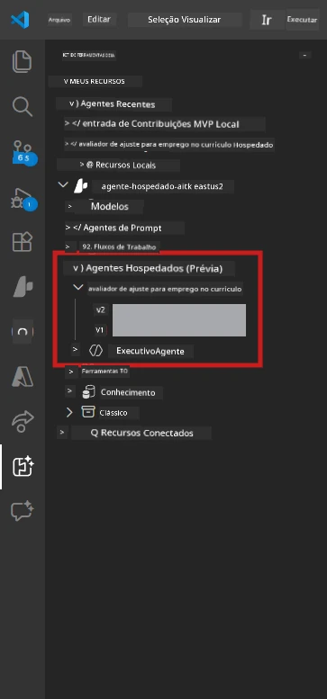

# Módulo 6 - Implantar no Serviço Foundry Agent

⏱️ ~10 min

Neste módulo, você implantará seu fluxo de trabalho multiagente testado localmente no [Microsoft Foundry](https://learn.microsoft.com/azure/foundry/agents/concepts/hosted-agents) como um **Agente Hospedado**. O processo de implantação cria uma imagem de contêiner Docker, envia para o [Azure Container Registry (ACR)](https://learn.microsoft.com/azure/container-registry/container-registry-intro) e cria uma versão do agente hospedado no [Foundry Agent Service](https://learn.microsoft.com/azure/foundry/agents/how-to/publish-agent).

> **Diferença chave do Lab 01:** O processo de implantação é idêntico. O Foundry trata seu fluxo de trabalho multiagente como um único agente hospedado - a complexidade está dentro do contêiner, mas a superfície de implantação é o mesmo endpoint `/responses`.

### Pipeline de implantação


```mermaid
flowchart LR
    A[VS Code: Deploy Hosted Agent] --> B[Build e push do Docker para ACR]
    B --> C[Foundry Agent Service: Criar versão do agente hospedado]
    C --> D[Contêiner do agente hospedado inicia no Foundry]
    D --> E[WorkflowBuilder executa 4 agentes sequencialmente dentro do contêiner]
    E --> F[Agente responde a requisições /responses]
```

---

## Verificação de pré-requisitos

Antes de implantar, verifique cada item abaixo:

1. **O agente passou nos testes locais rápidos:**
   - Você completou todos os 3 testes no [Módulo 5](05-test-locally.md) e o fluxo de trabalho produziu saída completa com cartões de lacunas e URLs do Microsoft Learn.

2. **Você tem a função [Foundry User](https://learn.microsoft.com/azure/foundry/concepts/rbac-foundry)** (para implantar, é necessário no mínimo **Foundry Project Manager** no escopo do projeto):

   > **Nota:** As funções RBAC do Foundry foram renomeadas recentemente - **Foundry User**, **Foundry Owner**, e **Foundry Project Manager** eram anteriormente chamados de Azure AI User, Azure AI Owner, e Azure AI Project Manager. IDs e permissões de função permanecem inalterados.

   - Verifique no [Portal Azure](https://portal.azure.com) → seu recurso de **projeto** Foundry → **Controle de acesso (IAM)** → **Atribuições de função** → confirme que **Foundry User** (ou superior) está listado para sua conta.

3. **Você está logado no Azure no VS Code:**
   - Verifique o ícone Contas no canto inferior esquerdo do VS Code. O nome da sua conta deve estar visível.

4. **`agent.yaml` tem valores corretos:**
   - Abra `PersonalCareerCopilot/agent.yaml` e verifique:
     ```yaml
     environment_variables:
       - name: AZURE_AI_MODEL_DEPLOYMENT_NAME
         value: ${AZURE_AI_MODEL_DEPLOYMENT_NAME}
     ```
   - `FOUNDRY_PROJECT_ENDPOINT` **não** está listado aqui - Foundry o injeta em tempo de execução. Apenas `AZURE_AI_MODEL_DEPLOYMENT_NAME` precisa ser declarado.

5. **`requirements.txt` tem versões corretas:**
   ```
   agent-framework-foundry
   agent-framework-foundry-hosting
   mcp<2,>=1.24.0
   debugpy
   ```

---

## Passo 1: Iniciar a implantação

### Opção A: Implantar pelo Agent Inspector (recomendado)

Se o agente estiver sendo executado via F5 com o Agent Inspector aberto:

1. Observe o **canto superior direito** do painel do Agent Inspector.
2. Clique no botão **Deploy** (ícone de nuvem com uma seta para cima ↑).
3. O assistente de implantação será aberto.



### Opção B: Implantar pela Command Palette

1. Pressione `Ctrl+Shift+P` para abrir a **Command Palette**.
2. Digite: **Foundry Toolkit: Deploy Hosted Agent** e selecione.
3. O assistente de implantação será aberto.

---

## Passo 2: Configurar a implantação

### 2.1 Selecione o projeto-alvo

1. Um menu suspenso mostrará seus projetos Foundry.
2. Selecione o projeto que você usou ao longo do workshop (ex.: `workshop-agents`).

### 2.2 Selecione o arquivo do agente containerizado

1. Você será solicitado a selecionar o ponto de entrada do agente.
2. Navegue até `workshop/lab02-multi-agent/PersonalCareerCopilot/` e escolha **`main.py`**.

### 2.3 Configure os recursos

| Configuração | Valor recomendado | Notas |
|---------|------------------|-------|
| **Método de Implantação** | **Container** (recomendado) ou **Code** | Container cria uma imagem Docker; Code carrega o código fonte como ZIP (preview) |
| **Registro do Container** | **ACR padrão** | Foundry cria e gerencia um para você |
| **CPU** | `0.25` | Padrão. Fluxos multiagente não precisam de mais CPU pois chamadas de modelo são limitadas por E/S |
| **Memória** | `0.5Gi` | Padrão. Aumente para `1Gi` se adicionar ferramentas pesadas de processamento de dados |

---

## Passo 3: Confirmar e implantar

1. O assistente mostra um resumo da implantação.
2. Revise e clique em **Confirmar e Implantar**.
3. Acompanhe o progresso no VS Code.

### O que acontece durante a implantação

Observe o painel **Output** do VS Code (selecione o dropdown "Microsoft Foundry"):

1. **Build do Docker** - Constrói o container a partir do seu `Dockerfile`
   ```
   Step 1/6 : FROM python:3.12-slim
   Step 2/6 : WORKDIR /app
   ...
   Successfully built abc123def456
   ```

2. **Push do Docker** - Envia a imagem para o ACR (1-3 minutos na primeira implantação).

3. **Registro do agente** - Foundry cria um agente hospedado usando metadados de `agent.yaml`. O nome do agente é `resume-job-fit-evaluator`.

4. **Início do container** - O container inicia na infraestrutura gerenciada do Foundry com uma identidade gerenciada pelo sistema.

> **A primeira implantação é mais lenta** (Docker envia todas as camadas). Implantações subsequentes reutilizam camadas em cache e são mais rápidas.

### Notas específicas para multiagente

- **Os quatro agentes estão dentro de um único container.** Foundry vê um único agente hospedado. O grafo WorkflowBuilder roda internamente.
- **Chamadas MCP saem para fora.** O container precisa de acesso à internet para alcançar `https://learn.microsoft.com/api/mcp`. A infraestrutura gerenciada do Foundry fornece isso por padrão.
- **[Identidade gerenciada](https://learn.microsoft.com/azure/foundry/agents/concepts/agent-identity).** Foundry cria automaticamente uma **identidade Entra dedicada por agente** para cada agente hospedado no momento da implantação. No ambiente hospedado, `DefaultAzureCredential` resolve automaticamente para essa identidade do agente - nenhuma configuração manual de identidade gerenciada é necessária.

---

## Passo 4: Verifique o status da implantação

1. Abra a barra lateral **Microsoft Foundry** (clique no ícone Foundry na Barra de Atividades).
2. Expanda **Hosted Agents (Preview)** no seu projeto.
3. Encontre **resume-job-fit-evaluator** (ou o nome do seu agente).
4. Clique no nome do agente → expanda versões (ex.: `v1`).
5. Clique na versão → verifique **Detalhes do Container** → **Status**:



| Status | Significado |
|--------|---------|
| **active** | Agente está executando e pronto para aceitar requisições |
| **creating** | Container está iniciando (aguarde 30–60 segundos) |
| **failed** | Container falhou ao iniciar (verifique os logs - veja abaixo) |

> **Nota:** A barra lateral do VS Code pode mostrar rótulos como "Running" ou "Started" enquanto o status da API subjacente usa `active`/`creating`. Qualquer exibição indica o mesmo estado.

> **A inicialização do multiagente leva mais tempo** do que o agente único porque o container cria 4 instâncias de agente na inicialização. `creating` por até 2 minutos é normal.

---

## Erros comuns na implantação e como corrigir

### Erro 1: Permissão negada - `agents/write`

```
Error: lacks the required data action 
Microsoft.CognitiveServices/accounts/AIServices/agents/write
```

**Correção:** Atribua a função **[Foundry User](https://learn.microsoft.com/azure/foundry/concepts/rbac-foundry)** (anteriormente **Azure AI User**) no nível do **projeto**. Veja o [Módulo 8 - Solução de Problemas](08-troubleshooting.md) para instruções passo a passo.

### Erro 2: Docker não está em execução

```
Error: Docker build failed / Cannot connect to Docker daemon
```

**Correção:**
1. Inicie o Docker Desktop.
2. Aguarde a mensagem "Docker Desktop is running".
3. Verifique com: `docker info`
4. **Windows:** Certifique-se que o backend WSL 2 está habilitado nas configurações do Docker Desktop.
5. Tente novamente.

### Erro 3: falha ao instalar pip durante build Docker

```
Error: Could not find a version that satisfies the requirement agent-framework-foundry
```

**Correção:** Verifique se o `requirements.txt` corresponde a:
```
agent-framework-foundry
agent-framework-foundry-hosting
mcp<2,>=1.24.0
debugpy
```

Se o build ainda falhar, sua rede Docker pode estar bloqueando PyPI. Verifique as configurações de proxy em `docker info`.

### Erro 4: Ferramenta MCP falha no agente hospedado

Se o Gap Analyzer parar de produzir URLs do Microsoft Learn após a implantação:

**Causa raiz:** A política de rede pode estar bloqueando HTTPS de saída do container.

**Correção:**
1. Geralmente não é um problema na configuração padrão do Foundry.
2. Se acontecer, verifique se a rede virtual do projeto Foundry tem um NSG bloqueando HTTPS de saída.
3. A ferramenta MCP tem URLs de fallback embutidos, então o agente ainda gera saída (sem URLs ao vivo).

---

### Checkpoint

- [ ] Comando de implantação completado sem erros no VS Code
- [ ] Agente aparece sob **Hosted Agents (Preview)** na barra lateral do Foundry
- [ ] Nome do agente é `resume-job-fit-evaluator` (ou o nome escolhido)
- [ ] Status do container mostra **Started** ou **Running**
- [ ] (Se houver erros) Você identificou o erro, aplicou a correção e implantou com sucesso

---

**Anterior:** [05 - Testar Localmente](05-test-locally.md) · **Próximo:** [07 - Verificar no Playground →](07-verify-in-playground.md)

---

<!-- CO-OP TRANSLATOR DISCLAIMER START -->
**Aviso Legal**:
Este documento foi traduzido usando o serviço de tradução por IA [Co-op Translator](https://github.com/Azure/co-op-translator). Embora nos esforcemos pela precisão, por favor, esteja ciente de que traduções automatizadas podem conter erros ou imprecisões. O documento original em seu idioma nativo deve ser considerado a fonte autorizada. Para informações críticas, recomenda-se tradução profissional humana. Não nos responsabilizamos por quaisquer mal-entendidos ou interpretações incorretas decorrentes do uso desta tradução.
<!-- CO-OP TRANSLATOR DISCLAIMER END -->