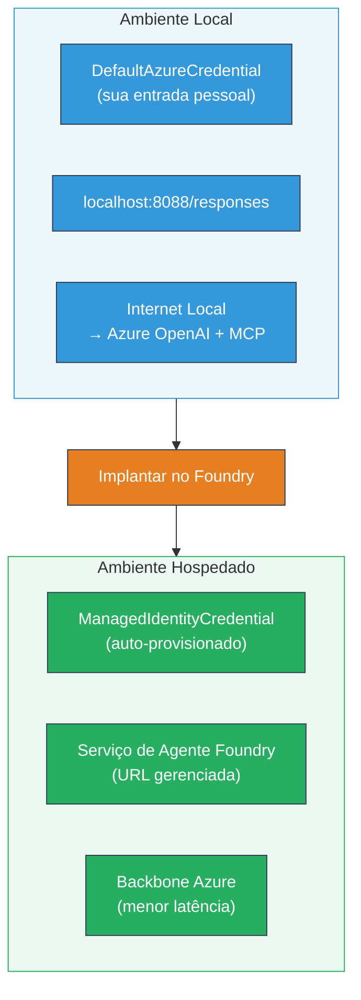

# Módulo 7 - Verificar no Playground

Neste módulo, você testa seu fluxo de trabalho multiagente implantado tanto no **VS Code** quanto no **[Foundry Portal](https://ai.azure.com)**, confirmando que o agente se comporta de forma idêntica ao teste local.

---

## Por que verificar após a implantação?

Seu fluxo de trabalho multiagente funcionou perfeitamente localmente, então por que testar novamente? O ambiente hospedado difere em vários aspectos:


| Diferença | Local | Hospedado |
|-----------|-------|-----------|
| **Identidade** | [`DefaultAzureCredential`](https://learn.microsoft.com/azure/developer/python/sdk/authentication/credential-chains#defaultazurecredential-overview) (sua entrada pessoal) | [`ManagedIdentityCredential`](https://learn.microsoft.com/python/api/overview/azure/identity-readme#managed-identity-support) (provisionado automaticamente) |
| **Endpoint** | `http://localhost:8088/responses` | endpoint do [Foundry Agent Service](https://learn.microsoft.com/azure/foundry/agents/concepts/hosted-agents) (URL gerenciada) |
| **Rede** | Máquina local → Azure OpenAI + MCP saída | Backbone do Azure (latência menor entre serviços) |
| **Conectividade MCP** | Internet local → `learn.microsoft.com/api/mcp` | Container saída → `learn.microsoft.com/api/mcp` |

Se qualquer variável de ambiente estiver mal configurada, RBAC diferir, ou a saída MCP estiver bloqueada, você identificará aqui.

---

## Opção A: Testar no Playground do VS Code (recomendado primeiro)

A [extensão Foundry](https://marketplace.visualstudio.com/items?itemName=TeamsDevApp.vscode-ai-foundry) inclui um Playground integrado que permite conversar com seu agente implantado sem sair do VS Code.

### Passo 1: Navegar até seu agente hospedado

1. Clique no ícone **Microsoft Foundry** na **Barra de Atividades** do VS Code (barra lateral esquerda) para abrir o painel Foundry.
2. Expanda seu projeto conectado (ex: `workshop-agents`).
3. Expanda **Hosted Agents (Preview)**.
4. Você deve ver o nome do seu agente (ex: `resume-job-fit-evaluator`).

### Passo 2: Selecionar uma versão

1. Clique no nome do agente para expandir suas versões.
2. Clique na versão que você implantou (ex: `v1`).
3. Um **painel de detalhes** abre mostrando os Detalhes do Container.
4. Verifique se o status está **Started** ou **Running**.

### Passo 3: Abrir o Playground

1. No painel de detalhes, clique no botão **Playground** (ou clique com o botão direito na versão → **Open in Playground**).
2. Uma interface de chat abre em uma aba do VS Code.

### Passo 4: Executar seus testes iniciais

Use os mesmos 3 testes do [Módulo 5](05-test-locally.md). Digite cada mensagem na caixa de entrada do Playground e pressione **Send** (ou **Enter**).

#### Teste 1 - Currículo completo + JD (fluxo padrão)

Cole o prompt completo do currículo + JD do Módulo 5, Teste 1 (Jane Doe + Engenheira Sênior de Nuvem na Contoso Ltd).

**Esperado:**
- Pontuação de adequação com detalhamento matemático (escala de 100 pontos)
- Seção de Skills combinadas
- Seção de Skills ausentes
- **Um cartão de lacuna por skill ausente** com URLs do Microsoft Learn
- Roteiro de aprendizado com linha do tempo

#### Teste 2 - Teste curto rápido (entrada mínima)

```
RESUME: 3 years Python developer, knows Django and PostgreSQL, no cloud experience.

JOB: Cloud DevOps Engineer requiring AWS, Kubernetes, Terraform, CI/CD. 5 years needed.
```

**Esperado:**
- Pontuação de adequação menor (< 40)
- Avaliação honesta com caminho de aprendizagem gradual
- Múltiplos cartões de lacuna (AWS, Kubernetes, Terraform, CI/CD, lacuna de experiência)

#### Teste 3 - Candidato com alta adequação

```
RESUME:
10 years Azure Cloud Architect. AZ-305 certified. Expert in AKS, Terraform, Azure DevOps, 
Azure Functions, Helm, Prometheus, Grafana, Python, Go. Led platform team of 8.

JOB:
Senior Cloud Engineer. Required: AKS, Terraform, Azure DevOps, Python. Preferred: Helm, Go.
5+ years experience. AZ-305 preferred.
```

**Esperado:**
- Pontuação de adequação alta (≥ 80)
- Foco em preparação para entrevista e aprimoramento
- Poucos ou nenhum cartão de lacuna
- Linha do tempo curta focada na preparação

### Passo 5: Comparar com os resultados locais

Abra suas anotações ou aba do navegador do Módulo 5 onde salvou as respostas locais. Para cada teste:

- A resposta tem a **mesma estrutura** (pontuação, cartões de lacuna, roteiro)?
- Segue o **mesmo esquema de pontuação** (detalhamento na escala de 100 pontos)?
- As **URLs do Microsoft Learn** ainda estão presentes nos cartões de lacuna?
- Há **um cartão de lacuna por skill ausente** (não truncado)?

> **Diferenças menores na redação são normais** - o modelo é não determinístico. Foque em estrutura, consistência da pontuação e uso das ferramentas MCP.

---

## Opção B: Testar no Foundry Portal

O [Foundry Portal](https://ai.azure.com) oferece um playground baseado na web, útil para compartilhar com colegas ou responsáveis.

### Passo 1: Abrir o Foundry Portal

1. Abra seu navegador e acesse [https://ai.azure.com](https://ai.azure.com).
2. Faça login com a mesma conta Azure usada durante o workshop.

### Passo 2: Navegar até seu projeto

1. Na página inicial, procure **Projetos Recentes** na barra lateral esquerda.
2. Clique no nome do seu projeto (ex: `workshop-agents`).
3. Se não encontrar, clique em **Todos os projetos** e pesquise.

### Passo 3: Encontrar seu agente implantado

1. No menu lateral do projeto, clique em **Build** → **Agents** (ou procure a seção **Agents**).
2. Você verá uma lista de agentes. Encontre seu agente implantado (ex: `resume-job-fit-evaluator`).
3. Clique no nome do agente para abrir a página de detalhes.

### Passo 4: Abrir o Playground

1. Na página de detalhes do agente, olhe na barra de ferramentas superior.
2. Clique em **Open in playground** (ou **Try in playground**).
3. Uma interface de chat abrirá.

### Passo 5: Executar os mesmos testes iniciais

Repita os 3 testes do Playground do VS Code acima. Compare cada resposta com os resultados locais (Módulo 5) e do Playground VS Code (Opção A).

---

## Verificação específica para multi-agentes

Além da correção básica, verifique estes comportamentos específicos para multi-agentes:

### Execução das ferramentas MCP

| Verificação | Como verificar | Condição de aprovação |
|-------------|----------------|----------------------|
| Chamadas MCP bem-sucedidas | Cartões de lacuna contêm URLs `learn.microsoft.com` | URLs reais, não mensagens de fallback |
| Múltiplas chamadas MCP | Cada lacuna de prioridade Alta/Média tem recursos | Não apenas o primeiro cartão de lacuna |
| Fallback MCP funciona | Se URLs estiverem ausentes, verificar texto de fallback | Agente ainda gera cartões de lacuna (com ou sem URLs) |

### Coordenação dos agentes

| Verificação | Como verificar | Condição de aprovação |
|-------------|----------------|----------------------|
| Todos os 4 agentes rodaram | Saída contém pontuação E cartões de lacuna | Pontuação do MatchingAgent, cartões do GapAnalyzer |
| Execução paralela | Tempo de resposta é razoável (< 2 min) | Se > 3 min, a execução paralela pode não estar funcionando |
| Integridade do fluxo de dados | Cartões de lacuna referenciam skills do relatório de matching | Não há skills inventadas que não constem no JD |

---

## Rubrica de validação

Use esta rubrica para avaliar o comportamento hospedado do seu fluxo de trabalho multiagente:

| # | Critério | Condição de aprovação | Passou? |
|---|----------|-----------------------|---------|
| 1 | **Correção funcional** | Agente responde a currículo + JD com pontuação e análise de lacunas | |
| 2 | **Consistência de pontuação** | Pontuação usa escala de 100 pontos com detalhamento matemático | |
| 3 | **Completude dos cartões de lacuna** | Um cartão por skill ausente (não truncado ou combinado) | |
| 4 | **Integração da ferramenta MCP** | Cartões têm URLs reais do Microsoft Learn | |
| 5 | **Consistência estrutural** | Estrutura da saída coincide entre execução local e hospedada | |
| 6 | **Tempo de resposta** | Agente hospedado responde em até 2 minutos para avaliação completa | |
| 7 | **Sem erros** | Sem erros HTTP 500, timeouts ou respostas vazias | |

> Um "pass" significa que todos os 7 critérios são cumpridos para os 3 testes em pelo menos um playground (VS Code ou Portal).

---

## Solução de problemas no playground

| Sintoma | Causa provável | Solução |
|---------|----------------|---------|
| Playground não carrega | Status do container não é "Started" | Volte ao [Módulo 6](06-deploy-to-foundry.md), verifique status da implantação. Aguarde se estiver "Pending" |
| Agente retorna resposta vazia | Nome do deployment do modelo inconsistente | Verifique `agent.yaml` → `environment_variables` → `MODEL_DEPLOYMENT_NAME` corresponde ao modelo implantado |
| Agente retorna mensagem de erro | Permissão [RBAC](https://learn.microsoft.com/azure/foundry/concepts/rbac-foundry) ausente | Atribua **[Azure AI User](https://aka.ms/foundry-ext-project-role)** no escopo do projeto |
| Sem URLs do Microsoft Learn nos cartões | Saída MCP bloqueada ou servidor MCP indisponível | Verifique se container alcança `learn.microsoft.com`. Veja [Módulo 8](08-troubleshooting.md) |
| Apenas 1 cartão de lacuna (truncado) | Instruções do GapAnalyzer sem bloco "CRITICAL" | Revise [Módulo 3, Passo 2.4](03-configure-agents.md) |
| Pontuação muito diferente da local | Modelo ou instruções implantadas diferentes | Compare variáveis de ambiente `agent.yaml` com `.env` local. Reimplante se necessário |
| "Agent not found" no Portal | Implantação ainda propagando ou falhou | Aguarde 2 minutos, atualize. Se continuar ausente, reimplante no [Módulo 6](06-deploy-to-foundry.md) |

---

### Checkpoint

- [ ] Testado agente no Playground do VS Code - todos os 3 testes concluídos
- [ ] Testado agente no Playground do [Foundry Portal](https://ai.azure.com) - todos os 3 testes concluídos
- [ ] Respostas são estruturalmente consistentes com teste local (pontuação, cartões, roteiro)
- [ ] URLs do Microsoft Learn estão presentes nos cartões (ferramenta MCP funcionando no ambiente hospedado)
- [ ] Um cartão de lacuna por skill ausente (sem truncamento)
- [ ] Sem erros ou timeouts durante os testes
- [ ] Rubrica de validação concluída (todos os 7 critérios aprovados)

---

**Anterior:** [06 - Deploy to Foundry](06-deploy-to-foundry.md) · **Próximo:** [08 - Troubleshooting →](08-troubleshooting.md)

---

<!-- CO-OP TRANSLATOR DISCLAIMER START -->
**Aviso Legal**:  
Este documento foi traduzido usando o serviço de tradução por IA [Co-op Translator](https://github.com/Azure/co-op-translator). Embora nos esforcemos para garantir a precisão, por favor, esteja ciente de que traduções automatizadas podem conter erros ou imprecisões. O documento original em seu idioma nativo deve ser considerado a fonte autorizada. Para informações críticas, é recomendada a tradução profissional humana. Não nos responsabilizamos por quaisquer mal-entendidos ou interpretações incorretas decorrentes do uso desta tradução.
<!-- CO-OP TRANSLATOR DISCLAIMER END -->