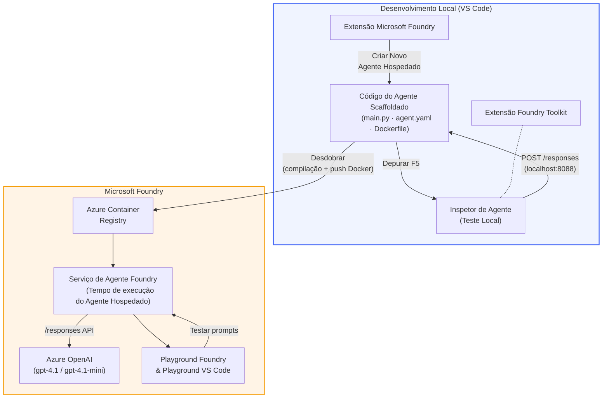

# Foundry Toolkit + Workshop de Agentes Alojados Foundry

[](https://www.python.org/)
[](https://github.com/microsoft/agents)
[](https://learn.microsoft.com/azure/ai-foundry/agents/concepts/hosted-agents/)
[](https://ai.azure.com/)
[](https://learn.microsoft.com/azure/ai-services/openai/)
[](https://learn.microsoft.com/cli/azure/install-azure-cli)
[](https://learn.microsoft.com/azure/developer/azure-developer-cli/install-azd)
[](https://www.docker.com/)
[](https://marketplace.visualstudio.com/items?itemName=ms-windows-ai-studio.windows-ai-studio)
[](LICENSE)

Construa, teste e implemente agentes de IA no **Microsoft Foundry Agent Service** como **Agentes Alojados** - tudo diretamente a partir do VS Code usando a **extensão Microsoft Foundry** e o **Foundry Toolkit**.

> **Os Agentes Alojados estão atualmente em pré-visualização.** As regiões suportadas são limitadas - veja [disponibilidade por região](https://learn.microsoft.com/azure/foundry/agents/concepts/hosted-agents#region-availability).

> A pasta `agent/` dentro de cada laboratório é **automaticamente criada** pela extensão Foundry - depois personaliza o código, testa localmente e implementa.

<!-- CO-OP TRANSLATOR LANGUAGES TABLE START -->
[Arabic](../ar/README.md) | [Bengali](../bn/README.md) | [Bulgarian](../bg/README.md) | [Burmese (Myanmar)](../my/README.md) | [Chinese (Simplified)](../zh-CN/README.md) | [Chinese (Traditional, Hong Kong)](../zh-HK/README.md) | [Chinese (Traditional, Macau)](../zh-MO/README.md) | [Chinese (Traditional, Taiwan)](../zh-TW/README.md) | [Croatian](../hr/README.md) | [Czech](../cs/README.md) | [Danish](../da/README.md) | [Dutch](../nl/README.md) | [Estonian](../et/README.md) | [Finnish](../fi/README.md) | [French](../fr/README.md) | [German](../de/README.md) | [Greek](../el/README.md) | [Hebrew](../he/README.md) | [Hindi](../hi/README.md) | [Hungarian](../hu/README.md) | [Indonesian](../id/README.md) | [Italian](../it/README.md) | [Japanese](../ja/README.md) | [Kannada](../kn/README.md) | [Khmer](../km/README.md) | [Korean](../ko/README.md) | [Lithuanian](../lt/README.md) | [Malay](../ms/README.md) | [Malayalam](../ml/README.md) | [Marathi](../mr/README.md) | [Nepali](../ne/README.md) | [Nigerian Pidgin](../pcm/README.md) | [Norwegian](../no/README.md) | [Persian (Farsi)](../fa/README.md) | [Polish](../pl/README.md) | [Portuguese (Brazil)](../pt-BR/README.md) | [Portuguese (Portugal)](./README.md) | [Punjabi (Gurmukhi)](../pa/README.md) | [Romanian](../ro/README.md) | [Russian](../ru/README.md) | [Serbian (Cyrillic)](../sr/README.md) | [Slovak](../sk/README.md) | [Slovenian](../sl/README.md) | [Spanish](../es/README.md) | [Swahili](../sw/README.md) | [Swedish](../sv/README.md) | [Tagalog (Filipino)](../tl/README.md) | [Tamil](../ta/README.md) | [Telugu](../te/README.md) | [Thai](../th/README.md) | [Turkish](../tr/README.md) | [Ukrainian](../uk/README.md) | [Urdu](../ur/README.md) | [Vietnamese](../vi/README.md)

> **Prefere Clonar Localmente?**
>
> Este repositório inclui traduções em mais de 50 idiomas, o que aumenta significativamente o tamanho da transferência. Para clonar sem traduções, use sparse checkout:
>
> **Bash / macOS / Linux:**
> ```bash
> git clone --filter=blob:none --sparse https://github.com/microsoft-foundry/Foundry_Toolkit_for_VSCode_Lab.git
> cd Foundry_Toolkit_for_VSCode_Lab
> git sparse-checkout set --no-cone '/*' '!translations' '!translated_images'
> ```
>
> **CMD (Windows):**
> ```cmd
> git clone --filter=blob:none --sparse https://github.com/microsoft-foundry/Foundry_Toolkit_for_VSCode_Lab.git
> cd Foundry_Toolkit_for_VSCode_Lab
> git sparse-checkout set --no-cone "/*" "!translations" "!translated_images"
> ```
>
> Isto fornece tudo o que precisa para completar o curso com um download muito mais rápido.
<!-- CO-OP TRANSLATOR LANGUAGES TABLE END -->

---

## Arquitetura


**Fluxo:** A extensão Foundry cria a estrutura do agente → personaliza o código & instruções → testa localmente com o Agent Inspector → implementa na Foundry (imagem Docker enviada para ACR) → verifica no Playground.

---

## O que vai construir

| Laboratório | Descrição | Estado |
|-----|-------------|--------|
| **Lab 01 - Agente Único** | Construir o **Agente "Explique Como Se Eu Fosse um Executivo"**, testar localmente e implementar na Foundry | ✅ Disponível |
| **Lab 02 - Workflow Multi-Agente** | Construir o **"Currículo → Avaliador de Adequação ao Emprego"** - 4 agentes colaboram para avaliar a adequação do currículo e gerar um roteiro de aprendizagem | ✅ Disponível |

---

## Conheça o Agente Executivo

Neste workshop vai construir o **Agente "Explique Como Se Eu Fosse um Executivo"** - um agente de IA que transforma jargão técnico complicado em sumários calmos e prontos para o conselho de administração. Porque sejamos honestos, ninguém no C-suite quer ouvir falar sobre "exaustão da pool de threads causada por chamadas síncronas introduzidas na v3.2."

Criei este agente depois de demasiados incidentes onde o meu post-mortem, perfeitamente elaborado, recebeu a resposta: *"Então... o site está em baixo ou não?"*

### Como funciona

Dá-lhe uma atualização técnica. Ele devolve um resumo executivo - três pontos-chave, sem jargão, sem rastos de pilha, sem pânico existencial. Apenas **o que aconteceu**, **impacto no negócio** e **próximo passo**.

### Veja em ação

**Você diz:**
> "A latência da API aumentou devido à exaustão da pool de threads causada por chamadas síncronas introduzidas na v3.2."

**O agente responde:**

> **Resumo Executivo:**
> - **O que aconteceu:** Após a última versão, o sistema tornou-se mais lento.
> - **Impacto no negócio:** Alguns utilizadores experienciaram atrasos ao usar o serviço.
> - **Próximo passo:** A alteração foi revertida e está a ser preparada uma correção antes da nova implementação.

### Porquê este agente?

É um agente simples, com um propósito único - perfeito para aprender o fluxo dos agentes alojados de ponta a ponta sem se perder em cadeias de ferramentas complexas. E honestamente? Toda equipa de engenharia poderia ter um destes.

---

## Estrutura do workshop

```
📂 Foundry_Toolkit_for_VSCode_Lab/
├── 📄 README.md                      ← You are here
├── 📂 ExecutiveAgent/                ← Standalone hosted agent project
│   ├── agent.yaml
│   ├── Dockerfile
│   ├── main.py
│   └── requirements.txt
└── 📂 workshop/
    ├── 📂 lab01-single-agent/        ← Full lab: docs + agent code
    │   ├── README.md                 ← Hands-on lab instructions
    │   ├── 📂 docs/                  ← Step-by-step tutorial modules
    │   │   ├── 00-prerequisites.md
    │   │   ├── 01-install-foundry-toolkit.md
    │   │   ├── 02-create-foundry-project.md
    │   │   ├── 03-create-hosted-agent.md
    │   │   ├── 04-configure-and-code.md
    │   │   ├── 05-test-locally.md
    │   │   ├── 06-deploy-to-foundry.md
    │   │   ├── 07-verify-in-playground.md
    │   │   └── 08-troubleshooting.md
    │   └── 📂 agent/                 ← Reference solution (auto-scaffolded by Foundry extension)
    │       ├── agent.yaml
    │       ├── Dockerfile
    │       ├── main.py
    │       └── requirements.txt
    └── 📂 lab02-multi-agent/         ← Resume → Job Fit Evaluator
        ├── README.md                 ← Hands-on lab instructions (end-to-end)
        ├── 📂 docs/                  ← Step-by-step tutorial modules
        │   ├── 00-prerequisites.md
        │   ├── 01-understand-multi-agent.md
        │   ├── 02-scaffold-multi-agent.md
        │   ├── 03-configure-agents.md
        │   ├── 04-orchestration-patterns.md
        │   ├── 05-test-locally.md
        │   ├── 06-deploy-to-foundry.md
        │   ├── 07-verify-in-playground.md
        │   └── 08-troubleshooting.md
        └── 📂 PersonalCareerCopilot/ ← Reference solution (multi-agent workflow)
            ├── agent.yaml
            ├── Dockerfile
            ├── main.py
            └── requirements.txt
```

> **Nota:** A pasta `agent/` dentro de cada laboratório é gerada pela **extensão Microsoft Foundry** quando executa o comando `Microsoft Foundry: Create a New Hosted Agent` a partir da Paleta de Comandos. Os ficheiros são depois personalizados com as instruções, ferramentas e configuração do seu agente. O Lab 01 guia-o na recriação disto desde o início.

---

## Como começar

### 1. Clone o repositório

```bash
git clone https://github.com/microsoft-foundry/Foundry_Toolkit_for_VSCode_Lab.git
cd Foundry_Toolkit_for_VSCode_Lab
```

### 2. Configure um ambiente virtual Python

```bash
python -m venv venv
```

Ative-o:

- **Windows (PowerShell):**
  ```powershell
  .\venv\Scripts\Activate.ps1
  ```
- **macOS / Linux:**
  ```bash
  source venv/bin/activate
  ```

### 3. Instale as dependências

```bash
pip install -r workshop/lab01-single-agent/agent/requirements.txt
```

### 4. Configure as variáveis de ambiente

Copie o ficheiro `.env` de exemplo dentro da pasta do agente e preencha os seus valores:

```bash
cp workshop/lab01-single-agent/agent/.env.example workshop/lab01-single-agent/agent/.env
```

Edite `workshop/lab01-single-agent/agent/.env`:

```env
AZURE_AI_PROJECT_ENDPOINT=https://<your-account>.services.ai.azure.com/api/projects/<your-project>
MODEL_DEPLOYMENT_NAME=<your-model-deployment-name>
```

### 5. Siga os laboratórios do workshop

Cada laboratório é autónomo com os seus próprios módulos. Comece pelo **Lab 01** para aprender os fundamentos, depois passe para o **Lab 02** para workflows multi-agente.

#### Lab 01 - Agente Único ([instruções completas](workshop/lab01-single-agent/README.md))

| # | Módulo | Link |
|---|--------|------|
| 1 | Leia os pré-requisitos | [00-prerequisites.md](workshop/lab01-single-agent/docs/00-prerequisites.md) |
| 2 | Instale o Foundry Toolkit & a extensão Foundry | [01-install-foundry-toolkit.md](workshop/lab01-single-agent/docs/01-install-foundry-toolkit.md) |
| 3 | Crie um projeto Foundry | [02-create-foundry-project.md](workshop/lab01-single-agent/docs/02-create-foundry-project.md) |
| 4 | Crie um agente alojado | [03-create-hosted-agent.md](workshop/lab01-single-agent/docs/03-create-hosted-agent.md) |
| 5 | Configure instruções & ambiente | [04-configure-and-code.md](workshop/lab01-single-agent/docs/04-configure-and-code.md) |
| 6 | Teste localmente | [05-test-locally.md](workshop/lab01-single-agent/docs/05-test-locally.md) |
| 7 | Implemente na Foundry | [06-deploy-to-foundry.md](workshop/lab01-single-agent/docs/06-deploy-to-foundry.md) |
| 8 | Verifique no playground | [07-verify-in-playground.md](workshop/lab01-single-agent/docs/07-verify-in-playground.md) |
| 9 | Resolução de problemas | [08-troubleshooting.md](workshop/lab01-single-agent/docs/08-troubleshooting.md) |

#### Lab 02 - Workflow Multi-Agente ([instruções completas](workshop/lab02-multi-agent/README.md))

| # | Módulo | Link |
|---|--------|------|
| 1 | Pré-requisitos (Lab 02) | [00-prerequisites.md](workshop/lab02-multi-agent/docs/00-prerequisites.md) |
| 2 | Entenda a arquitetura multi-agente | [01-understand-multi-agent.md](workshop/lab02-multi-agent/docs/01-understand-multi-agent.md) |
| 3 | Crie a estrutura do projeto multi-agente | [02-scaffold-multi-agent.md](workshop/lab02-multi-agent/docs/02-scaffold-multi-agent.md) |
| 4 | Configure agentes & ambiente | [03-configure-agents.md](workshop/lab02-multi-agent/docs/03-configure-agents.md) |
| 5 | Padrões de orquestração | [04-orchestration-patterns.md](workshop/lab02-multi-agent/docs/04-orchestration-patterns.md) |
| 6 | Teste localmente (multi-agente) | [05-test-locally.md](workshop/lab02-multi-agent/docs/05-test-locally.md) |
| 7 | Desdobrar para Foundry | [06-deploy-to-foundry.md](workshop/lab02-multi-agent/docs/06-deploy-to-foundry.md) |
| 8 | Verificar no playground | [07-verify-in-playground.md](workshop/lab02-multi-agent/docs/07-verify-in-playground.md) |
| 9 | Resolução de problemas (multi-agente) | [08-troubleshooting.md](workshop/lab02-multi-agent/docs/08-troubleshooting.md) |

---

## Mantenedor

<table>
<tr>
    <td align="center"><a href="https://github.com/ShivamGoyal03">
        <br />
        <sub><b>Shivam Goyal</b></sub>
    </a><br />
    </td>
</tr>
</table>

---

## Permissões necessárias (referência rápida)

| Cenário | Funções necessárias |
|----------|---------------------|
| Criar novo projeto Foundry | **Azure AI Owner** no recurso Foundry |
| Desdobrar para projeto existente (novos recursos) | **Azure AI Owner** + **Contributor** na subscrição |
| Desdobrar para projeto totalmente configurado | **Reader** na conta + **Azure AI User** no projeto |

> **Importante:** Os papéis `Owner` e `Contributor` do Azure incluem apenas permissões de *gestão*, não permissões de *desenvolvimento* (ação sobre dados). É necessário ter **Azure AI User** ou **Azure AI Owner** para construir e desdobrar agentes.

---

## Referências

- [Início rápido: Desdobre o seu primeiro agente alojado (VS Code)](https://learn.microsoft.com/azure/foundry/agents/quickstarts/quickstart-hosted-agent)
- [O que são agentes alojados?](https://learn.microsoft.com/azure/foundry/agents/concepts/hosted-agents)
- [Criar fluxos de trabalho de agentes alojados no VS Code](https://learn.microsoft.com/azure/foundry/agents/how-to/vs-code-agents-workflow-pro-code)
- [Desdobrar um agente alojado](https://learn.microsoft.com/azure/foundry/agents/how-to/deploy-hosted-agent)
- [RBAC para Microsoft Foundry](https://learn.microsoft.com/azure/foundry/concepts/rbac-foundry)
- [Exemplo de Agente de Revisão de Arquitetura](https://github.com/Azure-Samples/agent-architecture-review-sample) - Agente alojado do mundo real com ferramentas MCP, diagramas Excalidraw e desdobramento duplo

---


## Licença

[MIT](../../LICENSE)

---

<!-- CO-OP TRANSLATOR DISCLAIMER START -->
**Aviso**:  
Este documento foi traduzido utilizando o serviço de tradução automática [Co-op Translator](https://github.com/Azure/co-op-translator). Embora nos esforcemos pela precisão, por favor tenha em conta que traduções automáticas podem conter erros ou imprecisões. O documento original na sua língua nativa deve ser considerado a fonte oficial. Para informação crítica, é recomendada a tradução profissional humana. Não nos responsabilizamos por quaisquer mal-entendidos ou interpretações incorretas decorrentes do uso desta tradução.
<!-- CO-OP TRANSLATOR DISCLAIMER END -->