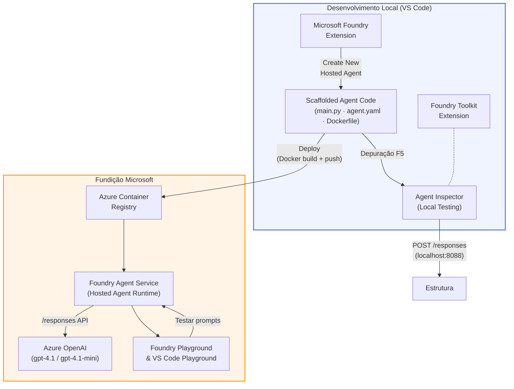

# Foundry Toolkit + Workshop de Agentes Hospedados Foundry

[](https://www.python.org/)
[](https://github.com/microsoft/agents)
[](https://learn.microsoft.com/azure/foundry/agents/concepts/hosted-agents)
[](https://ai.azure.com/)
[](https://learn.microsoft.com/azure/ai-services/openai/)
[](https://learn.microsoft.com/cli/azure/install-azure-cli)
[](https://learn.microsoft.com/azure/developer/azure-developer-cli/install-azd)
[](https://www.docker.com/)
[](https://marketplace.visualstudio.com/items?itemName=ms-windows-ai-studio.windows-ai-studio)
[](LICENSE)

Construa, teste e implemente agentes de IA no **Microsoft Foundry Agent Service** como **Agentes Hospedados** - completamente a partir do VS Code usando a **extensão Microsoft Foundry** e o **Foundry Toolkit**.

> **Agentes Hospedados estão atualmente em preview.** As regiões suportadas são limitadas - veja [disponibilidade por região](https://learn.microsoft.com/azure/foundry/agents/concepts/hosted-agents#region-availability).

> A pasta `agent/` dentro de cada laboratório é **automaticamente gerada** pela extensão Foundry - depois personaliza o código, testa localmente e faz o deploy.

### 🌐 Suporte Multilíngue

#### Suportado via GitHub Action (Automatizado & Sempre Atualizado)

<!-- CO-OP TRANSLATOR LANGUAGES TABLE START -->
[Árabe](../ar/README.md) | [Bengali](../bn/README.md) | [Búlgaro](../bg/README.md) | [Birmanês (Myanmar)](../my/README.md) | [Chinês (Simplificado)](../zh-CN/README.md) | [Chinês (Tradicional, Hong Kong)](../zh-HK/README.md) | [Chinês (Tradicional, Macau)](../zh-MO/README.md) | [Chinês (Tradicional, Taiwan)](../zh-TW/README.md) | [Croata](../hr/README.md) | [Checo](../cs/README.md) | [Dinamarquês](../da/README.md) | [Holandês](../nl/README.md) | [Estónio](../et/README.md) | [Finlandês](../fi/README.md) | [Francês](../fr/README.md) | [Alemão](../de/README.md) | [Grego](../el/README.md) | [Hebraico](../he/README.md) | [Hindi](../hi/README.md) | [Húngaro](../hu/README.md) | [Indonésio](../id/README.md) | [Italiano](../it/README.md) | [Japonês](../ja/README.md) | [Canarês](../kn/README.md) | [Khmer](../km/README.md) | [Coreano](../ko/README.md) | [Lituano](../lt/README.md) | [Malaio](../ms/README.md) | [Malaiala](../ml/README.md) | [Marata](../mr/README.md) | [Nepali](../ne/README.md) | [Pidgin Nigeriano](../pcm/README.md) | [Norueguês](../no/README.md) | [Persa (Farsi)](../fa/README.md) | [Polaco](../pl/README.md) | [Português (Brasil)](../pt-BR/README.md) | [Português (Portugal)](./README.md) | [Punjabi (Gurmukhi)](../pa/README.md) | [Romeno](../ro/README.md) | [Russo](../ru/README.md) | [Sérvio (Cirílico)](../sr/README.md) | [Eslovaco](../sk/README.md) | [Esloveno](../sl/README.md) | [Espanhol](../es/README.md) | [Suaíli](../sw/README.md) | [Sueco](../sv/README.md) | [Tagalo (Filipino)](../tl/README.md) | [Tamil](../ta/README.md) | [Telugu](../te/README.md) | [Tailandês](../th/README.md) | [Turco](../tr/README.md) | [Ucraniano](../uk/README.md) | [Urdu](../ur/README.md) | [Vietnamita](../vi/README.md)

> **Prefere Clonar Localmente?**
>
> Este repositório inclui mais de 50 traduções de idiomas que aumentam significativamente o tamanho do download. Para clonar sem as traduções, use checkout esparso:
>
> **Bash / macOS / Linux:**
> ```bash
> git clone --filter=blob:none --sparse https://github.com/microsoft-foundry/Foundry_Toolkit_for_VSCode_Lab.git
> cd Foundry_Toolkit_for_VSCode_Lab
> git sparse-checkout set --no-cone '/*' '!translations' '!translated_images'
> ```
>
> **CMD (Windows):**
> ```cmd
> git clone --filter=blob:none --sparse https://github.com/microsoft-foundry/Foundry_Toolkit_for_VSCode_Lab.git
> cd Foundry_Toolkit_for_VSCode_Lab
> git sparse-checkout set --no-cone "/*" "!translations" "!translated_images"
> ```
>
> Isto oferece tudo o que necessita para completar o curso com um download muito mais rápido.
<!-- CO-OP TRANSLATOR LANGUAGES TABLE END -->

---

## Arquitetura


```mermaid
flowchart TB
    subgraph Local["Desenvolvimento Local (VS Code)"]
        direction TB
        FE["Microsoft Foundry
        Extension"]
        FoundryToolkit["Foundry Toolkit
        Extension"]
        Scaffold["Scaffolded Agent Code
        (main.py · agent.yaml · Dockerfile)"]
        Inspector["Agent Inspector
        (Local Testing)"]
        FE -- "Create New
        Hosted Agent" --> Scaffold
        Scaffold -- "Depuração F5" --> Inspector
        FoundryToolkit -.- Inspector
    end

    subgraph Cloud["Fundição Microsoft"]
        direction TB
        ACR["Azure Container
        Registry"]
        AgentService["Foundry Agent Service
        (Hosted Agent Runtime)"]
        Model["Azure OpenAI
        (gpt-4.1 / gpt-4.1-mini)"]
        Playground["Foundry Playground
        & VS Code Playground"]
        ACR --> AgentService
        AgentService -- "/responses API" --> Model
        AgentService --> Playground
    end

    Scaffold -- "Deploy
    (Docker build + push)" --> ACR
    Inspector -- "POST /responses
    (localhost:8088)" --> Estrutura
    Playground -- "Testar prompts" --> AgentService

    style Local fill:#f0f4ff,stroke:#4a6cf7,stroke-width:2px
    style Cloud fill:#fff4e6,stroke:#f59e0b,stroke-width:2px
```

**Fluxo:** a extensão Foundry cria a estrutura do agente → personaliza o código e as instruções → testa localmente com o Agent Inspector → implementa no Foundry (imagem Docker enviada ao ACR) → verifica no Playground.

---

## O que irá construir

| Laboratório | Descrição | Estado |
|-----|-------------|--------|
| **Laboratório 01 - Agente Único** | Construa o **Agente "Explicar Como se Eu Fosse um Executivo"**, teste-o localmente e implemente no Foundry | ✅ Disponível |
| **Laboratório 02 - Workflow Multi-Agentes** | Construa o **"Avaliador de Adequação a Emprego com Base no Curriculum"** - 4 agentes colaboram para avaliar a adequação do currículo e gerar um roteiro de aprendizagem | ✅ Disponível |

---

## Conheça o Agente Executivo

Neste workshop, irá construir o **Agente "Explicar Como se Eu Fosse um Executivo"** - um agente de IA que pega numa linguagem técnica complicada e traduz para sumários calmos e prontos para a sala de reuniões. Porque sejamos honestos, ninguém no C-level quer ouvir sobre "exaustão da pool de threads causada por chamadas síncronas introduzidas na v3.2."

Criei este agente depois de uma série de incidentes em que o meu post-mortem perfeitamente elaborado recebeu a resposta: *"Então... o website está em baixo ou não?"*

### Como funciona

Introduz-lhe uma atualização técnica. Ele devolve um resumo executivo - três pontos principais, sem jargão, sem rastos de pilha, sem pânico existencial. Apenas **o que aconteceu**, **impacto no negócio**, e **próximo passo**.

### Veja-o em ação

**Você diz:**
> "A latência da API aumentou devido à exaustão da pool de threads causada por chamadas síncronas introduzidas na v3.2."

**O agente responde:**

> **Resumo Executivo:**
> - **O que aconteceu:** Após a última versão, o sistema ficou mais lento.
> - **Impacto no negócio:** Alguns utilizadores experienciaram atrasos ao usar o serviço.
> - **Próximo passo:** A alteração foi revertida e uma correção está a ser preparada antes da nova implementação.

### Porque este agente?

É um agente simples, de propósito único - perfeito para aprender o workflow de agente hospedado do início ao fim sem complicações com cadeias de ferramentas complexas. E honestamente? Todas as equipas de engenharia poderiam usar um destes.

---

## Estrutura do workshop

```
📂 Foundry_Toolkit_for_VSCode_Lab/
├── 📄 README.md                      ← You are here
└── 📂 workshop/
    ├── 📂 lab01-single-agent/        ← Full lab: docs + agent code
    │   ├── README.md                 ← Hands-on lab instructions
    │   ├── 📂 docs/                  ← Step-by-step tutorial modules
    │   │   ├── 00-prerequisites.md
    │   │   ├── 01-setup.md
    │   │   ├── 02-create-hosted-agent.md
    │   │   ├── 03-configure-and-code.md
    │   │   ├── 04-test-locally.md
    │   │   ├── 05-deploy-to-foundry.md
    │   │   ├── 06-verify-in-playground.md
    │   │   ├── 07-summary.md
    │   │   └── 08-troubleshooting.md
    │   └── 📂 agent/                 ← Reference solution (auto-scaffolded by Foundry extension)
    │       ├── agent.yaml
    │       ├── Dockerfile
    │       ├── main.py
    │       └── requirements.txt
    └── 📂 lab02-multi-agent/         ← Resume → Job Fit Evaluator
        ├── README.md                 ← Hands-on lab instructions (end-to-end)
        ├── 📂 docs/                  ← Step-by-step tutorial modules
        │   ├── 00-prerequisites.md
        │   ├── 01-understand-multi-agent.md
        │   ├── 02-scaffold-multi-agent.md
        │   ├── 03-configure-agents.md
        │   ├── 04-orchestration-patterns.md
        │   ├── 05-test-locally.md
        │   ├── 06-deploy-to-foundry.md
        │   ├── 07-verify-in-playground.md
        │   └── 08-troubleshooting.md
        └── 📂 PersonalCareerCopilot/ ← Reference solution (multi-agent workflow)
            ├── agent.yaml
            ├── Dockerfile
            ├── main.py
            └── requirements.txt
```

> **Nota:** A pasta `agent/` dentro de cada laboratório é gerada pela **extensão Microsoft Foundry** quando executa `Microsoft Foundry: Create a New Hosted Agent` no Command Palette. Os ficheiros são depois personalizados com as instruções, ferramentas e configurações do seu agente. O Laboratório 01 orienta-o em como recriar isto do zero.

---

## Começar

### 1. Clonar o repositório

```bash
git clone https://github.com/microsoft-foundry/Foundry_Toolkit_for_VSCode_Lab.git
cd Foundry_Toolkit_for_VSCode_Lab
```

### 2. Configurar um ambiente virtual Python

```bash
python -m venv venv
```

Ative-o:

- **Windows (PowerShell):**
  ```powershell
  .\venv\Scripts\Activate.ps1
  ```
- **macOS / Linux:**
  ```bash
  source venv/bin/activate
  ```

### 3. Instalar dependências

```bash
pip install -r workshop/lab01-single-agent/agent/requirements.txt
```

### 4. Configurar variáveis de ambiente

Copie o ficheiro `.env` de exemplo dentro da pasta do agente e preencha os seus valores:

```bash
cp workshop/lab01-single-agent/agent/.env.example workshop/lab01-single-agent/agent/.env
```

Edite `workshop/lab01-single-agent/agent/.env`:

```env
AZURE_AI_PROJECT_ENDPOINT=https://<your-account>.services.ai.azure.com/api/projects/<your-project>
AZURE_AI_MODEL_DEPLOYMENT_NAME=<your-model-deployment-name>
```

### 5. Siga os laboratórios do workshop

Cada laboratório é autónomo com os seus próprios módulos. Comece pelo **Laboratório 01** para aprender os fundamentos, depois avance para o **Laboratório 02** para workflows multi-agentes.

#### Laboratório 01 - Agente Único ([instruções completas](workshop/lab01-single-agent/README.md))

| # | Módulo | Link |
|---|--------|------|
| 1 | Leia os pré-requisitos | [00-prerequisites.md](workshop/lab01-single-agent/docs/00-prerequisites.md) |
| 2 | Instale Foundry Toolkit & extensão Foundry | [01-setup.md](workshop/lab01-single-agent/docs/01-setup.md) |
| 3 | Crie um projeto Foundry | [01-setup.md](workshop/lab01-single-agent/docs/01-setup.md) |
| 4 | Crie um agente hospedado | [02-create-hosted-agent.md](workshop/lab01-single-agent/docs/02-create-hosted-agent.md) |
| 5 | Configure instruções & ambiente | [03-configure-and-code.md](workshop/lab01-single-agent/docs/03-configure-and-code.md) |
| 6 | Teste localmente | [04-test-locally.md](workshop/lab01-single-agent/docs/04-test-locally.md) |
| 7 | Faça deploy no Foundry | [05-deploy-to-foundry.md](workshop/lab01-single-agent/docs/05-deploy-to-foundry.md) |
| 8 | Verifique no playground | [06-verify-in-playground.md](workshop/lab01-single-agent/docs/06-verify-in-playground.md) |
| 9 | Resolução de problemas | [08-troubleshooting.md](workshop/lab01-single-agent/docs/08-troubleshooting.md) |

#### Laboratório 02 - Workflow Multi-Agentes ([instruções completas](workshop/lab02-multi-agent/README.md))

| # | Módulo | Link |
|---|--------|------|
| 1 | Pré-requisitos (Laboratório 02) | [00-prerequisites.md](workshop/lab02-multi-agent/docs/00-prerequisites.md) |
| 2 | Entenda a arquitetura multi-agente | [01-understand-multi-agent.md](workshop/lab02-multi-agent/docs/01-understand-multi-agent.md) |
| 3 | Estruture o projeto multi-agente | [02-scaffold-multi-agent.md](workshop/lab02-multi-agent/docs/02-scaffold-multi-agent.md) |
| 4 | Configure agentes & ambiente | [03-configure-agents.md](workshop/lab02-multi-agent/docs/03-configure-agents.md) |
| 5 | Padrões de orquestração | [04-orchestration-patterns.md](workshop/lab02-multi-agent/docs/04-orchestration-patterns.md) |
| 6 | Teste localmente (multi-agente) | [05-test-locally.md](workshop/lab02-multi-agent/docs/05-test-locally.md) |

| 7 | Implantar para Foundry | [06-deploy-to-foundry.md](workshop/lab02-multi-agent/docs/06-deploy-to-foundry.md) |
| 8 | Verificar no playground | [07-verify-in-playground.md](workshop/lab02-multi-agent/docs/07-verify-in-playground.md) |
| 9 | Resolução de problemas (multi-agente) | [08-troubleshooting.md](workshop/lab02-multi-agent/docs/08-troubleshooting.md) |

---

## Mantenedor

<table>
<tr>
    <td align="center"><a href="https://github.com/ShivamGoyal03">
        <br />
        <sub><b>Shivam Goyal</b></sub>
    </a><br />
    </td>
</tr>
</table>

---

## Permissões necessárias (referência rápida)

| Cenário | Funções necessárias |
|----------|---------------|
| Criar novo projeto Foundry | **Azure AI Owner** no recurso Foundry |
| Implantar em projeto existente (novos recursos) | **Azure AI Owner** + **Contributor** na subscrição |
| Implantar em projeto totalmente configurado | **Reader** na conta + **Azure AI User** no projeto |

> **Importante:** As funções Azure `Owner` e `Contributor` incluem apenas permissões de *gestão*, não permissões de *desenvolvimento* (ação de dados). É necessário ser **Azure AI User** ou **Azure AI Owner** para construir e implantar agentes.

---

## Referências

- [Iniciação rápida: Implante o seu primeiro agente alojado (VS Code)](https://learn.microsoft.com/azure/foundry/agents/quickstarts/quickstart-hosted-agent)
- [O que são agentes alojados?](https://learn.microsoft.com/azure/foundry/agents/concepts/hosted-agents)
- [Criar fluxos de trabalho de agente alojado no VS Code](https://learn.microsoft.com/azure/foundry/agents/how-to/vs-code-agents-workflow-pro-code)
- [Implantar um agente alojado](https://learn.microsoft.com/azure/foundry/agents/how-to/deploy-hosted-agent)
- [RBAC para Microsoft Foundry](https://learn.microsoft.com/azure/foundry/concepts/rbac-foundry)
- [Amostra de agente de revisão de arquitetura](https://github.com/Azure-Samples/agent-architecture-review-sample) - Agente alojado real com ferramentas MCP, diagramas Excalidraw e implantação dupla

---


## Licença

[MIT](../../LICENSE)

---

<!-- CO-OP TRANSLATOR DISCLAIMER START -->
**Aviso Legal**:
Este documento foi traduzido utilizando o serviço de tradução automática [Co-op Translator](https://github.com/Azure/co-op-translator). Embora nos esforcemos pela precisão, esteja ciente de que traduções automáticas podem conter erros ou imprecisões. O documento original na sua língua nativa deve ser considerado a fonte autorizada. Para informações críticas, recomenda-se tradução profissional humana. Não nos responsabilizamos por quaisquer mal-entendidos ou interpretações incorretas resultantes da utilização desta tradução.
<!-- CO-OP TRANSLATOR DISCLAIMER END -->