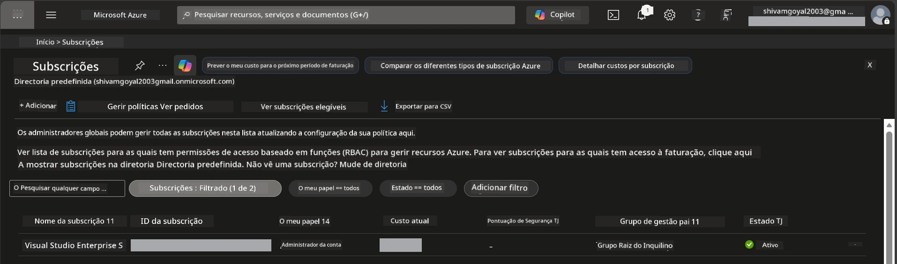

# Module 0 - Requisitos

Antes de iniciar o workshop, confirme que tem as seguintes ferramentas, acessos e ambiente prontos. Siga todos os passos abaixo - não avance sem os completar.

---

## 1. Conta e subscrição Azure

### 1.1 Criar ou verificar a sua subscrição Azure

1. Abra um navegador e navegue para [https://azure.microsoft.com/free/](https://azure.microsoft.com/free/).
2. Se não tiver uma conta Azure, clique em **Começar gratuitamente** e siga o processo de registo. Vai precisar de uma conta Microsoft (ou criar uma) e de um cartão de crédito para verificação de identidade.
3. Se já tem uma conta, faça login em [https://portal.azure.com](https://portal.azure.com).
4. No Portal, clique na lâmina **Subscrições** na navegação à esquerda (ou pesquise "Subscrições" na barra de pesquisa superior).
5. Verifique se vê pelo menos uma subscrição **Ativa**. Anote o **ID da Subscrição** - vai precisar dele mais tarde.



### 1.2 Compreender os papéis RBAC necessários

A implantação de [Hosted Agent](https://learn.microsoft.com/azure/foundry/agents/concepts/hosted-agents) requer permissões de **ação sobre dados** que os papéis padrão Azure `Owner` e `Contributor` **não** incluem. Vai necessitar de uma destas [combinações de papéis](https://learn.microsoft.com/azure/foundry/concepts/rbac-foundry#built-in-roles):

| Cenário | Papéis necessários | Onde atribuir |
|---------|--------------------|---------------|
| Criar novo projeto Foundry | **Azure AI Owner** na recurso Foundry | Recurso Foundry no Portal Azure |
| Implantar num projeto existente (novos recursos) | **Azure AI Owner** + **Contributor** na subscrição | Subscrição + recurso Foundry |
| Implantar num projeto totalmente configurado | **Reader** na conta + **Azure AI User** no projeto | Conta + Projeto no Portal Azure |

> **Ponto chave:** Os papéis Azure `Owner` e `Contributor` cobrem apenas permissões de *gestão* (operações ARM). Necessita de [**Azure AI User**](https://learn.microsoft.com/azure/foundry/concepts/rbac-foundry#built-in-roles) (ou superior) para *ações sobre dados* como `agents/write` que é necessário para criar e implantar agentes. Vai atribuir estes papéis no [Módulo 2](02-create-foundry-project.md).

---

## 2. Instalar ferramentas locais

Instale cada ferramenta abaixo. Após instalar, verifique se funciona executando o comando de verificação.

### 2.1 Visual Studio Code

1. Vá a [https://code.visualstudio.com/](https://code.visualstudio.com/).
2. Faça o download do instalador para o seu SO (Windows/macOS/Linux).
3. Execute o instalador com as configurações por defeito.
4. Abra o VS Code para confirmar que lança corretamente.

### 2.2 Python 3.10+

1. Vá a [https://www.python.org/downloads/](https://www.python.org/downloads/).
2. Faça o download do Python 3.10 ou superior (recomendado 3.12+).
3. **Windows:** Durante a instalação, marque **"Add Python to PATH"** na primeira tela.
4. Abra um terminal e verifique:

   ```powershell
   python --version
   ```

   Saída esperada: `Python 3.10.x` ou superior.

### 2.3 Azure CLI

1. Vá a [https://learn.microsoft.com/cli/azure/install-azure-cli](https://learn.microsoft.com/cli/azure/install-azure-cli).
2. Siga as instruções de instalação para o seu sistema operativo.
3. Verifique:

   ```powershell
   az --version
   ```

   Esperado: `azure-cli 2.80.0` ou superior.

4. Inicie sessão:

   ```powershell
   az login
   ```

### 2.4 Azure Developer CLI (azd)

1. Vá a [https://learn.microsoft.com/azure/developer/azure-developer-cli/install-azd](https://learn.microsoft.com/azure/developer/azure-developer-cli/install-azd).
2. Siga as instruções de instalação para o seu SO. No Windows:

   ```powershell
   winget install microsoft.azd
   ```

3. Verifique:

   ```powershell
   azd version
   ```

   Esperado: `azd version 1.x.x` ou superior.

4. Inicie sessão:

   ```powershell
   azd auth login
   ```

### 2.5 Docker Desktop (opcional)

O Docker só é necessário se quiser construir e testar a imagem do container localmente antes da implantação. A extensão Foundry trata automaticamente da construção dos containers durante a implantação.

1. Vá a [https://docs.docker.com/get-docker/](https://docs.docker.com/get-docker/).
2. Faça download e instale o Docker Desktop para o seu SO.
3. **Windows:** Certifique-se que o backend WSL 2 está selecionado durante a instalação.
4. Inicie o Docker Desktop e aguarde até o ícone na bandeja do sistema mostrar **"Docker Desktop is running"**.
5. Abra um terminal e verifique:

   ```powershell
   docker info
   ```

   Isto deverá imprimir informações do sistema Docker sem erros. Se vir `Cannot connect to the Docker daemon`, aguarde mais alguns segundos até o Docker arrancar totalmente.

---

## 3. Instalar extensões VS Code

Precisa de três extensões. Instale-as **antes** de o workshop começar.

### 3.1 Microsoft Foundry para VS Code

1. Abra o VS Code.
2. Prima `Ctrl+Shift+X` para abrir o painel de Extensões.
3. Na caixa de pesquisa, escreva **"Microsoft Foundry"**.
4. Encontre **Microsoft Foundry for Visual Studio Code** (publisher: Microsoft, ID: `TeamsDevApp.vscode-ai-foundry`).
5. Clique em **Instalar**.
6. Após a instalação, deve ver o ícone **Microsoft Foundry** aparecer na Barra de Atividades (barra lateral esquerda).

### 3.2 Foundry Toolkit

1. No painel de Extensões (`Ctrl+Shift+X`), pesquise **"Foundry Toolkit"**.
2. Encontre **Foundry Toolkit** (publisher: Microsoft, ID: `ms-windows-ai-studio.windows-ai-studio`).
3. Clique em **Instalar**.
4. O ícone do **Foundry Toolkit** deve aparecer na Barra de Atividades.

### 3.3 Python

1. No painel de Extensões, pesquise **"Python"**.
2. Encontre **Python** (publisher: Microsoft, ID: `ms-python.python`).
3. Clique em **Instalar**.

---

## 4. Iniciar sessão no Azure a partir do VS Code

O [Microsoft Agent Framework](https://learn.microsoft.com/agent-framework/overview/) usa [`DefaultAzureCredential`](https://learn.microsoft.com/azure/developer/python/sdk/authentication/credential-chains#defaultazurecredential-overview) para autenticação. Precisa de estar autenticado no Azure no VS Code.

### 4.1 Inicie sessão via VS Code

1. Olhe para o canto inferior esquerdo do VS Code e clique no ícone **Contas** (silhueta de pessoa).
2. Clique em **Iniciar sessão para usar Microsoft Foundry** (ou **Iniciar sessão com Azure**).
3. Abre-se uma janela do navegador - faça login com a conta Azure que tem acesso à sua subscrição.
4. Volte ao VS Code. Deve ver o nome da sua conta no canto inferior esquerdo.

### 4.2 (Opcional) Inicie sessão via Azure CLI

Se instalou a Azure CLI e prefere autenticação via CLI:

```powershell
az login
```

Isto abre um navegador para iniciar sessão. Após iniciar, defina a subscrição correta:

```powershell
az account set --subscription "<your-subscription-id>"
```

Verifique:

```powershell
az account show --query "{name:name, id:id, state:state}" --output table
```

Deve ver o nome, ID e estado da sua subscrição = `Enabled`.

### 4.3 (Alternativa) Autenticação por Service Principal

Para CI/CD ou ambientes partilhados, defina estas variáveis de ambiente em vez disso:

```powershell
$env:AZURE_TENANT_ID = "<your-tenant-id>"
$env:AZURE_CLIENT_ID = "<your-client-id>"
$env:AZURE_CLIENT_SECRET = "<your-client-secret>"
```

---

## 5. Limitações da pré-visualização

Antes de avançar, esteja ciente das limitações atuais:

- [**Hosted Agents**](https://learn.microsoft.com/azure/foundry/agents/concepts/hosted-agents) estão atualmente em **pré-visualização pública** - não recomendado para cargas de trabalho em produção.
- As regiões **suportadas são limitadas** - verifique a [disponibilidade de regiões](https://learn.microsoft.com/azure/foundry/agents/concepts/hosted-agents#region-availability) antes de criar recursos. Se escolher uma região não suportada, a implantação falhará.
- O pacote `azure-ai-agentserver-agentframework` está em pré-lançamento (`1.0.0b16`) - as APIs podem mudar.
- Limites de escala: agentes hospedados suportam 0-5 réplicas (incluindo escala a zero).

---

## 6. Lista de verificação prévia

Verifique todos os itens abaixo. Se algum passo falhar, volte e corrija antes de continuar.

- [ ] VS Code abre sem erros
- [ ] Python 3.10+ está no PATH (`python --version` imprime `3.10.x` ou superior)
- [ ] Azure CLI está instalado (`az --version` imprime `2.80.0` ou superior)
- [ ] Azure Developer CLI está instalado (`azd version` imprime informação da versão)
- [ ] Extensão Microsoft Foundry está instalada (ícone visível na Barra de Atividades)
- [ ] Extensão Foundry Toolkit está instalada (ícone visível na Barra de Atividades)
- [ ] Extensão Python está instalada
- [ ] Está autenticado no Azure no VS Code (verifique o ícone Contas, canto inferior esquerdo)
- [ ] `az account show` retorna sua subscrição
- [ ] (Opcional) Docker Desktop está a correr (`docker info` retorna informação do sistema sem erros)

### Ponto de verificação

Abra a Barra de Atividades do VS Code e confirme que vê as visualizações na barra lateral para **Foundry Toolkit** e **Microsoft Foundry**. Clique em cada uma para assegurar que carregam sem erros.

---

**A seguir:** [01 - Instalar Foundry Toolkit & Extensão Foundry →](01-install-foundry-toolkit.md)

---

<!-- CO-OP TRANSLATOR DISCLAIMER START -->
**Aviso Legal**:  
Este documento foi traduzido utilizando o serviço de tradução por IA [Co-op Translator](https://github.com/Azure/co-op-translator). Embora nos esforcemos pela precisão, por favor tenha em conta que traduções automáticas podem conter erros ou imprecisões. O documento original na sua língua nativa deve ser considerado a fonte autorizada. Para informações críticas, recomenda-se tradução profissional humana. Não nos responsabilizamos por quaisquer mal-entendidos ou interpretações erradas decorrentes da utilização desta tradução.
<!-- CO-OP TRANSLATOR DISCLAIMER END -->