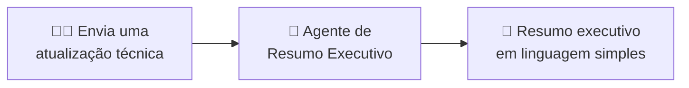

# Módulo 0 - Introdução

⏱️ ~10 min

> [!WARNING]
> **Pré-visualização & Limitações:** Os [Agentes Hosted](https://learn.microsoft.com/azure/foundry/agents/concepts/hosted-agents) estão atualmente em **pré-visualização pública** - não recomendados para cargas de trabalho de produção. Tenha em conta o seguinte:
> - **As regiões suportadas são limitadas** - verifique a [disponibilidade da região](https://learn.microsoft.com/azure/foundry/agents/concepts/hosted-agents#region-availability) antes de criar recursos. Se escolher uma região não suportada, a implantação falhará.
> - O pacote `azure-ai-agentserver-agentframework` está em pré-lançamento - as APIs podem mudar entre versões.
> - Limites de escala: os agentes hosted suportam 0–5 réplicas (incluindo escala para zero).
> - Algumas funcionalidades mostradas neste workshop podem mudar à medida que o serviço avança para GA.

## O que vais construir

Neste workshop, vais construir um agente **"Explique Como se Eu Fosse um Executivo"** - um agente AI hosted que pega em atualizações técnicas complexas e reescreve-as como resumos executivos em inglês simples.

```mermaid
flowchart LR
    A["🧑‍💻 Envia uma\natualização técnica"] --> B["🤖 Agente de\nResumo Executivo"]
    B --> C["📝 Resumo executivo\nem linguagem simples"]
```

**O agente usa:**
- **Microsoft Agent Framework** - para a lógica e estrutura do agente
- **Foundry Toolkit para VS Code** - para scaffolding, teste local e deploy
- **Um modelo AI** (ex: `gpt-4.1-mini/gpt-5-mini`) - para gerar os resumos

No final deste laboratório, terás um agente funcional que podes testar localmente via o Agent Inspector e opcionalmente implantar na cloud.

---

## O que são agentes hosted?

Um **agente hosted** é um agente AI que corre como um serviço gerido no Microsoft Foundry. Em vez de gerires a tua própria infraestrutura, embalas o código do agente num contentor e o Foundry trata do escalonamento, alojamento e exposição do mesmo através de um endpoint HTTP standard.

| Conceito | O que significa |
|---------|---------------|
| **Agente** | O teu código Python que recebe uma mensagem do utilizador, chama um modelo AI e devolve uma resposta estruturada |
| **Hosted** | O Foundry corre o teu container para ti - sem VMs, sem Kubernetes, sem infraestrutura para gerir |
| **Protocolo de respostas** | Uma API HTTP standard (`POST /responses`) que qualquer cliente pode chamar para interagir com o teu agente |
| **Agent Inspector** | Uma UI local de testes (integrada no Foundry Toolkit) que te permite conversar com o teu agente antes de o implantares |

Neste workshop, irás desde zero até ter um agente totalmente hosted - ou podes parar nos testes locais se preferires.

---

## Escolhe o teu caminho

> ⚠️ **Escolhe um caminho antes de continuar.** A tua escolha determina quais as ferramentas a instalar e quais os módulos aplicáveis. Podes mudar do Caminho B → Caminho A mais tarde se adquirires uma subscrição.

<strong>🅰️ Caminho A - cloud Azure (requer subscrição Azure)</strong>

| | Detalhes |
|---|---|
| **Para quem é?** | Tens uma subscrição Azure ativa e podes criar recursos Foundry |
| **Modelo** | Azure OpenAI via Foundry (ex: `gpt-4.1-mini/gpt-5-mini`) |
| **Módulos abrangidos** | Todos os módulos (00–07) |
| **Implantar na cloud?** | ✅ Sim - implantação completa end-to-end |

<strong>🅱️ Caminho B - Local / free-tier (não é necessária subscrição Azure)</strong>

| | Detalhes |
|---|---|
| **Para quem é?** | MVPs, estudantes ou qualquer pessoa sem acesso ao Azure |
| **Modelo** | **Foundry Local** (grátis, corre na tua máquina) |
| **Módulos abrangidos** | Módulos 00–04 (salta deploy & verificação na cloud) |
| **Implantar na cloud?** | ❌ Não - apenas teste local via Agent Inspector |

---

## Todos os caminhos: Ferramentas requeridas

Instala cada ferramenta abaixo. Após instalar, verifica se funciona executando o comando de verificação.

| # | Ferramenta | Versão | Instalar | Verificar (Saída Esperada) |
|---|-----------|---------|----------|-----------------------------|
| 1 | **Visual Studio Code** | Mais recente | [code.visualstudio.com](https://code.visualstudio.com/) | Abre sem erros |
| 2 | **Python** | 3.12 ou superior | [python.org/downloads](https://www.python.org/downloads/) | `python --version` $\rightarrow$ `Python 3.12.x` |
| 3 | **Foundry Toolkit para VS Code** | Mais recente | ID da Extensão: `ms-windows-ai-studio.windows-ai-studio` | Ícone Foundry na Barra de Atividades |
| 4 | **Extensão Python para VS Code** | Mais recente | ID da Extensão: `ms-python.python` | Instalada no painel de Extensões |

> [!TIP]
> **Dicas profissionais para a instalação:**
> - **Python PATH (Windows):** Sempre assinala **"Add Python to PATH"** na primeira janela do instalador Python. Sem isto, `python` não será reconhecido no terminal.
> - **Múltiplas versões de Python:** Se tens Python 3.10 e 3.12 instalados, usa `python3.12 -m venv .venv` para garantir que a versão correta é usada no ambiente virtual.
> - **Docker WSL 2 (Windows):** Durante a instalação do Docker Desktop, assegura que o **backend WSL 2** está selecionado. O Docker com Hyper-V é mais lento e pode causar problemas com builds de contentores Foundry.
> - **Docker não arranca?** Espera 30–60 segundos depois de abrir o Docker Desktop. Executa `docker info` - se aparecer "Cannot connect to the Docker daemon", o Docker ainda está a inicializar.
> - **Extensões VS Code não carregam?** Depois de instalar as extensões, recarrega a janela: `Ctrl+Shift+P` → `Developer: Reload Window`.

> **Utilizadores Windows:** Assinala **"Add Python to PATH"** durante a instalação do Python.

**Segue:** [01 - Configuração →](01-setup.md)

---

<!-- CO-OP TRANSLATOR DISCLAIMER START -->
**Aviso Legal**:
Este documento foi traduzido utilizando o serviço de tradução automática [Co-op Translator](https://github.com/Azure/co-op-translator). Embora nos esforcemos pela precisão, esteja ciente de que traduções automáticas podem conter erros ou imprecisões. O documento original na sua língua nativa deve ser considerado a fonte autorizada. Para informações críticas, recomenda-se tradução profissional humana. Não nos responsabilizamos por quaisquer mal-entendidos ou interpretações incorretas resultantes da utilização desta tradução.
<!-- CO-OP TRANSLATOR DISCLAIMER END -->