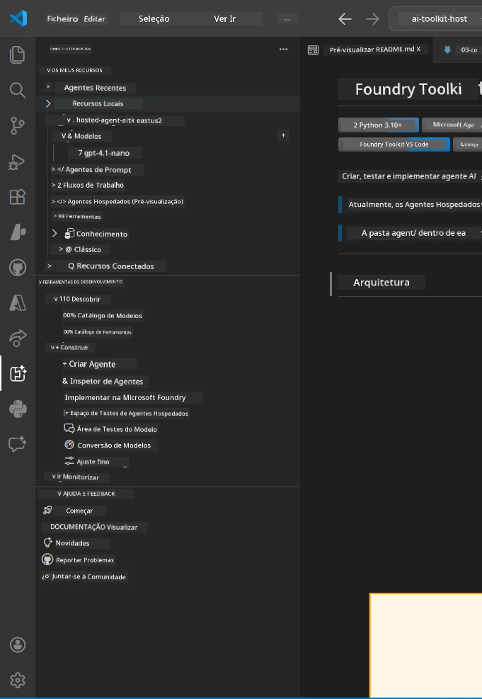
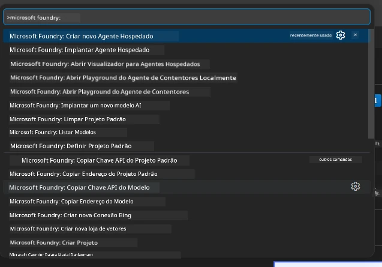

# Module 1 - Instalar Foundry Toolkit & Extensão Foundry

Este módulo guia-o na instalação e verificação das duas extensões principais do VS Code para este workshop. Se já as instalou durante o [Módulo 0](00-prerequisites.md), utilize este módulo para verificar se estão a funcionar corretamente.

---

## Step 1: Instalar a Extensão Microsoft Foundry

A extensão **Microsoft Foundry para VS Code** é a sua principal ferramenta para criar projetos Foundry, implementar modelos, estruturar agentes alojados e implementar diretamente a partir do VS Code.

1. Abra o VS Code.
2. Pressione `Ctrl+Shift+X` para abrir o painel de **Extensões**.
3. Na caixa de pesquisa na parte superior, escreva: **Microsoft Foundry**
4. Procure o resultado intitulado **Microsoft Foundry for Visual Studio Code**.
   - Editor: **Microsoft**
   - ID da Extensão: `TeamsDevApp.vscode-ai-foundry`
5. Clique no botão **Instalar**.
6. Aguarde a conclusão da instalação (verá um pequeno indicador de progresso).
7. Após a instalação, olhe para a **Barra de Atividade** (a barra de ícones vertical no lado esquerdo do VS Code). Deverá ver um novo ícone **Microsoft Foundry** (parecido com um diamante/ícone de IA).
8. Clique no ícone **Microsoft Foundry** para abrir a vista da barra lateral. Deverá ver secções para:
   - **Recursos** (ou Projetos)
   - **Agentes**
   - **Modelos**

> **Se o ícone não aparecer:** Tente recarregar o VS Code (`Ctrl+Shift+P` → `Developer: Reload Window`).

---

## Step 2: Instalar a Extensão Foundry Toolkit

A extensão **Foundry Toolkit** fornece o [**Agent Inspector**](https://learn.microsoft.com/azure/foundry/agents/how-to/vs-code-agents-workflow-pro-code) - uma interface visual para testar e depurar agentes localmente - além de playground, gestão de modelos e ferramentas de avaliação.

1. No painel de Extensões (`Ctrl+Shift+X`), limpe a caixa de pesquisa e escreva: **Foundry Toolkit**
2. Encontre **Foundry Toolkit** nos resultados.
   - Editor: **Microsoft**
   - ID da Extensão: `ms-windows-ai-studio.windows-ai-studio`
3. Clique em **Instalar**.
4. Após a instalação, o ícone **Foundry Toolkit** aparece na Barra de Atividade (parece um ícone de robô/brilho).
5. Clique no ícone **Foundry Toolkit** para abrir a vista da barra lateral. Deverá ver o ecrã de boas-vindas do Foundry Toolkit com opções para:
   - **Modelos**
   - **Playground**
   - **Agentes**

---

## Step 3: Verificar se ambas as extensões estão a funcionar

### 3.1 Verificar a Extensão Microsoft Foundry

1. Clique no ícone **Microsoft Foundry** na Barra de Atividade.
2. Se estiver autenticado no Azure (do Módulo 0), deverá ver os seus projetos listados em **Recursos**.
3. Se for solicitado para iniciar sessão, clique em **Sign in** e siga o processo de autenticação.
4. Confirme que consegue ver a barra lateral sem erros.

### 3.2 Verificar a Extensão Foundry Toolkit

1. Clique no ícone **Foundry Toolkit** na Barra de Atividade.
2. Confirme que o ecrã de boas-vindas ou painel principal carrega sem erros.
3. Ainda não precisa de configurar nada - usaremos o Agent Inspector no [Módulo 5](05-test-locally.md).

### 3.3 Verificar via Command Palette

1. Pressione `Ctrl+Shift+P` para abrir o Command Palette.
2. Escreva **"Microsoft Foundry"** - deverá ver comandos como:
   - `Microsoft Foundry: Create a New Hosted Agent`
   - `Microsoft Foundry: Deploy Hosted Agent`
   - `Microsoft Foundry: Open Model Catalog`
3. Pressione `Escape` para fechar o Command Palette.
4. Abra novamente o Command Palette e escreva **"Foundry Toolkit"** - deverá ver comandos como:
   - `Foundry Toolkit: Open Agent Inspector`

> Se não vir estes comandos, as extensões podem não estar instaladas corretamente. Tente desinstalá-las e instalá-las novamente.

---

## O que estas extensões fazem neste workshop

| Extensão | O que faz | Quando vai usar |
|-----------|-------------|-------------------|
| **Microsoft Foundry for VS Code** | Criar projetos Foundry, implementar modelos, **estruturar [agentes alojados](https://learn.microsoft.com/azure/foundry/agents/concepts/hosted-agents)** (gera automaticamente `agent.yaml`, `main.py`, `Dockerfile`, `requirements.txt`), implementar no [Foundry Agent Service](https://learn.microsoft.com/azure/foundry/agents/overview) | Módulos 2, 3, 6, 7 |
| **Foundry Toolkit** | Agent Inspector para testes/depuração local, interface playground, gestão de modelos | Módulos 5, 7 |

> **A extensão Foundry é a ferramenta mais crítica deste workshop.** Garante o ciclo de vida completo: estruturar → configurar → implementar → verificar. O Foundry Toolkit complementa-a ao fornecer o visual Agent Inspector para testes locais.

---

### Checkpoint

- [ ] Ícone Microsoft Foundry visível na Barra de Atividade
- [ ] Clicar nele abre a barra lateral sem erros
- [ ] Ícone Foundry Toolkit visível na Barra de Atividade
- [ ] Clicar nele abre a barra lateral sem erros
- [ ] `Ctrl+Shift+P` → escrever "Microsoft Foundry" mostra comandos disponíveis
- [ ] `Ctrl+Shift+P` → escrever "Foundry Toolkit" mostra comandos disponíveis

---

**Anterior:** [00 - Prerequisites](00-prerequisites.md) · **Próximo:** [02 - Create Foundry Project →](02-create-foundry-project.md)

---

<!-- CO-OP TRANSLATOR DISCLAIMER START -->
**Aviso Legal**:  
Este documento foi traduzido utilizando o serviço de tradução por IA [Co-op Translator](https://github.com/Azure/co-op-translator). Embora nos esforcemos pela precisão, esteja ciente de que traduções automáticas podem conter erros ou imprecisões. O documento original na sua língua nativa deve ser considerado a fonte autorizada. Para informações críticas, recomenda-se tradução profissional humana. Não nos responsabilizamos por quaisquer mal-entendidos ou interpretações incorretas decorrentes da utilização desta tradução.
<!-- CO-OP TRANSLATOR DISCLAIMER END -->