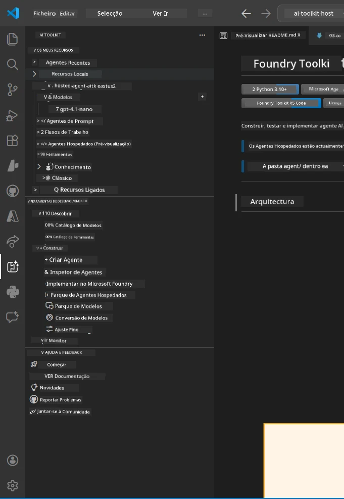
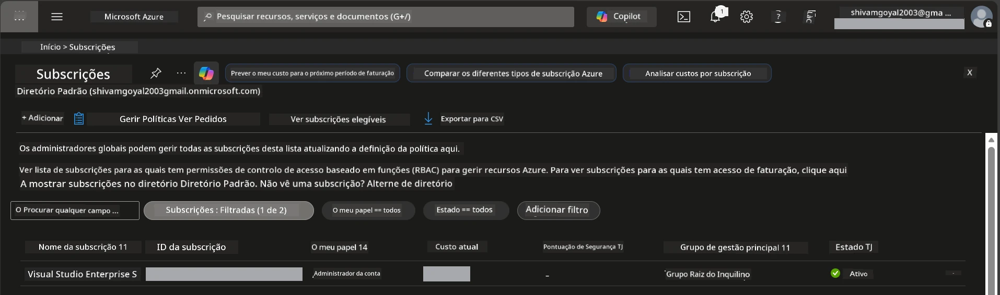
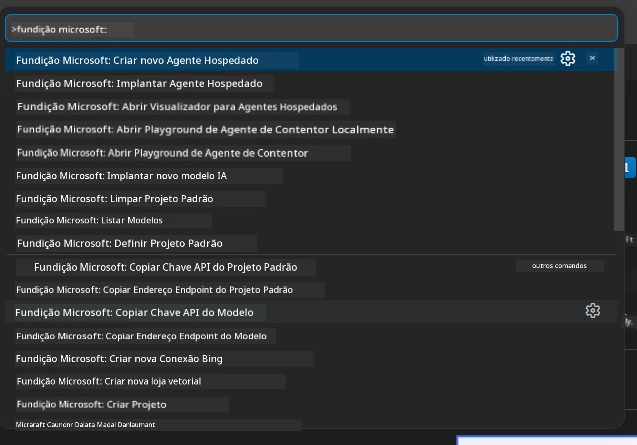
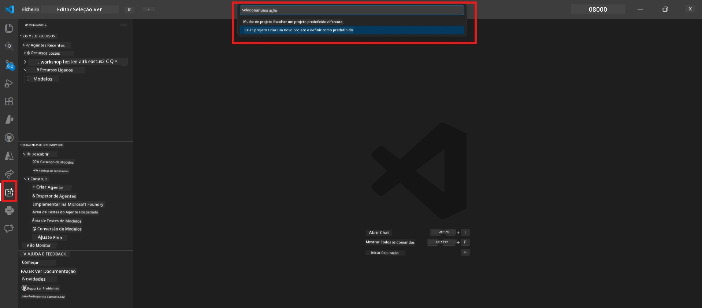
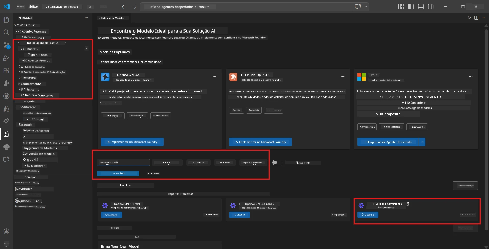
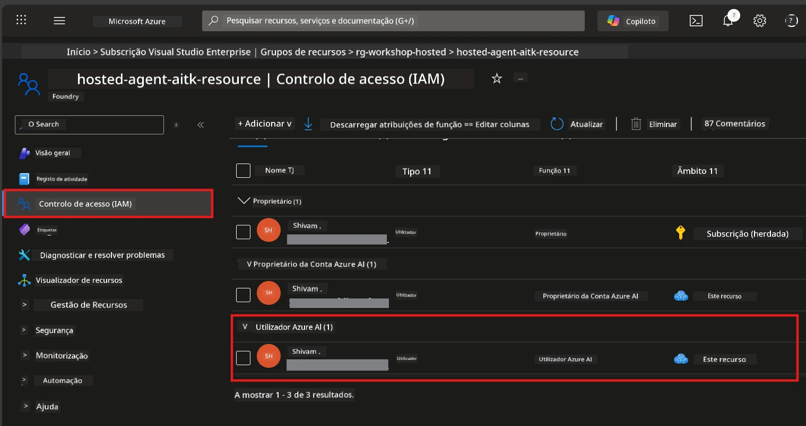

# Configuração: Extensão, Projeto e Modelo

⏱️ ~15 min

Neste módulo, irá instalar e verificar a extensão Foundry Toolkit, criar (ou ligar-se a) um projeto Foundry e implantar um modelo que o seu agente irá usar.

## Passo 1: Instalar Foundry Toolkit

**Foundry Toolkit para VS Code** é a extensão principal para este workshop. Ela fornece criação de projetos, implantação de modelos, estruturação de agentes, teste local (Agent Inspector) e implantação na cloud - tudo a partir do VS Code.

1. Abra o VS Code e pressione `Ctrl+Shift+X` para abrir o painel **Extensões**.
2. Procure por **Foundry Toolkit**.
3. Instale **Foundry Toolkit for VS Code** (Publisher: Microsoft, ID: `ms-windows-ai-studio.windows-ai-studio`).
4. Após a instalação, o ícone **Foundry Toolkit** aparece na Barra de Atividades (barra lateral esquerda).

> *Nota: A Barra de Atividades pode mostrar "AI TOOLKIT" em versões antigas da extensão. A funcionalidade é idêntica.*



## Passo 2: Configuração conforme o seu acesso

> **Escolha o seu caminho:** Expanda a secção abaixo que corresponde à sua configuração. Só precisa de completar **um** caminho.

<details>
<summary><strong>🅰️ Caminho A - Cloud Azure (requer subscrição Azure)</strong></summary>

### Azure CLI

1. Instale a partir de [learn.microsoft.com/cli/azure/install-azure-cli](https://learn.microsoft.com/cli/azure/install-azure-cli).
2. Verifique: `az --version` (espera-se 2.80.0+).
3. Inicie sessão: `az login`

### Opções de Autenticação

O [Microsoft Agent Framework](https://learn.microsoft.com/agent-framework/overview/) usa [`DefaultAzureCredential`](https://learn.microsoft.com/azure/developer/python/sdk/authentication/credential-chains#defaultazurecredential-overview) que tenta vários métodos de autenticação por ordem. Escolha o que se adequa ao seu ambiente:

#### Opção 1: Contas VS Code (recomendado para workshops)
1. Clique no ícone **Contas** (silhueta de pessoa) no canto inferior esquerdo do VS Code.
2. Selecione **Iniciar sessão para usar Microsoft Foundry** (ou **Iniciar sessão com Azure**).
3. Abre-se um navegador - inicie sessão com a conta Azure que tem acesso à sua subscrição.
4. Volte ao VS Code. Deve ver o nome da sua conta no canto inferior esquerdo.

#### Opção 2: Azure CLI
```bash
az login
az account set --subscription "<your-subscription-id>"
```

#### Opção 3: Service Principal (Empresa/CI)
Para ambientes restritos ou pipelines CI/CD, defina estas variáveis de ambiente no seu ficheiro `.env`:
```env
AZURE_TENANT_ID=<your-tenant-id>
AZURE_CLIENT_ID=<your-client-id>
AZURE_CLIENT_SECRET=<your-client-secret>
```

> **Como funciona o `DefaultAzureCredential`:** Primeiro tenta as variáveis de ambiente, depois identidade gerida, depois iniciar sessão no VS Code, depois Azure CLI - e usa o que tiver sucesso primeiro. Veja os [documentos da cadeia de credenciais](https://learn.microsoft.com/azure/developer/python/sdk/authentication/credential-chains#defaultazurecredential-overview).

### Azure Developer CLI (azd)

1. Instale: `winget install microsoft.azd` (Windows) ou veja os [documentos de instalação](https://learn.microsoft.com/azure/developer/azure-developer-cli/install-azd).
2. Verifique: `azd version`
3. Inicie sessão: `azd auth login`

### Docker Desktop (opcional)

O Docker só é necessário se quiser construir contentores localmente. A extensão Foundry cuida das construções automaticamente durante a implantação.

1. Instale a partir de [docs.docker.com/get-docker](https://docs.docker.com/get-docker/).
2. Verifique: `docker info`

### Subscrição Azure & RBAC

1. Inicie sessão em [portal.azure.com](https://portal.azure.com).
2. Navegue para **Subscrições** e confirme que pelo menos uma está **Ativa**.
3. Anote o seu **ID da Subscrição** - vai precisar dele no Módulo 01.



#### Tabela de Cenários RBAC

A implantação de [Hosted Agent](https://learn.microsoft.com/azure/foundry/agents/concepts/hosted-agents) requer permissões de **ação sobre dados** que os papéis padrão Azure `Owner` e `Contributor` **não** incluem. Use a tabela abaixo para determinar quais os papéis que precisa:

| Cenário | Papéis necessários | Onde os atribuir |
|----------|------------------|------------------|
| Criar novo projeto Foundry | **Azure AI Owner** no recurso Foundry | Recurso Foundry no Portal Azure |
| Implantar num projeto existente (novos recursos) | **Azure AI Owner** + **Contributor** na subscrição | Subscrição + Recurso Foundry |
| Implantar num projeto totalmente configurado | **Reader** na conta + **Azure AI User** no projeto | Conta + Projeto no Portal Azure |
| Apenas teste local (sem implantação) | **Azure AI User** no projeto | Projeto no Portal Azure |

> **Ponto chave:** Os papéis Azure `Owner` e `Contributor` cobrem apenas permissões de *gestão* (operações ARM). Precisa do [**Azure AI User**](https://learn.microsoft.com/azure/foundry/concepts/rbac-foundry#built-in-roles) (ou superior) para *ações de dados* como `agents/write` que é necessário para criar e implantar agentes.

## Ligar ou criar um projeto Foundry



1. Pressione `Ctrl+Shift+P` → digite **Foundry Toolkit: Create Project** → selecione-o.
2. Selecione a sua **subscrição Azure** no dropdown.
3. Selecione ou crie um **grupo de recursos** (ex.: `rg-hosted-agents-workshop`).
4. Selecione uma **região** que suporte agentes hospedados: `East US`, `West US 2` ou `Sweden Central`. Veja a [disponibilidade por região](https://learn.microsoft.com/azure/foundry/agents/concepts/hosted-agents#region-availability).
5. Introduza um nome para o projeto (ex.: `workshop-agents`).
6. Aguarde 2–5 minutos pela provisão. Uma notificação de progresso aparece no VS Code.
7. Quando terminar, o seu projeto aparece na barra lateral do **Foundry Toolkit** em **MEUS RECURSOS**.



## Implantar um modelo & atribuir RBAC

O seu agente hospedado precisa de um modelo de IA para gerar respostas.

#### Matriz de Seleção de Modelo
Conforme as suas necessidades, pode escolher entre diferentes níveis de modelo:

| Modelo | Melhor para | Custo | Notas |
|-------|------------|-------|-------|
| `gpt-4.1` | Respostas de alta qualidade e nuance | Mais alto | Melhores resultados, recomendado para testes finais |
| `gpt-4.1-mini/gpt-5-mini` | Iteração rápida, menor custo | Mais baixo | Bom para desenvolvimento em workshop e testes rápidos |
| `gpt-4.1-nano` | Tarefas leves | Mais baixo | Mais económico, mas respostas mais simples |

1. Pressione `Ctrl+Shift+P` → **Foundry Toolkit: Open Model Catalog** (ou clique em **Model Catalog** na barra lateral em FERRAMENTAS DE DESENVOLVEDOR → Descobrir).
2. Procure por **gpt-4.1** no catálogo.
3. Encontre **OpenAI GPT-4.1-mini** (ou `gpt-5-mini` para melhor qualidade) e clique em **Deploy**.



4. Na configuração de implantação:
   - **Nome da implantação:** Deixe o padrão ou insira um nome personalizado. **Lembre-se deste nome.**
   - **Destino:** Selecione **Deploy to Foundry Toolkit** → escolha o seu projeto.
5. Clique **Deploy** e aguarde 1–3 minutos.

> **Recomendação:** Use `gpt-4.1-mini/gpt-5-mini` para o workshop - rápido, acessível e produz bons resultados.

### Anote os seus valores

Após a implantação, anote estes dois valores (vai precisar deles no Módulo 03):

| Valor | Onde encontrá-lo |
|-------|-----------------|
| **Endpoint do projeto** | Clique no seu projeto na barra lateral → a vista detalhada mostra a URL (ex.: `https://<account>.services.ai.azure.com/api/projects/<project>`) |
| **Nome da implantação do modelo** | Expanda projeto → **Modelos** → o nome ao lado do modelo implantado (ex.: `gpt-4.1-mini/gpt-5-mini`) |

### Atribuir papel RBAC

> ⚠️ **Este é o passo mais frequentemente esquecido.** Sem o papel correto, a implantação no Módulo 05 falhará.

#### Qual papel preciso?
Dependendo do seu cenário, precisa das seguintes combinações de papéis:

| Cenário | Papéis necessários | Onde os atribuir |
|----------|-----------------|------------------|
| Criar novo projeto Foundry | **Azure AI Owner** no recurso Foundry | Recurso Foundry no Portal Azure |
| Implantar num projeto existente (novos recursos) | **Azure AI Owner** + **Contributor** na subscrição | Subscrição + Recurso Foundry |
| Implantar num projeto totalmente configurado | **Reader** na conta + **Azure AI User** no projeto | Conta + Projeto no Portal Azure |

**Ponto chave:** Os papéis Azure `Owner` e `Contributor` cobrem apenas permissões de *gestão*. Precisa do **Azure AI User** (ou superior) para *ações de dados* como `agents/write` necessárias para criar e implantar agentes.

1. Abra [portal.azure.com](https://portal.azure.com).
2. Procure o nome do seu **projeto Foundry** → clique no resultado do tipo **"Foundry Toolkit project"** (NÃO a conta pai).
3. Clique em **Control de acesso (IAM)** na navegação esquerda.
4. Clique em **+ Adicionar** → **Adicionar atribuição de papel**.
5. **Separador Papel:** Procure por **Azure AI User**, selecione-o, clique em **Seguinte**.
6. **Separador Membros:** Selecione **Utilizador, grupo ou principal de serviço** → clique em **+ Selecionar membros** → encontre e selecione-se → clique em **Selecionar**.
7. Clique em **Rever + atribuir** → novamente **Rever + atribuir**.
8. **Aguarde 1–2 minutos** para propagação.

> **Porquê este papel?** Os papéis Azure `Owner`/`Contributor` concedem apenas permissões de gestão. O papel **Azure AI User** concede a ação de dados `agents/write` necessária para criar e implantar agentes. Veja os [documentos RBAC do Foundry](https://learn.microsoft.com/azure/foundry/concepts/rbac-foundry#built-in-roles).



</details>

<details>
<summary><strong>🅱️ Caminho B - Local / nível gratuito (não é necessária subscrição Azure)</strong></summary>

### Foundry Local

Foundry Local permite-lhe correr modelos de IA na sua própria máquina - não é necessária conta cloud. Pode aceder a modelos Foundry Local usando Foundry Toolkit através do catálogo de modelos da seguinte forma:

1. Vá à extensão Foundry Toolkit.
2. Na navegação do Foundry Toolkit, vá a **Ferramentas do Desenvolvedor** > e selecione **Catálogo de Modelos**
3. Na nova janela, selecione **local** na barra de navegação.
4. Desça até **Phi 4 Mini,** e clique no **botão adicionar**; aparecerá um popup a indicar que o modelo está a ser descarregado.
5. Depois de o modelo ser descarregado, pode prosseguir para o próximo passo.

</details>

### ✅ Ponto de controlo


- [ ] `Ctrl+Shift+P` → "Foundry Toolkit" mostra comandos disponíveis
- [ ] Extensão Foundry Toolkit instalada e barra lateral carrega sem erros
- [ ] VS Code abre e funciona corretamente
- [ ] `python --version` mostra 3.10+
- [ ] Ícone Foundry Toolkit visível na Barra de Atividades do VS Code
- [ ] **Caminho A:** `az login` tem sucesso, subscrição está Ativa
- [ ] **Caminho B:** Foundry Local está a correr (`foundry local status`)
- [ ] **Caminho A:** Projeto Foundry visível na barra lateral, modelo implantado, papel Azure AI User atribuído
- [ ] **Caminho B:** Foundry Local a correr com um modelo
- [ ] Anotou o seu **endpoint** e **nome da implantação do modelo**


**Anterior:** [00 - Pré-requisitos](00-prerequisites.md) · **Seguinte:** [02 - Criar Agente Hospedado →](02-create-hosted-agent.md)

---

<!-- CO-OP TRANSLATOR DISCLAIMER START -->
**Aviso Legal**:
Este documento foi traduzido utilizando o serviço de tradução automática [Co-op Translator](https://github.com/Azure/co-op-translator). Embora nos esforcemos pela precisão, esteja ciente de que traduções automáticas podem conter erros ou imprecisões. O documento original na sua língua nativa deve ser considerado a fonte autorizada. Para informações críticas, recomenda-se tradução profissional humana. Não nos responsabilizamos por quaisquer mal-entendidos ou interpretações incorretas resultantes da utilização desta tradução.
<!-- CO-OP TRANSLATOR DISCLAIMER END -->