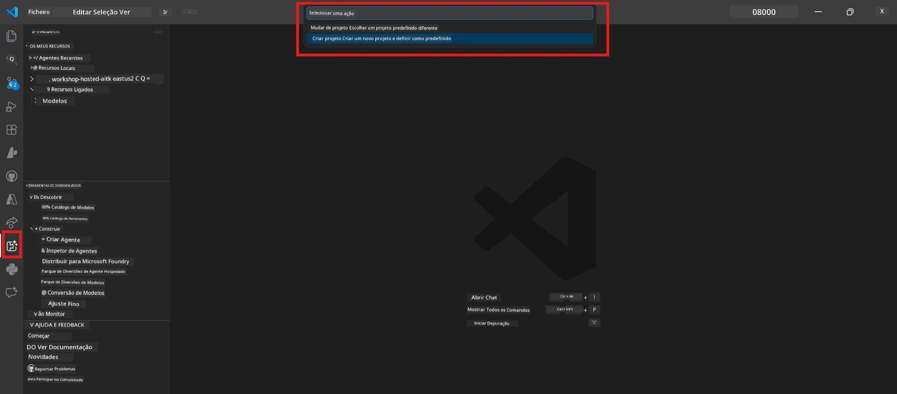
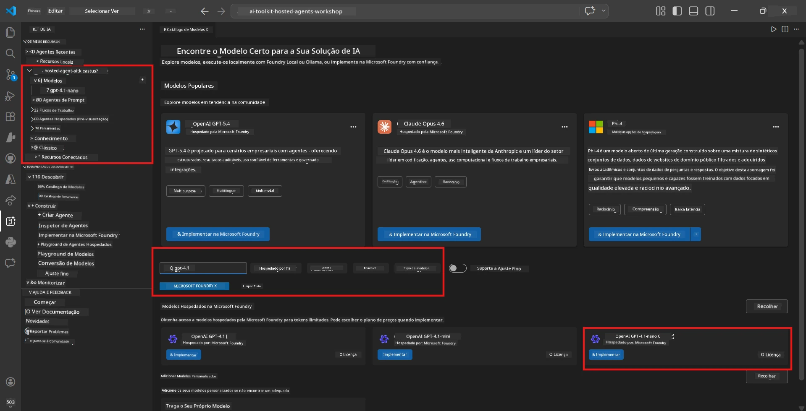
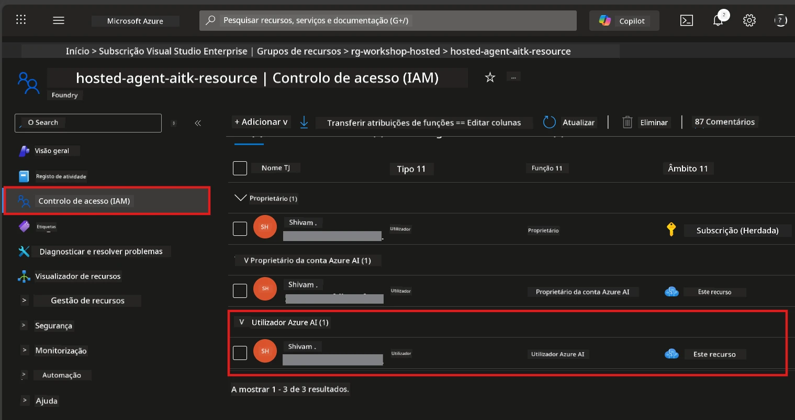

# Módulo 2 - Criar um Projeto Foundry e Implantar um Modelo

Neste módulo, irá criar (ou selecionar) um projeto Microsoft Foundry e implantar um modelo que o seu agente irá usar. Cada passo está escrito explicitamente – siga-os por ordem.

> Se já tem um projeto Foundry com um modelo implantado, salte para [Módulo 3](03-create-hosted-agent.md).

---

## Passo 1: Criar um projeto Foundry a partir do VS Code

Irá usar a extensão Microsoft Foundry para criar um projeto sem sair do VS Code.

1. Pressione `Ctrl+Shift+P` para abrir a **Paleta de Comandos**.
2. Digite: **Microsoft Foundry: Create Project** e selecione.
3. Aparece um menu pendente – selecione a sua **subscrição Azure** da lista.
4. Ser-lhe-á pedido para selecionar ou criar um **grupo de recursos**:
   - Para criar um novo: digite um nome (por exemplo, `rg-hosted-agents-workshop`) e prima Enter.
   - Para usar um existente: selecione-o no menu pendente.
5. Selecione uma **região**. **Importante:** Escolha uma região que suporte agentes hospedados. Verifique a [disponibilidade de regiões](https://learn.microsoft.com/azure/foundry/agents/concepts/hosted-agents#region-availability) – escolhas comuns são `East US`, `West US 2` ou `Sweden Central`.
6. Insira um **nome** para o projeto Foundry (por exemplo, `workshop-agents`).
7. Prima Enter e aguarde até a provisão estar concluída.

> **A provisão demora 2-5 minutos.** Verá uma notificação de progresso no canto inferior direito do VS Code. Não feche o VS Code durante a provisão.

8. Quando concluído, a barra lateral **Microsoft Foundry** mostrará o seu novo projeto em **Resources**.
9. Clique no nome do projeto para expandi-lo e confirme que mostra secções como **Models + endpoints** e **Agents**.



### Alternativa: Criar via Portal Foundry

Se preferir usar o navegador:

1. Abra [https://ai.azure.com](https://ai.azure.com) e inicie sessão.
2. Clique em **Create project** na página inicial.
3. Insira um nome para o projeto, selecione a sua subscrição, grupo de recursos e região.
4. Clique em **Create** e aguarde a provisão.
5. Depois de criado, volte ao VS Code – o projeto deverá aparecer na barra lateral do Foundry após atualizar (clique no ícone de atualizar).

---

## Passo 2: Implantar um modelo

O seu [agente hospedado](https://learn.microsoft.com/azure/foundry/agents/concepts/hosted-agents) necessita de um modelo Azure OpenAI para gerar respostas. Irá [implantar um agora](https://learn.microsoft.com/azure/ai-foundry/openai/how-to/create-resource#deploy-a-model).

1. Pressione `Ctrl+Shift+P` para abrir a **Paleta de Comandos**.
2. Digite: **Microsoft Foundry: Open [Model Catalog](https://learn.microsoft.com/azure/ai-foundry/openai/concepts/models)** e selecione.
3. A vista do Catálogo de Modelos abre no VS Code. Navegue ou use a barra de pesquisa para encontrar **gpt-4.1**.
4. Clique na carta do modelo **gpt-4.1** (ou `gpt-4.1-mini` se preferir um custo mais baixo).
5. Clique em **Deploy**.


6. Na configuração de implantação:
   - **Deployment name**: Deixe o padrão (por exemplo, `gpt-4.1`) ou insira um nome personalizado. **Lembre-se deste nome** – vai precisar dele no Módulo 4.
   - **Target**: Selecione **Deploy to Microsoft Foundry** e escolha o projeto que acabou de criar.
7. Clique em **Deploy** e aguarde a conclusão da implantação (1-3 minutos).

### Escolha do modelo

| Modelo | Melhor para | Custo | Notas |
|-------|-------------|-------|-------|
| `gpt-4.1` | Respostas de alta qualidade e nuance | Maior | Melhores resultados, recomendado para testes finais |
| `gpt-4.1-mini` | Iteração rápida, custo mais baixo | Menor | Bom para desenvolvimento de workshop e testes rápidos |
| `gpt-4.1-nano` | Tarefas leves | Mais baixo | Mais económico, mas com respostas simples |

> **Recomendação para este workshop:** Use `gpt-4.1-mini` para desenvolvimento e teste. É rápido, barato e produz bons resultados para os exercícios.

### Verificar a implantação do modelo

1. Na barra lateral **Microsoft Foundry**, expanda o seu projeto.
2. Veja em **Models + endpoints** (ou secção semelhante).
3. Deve ver o seu modelo implantado (exemplo: `gpt-4.1-mini`) com o estado **Succeeded** ou **Active**.
4. Clique na implantação do modelo para ver os detalhes.
5. **Anote** estes dois valores – vai precisar deles no Módulo 4:

   | Configuração | Onde encontrar | Exemplo |
   |--------------|----------------|---------|
   | **Project endpoint** | Clique no nome do projeto na barra lateral do Foundry. A URL do endpoint é exibida na vista dos detalhes. | `https://<account>.services.ai.azure.com/api/projects/<project>` |
   | **Model deployment name** | O nome mostrado junto ao modelo implantado. | `gpt-4.1-mini` |

---

## Passo 3: Atribuir as funções RBAC necessárias

Este é o **passo que mais frequentemente é esquecido**. Sem as funções corretas, a implantação no Módulo 6 irá falhar com erro de permissões.

### 3.1 Atribuir a função Azure AI User a si próprio

1. Abra um browser e navegue para [https://portal.azure.com](https://portal.azure.com).
2. Na barra de pesquisa topo, escreva o nome do seu **projeto Foundry** e clique nele nos resultados.
   - **Importante:** Navegue para o recurso **projeto** (tipo: "Microsoft Foundry project"), **não** para o recurso de conta/hub pai.
3. Navegue para **Access control (IAM)** no menu à esquerda do projeto.
4. Clique no botão **+ Add** no topo → selecione **Add role assignment**.
5. No separador **Role**, procure por [**Azure AI User**](https://learn.microsoft.com/azure/foundry/concepts/rbac-foundry#built-in-roles) e selecione-o. Clique em **Next**.
6. No separador **Members**:
   - Selecione **User, group, or service principal**.
   - Clique em **+ Select members**.
   - Procure pelo seu nome ou email, selecione-se e clique em **Select**.
7. Clique em **Review + assign** → depois clique novamente em **Review + assign** para confirmar.



### 3.2 (Opcional) Atribuir a função Azure AI Developer

Se precisar criar recursos adicionais dentro do projeto ou gerir implantações programaticamente:

1. Repita os passos anteriores, mas no passo 5 selecione **Azure AI Developer**.
2. Atribua esta função ao nível da **conta Foundry (recurso)**, não apenas ao nível do projeto.

### 3.3 Verificar as suas atribuições de função

1. Na página **Access control (IAM)** do projeto, clique no separador **Role assignments**.
2. Procure pelo seu nome.
3. Deve aparecer pelo menos **Azure AI User** listado para o âmbito do projeto.

> **Por que isto é importante:** A função [`Azure AI User`](https://learn.microsoft.com/azure/foundry/concepts/rbac-foundry#built-in-roles) concede a ação de dados `Microsoft.CognitiveServices/accounts/AIServices/agents/write`. Sem ela, irá ver este erro durante a implantação:
>
> ```
> Error: lacks the required data action 
> Microsoft.CognitiveServices/accounts/AIServices/agents/write 
> to perform POST /api/projects/{projectName}/assistants operation.
> ```
>
> Consulte [Módulo 8 - Resolução de Problemas](08-troubleshooting.md) para mais detalhes.

---

### Checkpoint

- [ ] O projeto Foundry existe e está visível na barra lateral Microsoft Foundry no VS Code
- [ ] Pelo menos um modelo está implantado (exemplo: `gpt-4.1-mini`) com estado **Succeeded**
- [ ] Anotou a URL do **project endpoint** e o **nome da implantação do modelo**
- [ ] Tem a função **Azure AI User** atribuída ao nível do **projeto** (verifique no Azure Portal → IAM → Role assignments)
- [ ] O projeto está numa [região suportada](https://learn.microsoft.com/azure/foundry/agents/concepts/hosted-agents#region-availability) para agentes hospedados

---

**Anterior:** [01 - Install Foundry Toolkit](01-install-foundry-toolkit.md) · **Seguinte:** [03 - Create a Hosted Agent →](03-create-hosted-agent.md)

---

<!-- CO-OP TRANSLATOR DISCLAIMER START -->
**Aviso Legal**:  
Este documento foi traduzido utilizando o serviço de tradução automática [Co-op Translator](https://github.com/Azure/co-op-translator). Embora nos esforcemos pela precisão, por favor tenha em atenção que traduções automáticas podem conter erros ou imprecisões. O documento original na sua língua nativa deve ser considerado a fonte autorizada. Para informações críticas, recomenda-se tradução profissional humana. Não nos responsabilizamos por quaisquer mal-entendidos ou interpretações erradas decorrentes do uso desta tradução.
<!-- CO-OP TRANSLATOR DISCLAIMER END -->