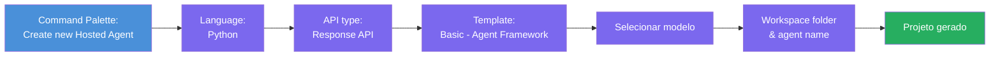
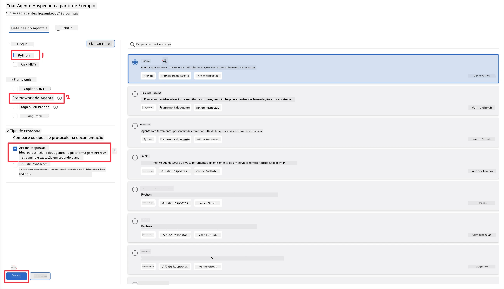
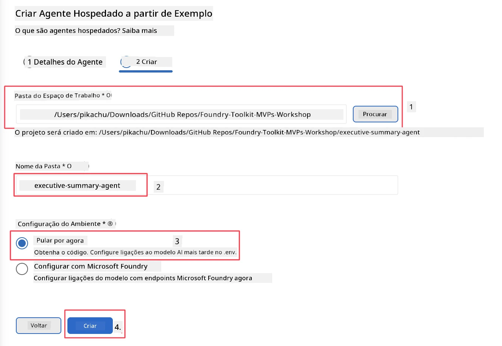

# Módulo 2 - Criar um Novo Agente Hospedado

⏱️ ~5 min

Neste módulo, usa o Foundry Toolkit para **criar a estrutura de um projeto de agente hospedado**. A estrutura gera toda a organização do projeto - `agent.yaml`, `main.py`, `Dockerfile`, `requirements.txt` e configuração de debug do VS Code - para que possa concentrar-se em personalizar o comportamento do agente.

> **Conceito chave:** A pasta `agent/` neste laboratório é um exemplo do que o Foundry Toolkit gera. Não escreve estes ficheiros do zero.

### Fluxo do assistente de criação



---

## Passo 1: Abrir o assistente Create Hosted Agent

1. Prima `Ctrl+Shift+P` para abrir a **Command Palette**.
2. Digite: **Foundry Toolkit: Create new Hosted Agent** e selecione.

> **Alternativa: Criar via Foundry Portal**
> Se preferir o browser, pode criar o seu projeto em [https://ai.azure.com](https://ai.azure.com). Depois de o projeto ser provisionado, volte ao VS Code e use a barra lateral do **Foundry Toolkit** para se ligar a ele.

> **Alternativa:** Clique no ícone **+** junto a **Hosted Agents (Preview)** na barra lateral do Foundry Toolkit.

## Passo 2: Escolher as definições



1. Na secção de navegação/opções à esquerda selecione o seguinte:

| Menu | Seleção | Notas |
|--------|---------|-------|
| **Linguagem** | Python | C# também suportado |
| **Framework** | Agent Framework | Ponto de partida simples usando o Agent Framework SDK |
| **Tipo de API** | Response API | `POST /responses` - conversacional, com histórico gerido pela plataforma |
| **Modelo** | Basic | Ponto de partida simples usando o Agent Framework SDK |

2. Uma vez selecionado, clique em **Next**



3. Na janela seguinte, selecione o seguinte:

| Menu | Seleção | Notas |
|--------|---------|-------|
| **Pasta do workspace** | Escolha uma pasta alvo | ex: `/workspace/Foundry_Toolkit_for_VSCode_Lab/` ou uma subpasta deste repositório |
| **Nome do agente** | Insira um nome | ex: `executive-summary-agent` |
| **Configuração do Ambiente** | ignore a configuração por agora |  |

Clique em **create** para criar o agente. Será criada uma nova pasta com o nome do agente hospedado.

## Passo 3: Inspecionar o projeto gerado

Após a criação da estrutura, verifique que vê estes ficheiros no Explorador (`Ctrl+Shift+E`):

```
📂 my-agent/
├── .env                ← Environment variables (placeholders)
├── .vscode/
│   ├── launch.json     ← Debug config (F5 → run + Agent Inspector)
│   └── tasks.json      ← VS Code task definitions
├── agent.yaml          ← Agent definition (kind: hosted)
├── Dockerfile          ← Container config for deployment
├── main.py             ← Agent entry point (your main code)
└── requirements.txt    ← Python dependencies
```

### Ficheiros chave explicados

| Ficheiro | Finalidade |
|---------|-----------|
| `agent.yaml` | Declara o agente como `kind: hosted`, mapeia variáveis de ambiente, define o protocolo `/responses` |
| `main.py` | Cria um `FoundryChatClient` → envolve num `Agent` com instruções → serve via `ResponsesHostServer` na porta 8088 |
| `Dockerfile` | Usa `python:3.12-slim`, instala dependências, expõe a porta 8088, executa `main.py` |
| `requirements.txt` | `agent-framework-foundry`, `agent-framework-foundry-hosting`, `mcp`, `debugpy` |

> **Importante:** Abra diretamente a pasta do agente estruturado no VS Code (a própria pasta `agent/`) para que `.vscode/launch.json` e `tasks.json` funcionem corretamente para depuração com F5.

---

### ✅ Checkpoint

- [ ] Projeto estruturado criado com todos os ficheiros esperados
- [ ] `agent.yaml` mostra `kind: hosted` e `protocol: responses`
- [ ] `main.py` importa `Agent`, `FoundryChatClient`, `ResponsesHostServer`
- [ ] A pasta do agente está aberta no VS Code como raiz do workspace

---

**Anterior:** [01 - Setup](01-setup.md) · **Seguinte:** [03 - Configure & Code →](03-configure-and-code.md)

---

<!-- CO-OP TRANSLATOR DISCLAIMER START -->
**Aviso Legal**:
Este documento foi traduzido utilizando o serviço de tradução automática [Co-op Translator](https://github.com/Azure/co-op-translator). Embora nos esforcemos pela precisão, esteja ciente de que traduções automáticas podem conter erros ou imprecisões. O documento original na sua língua nativa deve ser considerado a fonte autorizada. Para informações críticas, recomenda-se tradução profissional humana. Não nos responsabilizamos por quaisquer mal-entendidos ou interpretações incorretas resultantes da utilização desta tradução.
<!-- CO-OP TRANSLATOR DISCLAIMER END -->