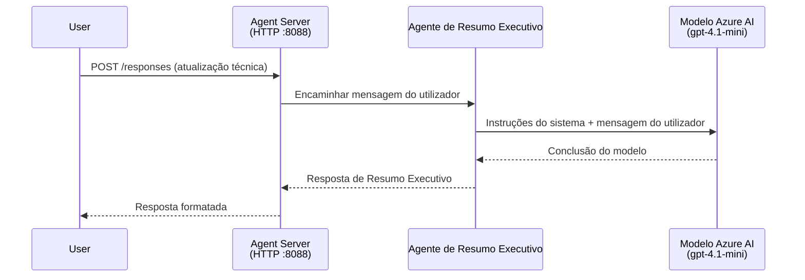
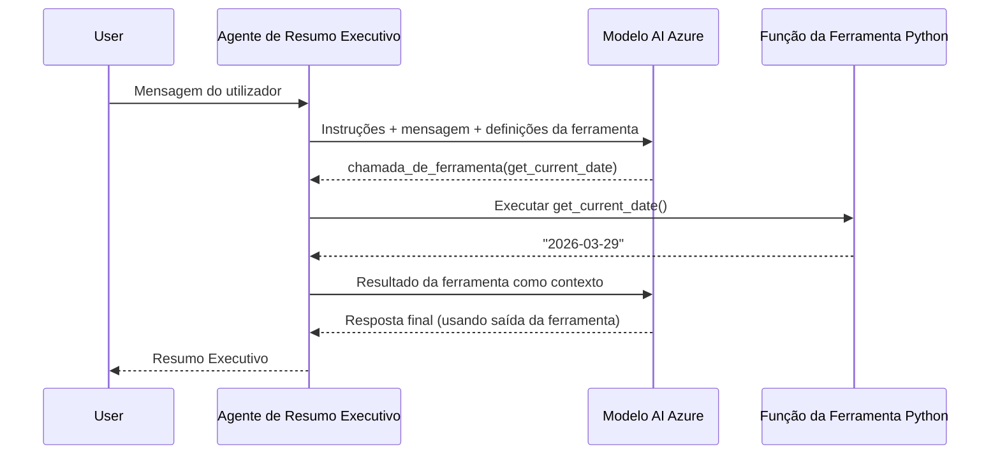

# Module 4 - Configurar Instruções, Ambiente e Instalar Dependências

Neste módulo, personalizas os ficheiros do agente auto-esquematizados do Módulo 3. É aqui que transformas o esquema genérico no **teu** agente - escrevendo instruções, configurando variáveis de ambiente, adicionando ferramentas opcionalmente e instalando dependências.

> **Lembrete:** A extensão Foundry gerou automaticamente os ficheiros do teu projeto. Agora modificas-nos. Consulta a pasta [`agent/`](../../../../../workshop/lab01-single-agent/agent) para um exemplo completo a funcionar de um agente personalizado.

---

## Como os componentes se encaixam

### Ciclo de vida do pedido (agente único)


> **Com ferramentas:** Se o agente tiver ferramentas registadas, o modelo pode devolver uma chamada de ferramenta em vez de uma resposta direta. O framework executa a ferramenta localmente, envia o resultado de volta ao modelo, e o modelo gera a resposta final.


---

## Passo 1: Configurar variáveis de ambiente

O esquema criou um ficheiro `.env` com valores de marcador. Precisas de preencher os valores reais do Módulo 2.

1. No teu projeto esquematizado, abre o ficheiro **`.env`** (fica na raiz do projeto).
2. Substitui os valores marcadores pelos detalhes reais do projeto Foundry:

   ```env
   PROJECT_ENDPOINT=https://<your-account>.services.ai.azure.com/api/projects/<your-project>
   MODEL_DEPLOYMENT_NAME=gpt-4.1-mini
   ```

3. Guarda o ficheiro.

### Onde encontrar estes valores

| Valor | Como encontrar |
|-------|----------------|
| **Endpoint do projeto** | Abre a barra lateral **Microsoft Foundry** no VS Code → clica no teu projeto → a URL do endpoint aparece na vista de detalhes. É algo como `https://<account-name>.services.ai.azure.com/api/projects/<project-name>` |
| **Nome do deployment do modelo** | Na barra lateral do Foundry, expande o teu projeto → vê em **Models + endpoints** → o nome aparece ao lado do modelo implementado (e.g., `gpt-4.1-mini`) |

> **Segurança:** Nunca cometes o ficheiro `.env` para controlo de versões. Ele já está incluído por padrão no `.gitignore`. Se não estiver, adiciona-o:
> ```
> .env
> ```

### Como fluem as variáveis de ambiente

A cadeia de mapeamento é: `.env` → `main.py` (lê via `os.getenv`) → `agent.yaml` (mapeia para variáveis de ambiente do container na altura do deploy).

No `main.py`, o esquema lê estes valores assim:

```python
PROJECT_ENDPOINT = os.getenv("AZURE_AI_PROJECT_ENDPOINT") or os.getenv("PROJECT_ENDPOINT")
MODEL_DEPLOYMENT_NAME = os.getenv("AZURE_AI_MODEL_DEPLOYMENT_NAME", os.getenv("MODEL_DEPLOYMENT_NAME", "gpt-4.1-mini"))
```

Ambos `AZURE_AI_PROJECT_ENDPOINT` e `PROJECT_ENDPOINT` são aceites (o `agent.yaml` usa o prefixo `AZURE_AI_*`).

---

## Passo 2: Escrever instruções para o agente

Este é o passo de personalização mais importante. As instruções definem a personalidade, comportamento, formato de saída e restrições de segurança do teu agente.

1. Abre `main.py` no teu projeto.
2. Encontra a string de instruções (o esquema inclui uma genérica/padrão).
3. Substitui-a por instruções detalhadas e estruturadas.

### O que boas instruções incluem

| Componente | Propósito | Exemplo |
|------------|-----------|---------|
| **Papel** | O que o agente é e faz | "És um agente de resumo executivo" |
| **Audiência** | Para quem são as respostas | "Liderança sénior com pouca formação técnica" |
| **Definição de entrada** | Que tipo de prompts aceita | "Relatórios técnicos de incidentes, atualizações operacionais" |
| **Formato de saída** | Estrutura exata das respostas | "Resumo Executivo: - O que aconteceu: ... - Impacto no negócio: ... - Próximo passo: ..." |
| **Regras** | Restrições e condições de recusa | "NÃO adiciones informação além do fornecido" |
| **Segurança** | Prevenir uso indevido e alucinações | "Se a entrada não for clara, pede esclarecimento" |
| **Exemplos** | Pares entrada/saída para orientar o comportamento | Inclui 2-3 exemplos com entradas variadas |

### Exemplo: Instruções do Agente de Resumo Executivo

Aqui estão as instruções usadas no workshop em [`agent/main.py`](../../../../../workshop/lab01-single-agent/agent/main.py):

```python
AGENT_INSTRUCTIONS = """You are an "Explain Like I'm an Executive" agent.

Purpose:
Your job is to translate complex technical or operational information into
clear, concise, and outcome-focused summaries that can be easily understood
by non-technical executives.

Audience:
Senior leaders with limited technical background who care about impact,
risk, and what happens next.

What you must do:
- Rephrase the input so it is understandable to a non-technical audience
- Prioritize clarity, brevity, and outcomes over technical accuracy
- Remove technical jargon, logs, metrics, stack traces, and deep root-cause details
- Translate technical causes into simple cause-and-effect statements
- Explicitly call out business impact
- Always include a clear next step or action
- Maintain a neutral, factual, and calm executive tone
- Do NOT add new facts or speculate beyond the input

Standard Output Structure (always use this wording):

Executive Summary:
- What happened: <plain-language description>
- Business impact: <clear, non-technical impact>
- Next step: <clear action or mitigation>

Rules:
- Keep responses under 100 words
- Do NOT add facts beyond the input
- If input is unclear, ask for clarification
"""
```

4. Substitui a string de instruções existente em `main.py` pelas tuas instruções personalizadas.
5. Guarda o ficheiro.

---

## Passo 3: (Opcional) Adicionar ferramentas personalizadas

Agentes hospedados podem executar **funções Python locais** como [ferramentas](https://learn.microsoft.com/azure/foundry/agents/concepts/tool-catalog). Esta é uma vantagem chave dos agentes baseados em código sobre agentes só com prompt - o teu agente pode correr lógica arbitrária do lado do servidor.

### 3.1 Definir uma função de ferramenta

Adiciona uma função de ferramenta a `main.py`:

```python
from agent_framework import tool

@tool
def get_current_date() -> str:
    """Returns the current date in YYYY-MM-DD format."""
    from datetime import date
    return str(date.today())
```

O decorador `@tool` transforma uma função Python padrão numa ferramenta do agente. A docstring torna-se a descrição da ferramenta que o modelo vê.

### 3.2 Registar a ferramenta com o agente

Ao criar o agente via o gestor de contexto `.as_agent()`, passa a ferramenta no parâmetro `tools`:

```python
async with AzureAIAgentClient(
    project_endpoint=PROJECT_ENDPOINT,
    model_deployment_name=MODEL_DEPLOYMENT_NAME,
    credential=credential,
).as_agent(
    name="my-agent",
    instructions=AGENT_INSTRUCTIONS,
    tools=[get_current_date],
) as agent:
    server = from_agent_framework(agent)
    await server.run_async()
```

### 3.3 Como funcionam as chamadas às ferramentas

1. O utilizador envia um prompt.
2. O modelo decide se é necessária uma ferramenta (com base no prompt, instruções e descrições das ferramentas).
3. Se for necessária, o framework chama a tua função Python localmente (dentro do container).
4. O valor retornado pela ferramenta é enviado de volta ao modelo como contexto.
5. O modelo gera a resposta final.

> **As ferramentas executam do lado do servidor** - correm dentro do teu container, não no browser do utilizador nem no modelo. Isto significa que podes aceder a bases de dados, APIs, sistemas de ficheiros, ou qualquer biblioteca Python.

---

## Passo 4: Criar e ativar um ambiente virtual

Antes de instalar dependências, cria um ambiente Python isolado.

### 4.1 Criar o ambiente virtual

Abre um terminal no VS Code (`` Ctrl+` ``) e executa:

```powershell
python -m venv .venv
```

Isto cria uma pasta `.venv` no diretório do projeto.

### 4.2 Ativar o ambiente virtual

**PowerShell (Windows):**

```powershell
.\.venv\Scripts\Activate.ps1
```

**Command Prompt (Windows):**

```cmd
.venv\Scripts\activate.bat
```

**macOS/Linux (Bash):**

```bash
source .venv/bin/activate
```

Deverás ver `(.venv)` aparecer no início do prompt do terminal, indicando que o ambiente virtual está ativo.

### 4.3 Instalar dependências

Com o ambiente virtual ativo, instala os pacotes requeridos:

```powershell
pip install -r requirements.txt
```

Isto instala:

| Pacote | Propósito |
|--------|-----------|
| `agent-framework-azure-ai==1.0.0rc3` | Integração Azure AI para o [Microsoft Agent Framework](https://learn.microsoft.com/agent-framework/overview/) |
| `agent-framework-core==1.0.0rc3` | Runtime core para construir agentes (inclui `python-dotenv`) |
| `azure-ai-agentserver-agentframework==1.0.0b16` | Runtime servidor de agentes hospedados para o [Foundry Agent Service](https://learn.microsoft.com/azure/foundry/agents/overview) |
| `azure-ai-agentserver-core==1.0.0b16` | Abstrações core do servidor de agentes |
| `debugpy` | Depuração Python (permite debug F5 no VS Code) |
| `agent-dev-cli` | CLI local de desenvolvimento para testar agentes |

### 4.4 Verificar a instalação

```powershell
pip list | Select-String "agent-framework|agentserver"
```

Saída esperada:
```
agent-framework-azure-ai   1.0.0rc3
agent-framework-core       1.0.0rc3
azure-ai-agentserver-agentframework 1.0.0b16
azure-ai-agentserver-core  1.0.0b16
```

---

## Passo 5: Verificar autenticação

O agente usa [`DefaultAzureCredential`](https://learn.microsoft.com/azure/developer/python/sdk/authentication/credential-chains#defaultazurecredential-overview) que tenta vários métodos de autenticação nesta ordem:

1. **Variáveis de ambiente** - `AZURE_CLIENT_ID`, `AZURE_TENANT_ID`, `AZURE_CLIENT_SECRET` (service principal)
2. **Azure CLI** - utiliza a sessão do teu `az login`
3. **VS Code** - usa a conta com que iniciaste sessão no VS Code
4. **Managed Identity** - usado ao executar no Azure (na altura do deploy)

### 5.1 Verificar para desenvolvimento local

Pelo menos um destes deve funcionar:

**Opção A: Azure CLI (recomendado)**

```powershell
az account show --query "{name:name, id:id}" --output table
```

Esperado: Mostra o nome e ID da tua subscrição.

**Opção B: Início de sessão no VS Code**

1. Olha para o canto inferior esquerdo do VS Code pelo ícone de **Contas**.
2. Se vires o nome da tua conta, estás autenticado.
3. Se não, clica no ícone → **Iniciar sessão para usar o Microsoft Foundry**.

**Opção C: Service principal (para CI/CD)**

```powershell
$env:AZURE_TENANT_ID = "<your-tenant-id>"
$env:AZURE_CLIENT_ID = "<your-client-id>"
$env:AZURE_CLIENT_SECRET = "<your-client-secret>"
```

### 5.2 Problema comum de autenticação

Se estiveres autenticado em múltiplas contas Azure, certifica-te que a subscrição correta está selecionada:

```powershell
az account set --subscription "<your-subscription-id>"
```

---

### Checkpoint

- [ ] Ficheiro `.env` tem valores válidos para `PROJECT_ENDPOINT` e `MODEL_DEPLOYMENT_NAME` (não são marcadores)
- [ ] Instruções do agente estão personalizadas em `main.py` - definem papel, audiência, formato de saída, regras e restrições de segurança
- [ ] (Opcional) Ferramentas personalizadas estão definidas e registadas
- [ ] Ambiente virtual está criado e ativo (`(.venv)` visível no prompt do terminal)
- [ ] `pip install -r requirements.txt` completa sem erros
- [ ] `pip list | Select-String "azure-ai-agentserver"` mostra o pacote instalado
- [ ] Autenticação é válida - `az account show` retorna a tua subscrição OU estás autenticado no VS Code

---

**Anterior:** [03 - Criar Agente Hospedado](03-create-hosted-agent.md) · **Seguinte:** [05 - Testar Localmente →](05-test-locally.md)

---

<!-- CO-OP TRANSLATOR DISCLAIMER START -->
**Aviso Legal**:  
Este documento foi traduzido utilizando o serviço de tradução automática [Co-op Translator](https://github.com/Azure/co-op-translator). Embora nos esforcemos para garantir a precisão, por favor tenha em conta que traduções automáticas podem conter erros ou imprecisões. O documento original na sua língua nativa deve ser considerado a fonte fidedigna. Para informações críticas, recomenda-se tradução profissional humana. Não nos responsabilizamos por quaisquer mal-entendidos ou interpretações erradas decorrentes do uso desta tradução.
<!-- CO-OP TRANSLATOR DISCLAIMER END -->