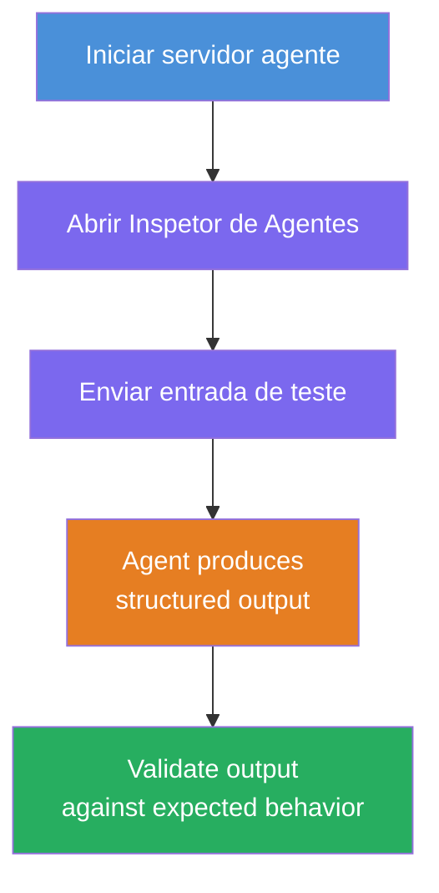
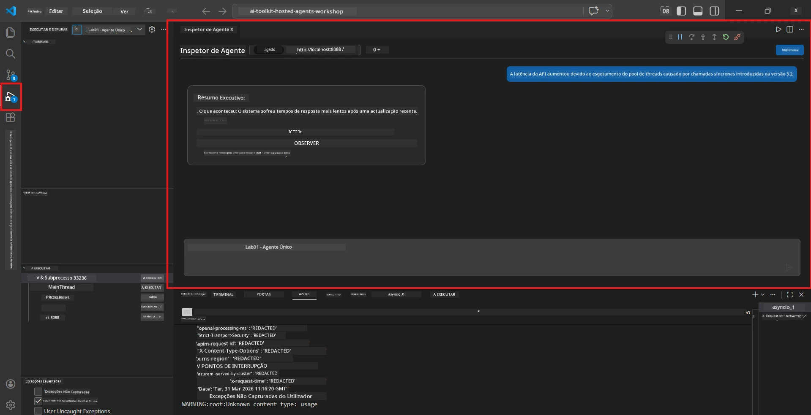
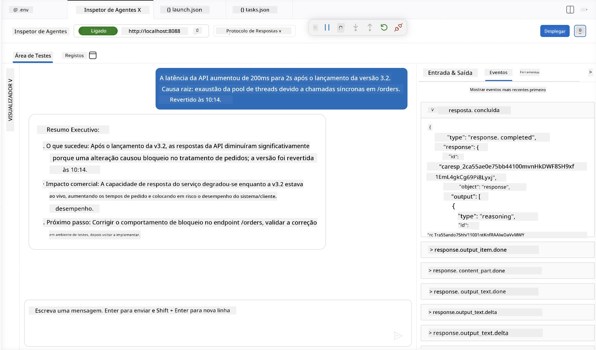

# Módulo 4 - Testar Localmente

⏱️ ~10 min

Neste módulo, irá executar o seu agente localmente e validar que funciona corretamente utilizando **testes funcionais de caminho feliz**. Usará o Agent Inspector (UI visual) ou chamadas HTTP diretas para confirmar que o agente produz respostas estruturadas e precisas.

### Fluxo de teste local



---

## Opção 1: Pressione F5 - Depurar com Agent Inspector (recomendado)

### Iniciar o depurador

1. Abra a pasta **executive-summary-agent/** diretamente no VS Code (`Ficheiro → Abrir Pasta`).
2. Abra o painel **Executar e Depurar** (`Ctrl+Shift+D`).
3. Selecione **Debug Local Agent Server** na lista suspensa.
4. Pressione **F5** (ou clique em ▶ Iniciar Depuração).

> ⚠️ **Crítico: Selecione o seu Interpretador Python**
> Se receber "ModuleNotFoundError" ou o depurador não iniciar, deve indicar ao VS Code para usar o seu ambiente virtual:
  > 1. Pressione `Ctrl+Shift+P` $\rightarrow$ escreva **Python: Select Interpreter**.
  > 2. Selecione o interpretador localizado na pasta `.venv` do seu projeto (por exemplo, `.\.venv\Scripts\python.exe` no Windows).
  > 3. Reinicie a sessão de depuração.
> Se continuar a obter erros, atualize manualmente o ficheiro `tasks.json` da seguinte forma:
  > 1. Navegue até ao ficheiro `.vscode/tasks.json`
  > 2. Vá ao comando rotulado: `Run Agent/Workflow HTTP Server`
  > 3. Atualize o valor do comando assim: `"value": "${workspaceFolder}/.venv/bin/python",`

### O que acontece

1. O servidor HTTP inicia em `http://localhost:8088/responses`.
2. O painel **Agent Inspector** abre automaticamente - uma interface visual de chat para testes.
3. Os pontos de interrupção estão ativados em `main.py`.

Observe o Terminal para:
```
Starting executive summary hosted agent
Executive agent server running on http://localhost:8088
```

> **Se o Agent Inspector não abrir:** Pressione `Ctrl+Shift+P` → **Foundry Toolkit: Open Agent Inspector**.



> *A captura de ecrã pode mostrar a marca antiga 'AI TOOLKIT' de uma versão anterior da extensão.*

---

## Opção 2: Testar via Terminal (alternativa)

Inicie o agente num terminal, envie pedidos a partir de outro:

```bash
# Terminal 1: Iniciar agente
cd executive-summary-agent/
source .venv/bin/activate
python main.py
```

```bash
# Terminal 2: Enviar teste (curl)
curl -sS -X POST http://localhost:8088/responses \
  -H "Content-Type: application/json" \
  -d '{"input": "The API latency increased due to thread pool exhaustion caused by sync calls in v3.2.", "stream": false}'
```

---

## Testes de cenário: validação funcional de caminho feliz

Execute **os três** cenários abaixo. Estes validam que o seu agente produz uma saída correta e estruturada para entradas realistas.



### Cenário 1: Incidente de IT - pico de latência na API

**Entrada:**
```
The API latency increased from 200ms to 2s after deploying v3.2.
Root cause: thread pool starvation from synchronous calls in /orders.
Rolled back at 10:14.
```

**Comportamento esperado:**
- ✅ Segue a estrutura de "Resumo Executivo" (O que aconteceu / Impacto no negócio / Próximo passo)
- ✅ Sem jargão técnico (sem "thread pool", sem "/orders", sem "v3.2")
- ✅ Explica claramente o impacto no negócio (ex.: utilizadores sofreram atrasos)
- ✅ Inclui um próximo passo (ex.: correção implementada, monitorização ativa)

---

### Cenário 2: Pipeline de Dados - falha de ETL

**Entrada:**
```
The nightly ETL job failed because the upstream schema changed. APAC dashboards show missing data.
```

**Comportamento esperado:**
- ✅ Resume a falha na atualização dos dados numa linguagem simples
- ✅ Menciona o impacto no dashboard da APAC
- ✅ Inclui um próximo passo para remediação
- ✅ NÃO menciona "ETL", "esquema" ou outros termos técnicos

---

### Cenário 3: Segurança - credencial exposta

**Entrada:**
```
Static analysis flagged a hardcoded secret in the repository.
The secret may have been exposed in commit history.
```

**Comportamento esperado:**
- ✅ Descreve uma questão de credenciais/segurança com linguagem acessível a executivos
- ✅ Assinala o risco potencial (acesso não autorizado)
- ✅ Indica a ação de remediação (rotatividade de credenciais, auditoria)
- ✅ NÃO inclui termos como "análise estática", "histórico de commits", ou "hardcoded"

---

## Critérios de validação

Para cada cenário, verifique:

| # | Critério | Condição de aprovação |
|---|----------|---------------------|
| 1 | **Estrutura** | Resposta usa formato "Resumo Executivo" com as três alíneas |
| 2 | **Linguagem simples** | Sem jargão técnico que um executivo não compreenderia |
| 3 | **Precisão** | Sumário reflete a entrada - sem detalhes fabricados |
| 4 | **Brièvidade** | Resposta tem menos de 100 palavras |
| 5 | **Próximo passo** | Está indicado um claro ação ou mitigação |

---

## Dicas de depuração

| Problema | Solução |
|---------|---------|
| O agente não inicia | Verifique valores no `.env`, confirme que o venv está ativado, execute `pip install -r requirements.txt` |
| Resposta vazia ou genérica | Reveja as instruções em `main.py` - assegure-se que o formato da saída está especificado |
| A resposta inclui jargão | Refine as regras de "remover termos técnicos" nas instruções |
| Agent Inspector não abre | `Ctrl+Shift+P` → **Foundry Toolkit: Open Agent Inspector** |
| Erros do modelo no Terminal | Verifique se `AZURE_AI_MODEL_DEPLOYMENT_NAME` corresponde exatamente (sensível a maiúsculas/minúsculas) |

---

### ✅ Checkpoint

- [ ] O agente inicia localmente sem erros
- [ ] O Agent Inspector abre e mostra uma interface de chat (se usar F5)
- [ ] **Cenário 1** (incidente de IT) - Resumo Executivo estruturado, sem jargão
- [ ] **Cenário 2** (pipeline de dados) - sumário relevante com impacto no negócio
- [ ] **Cenário 3** (alerta de segurança) - comunicação de risco apropriada
- [ ] Todas as respostas seguem a estrutura de saída definida

> **Guarde as suas respostas** (copie ou faça captura de ecrã) - irá compará-las posteriormente com os resultados na cloud no Módulo 06.

---

**Anterior:** [03 - Configurar & Programar](03-configure-and-code.md) · **Seguinte:** [05 - Desplegar para Foundry →](05-deploy-to-foundry.md)

---

<!-- CO-OP TRANSLATOR DISCLAIMER START -->
**Aviso Legal**:
Este documento foi traduzido utilizando o serviço de tradução automática [Co-op Translator](https://github.com/Azure/co-op-translator). Embora nos esforcemos pela precisão, esteja ciente de que traduções automáticas podem conter erros ou imprecisões. O documento original na sua língua nativa deve ser considerado a fonte autorizada. Para informações críticas, recomenda-se tradução profissional humana. Não nos responsabilizamos por quaisquer mal-entendidos ou interpretações incorretas resultantes da utilização desta tradução.
<!-- CO-OP TRANSLATOR DISCLAIMER END -->