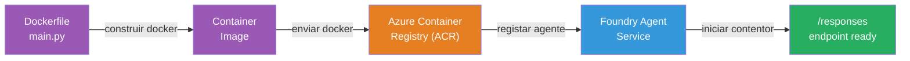
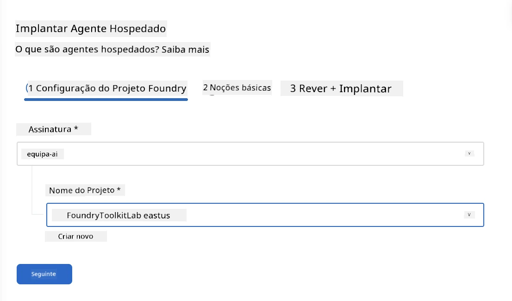
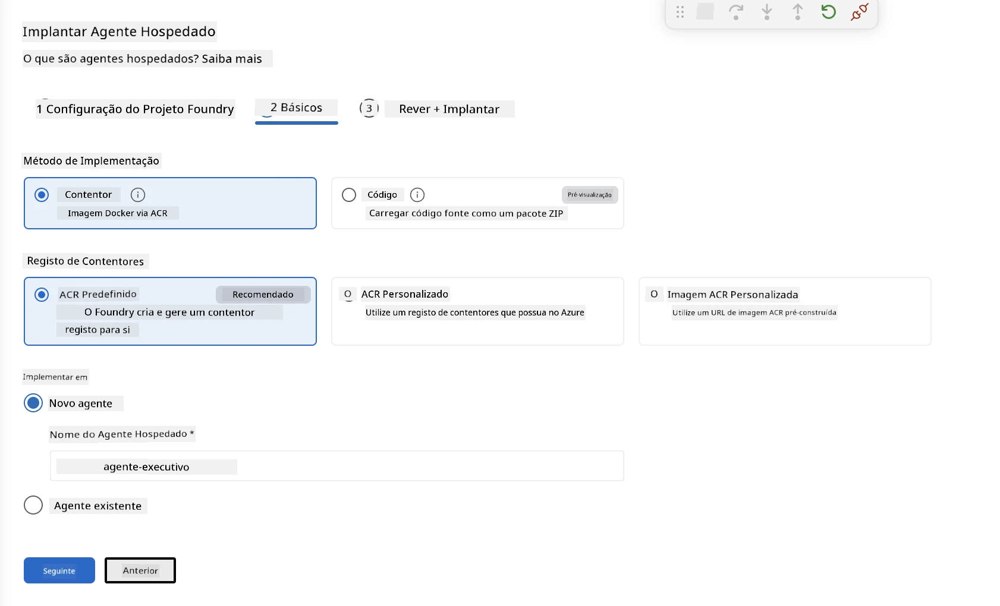
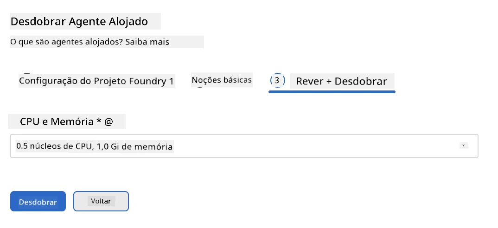
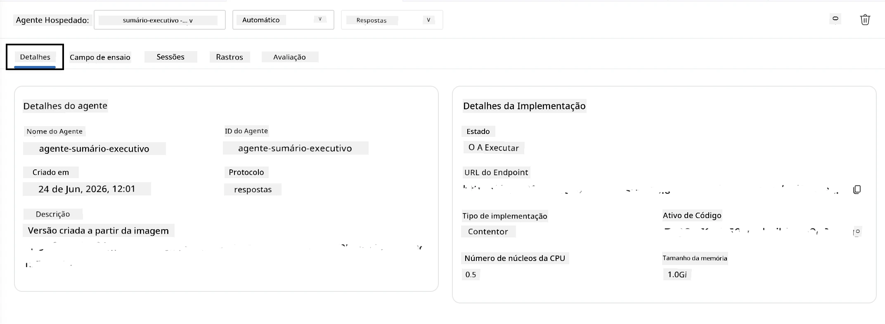

# Módulo 5 - Desplegar para o Serviço de Agente Foundry

⏱️ ~10 min

> ⚠️ **Utilizadores do Caminho B:** Este módulo requer uma subscrição Foundry. Se estiver a usar o Foundry Local, avance para [Módulo 07 - Resumo](07-summary.md). Concluiu com sucesso o fluxo de trabalho de desenvolvimento local!

Neste módulo, implementa o seu agente testado localmente na Microsoft Foundry como um **Agente Hospedado**. A implementação constrói uma imagem de contentor, envia-a para o Azure Container Registry e inicia o agente na infraestrutura gerida do Foundry.

### Pipeline de implementação

---

## Verificação de pré-requisitos

Antes de implementar, verifique:

- [ ] O agente passa todos os 3 cenários locais do [Módulo 04](04-test-locally.md)
- [ ] Tem a função **Utilizador Azure AI** ao nível do projeto ([Módulo 01, Atribuir RBAC](01-setup.md#deploy-a-model--assign-rbac))
- [ ] Está autenticado no Azure no VS Code (o ícone de Contas mostra o seu nome)

---

## Passo 1: Iniciar a implementação

### Opção A: Implementar a partir do Agent Inspector (recomendado)

Se o Agent Inspector estiver aberto (após testes):
1. Clique no botão **Deploy** no canto superior direito (ícone de nuvem ↑).

### Opção B: Implementar a partir da Paleta de Comandos

1. Pressione `Ctrl+Shift+P` → **Foundry Toolkit: Deploy Hosted Agent**.

---

## Passo 2: Configurar a implementação

O assistente solicita:

| Pedido | Seleção |
|--------|-----------|
| **Subscrição** | A sua subscrição Azure |
| **Projeto alvo** | O seu projeto Foundry (ex., `workshop-agents`) |

Clique em **seguinte** para configurar o agente.

| Pedido | Seleção |
|--------|-----------|
| **Método de Implementação** | Contentor |
| **Registo de contentores** | **ACR padrão** (a Microsoft Foundry cria e gere um para si) |
| **Implementar para** | Novo Agente (nome, `executive-summary-agent`) |

Clique em **seguinte** para rever e implementar o agente.

| Pedido | Seleção |
|--------|-----------|
| **CPU e memória** | **0,25 núcleos CPU, 0,5 Gi memória** (suficiente para o workshop) |

---

## Passo 3: Implementar e monitorizar

1. Clique em **Deploy**.
2. Observe o painel **Output** (selecione **Microsoft Foundry** no menu suspenso).
3. A implementação passa pelas seguintes fases:
   - **Construção Docker** - constrói o contentor a partir do seu Dockerfile
   - **Envio Docker** - envia a imagem para o ACR (1–3 min na primeira implementação)
   - **Registo do agente** - cria o agente hospedado no Foundry
   - **Início do contentor** - inicia com identidade gerida pelo sistema

4. Quando concluído, aparece uma notificação:
   > **my-agent foi implementado com sucesso.** `Ver registos` `Executar agente`

5. Clique em **Executar agente** para abrir o Agent Playground.

### Valores de estado da implementação

| Estado | Significado |
|--------|------------|
| **Running** | Contentor pronto, agente a responder |
| **Pending** | Contentor a iniciar - aguarde 30–60 segundos |
| **Failed** | Verifique os registos (consulte a resolução de problemas abaixo) |

---

## Erros comuns na implementação

| Erro | Causa raiz | Correção |
|-------|-----------|---------|
| Permissão `agents/write` negada | Falta a função **Utilizador Azure AI** ao nível do projeto | [Módulo 01, Atribuir RBAC](01-setup.md#deploy-a-model--assign-rbac) |
| Docker não está a correr | Docker Desktop não iniciado | Inicie o Docker Desktop → verifique `docker info` |
| Autorização ACR | Identidade gerida não consegue puxar a imagem | Ver [Módulo 08 - Resolução de problemas](08-troubleshooting.md) |

---

### ✅ Ponto de verificação

- [ ] Implementação concluída sem erros
- [ ] Agente aparece em **Hosted Agents (Preview)** na barra lateral do Foundry
- [ ] Estado do contentor mostra **Running**
- [ ] A aba do Agent Playground abriu mostrando detalhes do agente e URL do endpoint

---

**Anterior:** [04 - Testar Localmente](04-test-locally.md) · **Próximo:** [06 - Verificar no Playground →](06-verify-in-playground.md)

---

<!-- CO-OP TRANSLATOR DISCLAIMER START -->
**Aviso Legal**:
Este documento foi traduzido utilizando o serviço de tradução automática [Co-op Translator](https://github.com/Azure/co-op-translator). Embora nos esforcemos pela precisão, esteja ciente de que traduções automáticas podem conter erros ou imprecisões. O documento original na sua língua nativa deve ser considerado a fonte autorizada. Para informações críticas, recomenda-se tradução profissional humana. Não nos responsabilizamos por quaisquer mal-entendidos ou interpretações incorretas resultantes da utilização desta tradução.
<!-- CO-OP TRANSLATOR DISCLAIMER END -->