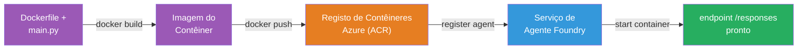
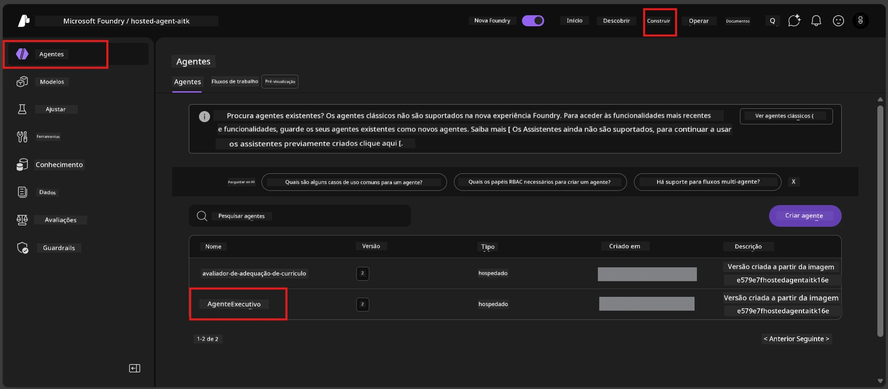

# Módulo 6 - Implantar no Serviço de Agente Foundry

Neste módulo, você implanta o seu agente testado localmente no Microsoft Foundry como um [**Agente Hospedado**](https://learn.microsoft.com/azure/foundry/agents/concepts/hosted-agents). O processo de implantação cria uma imagem de conteúdo Docker do seu projeto, envia-a para o [Azure Container Registry (ACR)](https://learn.microsoft.com/azure/container-registry/container-registry-intro) e cria uma versão do agente hospedado no [Foundry Agent Service](https://learn.microsoft.com/azure/foundry/agents/overview).

### Pipeline de implantação


---

## Verificação de pré-requisitos

Antes de implantar, verifique todos os itens abaixo. Ignorar estas verificações é a causa mais comum de falhas de implantação.

1. **O agente passou nos testes locais de fumagem:**
   - Você completou os 4 testes em [Módulo 5](05-test-locally.md) e o agente respondeu corretamente.

2. **Você tem o papel [Azure AI User](https://learn.microsoft.com/azure/foundry/concepts/rbac-foundry#built-in-roles):**
   - Este papel foi atribuído em [Módulo 2, Passo 3](02-create-foundry-project.md). Se não tem certeza, verifique agora:
   - Portal do Azure → o seu recurso **projeto** Foundry → **Controlo de acesso (IAM)** → separador **Atribuições de função** → pesquise o seu nome → confirme que **Azure AI User** está listado.

3. **Está conectado ao Azure no VS Code:**
   - Verifique o ícone de Contas no canto inferior esquerdo do VS Code. O nome da sua conta deve estar visível.

4. **(Opcional) Docker Desktop está a correr:**
   - O Docker é necessário apenas se a extensão Foundry pedir para construir localmente. Na maioria dos casos, a extensão lida automaticamente com as construções de contentores durante a implantação.
   - Se tem Docker instalado, confirme que está a funcionar: `docker info`

---

## Passo 1: Iniciar a implantação

Você tem duas formas de implantar – ambas conduzem ao mesmo resultado.

### Opção A: Implantar a partir do Agent Inspector (recomendado)

Se está a executar o agente com o depurador (F5) e o Agent Inspector está aberto:

1. Olhe para o **canto superior direito** do painel Agent Inspector.
2. Clique no botão **Deploy** (ícone de nuvem com uma seta para cima ↑).
3. O assistente de implantação abre.

### Opção B: Implantar a partir do Command Palette

1. Prima `Ctrl+Shift+P` para abrir o **Command Palette**.
2. Digite: **Microsoft Foundry: Deploy Hosted Agent** e selecione.
3. O assistente de implantação abre.

---

## Passo 2: Configurar a implantação

O assistente de implantação guia-o pela configuração. Preencha cada espaço solicitado:

### 2.1 Selecionar o projeto alvo

1. Um menu dropdown mostra os seus projetos Foundry.
2. Selecione o projeto que criou no Módulo 2 (ex.: `workshop-agents`).

### 2.2 Selecionar o ficheiro do agente no contentor

1. Ser-lhe-á pedido para selecionar o ponto de entrada do agente.
2. Escolha **`main.py`** (Python) – este é o ficheiro que o assistente usa para identificar o seu projeto de agente.

### 2.3 Configurar recursos

| Configuração | Valor recomendado | Notas |
|--------------|-------------------|-------|
| **CPU** | `0.25` | Predefinido, suficiente para o workshop. Aumente para cargas de trabalho de produção |
| **Memória** | `0.5Gi` | Predefinido, suficiente para o workshop |

Estes valores correspondem aos valores em `agent.yaml`. Pode aceitar os valores predefinidos.

---

## Passo 3: Confirmar e implantar

1. O assistente mostra um resumo da implantação com:
   - Nome do projeto alvo
   - Nome do agente (de `agent.yaml`)
   - Ficheiro do contentor e recursos
2. Reveja o resumo e clique em **Confirmar e Implantar** (ou **Implantar**).
3. Acompanhe o progresso no VS Code.

### O que acontece durante a implantação (passo a passo)

A implantação é um processo em várias etapas. Observe o painel **Output** do VS Code (selecione "Microsoft Foundry" no dropdown) para acompanhar:

1. **Construção Docker** – O VS Code constrói uma imagem Docker do seu `Dockerfile`. Verá mensagens das camadas Docker:
   ```
   Step 1/6 : FROM python:<version>-slim
   Step 2/6 : WORKDIR /app
   ...
   Successfully built abc123def456
   ```

2. **Envio Docker** – A imagem é enviada para o **Azure Container Registry (ACR)** associado ao seu projeto Foundry. Isto pode levar 1-3 minutos na primeira implantação (a imagem base tem >100MB).

3. **Registo do agente** – O Foundry Agent Service cria um novo agente hospedado (ou uma nova versão se o agente já existir). Os metadados do agente em `agent.yaml` são usados.

4. **Arranque do contentor** – O contentor arranca na infraestrutura gerida do Foundry. A plataforma atribui uma [identidade gerida pelo sistema](https://learn.microsoft.com/azure/foundry/agents/concepts/agent-identity) e expõe o endpoint `/responses`.

> **A primeira implantação é mais lenta** (Docker precisa de enviar todas as camadas). Implantações subsequentes são mais rápidas porque o Docker armazena em cache as camadas que não mudaram.

---

## Passo 4: Verificar o estado da implantação

Após o comando de implantação completar:

1. Abra a barra lateral **Microsoft Foundry** clicando no ícone Foundry na barra de atividades.
2. Expanda a secção **Hosted Agents (Preview)** sob o seu projeto.
3. Deve ver o nome do seu agente (ex.: `ExecutiveAgent` ou o nome definido em `agent.yaml`).
4. **Clique no nome do agente** para expandi-lo.
5. Verá uma ou mais **versões** (ex.: `v1`).
6. Clique na versão para ver os **Detalhes do Contentor**.
7. Verifique o campo **Status**:

   | Estado | Significado |
   |--------|-------------|
   | **Started** ou **Running** | O contentor está a correr e o agente está pronto |
   | **Pending** | O contentor está a iniciar (aguarde 30-60 segundos) |
   | **Failed** | O contentor falhou a iniciar (verifique logs - veja resolução de problemas abaixo) |



> **Se vir "Pending" por mais de 2 minutos:** O contentor pode estar a transferir a imagem base. Aguarde um pouco mais. Se continuar pendente, verifique os logs do contentor.

---

## Erros comuns na implantação e correções

### Erro 1: Permissão negada - `agents/write`

```
Error: lacks the required data action 
Microsoft.CognitiveServices/accounts/AIServices/agents/write 
to perform POST /api/projects/{projectName}/assistants operation.
```

**Causa principal:** Você não tem o papel `Azure AI User` ao nível do **projeto**.

**Passos para corrigir:**

1. Abra [https://portal.azure.com](https://portal.azure.com).
2. Na barra de pesquisa, escreva o nome do seu **projeto** Foundry e clique nele.
   - **Crítico:** Assegure-se de que está no recurso **projeto** (tipo: "Microsoft Foundry project"), e NÃO no recurso pai ou hub da conta.
3. No menu à esquerda, clique em **Controlo de acesso (IAM)**.
4. Clique em **+ Adicionar** → **Adicionar atribuição de função**.
5. Na aba **Função**, pesquise e selecione [**Azure AI User**](https://learn.microsoft.com/azure/foundry/concepts/rbac-foundry#built-in-roles). Clique em **Seguinte**.
6. Na aba **Membros**, selecione **Utilizador, grupo ou entidade de serviço**.
7. Clique em **+ Selecionar membros**, procure o seu nome/email, selecione-se e clique em **Selecionar**.
8. Clique em **Rever + atribuir** → **Rever + atribuir** novamente.
9. Aguarde 1-2 minutos para a propagação da atribuição da função.
10. **Tente implantar novamente** a partir do Passo 1.

> A função deve estar no âmbito do **projeto**, não apenas na conta. Esta é a causa #1 mais frequente de falhas nas implantações.

### Erro 2: Docker não está a correr

```
Error: Docker build failed / Cannot connect to Docker daemon
```

**Correção:**
1. Inicie o Docker Desktop (procure no menu Iniciar ou na barra de tarefas).
2. Aguarde que mostre "Docker Desktop is running" (30-60 segundos).
3. Verifique com: `docker info` num terminal.
4. **Específico para Windows:** Assegure que o backend WSL 2 está ativado em definições do Docker Desktop → **Geral** → **Usar motor baseado no WSL 2**.
5. Tente implantar novamente.

### Erro 3: Autorização ACR - `AcrPullUnauthorized`

```
Error: AcrPullUnauthorized
```

**Causa principal:** A identidade gerida do projeto Foundry não tem acesso de pull ao registry de contentores.

**Correção:**
1. No Portal Azure, navegue até o seu **[Container Registry](https://learn.microsoft.com/azure/container-registry/container-registry-intro)** (está no mesmo grupo de recursos que o seu projeto Foundry).
2. Vá a **Controlo de acesso (IAM)** → **Adicionar** → **Adicionar atribuição de função**.
3. Selecione o papel **[AcrPull](https://learn.microsoft.com/azure/container-registry/container-registry-roles)**.
4. Em Membros, selecione **Identidade gerida** → encontre a identidade gerida do projeto Foundry.
5. **Rever + atribuir**.

> Isto normalmente é configurado automaticamente pela extensão Foundry. Se vir este erro, pode indicar que a configuração automática falhou.

### Erro 4: Incompatibilidade da plataforma do contentor (Apple Silicon)

Se estiver a implantar a partir de um Mac Apple Silicon (M1/M2/M3), o contentor deve ser construído para `linux/amd64`:

```bash
docker build --platform linux/amd64 -t myagent:v1 .
```

> A extensão Foundry trata disto automaticamente para a maioria dos utilizadores.

---

### Ponto de verificação

- [ ] Comando de implantação concluído sem erros no VS Code
- [ ] O agente aparece em **Hosted Agents (Preview)** na barra lateral Foundry
- [ ] Clicou no agente → selecionou uma versão → viu os **Detalhes do Contentor**
- [ ] O estado do contentor mostra **Started** ou **Running**
- [ ] (Se ocorreram erros) Identificou o erro, aplicou a correção, e implantou novamente com sucesso

---

**Anterior:** [05 - Testar Localmente](05-test-locally.md) · **Seguinte:** [07 - Verificar no Playground →](07-verify-in-playground.md)

---

<!-- CO-OP TRANSLATOR DISCLAIMER START -->
**Aviso Legal**:  
Este documento foi traduzido utilizando o serviço de tradução automática [Co-op Translator](https://github.com/Azure/co-op-translator). Embora nos esforcemos pela precisão, por favor tenha em conta que traduções automáticas podem conter erros ou imprecisões. O documento original na sua língua nativa deve ser considerado a fonte autorizada. Para informações críticas, recomenda-se tradução profissional realizada por humanos. Não nos responsabilizamos por quaisquer mal-entendidos ou interpretações incorretas resultantes da utilização desta tradução.
<!-- CO-OP TRANSLATOR DISCLAIMER END -->