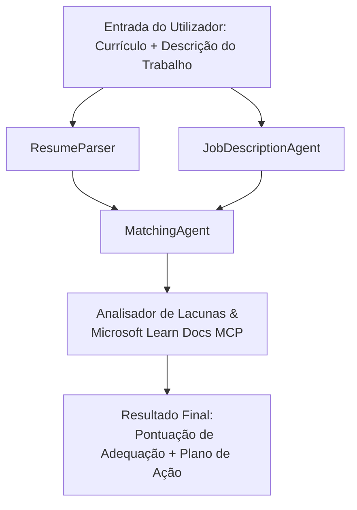

# PersonalCareerCopilot - Avaliador de Adequação Currículo → Emprego

Um fluxo de trabalho multiagente que avalia quão bem um currículo corresponde a uma descrição de emprego, depois gera um roteiro de aprendizagem personalizado para colmatar as lacunas.

---

## Agentes

| Agente | Função | Ferramentas |
|-------|------|-------|
| **ResumeParser** | Extrai competências estruturadas, experiência, certificações do texto do currículo | - |
| **JobDescriptionAgent** | Extrai competências, experiência, certificações requeridas/preferidas de uma descrição de emprego | - |
| **MatchingAgent** | Compara perfil vs requisitos → pontuação de adequação (0-100) + competências correspondentes/faltantes | - |
| **GapAnalyzer** | Constrói um roteiro de aprendizagem personalizado com recursos Microsoft Learn | `search_microsoft_learn_for_plan` (MCP) |

## Fluxo de Trabalho


---

## Início rápido

### 1. Configurar ambiente

```powershell
cd workshop\lab02-multi-agent\PersonalCareerCopilot
python -m venv .venv
.\.venv\Scripts\Activate.ps1          # Windows PowerShell
# source .venv/bin/activate            # macOS / Linux
pip install -r requirements.txt
```

### 2. Configurar credenciais

Copie o ficheiro env de exemplo e preencha com os detalhes do seu projeto Foundry:

```powershell
cp .env.example .env
```

Edite `.env`:

```env
PROJECT_ENDPOINT=https://<your-account>.services.ai.azure.com/api/projects/<your-project>
MODEL_DEPLOYMENT_NAME=gpt-4.1-mini
```

| Valor | Onde encontrar |
|-------|-----------------|
| `PROJECT_ENDPOINT` | Barra lateral do Microsoft Foundry no VS Code → clique com o botão direito no seu projeto → **Copiar Endpoint do Projeto** |
| `MODEL_DEPLOYMENT_NAME` | Barra lateral do Foundry → expanda o projeto → **Modelos + endpoints** → nome da implementação |

### 3. Executar localmente

```powershell
python -m debugpy --listen 127.0.0.1:5679 -m agentdev run main.py --verbose --port 8088
```

Ou use a tarefa do VS Code: `Ctrl+Shift+P` → **Tarefas: Executar Tarefa** → **Executar Servidor HTTP Lab02**.

### 4. Testar com o Inspector de Agentes

Abra o Inspector de Agentes: `Ctrl+Shift+P` → **Foundry Toolkit: Abrir Inspector de Agentes**.

Cole este prompt de teste:

```
Resume:
Jane Doe
Senior Software Engineer with 5 years of experience in Python, Django, and AWS.
Built microservices handling 10K+ requests/second. Led a team of 4 developers.
Certifications: AWS Solutions Architect Associate.
Education: B.S. Computer Science, State University.

Job Description:
Senior Cloud Engineer at Contoso Ltd.
Required: Python, Azure, Kubernetes, Terraform, CI/CD pipelines.
Preferred: Go, monitoring (Prometheus/Grafana), cost optimization.
Experience: 5+ years in cloud infrastructure.
Certifications: Azure Solutions Architect Expert preferred.
```

**Esperado:** Uma pontuação de adequação (0-100), competências correspondentes/faltantes e um roteiro de aprendizagem personalizado com URLs Microsoft Learn.

### 5. Implantar no Foundry

`Ctrl+Shift+P` → **Microsoft Foundry: Implantar Agente Hospedado** → selecione o seu projeto → confirme.

---

## Estrutura do projeto

```
PersonalCareerCopilot/
├── .env.example        ← Template for environment variables
├── .env                ← Your credentials (git-ignored)
├── agent.yaml          ← Hosted agent definition (name, resources, env vars)
├── Dockerfile          ← Container image for Foundry deployment
├── main.py             ← 4-agent workflow (instructions, MCP tool, WorkflowBuilder)
└── requirements.txt    ← Python dependencies
```

## Ficheiros chave

### `agent.yaml`

Define o agente hospedado para o Foundry Agent Service:
- `kind: hosted` - executa como um contentor gerido
- `protocols: [responses v1]` - expõe o endpoint HTTP `/responses`
- `environment_variables` - `PROJECT_ENDPOINT` e `MODEL_DEPLOYMENT_NAME` são injetados na altura da implantação

### `main.py`

Contém:
- **Instruções do agente** - quatro constantes `*_INSTRUCTIONS`, uma por agente
- **Ferramenta MCP** - `search_microsoft_learn_for_plan()` chama `https://learn.microsoft.com/api/mcp` via Streamable HTTP
- **Criação dos agentes** - gestor de contexto `create_agents()` usando `AzureAIAgentClient.as_agent()`
- **Grafo do fluxo de trabalho** - `create_workflow()` usa `WorkflowBuilder` para ligar os agentes com padrões fan-out/fan-in/sequencial
- **Arranque do servidor** - `from_agent_framework(agent).run_async()` na porta 8088

### `requirements.txt`

| Pacote | Versão | Propósito |
|---------|---------|---------|
| `agent-framework-azure-ai` | `1.0.0rc3` | Integração Azure AI para Microsoft Agent Framework |
| `agent-framework-core` | `1.0.0rc3` | Runtime core (inclui WorkflowBuilder) |
| `azure-ai-agentserver-agentframework` | `1.0.0b16` | Runtime do servidor de agentes hospedados |
| `azure-ai-agentserver-core` | `1.0.0b16` | Abstrações core do servidor de agentes |
| `debugpy` | última | Depuração Python (F5 no VS Code) |
| `agent-dev-cli` | `--pre` | CLI para desenvolvimento local + backend do Inspector de Agentes |

---

## Resolução de problemas

| Problema | Solução |
|-------|-----|
| `RuntimeError: Missing required environment variable(s)` | Crie `.env` com `PROJECT_ENDPOINT` e `MODEL_DEPLOYMENT_NAME` |
| `ModuleNotFoundError: No module named 'agent_framework'` | Ative o venv e execute `pip install -r requirements.txt` |
| Sem URLs Microsoft Learn na saída | Verifique a conectividade à internet para `https://learn.microsoft.com/api/mcp` |
| Apenas 1 cartão de lacuna (cortado) | Verifique se `GAP_ANALYZER_INSTRUCTIONS` inclui o bloco `CRITICAL:` |
| Porta 8088 em uso | Pare outros servidores: `netstat -ano \| findstr :8088` |

Para resolução detalhada, veja [Módulo 8 - Resolução de problemas](../docs/08-troubleshooting.md).

---

**Guia completo:** [Documentação Lab 02](../docs/README.md) · **Voltar para:** [README Lab 02](../README.md) · [Página Inicial do Workshop](../../../README.md)

---

<!-- CO-OP TRANSLATOR DISCLAIMER START -->
**Aviso Legal**:  
Este documento foi traduzido utilizando o serviço de tradução automática [Co-op Translator](https://github.com/Azure/co-op-translator). Embora nos esforcemos pela precisão, por favor tenha em conta que traduções automáticas podem conter erros ou imprecisões. O documento original na sua língua nativa deve ser considerado a fonte autorizada. Para informação crítica, recomenda-se tradução profissional feita por humanos. Não nos responsabilizamos por quaisquer mal-entendidos ou interpretações erradas decorrentes da utilização desta tradução.
<!-- CO-OP TRANSLATOR DISCLAIMER END -->