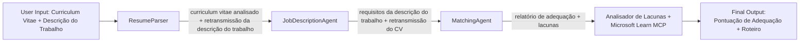

# PersonalCareerCopilot - Avaliador de Compatibilidade Currículo → Emprego

Uma aplicação multi-agente orientada por workflows que avalia quão bem um currículo corresponde a uma descrição de emprego, e depois gera um roteiro de aprendizagem personalizado para colmatar as lacunas.

---

## Agentes

| Agente | Função | Ferramentas |
|-------|------|-------|
| **ResumeParser** | Extrai skills, experiência, certificações estruturadas do texto do currículo | - |
| **JobDescriptionAgent** | Extrai skills, experiência, certificações exigidas/preferidas de uma JD | - |
| **MatchingAgent** | Compara perfil vs requisitos → pontuação de compatibilidade (0-100) + skills correspondentes/faltantes | - |
| **GapAnalyzer** | Constroi um roteiro de aprendizagem personalizado com recursos Microsoft Learn | `search_microsoft_learn_for_plan` (MCP) |

## Workflow


```mermaid
flowchart LR
    UserInput["User Input: Curriculum Vitae + Descrição do Trabalho"] --> ResumeParser
    ResumeParser -- "curriculum vitae analisado + retransmissão da descrição do trabalho" --> JobDescriptionAgent
    JobDescriptionAgent -- "requisitos da descrição do trabalho + retransmissão do CV" --> MatchingAgent
    MatchingAgent -- "relatório de adequação + lacunas" --> GapAnalyzerMCP["Analisador de Lacunas +\nMicrosoft Learn MCP"]
    GapAnalyzerMCP --> FinalOutput["Final Output:\nPontuação de Adequação + Roteiro"]
```

---

## Início rápido

### 1. Configurar ambiente

Esta pasta é a implementação de referência para a estrutura do Lab 02 orientado a workflow. O seu `main.py` usa os blocos de prompt existentes mais `WorkflowBuilder` para ligar os quatro agentes.

```powershell
cd workshop\lab02-multi-agent\PersonalCareerCopilot
python -m venv .venv
.\.venv\Scripts\Activate.ps1          # Windows PowerShell
# source .venv/bin/activate            # macOS / Linux
pip install -r requirements.txt
```

### 2. Configurar credenciais

Crie um ficheiro `.env` nesta pasta:

```powershell
copy .env .env.bak 2>$null; echo $null > .env
```

Edite `.env`:

```env
FOUNDRY_PROJECT_ENDPOINT=https://<your-account>.services.ai.azure.com/api/projects/<your-project>
AZURE_AI_MODEL_DEPLOYMENT_NAME=gpt-4.1-mini
```

| Valor | Onde encontrar |
|-------|------------------|
| `FOUNDRY_PROJECT_ENDPOINT` | Barra lateral do Foundry Toolkit → clique direito no seu projeto → **Copiar Endpoint do Projeto** |
| `AZURE_AI_MODEL_DEPLOYMENT_NAME` | Barra lateral do Foundry → expandir projeto → **Modelos + endpoints** → nome do deployment |

### 3. Executar localmente

```powershell
python -m debugpy --listen 127.0.0.1:5679 main.py --port 8088
```

Ou use a tarefa do VS Code: `Ctrl+Shift+P` → **Tasks: Run Task** → **Run Agent HTTP Server**.

Para debugging com F5, use **Debug Local Agent HTTP Server**.

### 4. Testar com Agent Inspector

Abra o Agent Inspector: `Ctrl+Shift+P` → **Foundry Toolkit: Open Agent Inspector**.

Cole este prompt de teste:

```
Resume:
Jane Doe
Senior Software Engineer with 5 years of experience in Python, Django, and AWS.
Built microservices handling 10K+ requests/second. Led a team of 4 developers.
Certifications: AWS Solutions Architect Associate.
Education: B.S. Computer Science, State University.

Job Description:
Senior Cloud Engineer at Contoso Ltd.
Required: Python, Azure, Kubernetes, Terraform, CI/CD pipelines.
Preferred: Go, monitoring (Prometheus/Grafana), cost optimization.
Experience: 5+ years in cloud infrastructure.
Certifications: Azure Solutions Architect Expert preferred.
```

**Esperado:** Uma pontuação de compatibilidade (0-100), skills correspondentes/faltantes, e um roteiro de aprendizagem personalizado com URLs do Microsoft Learn.

### 5. Desplegar no Foundry

`Ctrl+Shift+P` → **Foundry Toolkit: Deploy Hosted Agent** → selecione o seu projeto → confirme.

---

## Estrutura do projeto

```
PersonalCareerCopilot/
├── .env                ← Your credentials (git-ignored)
├── agent.yaml          ← Hosted agent definition (name, resources, env vars)
├── Dockerfile          ← Container image for Foundry deployment
├── main.py             ← 4-agent workflow (instructions, MCP tool, WorkflowBuilder)
└── requirements.txt    ← Python dependencies
```

## Ficheiros principais

### `agent.yaml`

Define o agente hospedado para o Foundry Agent Service:
- `kind: hosted` - executa como um contentor gerido
- `protocols` - protocolo `responses` com `version: 1.0.0`, expondo o endpoint HTTP `/responses`
- `environment_variables` - `AZURE_AI_MODEL_DEPLOYMENT_NAME` declarado aqui; `FOUNDRY_PROJECT_ENDPOINT` é injetado automaticamente no momento do deploy

### `main.py`

Contém:
- **Instruções dos agentes** - quatro constantes `*_INSTRUCTIONS`, uma por agente
- **Ferramenta MCP** - `search_microsoft_learn_for_plan()` chama `https://learn.microsoft.com/api/mcp` via Streamable HTTP
- **Criação dos agentes** - quatro instâncias `Agent()` + `AgentExecutor()` partilhando um `FoundryChatClient`
- **Grafo do workflow** - `WorkflowBuilder` liga agentes numa pipeline sequencial: ResumeParser → JD Agent → MatchingAgent → GapAnalyzer
- **Arranque do servidor** - `ResponsesHostServer` corre na porta 8088

### `requirements.txt`

| Pacote | Finalidade |
|---------|----------|
| `agent-framework-foundry` | Runtime núcleo: `Agent`, `AgentExecutor`, `WorkflowBuilder`, `@tool`, `FoundryChatClient` |
| `agent-framework-foundry-hosting` | `ResponsesHostServer` + integração de hospedagem Foundry |
| `mcp<2,>=1.24.0` | Cliente MCP para GapAnalyzer (`streamable_http_client`) |
| `debugpy` | Debugging Python (F5 no VS Code) |

---

## Resolução de problemas

| Problema | Solução |
|-------|-----|
| `KeyError: 'FOUNDRY_PROJECT_ENDPOINT'` ou `KeyError: 'AZURE_AI_MODEL_DEPLOYMENT_NAME'` | Crie `.env` com ambos `FOUNDRY_PROJECT_ENDPOINT` e `AZURE_AI_MODEL_DEPLOYMENT_NAME` definidos |
| `ModuleNotFoundError: No module named 'agent_framework'` | Ative o venv e execute `pip install -r requirements.txt` |
| Sem URLs do Microsoft Learn na saída | Verifique a conectividade à internet com `https://learn.microsoft.com/api/mcp` |
| Apenas 1 cartão de lacuna (truncado) | Verifique se `GAP_ANALYZER_INSTRUCTIONS` inclui o bloco `CRITICAL:` |
| Porta 8088 em uso | Pare outros servidores: `netstat -ano \| findstr :8088` |

Para resolução detalhada, consulte [Módulo 8 - Resolução de problemas](../docs/08-troubleshooting.md).

---

**Walkthrough completo:** [Lab 02 Docs](../docs/README.md) · **Voltar a:** [Lab 02 README](../README.md) · [Página inicial do Workshop](../../../README.md)

---

<!-- CO-OP TRANSLATOR DISCLAIMER START -->
**Aviso Legal**:
Este documento foi traduzido utilizando o serviço de tradução automática [Co-op Translator](https://github.com/Azure/co-op-translator). Embora nos esforcemos pela precisão, esteja ciente de que traduções automáticas podem conter erros ou imprecisões. O documento original na sua língua nativa deve ser considerado a fonte autorizada. Para informações críticas, recomenda-se tradução profissional humana. Não nos responsabilizamos por quaisquer mal-entendidos ou interpretações incorretas resultantes da utilização desta tradução.
<!-- CO-OP TRANSLATOR DISCLAIMER END -->