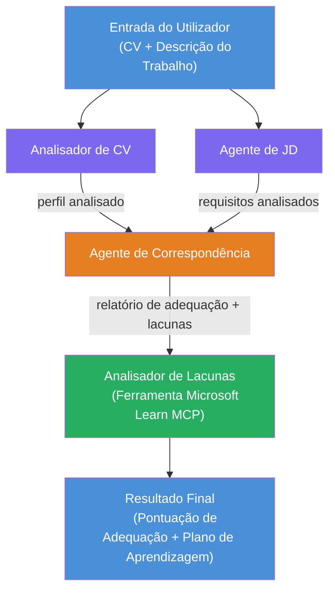

# Lab 02 - Workflow Multi-Agente: Avaliador de Adequação Currículo → Emprego

---

## O que vais construir

Um **Avaliador de Adequação Currículo → Emprego** - um workflow multi-agente onde quatro agentes especializados colaboram para avaliar o quão bem o currículo de um candidato corresponde a uma descrição de emprego e depois geram um roteiro de aprendizagem personalizado para colmatar as lacunas.

### Os agentes

| Agente | Função |
|--------|---------|
| **Parser de Currículos** | Extrai competências estruturadas, experiência, certificações do texto do currículo |
| **Agente de Descrição de Emprego** | Extrai competências, experiência, certificações requeridas/preferidas de uma descrição de emprego |
| **Agente de Correspondência** | Compara perfil vs requisitos → pontuação de adequação (0-100) + competências correspondentes/em falta |
| **Analisador de Lacunas** | Constrói um roteiro de aprendizagem personalizado com recursos, prazos e projetos de ganhos rápidos |

### Fluxo da demonstração

Carrega um **currículo + descrição do emprego** → obtém uma **pontuação de adequação + competências em falta** → recebe um **roteiro de aprendizagem personalizado**.

### Arquitectura do workflow

> Roxo = agentes em paralelo | Laranja = ponto de agregação | Verde = agente final com ferramentas. Ver [Módulo 1 - Compreender a Arquitectura](docs/01-understand-multi-agent.md) e [Módulo 4 - Padrões de Orquestração](docs/04-orchestration-patterns.md) para diagramas detalhados e fluxo de dados.

### Tópicos abordados

- Criação de um workflow multi-agente usando **WorkflowBuilder**
- Definição de funções dos agentes e fluxo de orquestração (paralelo + sequencial)
- Padrões de comunicação entre agentes
- Testes locais com o Agent Inspector
- Implantação de workflows multi-agente no Foundry Agent Service

---

## Pré-requisitos

Completa primeiro o Lab 01:

- [Lab 01 - Agente Único](../lab01-single-agent/README.md)

---

## Começar

Consulta as instruções completas de configuração, walkthrough do código e comandos de teste em:

- [Documentação Lab 2 - Pré-requisitos](docs/00-prerequisites.md)
- [Documentação Lab 2 - Caminho Completo de Aprendizagem](docs/README.md)
- [Guia de execução PersonalCareerCopilot](PersonalCareerCopilot/README.md)

## Padrões de orquestração (alternativas agenticas)

O Lab 2 inclui o fluxo predefinido **paralelo → agregador → planeador**, e a documentação
também descreve padrões alternativos para demonstrar um comportamento agentico mais forte:

- **Fan-out/Fan-in com consenso ponderado**
- **Passagem de revisor/crítico antes do roteiro final**
- **Roteador condicional** (seleção de caminho baseada na pontuação de adequação e competências em falta)

Ver [docs/04-orchestration-patterns.md](docs/04-orchestration-patterns.md).

---

**Anterior:** [Lab 01 - Agente Único](../lab01-single-agent/README.md) · **Voltar:** [Página Principal do Workshop](../../README.md)

---

<!-- CO-OP TRANSLATOR DISCLAIMER START -->
**Aviso Legal**:  
Este documento foi traduzido utilizando o serviço de tradução automática [Co-op Translator](https://github.com/Azure/co-op-translator). Embora nos esforcemos pela precisão, por favor tenha em conta que traduções automáticas podem conter erros ou imprecisões. O documento original na sua língua nativa deve ser considerado a fonte autoritativa. Para informações críticas, recomenda-se a tradução profissional realizada por humanos. Não nos responsabilizamos por quaisquer mal-entendidos ou interpretações erradas decorrentes do uso desta tradução.
<!-- CO-OP TRANSLATOR DISCLAIMER END -->