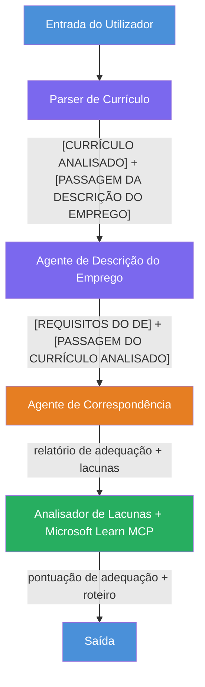

# Laboratório 02 - Fluxo de Trabalho Multi-Agente: Avaliador de Correspondência CV → Emprego

## Visão Geral

Neste laboratório prático, irá construir uma **aplicação multi-agente orientada para fluxo de trabalho** usando o Foundry Toolkit no VS Code e implantá-la no Microsoft Foundry Agent Service.

**O que irá construir:** um Avaliador de Correspondência CV → Emprego que analisa um currículo e uma descrição de trabalho, atribui uma pontuação de correspondência e produz um roteiro de aprendizagem personalizado usando recursos Microsoft Learn.

---

## Arquitectura

```mermaid
flowchart TD
    A["Entrada do Utilizador"] --> B["Parser de Currículo"]
    B -->|"[CURRÍCULO ANALISADO] + [PASSAGEM DA DESCRIÇÃO DO EMPREGO]"| C["Agente de Descrição do Emprego"]
    C -->|"[REQUISITOS DO DE] + [PASSAGEM DO CURRÍCULO ANALISADO]"| D["Agente de Correspondência"]
    D -->|relatório de adequação + lacunas| E["Analisador de Lacunas + Microsoft Learn MCP"]
    E -->|pontuação de adequação + roteiro| F["Saída"]

    style A fill:#4A90D9,color:#fff
    style B fill:#7B68EE,color:#fff
    style C fill:#7B68EE,color:#fff
    style D fill:#E67E22,color:#fff
    style E fill:#27AE60,color:#fff
    style F fill:#4A90D9,color:#fff
```

**Como funciona:**
1. O utilizador cola um currículo e uma descrição de trabalho.
2. **ResumeParser** analisa o currículo e copia a descrição do trabalho literalmente para uma secção `[PASSAGEM DA DESCRIÇÃO DO TRABALHO]`.
3. **Agente JD** extrai requisitos estruturados da passagem, depois encaminha o `[CURRÍCULO ANALISADO]` em frente como `[PASSAGEM DO CURRÍCULO ANALISADO]`.
4. **MatchingAgent** compara `[PASSAGEM DO CURRÍCULO ANALISADO]` vs `[REQUISITOS DA DESCRIÇÃO DO TRABALHO]` e produz uma pontuação de correspondência.
5. **GapAnalyzer** transforma as lacunas num roteiro prático e recupera links reais do Microsoft Learn via MCP.

---

## Pré-requisitos

Complete primeiro o Laboratório 01:

- [Laboratório 01 - Agente Único](../lab01-single-agent/README.md)

---

## Parte 1: Leia os módulos pela ordem

Veja o caminho de aprendizagem completo em:

- [Documentação Lab 2 - Pré-requisitos](docs/00-prerequisites.md)
- [Documentação Lab 2 - Caminho Completo de Aprendizagem](docs/README.md)
- [Guia de execução PersonalCareerCopilot](PersonalCareerCopilot/README.md)

---

## Parte 2: Construa e teste o fluxo de trabalho

1. Use o assistente Foundry Toolkit para criar a estrutura do projeto baseado em fluxo de trabalho.
2. Copie os blocos de prompt e o gráfico do fluxo de trabalho de `PersonalCareerCopilot/main.py` para o seu ambiente de trabalho.
3. Execute localmente com o Agent Inspector e verifique os quatro agentes e a ferramenta MCP.
4. Implemente o agente alojado no Foundry quando os testes locais forem aprovados.

---

## Padrões de orquestração

O Laboratório 02 inclui o fluxo padrão **fan-out → fan-in → sequencial**, e a documentação também descreve padrões alternativos de orquestração para experimentação.

- **Fan-out/Fan-in com consenso ponderado**
- **Passagem de revisor/crítico antes do roteiro final**
- **Router condicional** baseado em pontuação de ajuste e competências em falta

Veja [docs/04-orchestration-patterns.md](docs/04-orchestration-patterns.md).

---

**Anterior:** [Laboratório 01 - Agente Único](../lab01-single-agent/README.md) · **Voltar para:** [Página Inicial do Workshop](../../README.md)

---

<!-- CO-OP TRANSLATOR DISCLAIMER START -->
**Aviso Legal**:
Este documento foi traduzido utilizando o serviço de tradução automática [Co-op Translator](https://github.com/Azure/co-op-translator). Embora nos esforcemos pela precisão, esteja ciente de que traduções automáticas podem conter erros ou imprecisões. O documento original na sua língua nativa deve ser considerado a fonte autorizada. Para informações críticas, recomenda-se tradução profissional humana. Não nos responsabilizamos por quaisquer mal-entendidos ou interpretações incorretas resultantes da utilização desta tradução.
<!-- CO-OP TRANSLATOR DISCLAIMER END -->