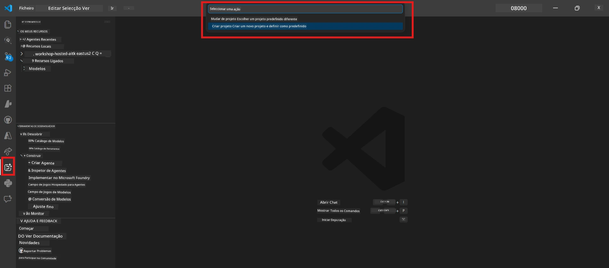

# Module 0 - Pré-requisitos

Antes de começar o Laboratório 02, confirme que tem o seguinte concluído. Este laboratório baseia-se diretamente no Laboratório 01 - não o ignore.

---

## 1. Concluir o Laboratório 01

O Laboratório 02 assume que já:

- [x] Concluiu todos os 8 módulos do [Laboratório 01 - Agente Único](../../lab01-single-agent/README.md)
- [x] Implantou com sucesso um agente único no Foundry Agent Service
- [x] Verificou que o agente funciona tanto no Agent Inspector local como no Foundry Playground

Se ainda não concluiu o Laboratório 01, volte e termine-o agora: [Documentação do Laboratório 01](../../lab01-single-agent/docs/00-prerequisites.md)

---

## 2. Verificar configuração existente

Todas as ferramentas do Laboratório 01 devem continuar instaladas e a funcionar. Execute estas verificações rápidas:

### 2.1 Azure CLI

```powershell
az account show --query "{name:name, id:id}" --output table
```

Esperado: Exibe o nome e ID da sua subscrição. Se falhar, execute [`az login`](https://learn.microsoft.com/cli/azure/authenticate-azure-cli-interactively).

### 2.2 Extensões do VS Code

1. Pressione `Ctrl+Shift+P` → escreva **"Microsoft Foundry"** → confirme se vê comandos (ex.: `Microsoft Foundry: Create a New Hosted Agent`).
2. Pressione `Ctrl+Shift+P` → escreva **"Foundry Toolkit"** → confirme se vê comandos (ex.: `Foundry Toolkit: Open Agent Inspector`).

### 2.3 Projeto & modelo Foundry

1. Clique no ícone **Microsoft Foundry** na Barra de Atividades do VS Code.
2. Confirme que o seu projeto está listado (ex.: `workshop-agents`).
3. Expanda o projeto → verifique se existe um modelo implantado (ex.: `gpt-4.1-mini`) com o estado **Succeeded**.

> **Se o seu modelo expirou:** Algumas implantações gratuitas expiraram automaticamente. Reimplante a partir do [Catálogo de Modelos](https://learn.microsoft.com/azure/foundry/foundry-models/concepts/models-sold-directly-by-azure) (`Ctrl+Shift+P` → **Microsoft Foundry: Open Model Catalog**).



### 2.4 Funções RBAC

Verifique se tem o **Azure AI User** no seu projeto Foundry:

1. [Azure Portal](https://portal.azure.com) → recurso do seu **projeto** Foundry → **Controlo de acesso (IAM)** → separador **[Funções atribuídas](https://learn.microsoft.com/azure/foundry/concepts/rbac-foundry)**.
2. Pesquise o seu nome → confirme que o **[Azure AI User](https://aka.ms/foundry-ext-project-role)** está listado.

---

## 3. Compreender conceitos multi-agente (novo no Laboratório 02)

O Laboratório 02 introduz conceitos não abordados no Laboratório 01. Leia-os antes de avançar:

### 3.1 O que é um fluxo de trabalho multi-agente?

Em vez de um único agente lidar com tudo, um **fluxo de trabalho multi-agente** divide o trabalho entre vários agentes especializados. Cada agente tem:

- As suas próprias **instruções** (prompt do sistema)
- O seu próprio **papel** (responsabilidade)
- Ferramentas opcionais **(tools)** (funções que pode chamar)

Os agentes comunicam através de um **grafo de orquestração** que define como os dados fluem entre eles.

### 3.2 WorkflowBuilder

A classe [`WorkflowBuilder`](https://learn.microsoft.com/agent-framework/workflows/agents-in-workflows) do `agent_framework` é o componente do SDK que liga os agentes:

```python
from agent_framework import WorkflowBuilder

workflow = (
    WorkflowBuilder(
        name="MyWorkflow",
        start_executor=agent_a,
        output_executors=[agent_d],
    )
    .add_edge(agent_a, agent_b)
    .add_edge(agent_a, agent_c)
    .add_edge(agent_b, agent_d)
    .add_edge(agent_c, agent_d)
    .build()
)
```

- **`start_executor`** - O primeiro agente que recebe a entrada do utilizador
- **`output_executors`** - O(s) agente(s) cujo output se torna na resposta final
- **`add_edge(source, target)`** - Define que o `target` recebe o output do `source`

### 3.3 Ferramentas MCP (Model Context Protocol)

O Laboratório 02 usa uma **ferramenta MCP** que chama a API Microsoft Learn para obter recursos de aprendizagem. [MCP (Model Context Protocol)](https://modelcontextprotocol.io/introduction) é um protocolo padronizado para ligar modelos de IA a fontes de dados externas e ferramentas.

| Termo | Definição |
|-------|-----------|
| **Servidor MCP** | Um serviço que expõe ferramentas/recursos via o [protocolo MCP](https://learn.microsoft.com/azure/foundry/agents/how-to/tools/model-context-protocol) |
| **Cliente MCP** | O seu código agente que se liga a um servidor MCP e chama as suas ferramentas |
| **[HTTP Streamable](https://learn.microsoft.com/agent-framework/agents/tools/hosted-mcp-tools)** | O método de transporte usado para comunicar com o servidor MCP |

### 3.4 Como o Laboratório 02 difere do Laboratório 01

| Aspeto | Laboratório 01 (Agente Único) | Laboratório 02 (Multi-Agente) |
|--------|-------------------------------|------------------------------|
| Agentes | 1 | 4 (papéis especializados) |
| Orquestração | Nenhuma | WorkflowBuilder (paralelo + sequencial) |
| Ferramentas | Função `@tool` opcional | Ferramenta MCP (chamada API externa) |
| Complexidade | Prompt simples → resposta | Curriculum + descrição → pontuação → roadmap |
| Fluxo de contexto | Direto | Passagem agente a agente |

---

## 4. Estrutura do repositório do Workshop para o Laboratório 02

Certifique-se de que sabe onde estão os ficheiros do Laboratório 02:

```
workshop/
└── lab02-multi-agent/
    ├── README.md                       ← Lab overview
    ├── docs/                           ← You are here
    │   ├── README.md                   ← Learning path index
    │   ├── 00-prerequisites.md         ← This file
    │   ├── 01-understand-multi-agent.md
    │   ├── ...
    │   └── 08-troubleshooting.md
    └── PersonalCareerCopilot/          ← The agent project
        ├── agent.yaml                  ← Agent definition
        ├── main.py                     ← 4-agent workflow code
        ├── Dockerfile                  ← Container configuration
        └── requirements.txt            ← Python dependencies
```

---

### Ponto de verificação

- [ ] Laboratório 01 completamente concluído (todos os 8 módulos, agente implantado e verificado)
- [ ] `az account show` retorna a sua subscrição
- [ ] Extensões Microsoft Foundry e Foundry Toolkit instaladas e a responder
- [ ] Projeto Foundry tem um modelo implantado (ex.: `gpt-4.1-mini`)
- [ ] Tem a função **Azure AI User** no projeto
- [ ] Leu a secção de conceitos multi-agente acima e compreende WorkflowBuilder, MCP e orquestração de agentes

---

**A seguir:** [01 - Compreender a Arquitetura Multi-Agente →](01-understand-multi-agent.md)

---

<!-- CO-OP TRANSLATOR DISCLAIMER START -->
**Aviso Legal**:  
Este documento foi traduzido utilizando o serviço de tradução por IA [Co-op Translator](https://github.com/Azure/co-op-translator). Embora nos esforcemos por garantir a precisão, por favor tenha em conta que traduções automáticas podem conter erros ou imprecisões. O documento original no seu idioma nativo deve ser considerado a fonte autoritativa. Para informações críticas, recomenda-se tradução profissional humana. Não nos responsabilizamos por quaisquer mal-entendidos ou interpretações erradas decorrentes do uso desta tradução.
<!-- CO-OP TRANSLATOR DISCLAIMER END -->