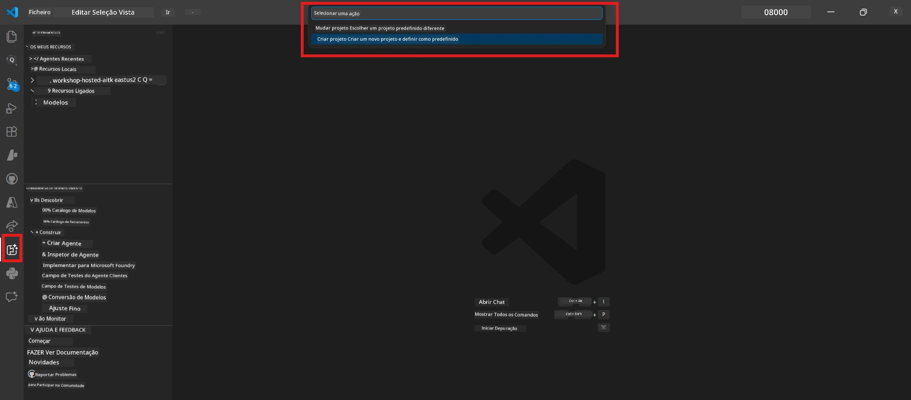

# Módulo 0 - Introdução

⏱️ ~10 min

> [!WARNING]
> **Pré-visualização & Limitações:** Os [Agentes Hospedados](https://learn.microsoft.com/azure/foundry/agents/concepts/hosted-agents) encontram-se atualmente em **pré-visualização pública** - não são recomendados para cargas de trabalho de produção. Algumas funcionalidades apresentadas neste workshop podem mudar conforme o serviço evolui para GA.

## O que vais criar

Neste laboratório, vais expandir as competências de agente único do Laboratório 01 para construir um **fluxo de trabalho multi-agente** - o Avaliador de Adequação CV → Emprego.

Vais colar um **currículo** e uma **descrição de trabalho**. Quatro agentes especializados processam a entrada sequencialmente, e depois devolvem:
- Uma pontuação de adequação (0–100 com um detalhamento da pontuação)
- Uma lista de lacunas de competências e certificações
- Um roteiro de aprendizagem personalizado com links reais do Microsoft Learn para cada lacuna

**O fluxo de trabalho utiliza:**
- **Microsoft Agent Framework** - `WorkflowBuilder` para orquestração sequencial da pipeline
- **Foundry Toolkit para VS Code** - scaffold, teste local, deploy
- **Um modelo de IA** (ex., `gpt-4.1-mini`) - usado pelos quatro agentes
- **Servidor Microsoft Learn MCP** - fornece links reais de recursos de aprendizagem para cada lacuna de competência

---

## Escolhe o teu caminho

> ⚠️ **Continua com o mesmo caminho que usaste no Laboratório 01.**

<details open>
<summary><strong>🅰️ Caminho A - Azure cloud (requer subscrição Azure)</strong></summary>

| | Detalhes |
|---|---|
| **Para quem é?** | Concluíste o Laboratório 01 usando uma subscrição Azure |
| **Modelo** | Azure OpenAI via Foundry (ex., `gpt-4.1-mini`) |
| **Módulos abordados** | Todos os módulos (00–09) |
| **Deploy para a cloud?** | ✅ Sim - deploy completo end-to-end |

</details>

<details open>
<summary><strong>🅱️ Caminho B - Foundry Local (não precisa de subscrição Azure)</strong></summary>

| | Detalhes |
|---|---|
| **Para quem é?** | Concluíste o Laboratório 01 usando Foundry Local |
| **Modelo** | Foundry Local (gratuito, corre na tua máquina) |
| **Módulos abordados** | Módulos 00–05 (ignorar 06–07 - deploy & cloud verify) |
| **Deploy para a cloud?** | ❌ Não - apenas testes locais via Agent Inspector |

</details>

---

## Verificação do Laboratório 01

O Laboratório 02 baseia-se diretamente no Laboratório 01. Completa o Laboratório 01 antes de começar aqui.

Ainda não fizeste o Laboratório 01? Começa aqui: [Lab 01 - Introdução](../../lab01-single-agent/docs/00-prerequisites.md)

<details open>
<summary><strong>🅰️ Caminho A - Azure cloud</strong></summary>

```powershell
az account show --query "{name:name, id:id}" --output table
```

Se falhar, executa `az login`. Depois confirma no VS Code:

1. `Ctrl+Shift+P` → escreve **Foundry Toolkit** → confirma que os comandos aparecem.
2. Clica no ícone **Foundry Toolkit** → o teu projeto e modelo deployado mostram **Sucesso**.



> **RBAC:** Atribuíste o papel **Foundry User** no Laboratório 01. Se precisares de o reatribuir, vê [Laboratório 01, Módulo 1](../../lab01-single-agent/docs/01-setup.md#deploy-a-model--assign-rbac). O papel chamava-se anteriormente **Azure AI User** - mesmas permissões.

</details>

<details open>
<summary><strong>🅱️ Caminho B - Foundry Local</strong></summary>

```powershell
Invoke-WebRequest -Uri "http://localhost:5273/v1/health" -UseBasicParsing | Select-Object StatusCode
```

Esperado: `StatusCode: 200`. Caso contrário, reinicia o Foundry Local a partir da sidebar do Foundry Toolkit.

> Toda a inferência é feita na tua máquina. A única chamada externa é a ferramenta MCP para `https://learn.microsoft.com/api/mcp`.

</details>

---

## Novidades no Laboratório 02

| | Laboratório 01 | Laboratório 02 |
|--|--------|--------|
| Agentes | 1 | 4 (encadeados com WorkflowBuilder) |
| Template scaffold | Básico - Agent Framework | Workflows - Agent Framework |
| Novo pacote | - | `mcp` |
| Orquestração | Agente conversacional único | Pipeline sequencial (WorkflowBuilder) |
| Nova ferramenta | - | `search_microsoft_learn_for_plan` (MCP) |

---

**Próximo:** [01 - Compreender a Arquitetura →](01-understand-multi-agent.md)

---

<!-- CO-OP TRANSLATOR DISCLAIMER START -->
**Aviso Legal**:
Este documento foi traduzido utilizando o serviço de tradução automática [Co-op Translator](https://github.com/Azure/co-op-translator). Embora nos esforcemos pela precisão, esteja ciente de que traduções automáticas podem conter erros ou imprecisões. O documento original na sua língua nativa deve ser considerado a fonte autorizada. Para informações críticas, recomenda-se tradução profissional humana. Não nos responsabilizamos por quaisquer mal-entendidos ou interpretações incorretas resultantes da utilização desta tradução.
<!-- CO-OP TRANSLATOR DISCLAIMER END -->