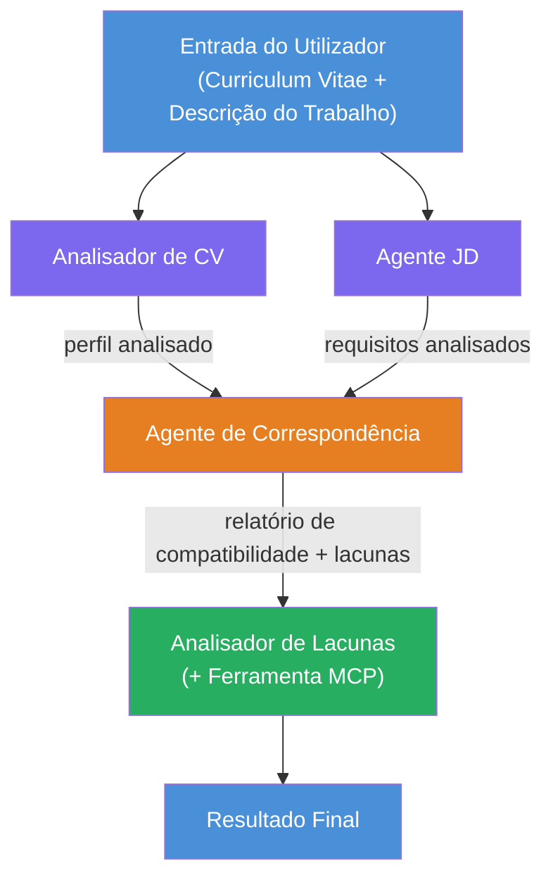
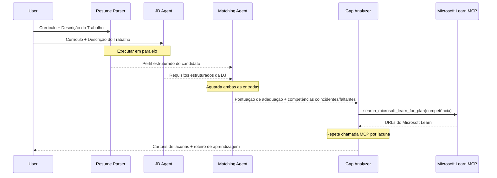
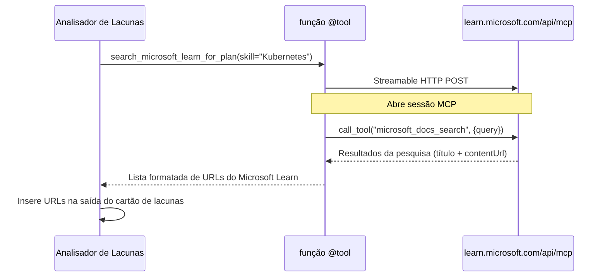

# Módulo 1 - Compreender a Arquitetura Multi-Agente

Neste módulo, irá aprender a arquitetura do Avaliador de Compatibilidade Currículo → Vaga antes de escrever qualquer código. Compreender o grafo de orquestração, os papéis dos agentes e o fluxo de dados é fundamental para depurar e expandir [fluxos de trabalho multi-agente](https://learn.microsoft.com/azure/architecture/ai-ml/idea/multiple-agent-workflow-automation).

---

## O problema que isto resolve

Associar um currículo a uma descrição de vaga envolve múltiplas competências distintas:

1. **Extração** - Extrair dados estruturados de texto não estruturado (currículo)
2. **Análise** - Extrair requisitos de uma descrição de vaga
3. **Comparação** - Avaliar a correspondência entre os dois
4. **Planeamento** - Construir um roteiro de aprendizagem para colmatar lacunas

Um agente único a executar as quatro tarefas numa única prompt frequentemente produz:
- Extração incompleta (apressa-se na extração para chegar à pontuação)
- Avaliação superficial (sem detalhe baseado em evidências)
- Roteiros genéricos (não adaptados às lacunas específicas)

Ao dividir em **quatro agentes especializados**, cada um foca na sua tarefa com instruções dedicadas, gerando saídas de maior qualidade em cada etapa.

---

## Os quatro agentes

Cada agente é um agente completo [Microsoft Foundry](https://learn.microsoft.com/azure/foundry/agents/concepts/hosted-agents) criado via `AzureAIAgentClient.as_agent()`. Partilham o mesmo deployment de modelo, mas têm instruções diferentes e (opcionalmente) ferramentas distintas.

| # | Nome do Agente | Papel | Entrada | Saída |
|---|----------------|-------|---------|-------|
| 1 | **ResumeParser** | Extrai perfil estruturado a partir do texto do currículo | Texto bruto do currículo (do utilizador) | Perfil do candidato, Competências técnicas, Competências interpessoais, Certificações, Experiência no domínio, Conquistas |
| 2 | **JobDescriptionAgent** | Extrai requisitos estruturados de uma descrição de vaga | Texto bruto da descrição de vaga (do utilizador, encaminhado via ResumeParser) | Visão geral do cargo, Competências obrigatórias, Competências preferenciais, Experiência, Certificações, Educação, Responsabilidades |
| 3 | **MatchingAgent** | Calcula a pontuação de compatibilidade baseada em evidências | Saídas do ResumeParser + JobDescriptionAgent | Pontuação de compatibilidade (0-100 com detalhamento), Competências correspondentes, Competências em falta, Lacunas |
| 4 | **GapAnalyzer** | Constrói um roteiro de aprendizagem personalizado | Saída do MatchingAgent | Cartões de lacunas (por competência), Ordem de aprendizagem, Cronograma, Recursos da Microsoft Learn |

---

## O grafo de orquestração

O fluxo de trabalho usa **ramificação paralela** seguida de **agregação sequencial**:


> **Legenda:** Roxo = agentes paralelos, Laranja = ponto de agregação, Verde = agente final com ferramentas

### Como os dados fluem


1. **O utilizador envia** uma mensagem contendo um currículo e uma descrição de vaga.
2. **ResumeParser** recebe a entrada completa do utilizador e extrai um perfil estruturado do candidato.
3. **JobDescriptionAgent** recebe a entrada do utilizador em paralelo e extrai requisitos estruturados.
4. **MatchingAgent** recebe as saídas de **ambos** ResumeParser e JobDescriptionAgent (o framework espera que ambos terminem antes de executar o MatchingAgent).
5. **GapAnalyzer** recebe a saída do MatchingAgent e chama a **ferramenta Microsoft Learn MCP** para obter recursos reais de aprendizagem para cada lacuna.
6. A **saída final** é a resposta do GapAnalyzer, que inclui a pontuação de compatibilidade, cartões de lacunas e um roteiro de aprendizagem completo.

### Por que a ramificação paralela é importante

ResumeParser e JobDescriptionAgent executam **em paralelo** porque nenhum depende do outro. Isto:
- Reduz a latência total (ambos executam simultaneamente em vez de sequencialmente)
- É uma divisão natural (analisar currículo vs. analisar descrição de vaga são tarefas independentes)
- Demonstra um padrão comum multi-agente: **ramificação → agregação → ação**

---

## WorkflowBuilder em código

Aqui está o mapeamento do grafo acima para chamadas da API [`WorkflowBuilder`](https://learn.microsoft.com/agent-framework/workflows/agents-in-workflows) em `main.py`:

```python
from agent_framework import WorkflowBuilder

workflow = (
    WorkflowBuilder(
        name="ResumeJobFitEvaluator",
        start_executor=resume_parser,       # Primeiro agente a receber a entrada do utilizador
        output_executors=[gap_analyzer],     # Agente final cujo output é devolvido
    )
    .add_edge(resume_parser, jd_agent)      # ResumeParser → JobDescriptionAgent
    .add_edge(resume_parser, matching_agent) # ResumeParser → MatchingAgent
    .add_edge(jd_agent, matching_agent)      # JobDescriptionAgent → MatchingAgent
    .add_edge(matching_agent, gap_analyzer)  # MatchingAgent → GapAnalyzer
    .build()
)
```

**Compreendendo as ligações:**

| Ligação | O que significa |
|---------|-----------------|
| `resume_parser → jd_agent` | O agente de descrição de vaga recebe a saída do ResumeParser |
| `resume_parser → matching_agent` | MatchingAgent recebe a saída do ResumeParser |
| `jd_agent → matching_agent` | MatchingAgent também recebe a saída do agente de descrição de vaga (espera por ambos) |
| `matching_agent → gap_analyzer` | GapAnalyzer recebe a saída do MatchingAgent |

Como o `matching_agent` tem **duas entradas** (`resume_parser` e `jd_agent`), o framework espera automaticamente que ambos os agentes terminem antes de correr o MatchingAgent.

---

## A ferramenta MCP

O agente GapAnalyzer tem uma ferramenta: `search_microsoft_learn_for_plan`. Esta é uma **[ferramenta MCP](https://learn.microsoft.com/agent-framework/agents/tools/hosted-mcp-tools)** que chama a API Microsoft Learn para obter recursos de aprendizagem selecionados.

### Como funciona

```python
@tool
async def search_microsoft_learn_for_plan(
    skill: str, role: str = "", max_results: int = 5
) -> str:
    """Search Microsoft Learn MCP and return curated official links."""
    # Liga-se a https://learn.microsoft.com/api/mcp via HTTP Streamable
    # Chama a ferramenta 'microsoft_docs_search' no servidor MCP
    # Retorna uma lista formatada de URLs do Microsoft Learn
```

### Fluxo de chamada MCP


1. GapAnalyzer decide que precisa de recursos de aprendizagem para uma competência (ex.: "Kubernetes")
2. O framework chama `search_microsoft_learn_for_plan(skill="Kubernetes")`
3. A função abre uma ligação [HTTP Streamable](https://learn.microsoft.com/agent-framework/agents/tools/hosted-mcp-tools) para `https://learn.microsoft.com/api/mcp`
4. Chama a ferramenta `microsoft_docs_search` no [servidor MCP](https://learn.microsoft.com/azure/foundry/agents/how-to/tools/model-context-protocol)
5. O servidor MCP devolve resultados de pesquisa (título + URL)
6. A função formata os resultados e retorna-os como string
7. GapAnalyzer usa os URLs retornados na saída dos cartões de lacunas

### Registos MCP esperados

Quando a ferramenta executa, verá registos como:

```
GET https://learn.microsoft.com/api/mcp → 405 (Method Not Allowed)
POST https://learn.microsoft.com/api/mcp → 200
DELETE https://learn.microsoft.com/api/mcp → 405 (Method Not Allowed)
```

**Estes são normais.** O cliente MCP faz sondagens GET e DELETE durante a inicialização - receber 405 é comportamento esperado. A chamada real da ferramenta usa POST e retorna 200. Só deve preocupar-se se as chamadas POST falharem.

---

## Padrão de criação do agente

Cada agente é criado usando o **gestor de contexto assíncrono [`AzureAIAgentClient.as_agent()`](https://learn.microsoft.com/python/api/overview/azure/ai-agents-readme)**. Este é o padrão do Foundry SDK para criar agentes que são automaticamente limpos:

```python
async with (
    get_credential() as credential,
    AzureAIAgentClient(
        project_endpoint=PROJECT_ENDPOINT,
        model_deployment_name=MODEL_DEPLOYMENT_NAME,
        credential=credential,
    ).as_agent(
        name="ResumeParser",
        instructions=RESUME_PARSER_INSTRUCTIONS,
    ) as resume_parser,
    # ... repetir para cada agente ...
):
    # Todos os 4 agentes existem aqui
    workflow = create_workflow(resume_parser, jd_agent, matching_agent, gap_analyzer)
```

**Pontos chave:**
- Cada agente obtém a sua própria instância `AzureAIAgentClient` (o SDK exige que o nome do agente esteja associado ao cliente)
- Todos os agentes partilham o mesmo `credential`, `PROJECT_ENDPOINT` e `MODEL_DEPLOYMENT_NAME`
- O bloco `async with` assegura que todos os agentes são limpos quando o servidor é encerrado
- O GapAnalyzer recebe adicionalmente `tools=[search_microsoft_learn_for_plan]`

---

## Inicialização do servidor

Depois de criar os agentes e construir o fluxo de trabalho, o servidor inicia:

```python
from azure.ai.agentserver.agentframework import from_agent_framework

agent = create_workflow(resume_parser, jd_agent, matching_agent, gap_analyzer)
await from_agent_framework(agent).run_async()
```

`from_agent_framework()` encapsula o fluxo de trabalho como um servidor HTTP expondo o endpoint `/responses` na porta 8088. Este é o mesmo padrão do Lab 01, mas o "agente" é agora o [grafo completo do fluxo de trabalho](https://learn.microsoft.com/agent-framework/workflows/as-agents).

---

### Checkpoint

- [ ] Compreende a arquitetura de 4 agentes e o papel de cada agente
- [ ] Consegue traçar o fluxo de dados: Utilizador → ResumeParser → (paralelo) Agente de descrição de vaga + MatchingAgent → GapAnalyzer → Saída
- [ ] Compreende por que o MatchingAgent espera por ambos ResumeParser e Agente de descrição de vaga (duas ligações de entrada)
- [ ] Compreende a ferramenta MCP: o que faz, como é chamada, e que logs GET 405 são normais
- [ ] Compreende o padrão `AzureAIAgentClient.as_agent()` e porque cada agente tem a sua própria instância cliente
- [ ] Consegue ler o código do `WorkflowBuilder` e associá-lo ao grafo visual

---

**Anterior:** [00 - Prerequisites](00-prerequisites.md) · **Seguinte:** [02 - Scaffold the Multi-Agent Project →](02-scaffold-multi-agent.md)

---

<!-- CO-OP TRANSLATOR DISCLAIMER START -->
**Aviso Legal**:  
Este documento foi traduzido utilizando o serviço de tradução por IA [Co-op Translator](https://github.com/Azure/co-op-translator). Embora nos esforcemos pela precisão, por favor, tenha em atenção que traduções automáticas podem conter erros ou imprecisões. O documento original na sua língua nativa deve ser considerado a fonte oficial. Para informações críticas, recomenda-se tradução profissional realizada por humanos. Não nos responsabilizamos por quaisquer mal-entendidos ou interpretações incorretas resultantes da utilização desta tradução.
<!-- CO-OP TRANSLATOR DISCLAIMER END -->