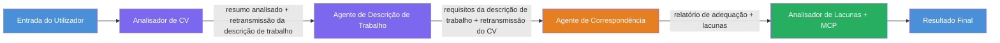

# Módulo 1 - Compreender a Arquitetura

⏱️ ~5 min

Antes de escrever qualquer código, aqui está uma visão geral rápida do que estás a construir e como funciona.

---

## O que estás a construir

Tu copias um **currículo** e uma **descrição de trabalho**. O fluxo de trabalho devolve:

- Uma pontuação de adequação (0–100 com uma análise detalhada)
- Uma lista de lacunas de competências e certificações
- Um roteiro de aprendizagem personalizado com ligações Microsoft Learn para cada lacuna

---

## Os quatro agentes

Um único agente a tentar analisar, pontuar e planear tudo de uma vez tende a apressar-se e produzir resultados superficiais. Dividir o trabalho em quatro agentes especializados dá melhores resultados:

| Agente | O que faz |
|-------|-------------|
| **ResumeParser** | Analisa o currículo; copia a descrição de trabalho na íntegra para `[JOB DESCRIPTION PASS-THROUGH]` para os agentes seguintes |
| **JobDescriptionAgent** | Extrai os requisitos da descrição de trabalho do pass-through; encaminha `[PARSED RESUME]` para a frente como `[PARSED RESUME PASS-THROUGH]` |
| **MatchingAgent** | Compara ambas as secções etiquetadas; produz uma pontuação de adequação de 0–100 e uma lista de lacunas |
| **GapAnalyzer** | Cria um roteiro de aprendizagem; pesquisa no Microsoft Learn para cada lacuna |

---

## O gráfico de orquestração

O fluxo de trabalho é uma **pipeline sequencial** – cada agente passa a sua saída para o seguinte:


```mermaid
flowchart LR
    A["Entrada do Utilizador"] --> B["Analisador de CV"]
    B -- "resumo analisado + retransmissão da descrição de trabalho" --> C["Agente de Descrição de Trabalho"]
    C -- "requisitos da descrição de trabalho + retransmissão do CV" --> D["Agente de Correspondência"]
    D -- "relatório de adequação + lacunas" --> E["Analisador de Lacunas + MCP"]
    E --> F["Resultado Final"]

    style A fill:#4A90D9,color:#fff
    style B fill:#7B68EE,color:#fff
    style C fill:#7B68EE,color:#fff
    style D fill:#E67E22,color:#fff
    style E fill:#27AE60,color:#fff
    style F fill:#4A90D9,color:#fff
```

1. **ResumeParser** recebe a entrada do utilizador, analisa o currículo, e copia a descrição de trabalho para `[JOB DESCRIPTION PASS-THROUGH]`.
2. **JD Agent** extrai os requisitos estruturados e encaminha `[PARSED RESUME PASS-THROUGH]` para a frente.
3. **MatchingAgent** compara ambas as secções e produz uma pontuação de adequação e uma lista de lacunas.
4. **GapAnalyzer** constrói o roteiro e chama a ferramenta MCP Microsoft Learn para cada lacuna.

---

## Como isto se traduz em código

Em `main.py`, descreves este gráfico com `WorkflowBuilder`:

```python
workflow_agent = (
    WorkflowBuilder(
        start_executor=resume_executor,       # primeiro agente a receber a entrada do utilizador
        output_executors=[gap_executor],      # último agente - a sua saída é a resposta
    )
    .add_edge(resume_executor, jd_executor)       # ResumeParser → Agente JD
    .add_edge(jd_executor, matching_executor)     # Agente JD → MatchingAgent
    .add_edge(matching_executor, gap_executor)    # MatchingAgent → GapAnalyzer
    .build()
    .as_agent()
)
```

Cada `Agent` está envolvido num `AgentExecutor`. As chamadas `add_edge()` definem uma pipeline estritamente sequencial – cada agente recebe apenas a saída do seu antecessor direto.

> `context_mode="last_agent"` significa que cada executor vê apenas a saída do seu antecessor direto. ResumeParser e JD Agent encaminham os dados em secções etiquetadas para que cada agente subsequente tenha exatamente o que precisa.

---

## A ferramenta MCP

GapAnalyzer tem uma ferramenta: `search_microsoft_learn_for_plan`. Liga-se a `https://learn.microsoft.com/api/mcp` e retorna ligações reais do Microsoft Learn para cada lacuna de competências.

Quando a ferramenta é executada vais ver estes logs – todos esperados:

```
GET  https://learn.microsoft.com/api/mcp → 405   ← connection probe, normal
POST https://learn.microsoft.com/api/mcp → 200   ← actual tool call
DELETE https://learn.microsoft.com/api/mcp → 405 ← cleanup probe, normal
```

Só te deves preocupar se o `POST` devolver um erro.

---

**Anterior:** [00 - Prerequisitos](00-prerequisites.md) · **Seguinte:** [02 - Scaffold do Projeto →](02-scaffold-multi-agent.md)

---

<!-- CO-OP TRANSLATOR DISCLAIMER START -->
**Aviso Legal**:
Este documento foi traduzido utilizando o serviço de tradução automática [Co-op Translator](https://github.com/Azure/co-op-translator). Embora nos esforcemos pela precisão, esteja ciente de que traduções automáticas podem conter erros ou imprecisões. O documento original na sua língua nativa deve ser considerado a fonte autorizada. Para informações críticas, recomenda-se tradução profissional humana. Não nos responsabilizamos por quaisquer mal-entendidos ou interpretações incorretas resultantes da utilização desta tradução.
<!-- CO-OP TRANSLATOR DISCLAIMER END -->