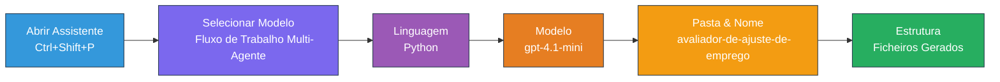
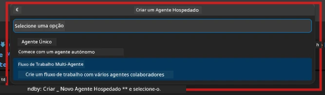

# Module 2 - Estruturar o Projeto Multi-Agente

Neste módulo, você usa a [extensão Microsoft Foundry](https://marketplace.visualstudio.com/items?itemName=TeamsDevApp.vscode-ai-foundry) para **estruturar um projeto de workflow multi-agente**. A extensão gera toda a estrutura do projeto - `agent.yaml`, `main.py`, `Dockerfile`, `requirements.txt`, `.env` e configuração de debug. Você personaliza esses arquivos nos Módulos 3 e 4.

> **Nota:** A pasta `PersonalCareerCopilot/` neste laboratório é um exemplo completo e funcional de um projeto multi-agente personalizado. Você pode estruturar um projeto novo (recomendado para aprendizagem) ou estudar o código existente diretamente.

---

## Passo 1: Abrir o assistente Create Hosted Agent


1. Pressione `Ctrl+Shift+P` para abrir a **Paleta de Comandos**.
2. Digite: **Microsoft Foundry: Create a New Hosted Agent** e selecione essa opção.
3. O assistente de criação do agente hospedado será aberto.

> **Alternativa:** Clique no ícone **Microsoft Foundry** na Barra de Atividades → clique no ícone **+** ao lado de **Agents** → **Create New Hosted Agent**.

---

## Passo 2: Escolher o modelo Multi-Agent Workflow

O assistente solicita que escolha um modelo:

| Modelo | Descrição | Quando usar |
|--------|-----------|-------------|
| Single Agent | Um agente com instruções e ferramentas opcionais | Laboratório 01 |
| **Multi-Agent Workflow** | Múltiplos agentes que colaboram via WorkflowBuilder | **Este laboratório (Lab 02)** |

1. Selecione **Multi-Agent Workflow**.
2. Clique em **Next**.



---

## Passo 3: Escolher linguagem de programação

1. Selecione **Python**.
2. Clique em **Next**.

---

## Passo 4: Selecionar o seu modelo

1. O assistente mostra os modelos implantados no seu projeto Foundry.
2. Selecione o mesmo modelo que usou no Lab 01 (ex: **gpt-4.1-mini**).
3. Clique em **Next**.

> **Dica:** [`gpt-4.1-mini`](https://learn.microsoft.com/azure/foundry/foundry-models/concepts/models-sold-directly-by-azure#gpt-41-series) é recomendado para desenvolvimento - é rápido, barato e lida bem com workflows multi-agentes. Mude para `gpt-4.1` para implantação final em produção se quiser uma saída de maior qualidade.

---

## Passo 5: Escolher a pasta de destino e nome do agente

1. Uma caixa de diálogo é aberta. Escolha uma pasta de destino:
   - Se estiver a acompanhar o repositório do workshop: navegue até `workshop/lab02-multi-agent/` e crie uma nova subpasta
   - Se estiver a começar do zero: escolha qualquer pasta
2. Insira um **nome** para o agente hospedado (ex: `resume-job-fit-evaluator`).
3. Clique em **Create**.

---

## Passo 6: Aguardar a conclusão da estruturação

1. O VS Code abre uma nova janela (ou atualiza a janela atual) com o projeto estruturado.
2. Você deve ver esta estrutura de arquivos:

```
resume-job-fit-evaluator/
├── .env                ← Environment variables (placeholders)
├── .vscode/
│   └── launch.json     ← Debug configuration
├── agent.yaml          ← Agent definition (kind: hosted)
├── Dockerfile          ← Container configuration
├── main.py             ← Multi-agent workflow code (scaffold)
└── requirements.txt    ← Python dependencies
```

> **Nota do workshop:** No repositório do workshop, a pasta `.vscode/` está na **raiz do workspace** com `launch.json` e `tasks.json` partilhados. As configurações de debug para o Lab 01 e Lab 02 estão incluídas. Quando pressiona F5, selecione **"Lab02 - Multi-Agent"** no menu suspenso.

---

## Passo 7: Entender os arquivos estruturados (especificidades multi-agente)

O scaffold multi-agente difere do scaffold single-agent em vários aspetos:

### 7.1 `agent.yaml` - Definição do agente

```yaml
kind: hosted
name: resume-job-fit-evaluator
description: >
  A multi-agent workflow that evaluates resume-to-job fit.
metadata:
  authors:
    - Microsoft
  tags:
    - Multi-Agent Workflow
    - Resume Evaluator
protocols:
  - protocol: responses
    version: v1
environment_variables:
  - name: PROJECT_ENDPOINT
    value: ${PROJECT_ENDPOINT}
  - name: MODEL_DEPLOYMENT_NAME
    value: ${MODEL_DEPLOYMENT_NAME}
```

**Diferença chave do Lab 01:** A secção `environment_variables` pode incluir variáveis adicionais para endpoints MCP ou outra configuração de ferramentas. O `name` e `description` refletem o caso de uso multi-agente.

### 7.2 `main.py` - Código do workflow multi-agente

O scaffold inclui:
- **Instruções para múltiplos agentes** (uma constante por agente)
- **Múltiplos gerenciadores de contexto [`AzureAIAgentClient.as_agent()`](https://learn.microsoft.com/python/api/overview/azure/ai-agents-readme)** (um por agente)
- **[`WorkflowBuilder`](https://learn.microsoft.com/agent-framework/workflows/agents-in-workflows)** para ligar os agentes entre si
- **`from_agent_framework()`** para expor o workflow como um endpoint HTTP

```python
from agent_framework import WorkflowBuilder, tool
from agent_framework.azure import AzureAIAgentClient
from azure.ai.agentserver.agentframework import from_agent_framework
```

A importação extra [`WorkflowBuilder`](https://learn.microsoft.com/agent-framework/workflows/agents-in-workflows) é nova em comparação ao Lab 01.

### 7.3 `requirements.txt` - Dependências adicionais

O projeto multi-agente usa os mesmos pacotes base do Lab 01, mais quaisquer pacotes relacionados ao MCP:

```
agent-framework-azure-ai==1.0.0rc3
agent-framework-core==1.0.0rc3
azure-ai-agentserver-agentframework==1.0.0b16
azure-ai-agentserver-core==1.0.0b16
debugpy
agent-dev-cli --pre
```

> **Nota importante sobre versões:** O pacote `agent-dev-cli` requer a flag `--pre` em `requirements.txt` para instalar a versão preview mais recente. Isso é necessário para compatibilidade do Agent Inspector com `agent-framework-core==1.0.0rc3`. Veja [Module 8 - Troubleshooting](08-troubleshooting.md) para detalhes sobre versões.

| Pacote | Versão | Propósito |
|--------|--------|-----------|
| [`agent-framework-azure-ai`](https://learn.microsoft.com/agent-framework/overview/) | `1.0.0rc3` | Integração Azure AI para o [Microsoft Agent Framework](https://github.com/microsoft/agent-framework) |
| [`agent-framework-core`](https://learn.microsoft.com/agent-framework/overview/) | `1.0.0rc3` | Runtime núcleo (inclui WorkflowBuilder) |
| `azure-ai-agentserver-agentframework` | `1.0.0b16` | Runtime do servidor para agente hospedado |
| `azure-ai-agentserver-core` | `1.0.0b16` | Abstrações do servidor core para agente |
| `debugpy` | última | Debug Python (F5 no VS Code) |
| `agent-dev-cli` | `--pre` | CLI local para desenvolvimento + backend do Agent Inspector |

### 7.4 `Dockerfile` - Igual ao Lab 01

O Dockerfile é idêntico ao do Lab 01 - copia os arquivos, instala dependências de `requirements.txt`, expõe a porta 8088 e executa `python main.py`.

```dockerfile
FROM python:3.14-slim
WORKDIR /app
COPY ./ .
RUN pip install --upgrade pip && \
    if [ -f requirements.txt ]; then \
        pip install -r requirements.txt; \
    else \
      echo "No requirements.txt found" >&2; exit 1; \
    fi
EXPOSE 8088
CMD ["python", "main.py"]
```

---

### Ponto de Verificação

- [ ] Assistente de scaffold terminado → a nova estrutura do projeto está visível
- [ ] Você vê todos os arquivos: `agent.yaml`, `main.py`, `Dockerfile`, `requirements.txt`, `.env`
- [ ] `main.py` inclui a importação `WorkflowBuilder` (confirma que o template multi-agente foi selecionado)
- [ ] `requirements.txt` inclui tanto `agent-framework-core` quanto `agent-framework-azure-ai`
- [ ] Você compreende como o scaffold multi-agente difere do scaffold single-agent (múltiplos agentes, WorkflowBuilder, ferramentas MCP)

---

**Anterior:** [01 - Entender a Arquitetura Multi-Agente](01-understand-multi-agent.md) · **Próximo:** [03 - Configurar Agentes & Ambiente →](03-configure-agents.md)

---

<!-- CO-OP TRANSLATOR DISCLAIMER START -->
**Aviso Legal**:
Este documento foi traduzido utilizando o serviço de tradução automática [Co-op Translator](https://github.com/Azure/co-op-translator). Embora nos esforcemos pela precisão, esteja ciente de que as traduções automáticas podem conter erros ou imprecisões. O documento original na sua língua nativa deve ser considerado a fonte autorizada. Para informações críticas, recomenda-se a tradução profissional por humanos. Não nos responsabilizamos por quaisquer mal-entendidos ou interpretações erradas decorrentes do uso desta tradução.
<!-- CO-OP TRANSLATOR DISCLAIMER END -->