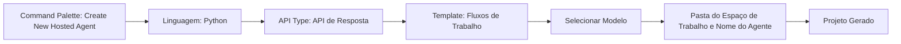
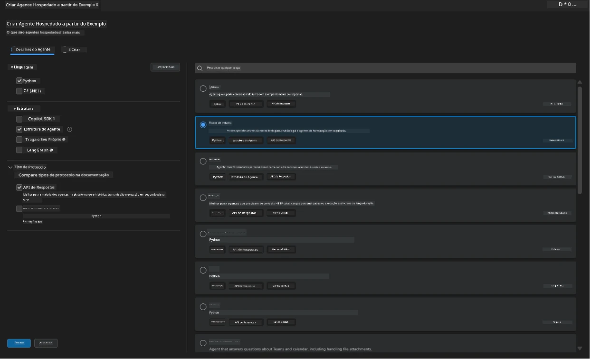
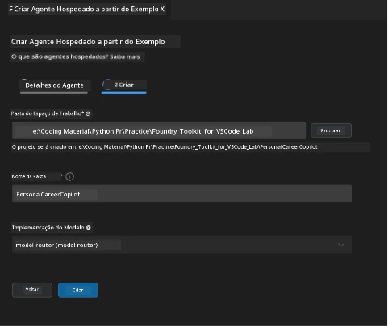

# Módulo 2 - Estruturar o Projeto Multi-Agente

⏱️ ~5 min

Neste módulo, você usa [Foundry Toolkit para VS Code](https://aka.ms/foundrytk) para **estruturar um projeto multi-agente**. O assistente gera `agent.yaml`, `main.py`, `Dockerfile`, `requirements.txt`, `.env` e configuração de debug para VS Code - para que você possa se concentrar em conectar o fluxo de trabalho com 4 agentes no Módulo 3.

> **Conceito chave:** A estrutura é um esqueleto funcional com um agente. Você substitui a lógica temporária pelo grafo do `WorkflowBuilder` no Módulo 3. Você não precisa escrever o código-base do zero.

> **Implementação de referência:** [`PersonalCareerCopilot/`](../../../../../workshop/lab02-multi-agent/PersonalCareerCopilot) é um exemplo funcional completo. Use-o para comparar seu progresso.

### Fluxo do assistente de estruturação


```mermaid
flowchart LR
    A[Command Palette: Create New Hosted Agent] --> B[Linguagem: Python]
    B --> C[API Type: API de Resposta]
    C --> D[Template: Fluxos de Trabalho]
    D --> E[Selecionar Modelo]
    E --> F[Pasta do Espaço de Trabalho e Nome do Agente]
    F --> G[Projeto Gerado]
```

---

## Passo 1: Abrir o assistente Criar Agente Hospedado

1. Pressione `Ctrl+Shift+P` para abrir a **Paleta de Comandos**.
2. Digite: **Foundry Toolkit: Create a New Hosted Agent** e selecione-o.
3. O assistente abre na aba **Detalhes do Agente**.

> **Alternativa:** Clique no ícone **Foundry Toolkit** na Barra de Atividades → clique no ícone **+** ao lado de **Agentes Hospedados** → **Criar Novo Agente Hospedado**.

---

## Passo 2: Escolher configurações



1. Na seção de navegação/opções à esquerda, selecione o seguinte:

| Menu | Seleção | Notas |
|--------|-----------|-------|
| **Linguagem** | Python | C# (.NET) também suportado |
| **Framework** | Agent Framework | Fornece `Agent`, `AgentExecutor`, `WorkflowBuilder` |
| **Tipo de API** | Response API | `POST /responses` - histórico gerido pela plataforma, suporte a streaming |
| **Template** | **Workflows** | Processa pedidos através de múltiplos agentes em sequência |

2. Depois de selecionar, clique em **Avançar**



3. Na próxima janela, selecione o seguinte:

| Menu | Seleção | Notas |
|--------|-----------|-------|
| **Pasta do Espaço de Trabalho** | Navegue até a pasta alvo | ex: `workshop/lab02-multi-agent/` neste repositório |
| **Nome do Agente** | `PersonalCareerCopilot` | Este será o nome da pasta do projeto |
| **Modelo Implementado** | Selecione o modelo que implementou | ex: `gpt-4.1-mini` do Lab 01 |

4. Clique em **Criar** para estruturar o projeto. O VS Code gera os ficheiros e abre a pasta.

> **Dica:** [`gpt-4.1-mini`](https://learn.microsoft.com/azure/foundry/foundry-models/concepts/models-sold-directly-by-azure#gpt-41-series) tem um bom equilíbrio entre velocidade e qualidade para desenvolvimento multi-agente.

---

## Passo 3: Inspecionar o projeto gerado

Após concluir a estruturação, verifique se estes ficheiros aparecem no Explorador (`Ctrl+Shift+E`):

```
📂 <your-agent-name>/
├── .azdignore          ← Files excluded from Azure Developer CLI deployments
├── .dockerignore       ← Files excluded from Docker builds
├── .env                ← Environment variables (placeholders - fill in Module 3)
├── .vscode/
│   ├── launch.json     ← Debug config (F5 → run + Agent Inspector)
│   └── tasks.json      ← VS Code task definitions
├── agent.yaml          ← Agent definition (kind: hosted, protocol: responses)
├── Dockerfile          ← Container config for deployment
├── main.py             ← Stub agent entry point (replace with WorkflowBuilder in Module 3)
└── requirements.txt    ← Python dependencies
```

> **Importante:** Abra esta pasta estruturada diretamente no VS Code para que `.vscode/launch.json` e `tasks.json` sejam aplicados corretamente para debug com F5.

### Explicação dos ficheiros principais

| Ficheiro | Propósito |
|------|---------|
| `agent.yaml` | Declara `kind: hosted`, mapeia variáveis de ambiente, define o protocolo `/responses` |
| `main.py` | Esqueleto: um `FoundryChatClient` → `Agent` → `ResponsesHostServer`. Você substituirá por 4 agentes + `WorkflowBuilder` no Módulo 3 |
| `Dockerfile` | `python:3.12-slim`, instala `requirements.txt`, expõe porta 8088, executa `python main.py` |
| `requirements.txt` | `agent-framework-foundry`, `agent-framework-foundry-hosting`, `mcp<2,>=1.24.0`, `debugpy` |

> **Referência:** Veja [`PersonalCareerCopilot/agent.yaml`](../../../../../workshop/lab02-multi-agent/PersonalCareerCopilot/agent.yaml) e [`PersonalCareerCopilot/requirements.txt`](../../../../../workshop/lab02-multi-agent/PersonalCareerCopilot/requirements.txt) para o conteúdo gerado completo.

---

### ✅ Ponto de verificação

- [ ] Assistente de estruturação concluído - nova pasta do projeto visível no Explorador
- [ ] Todos os ficheiros esperados presentes: `agent.yaml`, `main.py`, `Dockerfile`, `requirements.txt`, `.env`
- [ ] `agent.yaml` mostra `kind: hosted` e `protocol: responses`
- [ ] `main.py` importa `Agent`, `FoundryChatClient`, `ResponsesHostServer`
- [ ] Pasta estruturada aberta como raiz do espaço de trabalho no VS Code
- [ ] Você entende que `main.py` é um esqueleto - `WorkflowBuilder` será adicionado no Módulo 3

---

**Anterior:** [01 - Entender Arquitetura Multi-Agente](01-understand-multi-agent.md) · **Seguinte:** [03 - Configurar Agentes e Ambiente →](03-configure-agents.md)

---

<!-- CO-OP TRANSLATOR DISCLAIMER START -->
**Aviso Legal**:
Este documento foi traduzido utilizando o serviço de tradução automática [Co-op Translator](https://github.com/Azure/co-op-translator). Embora nos esforcemos pela precisão, esteja ciente de que traduções automáticas podem conter erros ou imprecisões. O documento original na sua língua nativa deve ser considerado a fonte autorizada. Para informações críticas, recomenda-se tradução profissional humana. Não nos responsabilizamos por quaisquer mal-entendidos ou interpretações incorretas resultantes da utilização desta tradução.
<!-- CO-OP TRANSLATOR DISCLAIMER END -->