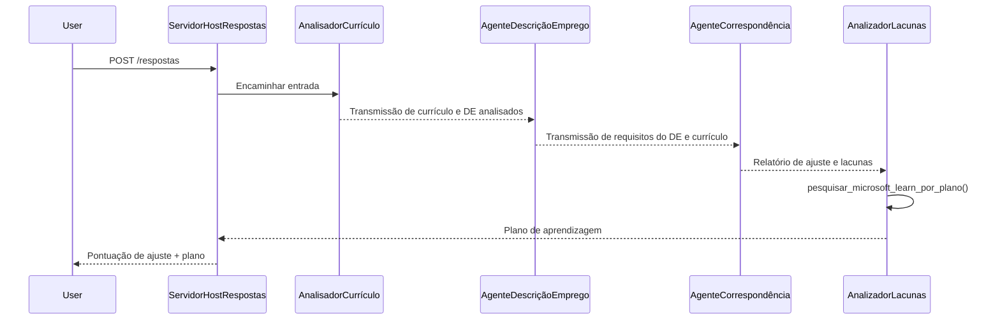

# Módulo 3 - Configurar Instruções, Ambiente e Instalar Dependências

⏱️ ~15 min

Neste módulo, transforma o esqueleto esboçado em **seu** fluxo de trabalho multi-agente - configurando variáveis de ambiente, escrevendo instruções para agentes, adicionando a ferramenta MCP, ligando o grafo do fluxo de trabalho e instalando dependências.

> **Referência:** O código funcional completo está em [`PersonalCareerCopilot/main.py`](../../../../../workshop/lab02-multi-agent/PersonalCareerCopilot/main.py). Use-o como referência ao construir seu próprio grafo de fluxo de trabalho e blocos de prompts.

---

## Como os quatro agentes se encaixam



---

## Passo 1: Configurar variáveis de ambiente

1. Abra o ficheiro **`.env`** na raiz do seu projeto (criado pelo assistente de scaffold).
2. Substitua os espaços reservados pelos seus valores reais do Laboratório 01.

<details open>
<summary><strong>🅰️ Caminho A - Subscrição Foundry</strong></summary>

```env
FOUNDRY_PROJECT_ENDPOINT=https://<your-account>.services.ai.azure.com/api/projects/<your-project>
AZURE_AI_MODEL_DEPLOYMENT_NAME=gpt-4.1-mini
```

> **Onde encontrar valores:** Veja [Laboratório 01, Módulo 1](../../lab01-single-agent/docs/01-setup.md#deploy-a-model--assign-rbac).

</details>

<details open>
<summary><strong>🅱️ Caminho B - Foundry Local</strong></summary>

```env
FOUNDRY_PROJECT_ENDPOINT=http://localhost:5273/v1
AZURE_AI_MODEL_DEPLOYMENT_NAME=phi-4-mini
```

> Toda a inferência é feita na sua máquina - nenhum dado sai do seu dispositivo. Execute `foundry model list` para confirmar o alias exato do modelo. A única requisição externa é a chamada da ferramenta MCP para `https://learn.microsoft.com/api/mcp`.

> **Onde encontrar valores:** Veja [Laboratório 01, Módulo 1 - caminho local](../../lab01-single-agent/docs/01-setup.md#step-2-set-up-based-on-your-access).

</details>

> **Segurança:** Nunca faça commit do `.env` para controlo de versão. Ele deve estar já incluído no `.gitignore`.

---

## Passo 2: Escrever instruções para agentes

As instruções definem o papel de cada agente, formato de saída e regras. Abra `main.py` e defina (ou substitua) as quatro constantes de instrução - as strings completas estão em [`PersonalCareerCopilot/main.py`](../../../../../workshop/lab02-multi-agent/PersonalCareerCopilot/main.py).

### 2.1 `RESUME_PARSER_INSTRUCTIONS`
Analisa o currículo para um perfil estruturado do candidato **e** copia a descrição da vaga literalmente para `[JOB DESCRIPTION PASS-THROUGH]`. Ambas as secções com etiqueta devem aparecer na saída.

> **Por que passar adiante?** Com `context_mode="last_agent"`, ResumeParser é o **único** agente que vê a mensagem original do utilizador. Se não copiar a descrição da vaga para frente, os agentes posteriores nunca a verão.

### 2.2 `JOB_DESCRIPTION_INSTRUCTIONS`
Lê `[PARSED RESUME]` e `[JOB DESCRIPTION PASS-THROUGH]` a partir da saída do ResumeParser. Produz `[JD REQUIREMENTS]` (requisitos estruturados) e `[PARSED RESUME PASS-THROUGH]` (cópia literal do currículo para MatchingAgent).

### 2.3 `MATCHING_AGENT_INSTRUCTIONS`
Lê `[JD REQUIREMENTS]` e `[PARSED RESUME PASS-THROUGH]`. Produz um relatório de compatibilidade pontuado (0–100) com cálculos detalhados, competências correspondentes, competências em falta e alinhamento de experiência.

### 2.4 `GAP_ANALYZER_INSTRUCTIONS`
Lê o relatório de compatibilidade. Para **cada** competência em falta, chama `search_microsoft_learn_for_plan` para obter recursos Microsoft Learn. Produz um cartão detalhado do gap por competência e um roteiro de aprendizagem semana a semana.

---

## Passo 3: Adicionar a ferramenta MCP

O GapAnalyzer chama o [servidor MCP da Microsoft Learn](https://learn.microsoft.com/azure/foundry/agents/how-to/tools/model-context-protocol) para obter recursos reais de aprendizagem para cada lacuna de competência. A função completa `search_microsoft_learn_for_plan` está em [`PersonalCareerCopilot/main.py`](../../../../../workshop/lab02-multi-agent/PersonalCareerCopilot/main.py).

Registe a ferramenta no GapAnalyzer ao criar o agente:

```python
gap_analyzer = Agent(
    client=client,
    instructions=GAP_ANALYZER_INSTRUCTIONS,
    name="GapAnalyzer",
    tools=[search_microsoft_learn_for_plan],
)
```

> Veja [`PersonalCareerCopilot/main.py`](../../../../../workshop/lab02-multi-agent/PersonalCareerCopilot/main.py) para o grafo completo `WorkflowBuilder` com `FoundryChatClient`, `AgentExecutor` e todas as chamadas `add_edge()`.

---

## Passo 4: Criar ambiente virtual e instalar dependências

> ⚠️ **Não salte este passo.** Sem as dependências instaladas, a depuração com F5 falhará.

### 4.1 Criar ambiente virtual

```powershell
python -m venv .venv
```

### 4.2 Ativá-lo

| SO | Comando |
|----|---------|
| **Windows (PowerShell)** | `.\.venv\Scripts\Activate.ps1` |
| **Windows (CMD)** | `.venv\Scripts\activate.bat` |
| **macOS / Linux** | `source .venv/bin/activate` |

Deve ver `(.venv)` no seu prompt do terminal.

### 4.3 Instalar dependências

```powershell
pip install -r requirements.txt
```

### 4.4 Verificar

```powershell
pip list | Select-String "agent-framework|mcp|debugpy"
```

Esperado: `agent-framework-foundry`, `agent-framework-foundry-hosting`, `mcp` e `debugpy` estão listados.

---

## Passo 5: Verificar autenticação

<details open>
<summary><strong>🅰️ Caminho A - Credencial Azure</strong></summary>

```powershell
az account show --query "{name:name, id:id}" --output table
```

Se falhar, execute [`az login`](https://learn.microsoft.com/cli/azure/authenticate-azure-cli-interactively).

Os quatro agentes partilham um `FoundryChatClient` e uma `DefaultAzureCredential`. Se a autenticação funcionar para um, funciona para todos.

</details>

<details open>
<summary><strong>🅱️ Caminho B - Foundry Local</strong></summary>

Nenhuma autenticação é necessária para testes locais.

</details>

---

### ✅ Ponto de verificação

> Não avance para o Módulo 04 até: **(1)** `(.venv)` estar visível no seu prompt E **(2)** `pip install -r requirements.txt` ter sido concluído com sucesso.

- [ ] `.env` tem endpoint válido e nome do deployment do modelo (não placeholders)
- [ ] Todas as 4 constantes de instrução para agentes definidas em `main.py` (ResumeParser, JD Agent, MatchingAgent, GapAnalyzer)
- [ ] Ferramenta MCP `search_microsoft_learn_for_plan` definida e registada no GapAnalyzer
- [ ] Objetos `FoundryChatClient` + 4 `Agent` + 4 `AgentExecutor` criados em `main()`
- [ ] `WorkflowBuilder` constrói o grafo correto sequencial com todas as 3 chamadas `add_edge()`
- [ ] Ambiente virtual criado e ativado (`(.venv)` visível no prompt)
- [ ] `pip install -r requirements.txt` concluído sem erros
- [ ] **Caminho A:** `az account show` é bem sucedido OU o ícone de Contas do VS Code mostra conta autenticada

---

**Anterior:** [02 - Scaffold Multi-Agent Project](02-scaffold-multi-agent.md) · **Seguinte:** [04 - Orchestration Patterns →](04-orchestration-patterns.md)

---

<!-- CO-OP TRANSLATOR DISCLAIMER START -->
**Aviso Legal**:
Este documento foi traduzido utilizando o serviço de tradução automática [Co-op Translator](https://github.com/Azure/co-op-translator). Embora nos esforcemos pela precisão, esteja ciente de que traduções automáticas podem conter erros ou imprecisões. O documento original na sua língua nativa deve ser considerado a fonte autorizada. Para informações críticas, recomenda-se tradução profissional humana. Não nos responsabilizamos por quaisquer mal-entendidos ou interpretações incorretas resultantes da utilização desta tradução.
<!-- CO-OP TRANSLATOR DISCLAIMER END -->