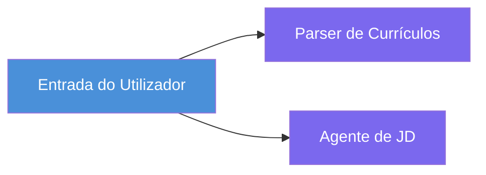
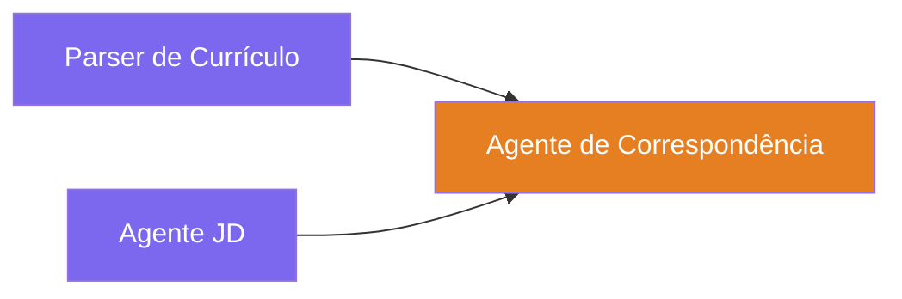
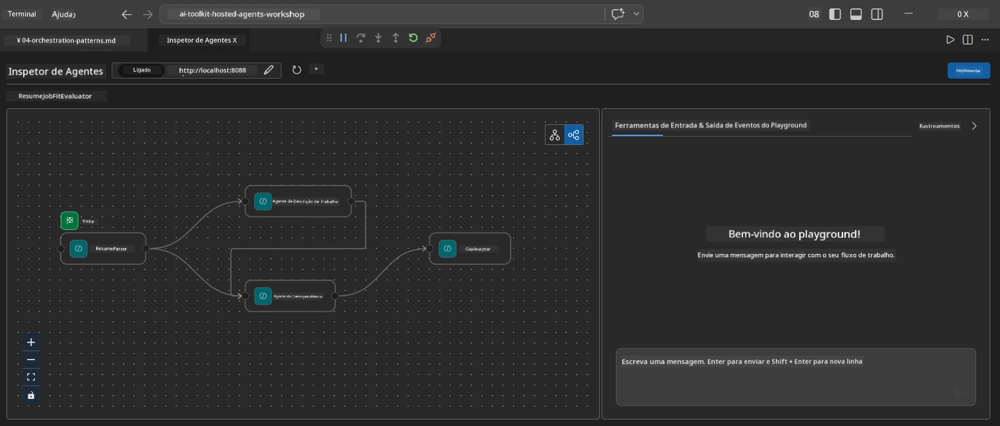
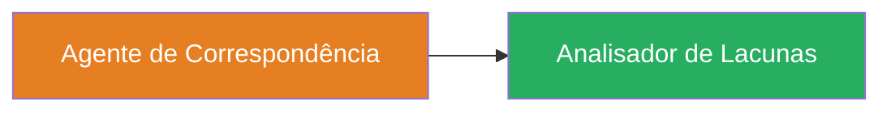
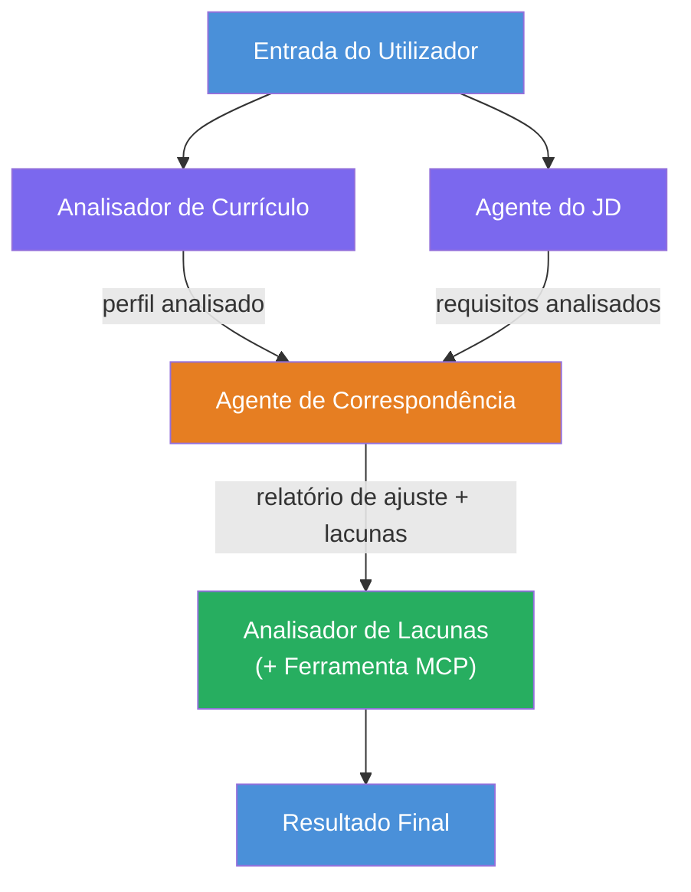
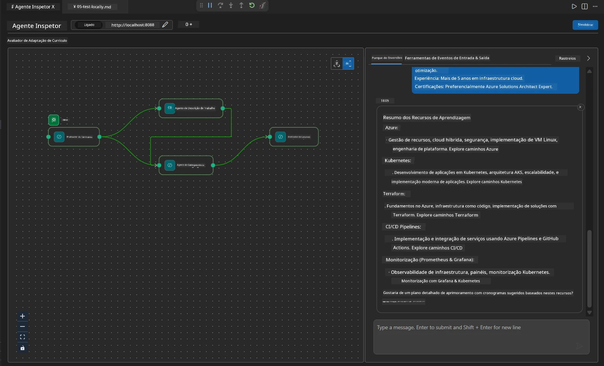

# Módulo 4 - Padrões de Orquestração

Neste módulo, explora os padrões de orquestração usados no Avaliador de Adequação de Currículo e aprende a ler, modificar e expandir o grafo do fluxo de trabalho. Compreender estes padrões é essencial para corrigir problemas no fluxo de dados e construir os seus próprios [fluxos de trabalho multiagente](https://learn.microsoft.com/agent-framework/workflows/).

---

## Padrão 1: Fan-out (divisão paralela)

O primeiro padrão no fluxo de trabalho é o **fan-out** - uma única entrada é enviada simultaneamente para vários agentes.


No código, isto acontece porque `resume_parser` é o `start_executor` - recebe primeiro a mensagem do utilizador. Depois, porque tanto `jd_agent` como `matching_agent` têm ligações a partir de `resume_parser`, o framework encaminha a saída de `resume_parser` para ambos os agentes:

```python
.add_edge(resume_parser, jd_agent)         # Saída do ResumeParser → Agente JD
.add_edge(resume_parser, matching_agent)   # Saída do ResumeParser → Agente de Correspondência
```

**Porquê que isto funciona:** ResumeParser e JD Agent processam aspetos diferentes da mesma entrada. Executá-los em paralelo reduz a latência total comparado com executá-los sequencialmente.

### Quando usar fan-out

| Caso de uso | Exemplo |
|------------|---------|
| Subtarefas independentes | Analisar currículo vs. analisar JD |
| Redundância / votação | Dois agentes analisam os mesmos dados, um terceiro escolhe a melhor resposta |
| Saída multi-formato | Um agente gera texto, outro gera JSON estruturado |

---

## Padrão 2: Fan-in (agregação)

O segundo padrão é o **fan-in** - várias saídas de agentes são recolhidas e enviadas para um único agente a jusante.


No código:

```python
.add_edge(resume_parser, matching_agent)   # Saída do ResumeParser → MatchingAgent
.add_edge(jd_agent, matching_agent)        # Saída do Agente JD → MatchingAgent
```

**Comportamento chave:** Quando um agente tem **duas ou mais ligações de entrada**, o framework espera automaticamente que **todos** os agentes a montante terminem antes de executar o agente a jusante. MatchingAgent só começa quando tanto ResumeParser como JD Agent terminam.

### O que MatchingAgent recebe

O framework concatena as saídas de todos os agentes a montante. A entrada do MatchingAgent parece:

```
[ResumeParser output]
---
Candidate Profile:
  Name: Jane Doe
  Technical Skills: Python, Azure, Kubernetes, ...
  ...

[JobDescriptionAgent output]
---
Role Overview: Senior Cloud Engineer
Required Skills: Python, Azure, Terraform, ...
...
```

> **Nota:** O formato exato da concatenação depende da versão do framework. As instruções do agente devem ser escritas para lidar tanto com saída estruturada como não estruturada a montante.



---

## Padrão 3: Cadeia sequencial

O terceiro padrão é o **encadeamento sequencial** - a saída de um agente alimenta diretamente o próximo.


No código:

```python
.add_edge(matching_agent, gap_analyzer)    # Saída do MatchingAgent → GapAnalyzer
```

Este é o padrão mais simples. GapAnalyzer recebe a pontuação de adequação do MatchingAgent, competências coincidentes/faltantes, e lacunas. Depois, chama a [ferramenta MCP](https://learn.microsoft.com/azure/foundry/agents/how-to/tools/model-context-protocol) para cada lacuna para obter recursos Microsoft Learn.

---

## O grafo completo

Combinar os três padrões produz o fluxo de trabalho completo:


### Linha temporal de execução

```mermaid
gantt
    title Linha Temporal de Execução do Agente
    dateFormat X
    axisFormat %s

    section Paralelo
    Resume Parser       :rp, 0, 3
    JD Agent            :jd, 0, 2

    section Sequencial
    Matching Agent      :ma, 3, 5
    Gap Analyzer        :ga, 5, 9
```


> O tempo total de relógio é aproximadamente `max(ResumeParser, JD Agent) + MatchingAgent + GapAnalyzer`. GapAnalyzer é tipicamente o mais lento porque faz várias chamadas à ferramenta MCP (uma por lacuna).

---

## Ler o código do WorkflowBuilder

Aqui está a função `create_workflow()` completa de `main.py`, anotada:

```python
def create_workflow(resume_parser, jd_agent, matching_agent, gap_analyzer):
    workflow = (
        WorkflowBuilder(
            name="ResumeJobFitEvaluator",

            # O primeiro agente a receber a entrada do utilizador
            start_executor=resume_parser,

            # O(s) agente(s) cujo output se torna a resposta final
            output_executors=[gap_analyzer],
        )
        # Expansão: A saída do ResumeParser vai para o agente de JD e para o MatchingAgent
        .add_edge(resume_parser, jd_agent)
        .add_edge(resume_parser, matching_agent)

        # Consolidação: O MatchingAgent espera por ambos ResumeParser e agente de JD
        .add_edge(jd_agent, matching_agent)

        # Sequencial: A saída do MatchingAgent alimenta o GapAnalyzer
        .add_edge(matching_agent, gap_analyzer)

        .build()
    )
    return workflow.as_agent()
```

### Tabela resumo das ligações

| # | Ligação | Padrão | Efeito |
|---|---------|--------|--------|
| 1 | `resume_parser → jd_agent` | Fan-out | JD Agent recebe a saída do ResumeParser (mais a entrada original do utilizador) |
| 2 | `resume_parser → matching_agent` | Fan-out | MatchingAgent recebe a saída do ResumeParser |
| 3 | `jd_agent → matching_agent` | Fan-in | MatchingAgent também recebe a saída do JD Agent (espera por ambos) |
| 4 | `matching_agent → gap_analyzer` | Sequencial | GapAnalyzer recebe relatório de adequação + lista de lacunas |

---

## Modificar o grafo

### Adicionar um novo agente

Para adicionar um quinto agente (p.ex., um **InterviewPrepAgent** que gera perguntas de entrevista com base na análise de lacunas):

```python
# 1. Definir instruções
INTERVIEW_PREP_INSTRUCTIONS = """\
You are the Interview Prep Agent.
Given a gap analysis and fit report, generate 10 targeted interview questions
the candidate should prepare for.
"""

# 2. Criar o agente (dentro do bloco async with)
AzureAIAgentClient(
    project_endpoint=PROJECT_ENDPOINT,
    model_deployment_name=MODEL_DEPLOYMENT_NAME,
    credential=credential,
).as_agent(
    name="InterviewPrepAgent",
    instructions=INTERVIEW_PREP_INSTRUCTIONS,
) as interview_prep,

# 3. Adicionar arestas em create_workflow()
.add_edge(matching_agent, interview_prep)   # recebe relatório de ajuste
.add_edge(gap_analyzer, interview_prep)     # também recebe cartões de lacunas

# 4. Atualizar output_executors
output_executors=[interview_prep],  # agora o agente final
```

### Alterar ordem de execução

Para fazer o JD Agent correr **depois** do ResumeParser (sequencial em vez de paralelo):

```python
# Remover: .add_edge(resume_parser, jd_agent) ← já existe, manter
# Remover o paralelismo implícito ao NÃO fazer com que jd_agent receba diretamente a entrada do utilizador
# O start_executor envia para o resume_parser primeiro, e o jd_agent só recebe
# a saída do resume_parser através da ligação. Isto torna-os sequenciais.
```

> **Importante:** O `start_executor` é o único agente que recebe a entrada bruta do utilizador. Todos os outros agentes recebem saída dos seus respetivos agentes a montante. Se quiser que um agente também receba a entrada bruta do utilizador, deve ter uma ligação a partir do `start_executor`.

---

## Erros comuns no grafo

| Erro | Sintoma | Solução |
|-------|---------|---------|
| Ligação ausente a `output_executors` | Agente corre mas saída está vazia | Garantir que existe um caminho do `start_executor` a cada agente em `output_executors` |
| Dependência circular | Loop infinito ou timeout | Verificar que nenhum agente alimenta de volta um agente a montante |
| Agente em `output_executors` sem ligação de entrada | Saída vazia | Adicionar pelo menos uma `add_edge(fonte, esse_agente)` |
| Múltiplos `output_executors` sem fan-in | Saída contém resposta apenas de um agente | Usar um único agente de saída que agregue, ou aceitar várias saídas |
| Ausência do `start_executor` | `ValueError` em tempo de construção | Especificar sempre o `start_executor` em `WorkflowBuilder()` |

---

## Depurar o grafo

### Usar o Agent Inspector

1. Inicie o agente localmente (F5 ou terminal - ver [Módulo 5](05-test-locally.md)).
2. Abra o Agent Inspector (`Ctrl+Shift+P` → **Foundry Toolkit: Open Agent Inspector**).
3. Envie uma mensagem de teste.
4. No painel de resposta do Inspector, procure a **saída em streaming** - mostra cada contribuição do agente em sequência.



### Usar logging

Adicione logging ao `main.py` para rastrear o fluxo de dados:

```python
import logging
logger = logging.getLogger("resume-job-fit")

# Em create_workflow(), depois de construir:
logger.info("Workflow graph built with edges: RP→JD, RP→MA, JD→MA, MA→GA")
```

Os logs do servidor mostram a ordem de execução dos agentes e chamadas à ferramenta MCP:

```
INFO:resume-job-fit:Starting Resume -> Job Fit Evaluator HTTP server...
INFO:resume-job-fit:Server running on http://localhost:8088
INFO:agent_framework:Executing agent: ResumeParser
INFO:agent_framework:Executing agent: JobDescriptionAgent
INFO:agent_framework:Waiting for upstream agents: ResumeParser, JobDescriptionAgent
INFO:agent_framework:Executing agent: MatchingAgent
INFO:agent_framework:Executing agent: GapAnalyzer
INFO:agent_framework:Tool call: search_microsoft_learn_for_plan(skill="Kubernetes")
POST https://learn.microsoft.com/api/mcp → 200
INFO:agent_framework:Tool call: search_microsoft_learn_for_plan(skill="Terraform")
POST https://learn.microsoft.com/api/mcp → 200
```

---

### Ponto de verificação

- [ ] Consegue identificar os três padrões de orquestração no fluxo de trabalho: fan-out, fan-in e cadeia sequencial
- [ ] Compreende que agentes com múltiplas ligações de entrada aguardam que todos os agentes a montante terminem
- [ ] Consegue ler o código do `WorkflowBuilder` e mapear cada chamada `add_edge()` ao grafo visual
- [ ] Compreende a linha temporal de execução: agentes em paralelo correm primeiro, depois agregação, depois sequencial
- [ ] Sabe como adicionar um novo agente ao grafo (definir instruções, criar agente, adicionar ligações, atualizar saída)
- [ ] Consegue identificar erros comuns no grafo e os seus sintomas

---

**Anterior:** [03 - Configurar Agentes & Ambiente](03-configure-agents.md) · **Seguinte:** [05 - Testar Localmente →](05-test-locally.md)

---

<!-- CO-OP TRANSLATOR DISCLAIMER START -->
**Aviso Legal**:
Este documento foi traduzido utilizando o serviço de tradução automática [Co-op Translator](https://github.com/Azure/co-op-translator). Embora nos esforcemos pela precisão, por favor tenha em conta que as traduções automáticas podem conter erros ou imprecisões. O documento original na sua língua nativa deve ser considerado a fonte autoritativa. Para informação crítica, é recomendada a tradução profissional humana. Não nos responsabilizamos por quaisquer mal-entendidos ou interpretações incorretas decorrentes do uso desta tradução.
<!-- CO-OP TRANSLATOR DISCLAIMER END -->