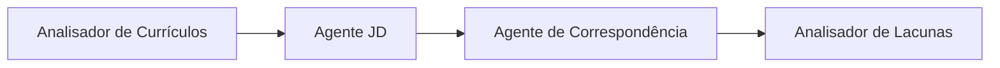
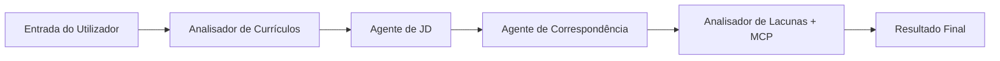

# Módulo 4 - Padrões de Orquestração

⏱️ ~10 min

Neste módulo, irá explorar os padrões de orquestração usados no Avaliador de Adequação do Currículo para o Trabalho e aprenderá a ler, modificar e estender o gráfico do fluxo de trabalho. Compreender estes padrões é essencial para depurar problemas de fluxo de dados e construir os seus próprios [fluxos de trabalho multi-agentes](https://learn.microsoft.com/agent-framework/workflows/).

---

## Padrão 1: Cadeia sequencial

O padrão fundamental no fluxo de trabalho é uma **cadeia sequencial** - a saída de cada agente alimenta diretamente o seguinte.


```mermaid
flowchart LR
    RP[Analisador de Currículos] --> JD[Agente JD]
    JD --> MA[Agente de Correspondência]
    MA --> GA[Analisador de Lacunas]
```

No código, cada chamada `add_edge()` cria um passo na cadeia:

```python
.add_edge(resume_executor, jd_executor)       # Saída do ResumeParser → JD Agent
.add_edge(jd_executor, matching_executor)     # Saída do JD Agent → MatchingAgent
.add_edge(matching_executor, gap_executor)    # Saída do MatchingAgent → GapAnalyzer
```

> **Porquê sequencial, e não branqueamento/concatenação?** `WorkflowBuilder` usa **semântica OR** para arestas de entrada: um executor a jusante dispara assim que **qualquer** predecessor termina. Se `matching_executor` tivesse duas arestas de entrada (tanto de `resume_executor` como de `jd_executor`), seria acionado duas vezes - uma quando o ResumeParser termina e outra quando o JD Agent termina - fazendo com que o GapAnalyzer também corra duas vezes e a saída apareça duplicada. O pipeline sequencial evita isto completamente.

## Padrão 2: Reenvio de conteúdo

Como `context_mode="last_agent"` significa que cada executor vê apenas a saída do seu **predecessor direto**, os agentes numa cadeia sequencial têm de passar explicitamente os dados que os agentes a jusante precisam.

Neste fluxo de trabalho:
- **ResumeParser** copia a descrição do trabalho (JD) literalmente para `[JOB DESCRIPTION PASS-THROUGH]` (para que o JD Agent a possa usar).
- **JD Agent** copia o `[PARSED RESUME]` literalmente para `[PARSED RESUME PASS-THROUGH]` (para que o MatchingAgent possa comparar ambos os perfis).

```
ResumeParser output
└─ [PARSED RESUME]               ← extracted by JD Agent
└─ [JOB DESCRIPTION PASS-THROUGH] ← extracted by JD Agent

JD Agent output
└─ [JD REQUIREMENTS]             ← extracted by MatchingAgent
└─ [PARSED RESUME PASS-THROUGH]  ← extracted by MatchingAgent
```

Cada secção de reenvio deve ser copiada **literalmente** - resumir ou parafrasear quebra o agente a jusante que dela depende.

---

## O gráfico completo

Combinar os padrões de cadeia sequencial e reenvio de conteúdo produz o fluxo de trabalho completo:


```mermaid
flowchart LR
    U[Entrada do Utilizador] --> RP[Analisador de Currículos]
    RP --> JD[Agente de JD]
    JD --> MA[Agente de Correspondência]
    MA --> GA[Analisador de Lacunas + MCP]
    GA --> O[Resultado Final]
```

O Inspector de Agentes mostra esta mesma estrutura gráfica quando o agente está a correr localmente. Consulte [Módulo 5 - Testar Localmente](05-test-locally.md) para capturas de ecrã.

---

## Lendo o código do WorkflowBuilder

A função completa `create_workflow()` encontra-se em [`PersonalCareerCopilot/main.py`](../../../../../workshop/lab02-multi-agent/PersonalCareerCopilot/main.py). As três chamadas `add_edge()` constroem o pipeline sequencial:

| # | Aresta | Efeito |
|---|------|--------|
| 1 | `resume_executor → jd_executor` | O JD Agent recebe `[PARSED RESUME]` + `[JOB DESCRIPTION PASS-THROUGH]` |
| 2 | `jd_executor → matching_executor` | O MatchingAgent recebe `[JD REQUIREMENTS]` + `[PARSED RESUME PASS-THROUGH]` |
| 3 | `matching_executor → gap_executor` | O GapAnalyzer recebe o relatório de adequação + lista de lacunas |

---

## Modificar o gráfico

### Adicionar um novo agente

Para adicionar um quinto agente (ex., um **InterviewPrepAgent** após o GapAnalyzer):

1. Defina uma constante `INTERVIEW_PREP_INSTRUCTIONS`.
2. Crie objetos `Agent` + `AgentExecutor` (mesmo padrão dos quatro existentes).
3. Adicione `.add_edge(gap_executor, interview_exec)` em `WorkflowBuilder`.
4. Atualize `output_executors=[interview_exec]`.

> **Importante:** `start_executor` é o único agente que recebe a entrada bruta do utilizador. Todos os outros agentes recebem a saída da sua aresta a montante.

---

## Erros comuns no gráfico

| Erro | Sintoma | Correção |
|---------|---------|-----|
| Aresta em falta para `output_executors` | O agente corre mas a saída está vazia | Assegurar que existe um caminho de `start_executor` para todos os agentes em `output_executors` |
| Dependência circular | Loop infinito ou timeout | Verificar que nenhum agente alimenta de volta um agente a montante |
| Agente em `output_executors` sem aresta de entrada | Saída vazia | Adicionar pelo menos uma `add_edge(source, that_agent)` |
| Vários `output_executors` sem fan-in | A saída contém apenas a resposta de um agente | Usar um único agente de saída que agregue, ou aceitar múltiplas saídas |
| `start_executor` em falta | `ValueError` em tempo de construção | Sempre especificar `start_executor` em `WorkflowBuilder()` |

---

## Depurar o gráfico

### Usar o Agent Inspector

1. Iniciar o agente localmente com F5.
2. Abrir o Agent Inspector (`Ctrl+Shift+P` → **Foundry Toolkit: Open Agent Inspector**).
3. Enviar uma mensagem de teste.
4. No painel de resposta do Inspector, procurar a **saída em streaming** - mostra a contribuição de cada agente em sequência.


### Usar logging

Adicione logging ao `main.py` para traçar o fluxo de dados:

```python
import logging
logger = logging.getLogger("resume-job-fit")

# Em main(), após construir o fluxo de trabalho:
logger.info("Workflow graph built with edges: RP→JD, JD→MA, MA→GA")
```

Os registos do servidor mostram a ordem de execução dos agentes e as chamadas às ferramentas MCP:

```
INFO:agent_framework:Executing agent: ResumeParser
INFO:agent_framework:Executing agent: JobDescriptionAgent
INFO:agent_framework:Executing agent: MatchingAgent
INFO:agent_framework:Executing agent: GapAnalyzer
INFO:agent_framework:Tool call: search_microsoft_learn_for_plan(skill="Kubernetes")
POST https://learn.microsoft.com/api/mcp → 200
INFO:agent_framework:Tool call: search_microsoft_learn_for_plan(skill="Terraform")
POST https://learn.microsoft.com/api/mcp → 200
```

---

### Marco

- [ ] Conseguir identificar os dois padrões de orquestração no fluxo de trabalho: cadeia sequencial e reenvio de conteúdo
- [ ] Compreender por que `context_mode="last_agent"` requer reenvio explícito de dados entre agentes
- [ ] Conseguir ler o código do `WorkflowBuilder` e mapear cada chamada `add_edge()` para o gráfico visual
- [ ] Saber como adicionar um novo agente ao final do pipeline
- [ ] Conseguir identificar erros comuns no gráfico e os seus sintomas

---

**Anterior:** [03 - Configurar Agentes & Ambiente](03-configure-agents.md) · **Seguinte:** [05 - Testar Localmente →](05-test-locally.md)

---

<!-- CO-OP TRANSLATOR DISCLAIMER START -->
**Aviso Legal**:
Este documento foi traduzido utilizando o serviço de tradução automática [Co-op Translator](https://github.com/Azure/co-op-translator). Embora nos esforcemos pela precisão, esteja ciente de que traduções automáticas podem conter erros ou imprecisões. O documento original na sua língua nativa deve ser considerado a fonte autorizada. Para informações críticas, recomenda-se tradução profissional humana. Não nos responsabilizamos por quaisquer mal-entendidos ou interpretações incorretas resultantes da utilização desta tradução.
<!-- CO-OP TRANSLATOR DISCLAIMER END -->