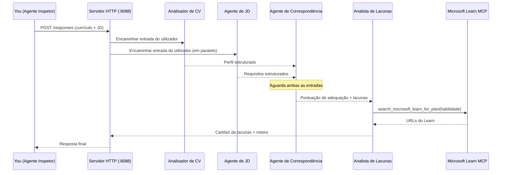
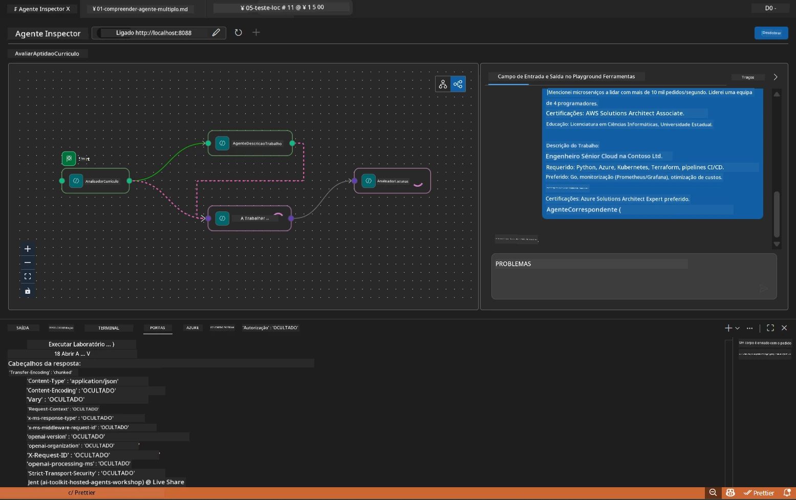

# Módulo 5 - Testar Localmente (Multi-Agente)

Neste módulo, executa o workflow multi-agente localmente, testa-o com o Agent Inspector e verifica se todos os quatro agentes e a ferramenta MCP funcionam corretamente antes de implantar no Foundry.

### O que acontece durante uma execução de teste local


---

## Passo 1: Iniciar o servidor de agentes

### Opção A: Usar a tarefa do VS Code (recomendado)

1. Pressione `Ctrl+Shift+P` → escreva **Tasks: Run Task** → selecione **Run Lab02 HTTP Server**.
2. A tarefa inicia o servidor com debugpy ligado na porta `5679` e o agente na porta `8088`.
3. Aguarde que a saída mostre:

```
INFO:resume-job-fit:Starting Resume -> Job Fit Evaluator HTTP server...
INFO:resume-job-fit:Server running on http://localhost:8088
```

### Opção B: Usar o terminal manualmente

```powershell
cd workshop\lab02-multi-agent\PersonalCareerCopilot
```

Ative o ambiente virtual:

**PowerShell (Windows):**
```powershell
.\.venv\Scripts\Activate.ps1
```

**macOS/Linux:**
```bash
source .venv/bin/activate
```

Inicie o servidor:

```powershell
python -m debugpy --listen 127.0.0.1:5679 -m agentdev run main.py --verbose --port 8088
```

### Opção C: Usar F5 (modo debug)

1. Pressione `F5` ou vá para **Run and Debug** (`Ctrl+Shift+D`).
2. Selecione a configuração de lançamento **Lab02 - Multi-Agent** no menu dropdown.
3. O servidor inicia com suporte total a breakpoints.

> **Dica:** O modo debug permite definir breakpoints dentro de `search_microsoft_learn_for_plan()` para inspeccionar as respostas do MCP, ou dentro das strings de instrução do agente para ver o que cada agente recebe.

---

## Passo 2: Abrir o Agent Inspector

1. Pressione `Ctrl+Shift+P` → escreva **Foundry Toolkit: Open Agent Inspector**.
2. O Agent Inspector abre numa aba do navegador em `http://localhost:5679`.
3. Deve ver a interface do agente pronta para aceitar mensagens.

> **Se o Agent Inspector não abrir:** Verifique se o servidor está totalmente iniciado (vê o log "Server running"). Se a porta 5679 estiver ocupada, consulte [Módulo 8 - Resolução de Problemas](08-troubleshooting.md).

---

## Passo 3: Executar testes básicos

Execute estes três testes por ordem. Cada um testa progressivamente mais do workflow.

### Teste 1: Resumo + descrição de função básicos

Cole o seguinte no Agent Inspector:

```
Resume:
Jane Doe
Senior Software Engineer with 5 years of experience in Python, Django, and AWS.
Built microservices handling 10K+ requests/second. Led a team of 4 developers.
Certifications: AWS Solutions Architect Associate.
Education: B.S. Computer Science, State University.

Job Description:
Senior Cloud Engineer at Contoso Ltd.
Required: Python, Azure, Kubernetes, Terraform, CI/CD pipelines.
Preferred: Go, monitoring (Prometheus/Grafana), cost optimization.
Experience: 5+ years in cloud infrastructure.
Certifications: Azure Solutions Architect Expert preferred.
```

**Estrutura de saída esperada:**

A resposta deve conter a saída de todos os quatro agentes em sequência:

1. **Saída do Resume Parser** - Perfil do candidato estruturado com competências agrupadas por categoria
2. **Saída do JD Agent** - Requisitos estruturados com competências obrigatórias vs. preferidas separadas
3. **Saída do Matching Agent** - Pontuação de compatibilidade (0-100) com detalhe, competências correspondidas, competências em falta, lacunas
4. **Saída do Gap Analyzer** - Cartões individuais para cada competência em falta, cada um com URLs do Microsoft Learn



### O que verificar no Teste 1

| Verificar | Esperado | Passou? |
|-----------|----------|---------|
| Resposta contém pontuação de compatibilidade | Número entre 0-100 com detalhe | |
| Competências correspondidas estão listadas | Python, CI/CD (parcial), etc. | |
| Competências em falta estão listadas | Azure, Kubernetes, Terraform, etc. | |
| Cartões de lacunas existem para cada competência em falta | Um cartão por competência | |
| URLs do Microsoft Learn presentes | Links reais de `learn.microsoft.com` | |
| Nenhuma mensagem de erro na resposta | Saída estruturada limpa | |

### Teste 2: Verificar execução da ferramenta MCP

Enquanto o Teste 1 corre, verifique no **terminal do servidor** as entradas de log do MCP:

```
GET https://learn.microsoft.com/api/mcp → 405 (Method Not Allowed)
POST https://learn.microsoft.com/api/mcp → 200
DELETE https://learn.microsoft.com/api/mcp → 405 (Method Not Allowed)
```

| Entrada de log | Significado | Esperado? |
|---------------|-------------|-----------|
| `GET ... → 405` | O cliente MCP faz sondagens com GET durante a inicialização | Sim - normal |
| `POST ... → 200` | Chamada real da ferramenta ao servidor MCP Microsoft Learn | Sim - esta é a chamada real |
| `DELETE ... → 405` | O cliente MCP faz sondagens com DELETE durante a limpeza | Sim - normal |
| `POST ... → 4xx/5xx` | A chamada da ferramenta falhou | Não - veja [Resolução de Problemas](08-troubleshooting.md) |

> **Ponto chave:** As linhas `GET 405` e `DELETE 405` são **comportamento esperado**. Só se preocupe se as chamadas `POST` retornarem códigos de estado diferentes de 200.

### Teste 3: Caso limite - candidato com alta compatibilidade

Cole um currículo que corresponda muito de perto à descrição de função para verificar se o GapAnalyzer lida com cenários de alta compatibilidade:

```
Resume:
Alex Chen
Senior Cloud Engineer with 7 years of experience.
Skills: Python, Azure (AKS, Functions, DevOps), Kubernetes, Terraform, CI/CD (GitHub Actions, Azure Pipelines), Go, Prometheus, Grafana, cost optimization.
Certifications: Azure Solutions Architect Expert, Azure DevOps Engineer Expert.
Led infrastructure migration to Azure for 3 enterprise clients.
Education: M.S. Computer Science, Tech University.

Job Description:
Senior Cloud Engineer at Contoso Ltd.
Required: Python, Azure, Kubernetes, Terraform, CI/CD pipelines.
Preferred: Go, monitoring (Prometheus/Grafana), cost optimization.
Experience: 5+ years in cloud infrastructure.
Certifications: Azure Solutions Architect Expert preferred.
```

**Comportamento esperado:**
- A pontuação de compatibilidade deve ser **80+** (a maioria das competências correspondem)
- Os cartões de lacunas devem focar em polimento/preparação para entrevista em vez de aprendizagem básica
- As instruções do GapAnalyzer dizem: "Se compatibilidade >= 80, focar em polimento/preparação para entrevista"

---

## Passo 4: Verificar a completude da saída

Após executar os testes, verifique se a saída cumpre estes critérios:

### Lista de verificação da estrutura de saída

| Secção | Agente | Presente? |
|--------|--------|-----------|
| Perfil do Candidato | Resume Parser | |
| Competências Técnicas (agrupadas) | Resume Parser | |
| Visão Geral do Cargo | JD Agent | |
| Competências Obrigatórias vs. Preferidas | JD Agent | |
| Pontuação de Compatibilidade com detalhe | Matching Agent | |
| Competências Correspondidas / Em Falta / Parciais | Matching Agent | |
| Cartão de lacuna por competência em falta | Gap Analyzer | |
| URLs do Microsoft Learn nos cartões de lacunas | Gap Analyzer (MCP) | |
| Ordem de aprendizagem (numerada) | Gap Analyzer | |
| Resumo do cronograma | Gap Analyzer | |

### Problemas comuns nesta fase

| Problema | Causa | Solução |
|----------|-------|---------|
| Só 1 cartão de lacuna (restante truncado) | Instruções do GapAnalyzer sem bloco CRITICAL | Adicione o parágrafo `CRITICAL:` em `GAP_ANALYZER_INSTRUCTIONS` - veja [Módulo 3](03-configure-agents.md) |
| Sem URLs do Microsoft Learn | Ponto final MCP inacessível | Verifique a ligação à internet. Confirme que `MICROSOFT_LEARN_MCP_ENDPOINT` no `.env` é `https://learn.microsoft.com/api/mcp` |
| Resposta vazia | `PROJECT_ENDPOINT` ou `MODEL_DEPLOYMENT_NAME` não configurados | Verifique os valores no ficheiro `.env`. Execute `echo $env:PROJECT_ENDPOINT` no terminal |
| Pontuação de compatibilidade é 0 ou está em falta | MatchingAgent não recebeu dados upstream | Verifique se existem `add_edge(resume_parser, matching_agent)` e `add_edge(jd_agent, matching_agent)` em `create_workflow()` |
| O agente inicia mas sai imediatamente | Erro de importação ou dependência em falta | Execute novamente `pip install -r requirements.txt`. Verifique o terminal para mensagens de erro |
| Erro `validate_configuration` | Variáveis de ambiente em falta | Crie o `.env` com `PROJECT_ENDPOINT=<seu-endpoint>` e `MODEL_DEPLOYMENT_NAME=<seu-modelo>` |

---

## Passo 5: Testar com os seus próprios dados (opcional)

Experimente colar o seu próprio currículo e uma descrição de função real. Isto ajuda a verificar:

- Os agentes suportam diferentes formatos de currículo (cronológico, funcional, híbrido)
- O JD Agent suporta diferentes estilos de descrição de função (listas, parágrafos, estruturados)
- A ferramenta MCP devolve recursos relevantes para competências reais
- Os cartões de lacunas são personalizados para o seu background específico

> **Nota de privacidade:** Ao testar localmente, os seus dados permanecem na sua máquina e são enviados apenas para a sua implementação Azure OpenAI. Não são registados nem armazenados pela infraestrutura do workshop. Pode usar nomes fictícios se preferir (ex., "Jane Doe" em vez do seu nome real).

---

### Ponto de verificação

- [ ] Servidor iniciado com sucesso na porta `8088` (log mostra "Server running")
- [ ] Agent Inspector aberto e conectado ao agente
- [ ] Teste 1: Resposta completa com pontuação, competências correspondidas/em falta, cartões de lacunas e URLs do Microsoft Learn
- [ ] Teste 2: Logs MCP mostram `POST ... → 200` (chamadas à ferramenta bem sucedidas)
- [ ] Teste 3: Candidato com alta compatibilidade obtém pontuação 80+ com recomendações focadas em polimento
- [ ] Todos os cartões de lacunas presentes (um por competência em falta, sem truncamento)
- [ ] Sem erros ou mensagens de stack trace no terminal do servidor

---

**Anterior:** [04 - Padrões de Orquestração](04-orchestration-patterns.md) · **Seguinte:** [06 - Implantar no Foundry →](06-deploy-to-foundry.md)

---

<!-- CO-OP TRANSLATOR DISCLAIMER START -->
**Aviso Legal**:  
Este documento foi traduzido utilizando o serviço de tradução por IA [Co-op Translator](https://github.com/Azure/co-op-translator). Embora nos esforcemos por garantir a precisão, por favor esteja ciente de que traduções automáticas podem conter erros ou imprecisões. O documento original na sua língua nativa deve ser considerado a fonte autoritativa. Para informações críticas, é recomendada a tradução profissional humana. Não nos responsabilizamos por quaisquer mal-entendidos ou interpretações erradas decorrentes do uso desta tradução.
<!-- CO-OP TRANSLATOR DISCLAIMER END -->