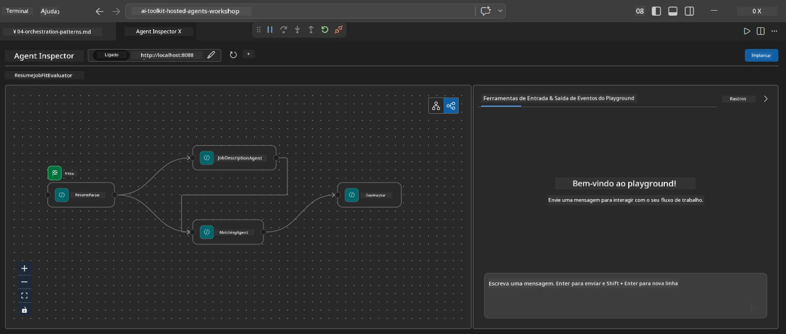
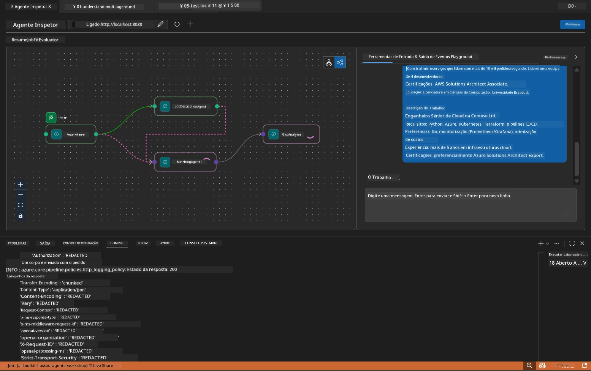
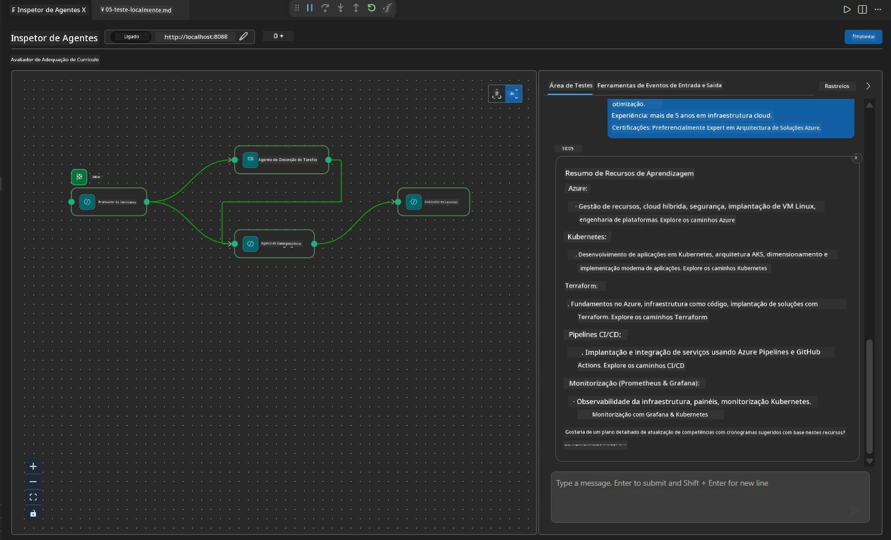

# Módulo 5 - Testar Localmente

⏱️ ~15 min

Neste módulo, irá executar o fluxo de trabalho multi-agente localmente, testá-lo com o Agent Inspector, e verificar se os quatro agentes e a ferramenta MCP funcionam corretamente antes de implantar.

---

## Passo 1: Iniciar o servidor do agente

### Opção A: Usar a tarefa do VS Code (recomendado)

1. Abra `workshop/lab02-multi-agent/PersonalCareerCopilot/` como a sua pasta no VS Code.
2. Pressione `Ctrl+Shift+P` → escreva **Tasks: Run Task** → selecione **Run Agent HTTP Server**.
3. A tarefa inicia o servidor com o debugpy anexado na porta `5679` e o agente na porta `8088`.
4. Aguarde a saída mostrar:

```
INFO:resume-job-fit:Starting Resume -> Job Fit Evaluator HTTP server...
INFO:resume-job-fit:Server running on http://localhost:8088
```

### Opção B: Usar F5 (modo de depuração)

1. Pressione `F5` → selecione **Debug Local Agent HTTP Server**.
2. O servidor inicia com suporte total a breakpoint - útil para inspeccionar respostas MCP ou saídas de agentes.

---

## Passo 2: Abrir o Agent Inspector

1. Pressione `Ctrl+Shift+P` → escreva **Foundry Toolkit: Open Agent Inspector**.
2. O Agent Inspector abre como um painel VS Code conectado a `http://localhost:8088`.
3. Deve ver a interface do agente pronta para aceitar mensagens.



> **Se o Agent Inspector não abrir:** Assegure que o servidor está totalmente iniciado (vê o log "Server running"). Se a porta 5679 estiver ocupada, consulte [Módulo 8 - Resolução de Problemas](08-troubleshooting.md).

---

## Passo 2b: (Opcional) Abrir o Visualizador de Fluxo de Trabalho

O Foundry Toolkit inclui um **Visualizador de Fluxo de Trabalho** em tempo real que mostra como os agentes interagem enquanto o grafo é executado. Isto é especialmente útil para depurar multi-agentes.

1. Pressione `Ctrl+Shift+P` → escreva **Foundry Toolkit: Open Visualizer for Hosted Agents**.
2. Abre uma nova aba no VS Code mostrando o grafo de execução ao vivo.
3. À medida que envia mensagens no Agent Inspector, o visualizador atualiza automaticamente - nós verdes indicam agentes concluídos, e arestas animadas mostram o fluxo de dados entre eles.

> **Conflito de porta:** Se a porta do visualizador já estiver em uso, altere-a nas definições do VS Code → **Extensões** → **Configuração Microsoft Foundry** → **Hosted Agents: Visualizer Port**.

---

## Passo 3: Executar testes rápidos

Execute estes três testes por ordem. Cada um testa progressivamente mais do fluxo de trabalho.

### Teste 1: Currículo básico + descrição de trabalho

Cole o seguinte no Agent Inspector:

```
Resume:
Jane Doe
Senior Software Engineer with 5 years of experience in Python, Django, and AWS.
Built microservices handling 10K+ requests/second. Led a team of 4 developers.
Certifications: AWS Solutions Architect Associate.
Education: B.S. Computer Science, State University.

Job Description:
Senior Cloud Engineer at Contoso Ltd.
Required: Python, Azure, Kubernetes, Terraform, CI/CD pipelines.
Preferred: Go, monitoring (Prometheus/Grafana), cost optimization.
Experience: 5+ years in cloud infrastructure.
Certifications: Azure Solutions Architect Expert preferred.
```

**Estrutura de saída esperada:**

A resposta deve conter saída dos quatro agentes em sequência:

1. **Saída do Resume Parser** - Duas secções rotuladas: `[PARSED RESUME]` (perfil do candidato com competências agrupadas) e `[JOB DESCRIPTION PASS-THROUGH]` (texto literal da descrição de trabalho que alimenta o JD Agent)
2. **Saída do JD Agent** - Requisitos estruturados com competências obrigatórias e preferenciais separadas
3. **Saída do Matching Agent** - Pontuação de aptidão (0-100) com detalhamento, competências correspondentes, competências em falta, lacunas
4. **Saída do Gap Analyzer** - Cartões individuais para cada competência em falta, cada um com URLs da Microsoft Learn





### O que verificar no Teste 1

| Verificar | Esperado | Passou? |
|-------|----------|-------|
| Resposta contém pontuação de aptidão | Número entre 0-100 com detalhamento | |
| Competências correspondentes estão listadas | Python, CI/CD (parcial), etc. | |
| Competências em falta estão listadas | Azure, Kubernetes, Terraform, etc. | |
| Cartões de lacunas existem para cada competência em falta | Um cartão por competência | |
| URLs Microsoft Learn estão presentes | Links reais do `learn.microsoft.com` | |
| Sem mensagens de erro na resposta | Saída estruturada limpa | |

### Teste 2: Caso extremo - candidato altamente apto

Cole um currículo que coincide de perto com a descrição de trabalho para verificar se o GapAnalyzer lida com cenários de alta aptidão:

```
Resume:
Alex Chen
Senior Cloud Engineer with 7 years of experience.
Skills: Python, Azure (AKS, Functions, DevOps), Kubernetes, Terraform, CI/CD (GitHub Actions, Azure Pipelines), Go, Prometheus, Grafana, cost optimization.
Certifications: Azure Solutions Architect Expert, Azure DevOps Engineer Expert.
Led infrastructure migration to Azure for 3 enterprise clients.
Education: M.S. Computer Science, Tech University.

Job Description:
Senior Cloud Engineer at Contoso Ltd.
Required: Python, Azure, Kubernetes, Terraform, CI/CD pipelines.
Preferred: Go, monitoring (Prometheus/Grafana), cost optimization.
Experience: 5+ years in cloud infrastructure.
Certifications: Azure Solutions Architect Expert preferred.
```

**Comportamento esperado:**
- A pontuação de aptidão deve ser **80+** (a maioria das competências coincidem)
- Cartões de lacunas devem focar-se em polimento/ preparação para entrevista em vez de aprendizagem fundamental
- As instruções do GapAnalyzer dizem: "Se aptidão >= 80, focar no polimento/preparação para entrevista"

---

## Passo 4: Testar com os seus próprios dados (opcional)

Experimente colar o seu próprio currículo e uma descrição de trabalho real. Isto ajuda a verificar:

- Se os agentes lidam com diferentes formatos de currículo (cronológico, funcional, híbrido)
- Se o JD Agent lida com diferentes estilos de descrição de trabalho (pontos de bala, parágrafos, estruturados)
- Se a ferramenta MCP retorna recursos relevantes para competências reais
- Se os cartões de lacunas são personalizados para o seu background específico

> **Privacidade - Caminho A (Foundry cloud):** O texto do currículo e descrição de trabalho é enviado para o seu deployment Azure OpenAI para inferência. Não é registado nem armazenado pela infraestrutura do workshop. Use nomes fictícios (ex: "Jane Doe") se preferir.
>
> **Privacidade - Caminho B (Foundry Local):** As quatro inferências dos agentes correm inteiramente no seu dispositivo. O seu texto de currículo e descrição de trabalho **nunca sai da sua máquina**. A única chamada externa é a ferramenta MCP buscando recursos de `https://learn.microsoft.com/api/mcp`; essa consulta contém só o nome da competência, não os seus dados pessoais.

---

### Ponto de verificação

- [ ] Servidor iniciado com sucesso na porta `8088` (log mostra "Server running")
- [ ] Agent Inspector aberto e conectado ao agente
- [ ] Teste 1: Resposta completa com pontuação de aptidão, competências correspondentes/em falta, cartões de lacunas, e URLs Microsoft Learn
- [ ] Teste 2: Candidato altamente apto obtém pontuação 80+ com recomendações focadas em polimento
- [ ] Todos os cartões de lacunas presentes (um por competência em falta, sem truncamento)
- [ ] Sem erros ou rastreamentos no terminal do servidor

---

**Anterior:** [04 - Padrões de Orquestração](04-orchestration-patterns.md) · **Seguinte:** [06 - Implantar no Foundry →](06-deploy-to-foundry.md)

---

<!-- CO-OP TRANSLATOR DISCLAIMER START -->
**Aviso Legal**:
Este documento foi traduzido utilizando o serviço de tradução automática [Co-op Translator](https://github.com/Azure/co-op-translator). Embora nos esforcemos pela precisão, esteja ciente de que traduções automáticas podem conter erros ou imprecisões. O documento original na sua língua nativa deve ser considerado a fonte autorizada. Para informações críticas, recomenda-se tradução profissional humana. Não nos responsabilizamos por quaisquer mal-entendidos ou interpretações incorretas resultantes da utilização desta tradução.
<!-- CO-OP TRANSLATOR DISCLAIMER END -->