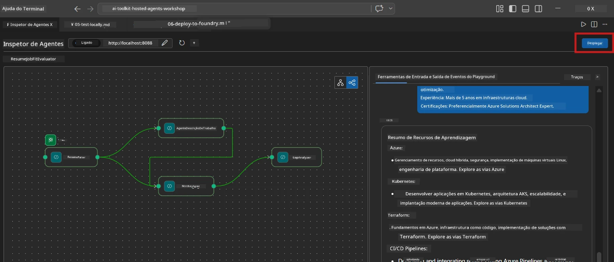
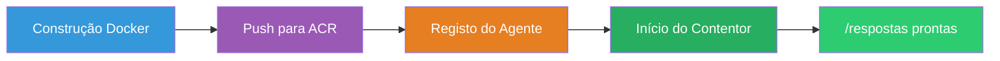
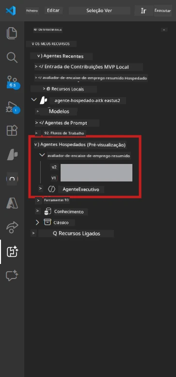

# Module 6 - Desdobrar para o Serviço Foundry Agent

Neste módulo, irá desdobrar o seu fluxo de trabalho multi-agente testado localmente para o [Microsoft Foundry](https://learn.microsoft.com/azure/foundry/agents/concepts/hosted-agents) como um **Agente Hospedado**. O processo de desdobramento constrói uma imagem de contentor Docker, envia-a para o [Azure Container Registry (ACR)](https://learn.microsoft.com/azure/container-registry/container-registry-intro) e cria uma versão de agente hospedado no [Foundry Agent Service](https://learn.microsoft.com/azure/foundry/agents/how-to/publish-agent).

> **Diferença chave em relação ao Lab 01:** O processo de desdobramento é idêntico. O Foundry trata o seu fluxo de trabalho multi-agente como um único agente hospedado - a complexidade está dentro do contentor, mas a superfície de desdobramento é o mesmo endpoint `/responses`.

---

## Verificação de pré-requisitos

Antes de desdobrar, verifique todos os pontos abaixo:

1. **O agente passa os testes locais rápidos:**
   - Completou todos os 3 testes em [Module 5](05-test-locally.md) e o fluxo de trabalho produziu saída completa com cartões de lacunas e URLs da Microsoft Learn.

2. **Tem a função [Azure AI User](https://learn.microsoft.com/azure/foundry/concepts/rbac-foundry):**
   - Atribuída em [Lab 01, Module 2](../../lab01-single-agent/docs/02-create-foundry-project.md). Verifique:
   - [Azure Portal](https://portal.azure.com) → o recurso de **projeto** Foundry → **Controlo de acesso (IAM)** → **Atribuições de função** → confirme que **[Azure AI User](https://aka.ms/foundry-ext-project-role)** está listado para a sua conta.

3. **Está autenticado no Azure no VS Code:**
   - Verifique o ícone de Contas no canto inferior esquerdo do VS Code. O nome da sua conta deve estar visível.

4. **`agent.yaml` tem valores corretos:**
   - Abra `PersonalCareerCopilot/agent.yaml` e verifique:
     ```yaml
     environment_variables:
       - name: PROJECT_ENDPOINT
         value: ${PROJECT_ENDPOINT}
       - name: MODEL_DEPLOYMENT_NAME
         value: ${MODEL_DEPLOYMENT_NAME}
     ```
   - Estes devem corresponder às variáveis de ambiente que o seu `main.py` lê.

5. **`requirements.txt` tem versões corretas:**
   ```
   agent-framework-azure-ai==1.0.0rc3
   agent-framework-core==1.0.0rc3
   azure-ai-agentserver-agentframework==1.0.0b16
   azure-ai-agentserver-core==1.0.0b16
   debugpy
   agent-dev-cli --pre
   ```

---

## Passo 1: Iniciar o desdobramento

### Opção A: Desdobrar a partir do Agent Inspector (recomendado)

Se o agente estiver a correr via F5 com o Agent Inspector aberto:

1. Olhe para o **canto superior direito** do painel do Agent Inspector.
2. Clique no botão **Desdobrar** (ícone de nuvem com uma seta para cima ↑).
3. O assistente de desdobramento abre.



### Opção B: Desdobrar a partir da Palette de Comandos

1. Pressione `Ctrl+Shift+P` para abrir a **Palette de Comandos**.
2. Escreva: **Microsoft Foundry: Deploy Hosted Agent** e selecione.
3. O assistente de desdobramento abre.

---

## Passo 2: Configurar o desdobramento

### 2.1 Selecionar o projeto alvo

1. Um dropdown mostra os seus projetos Foundry.
2. Selecione o projeto que usou durante o workshop (ex.: `workshop-agents`).

### 2.2 Selecionar o ficheiro agente do contentor

1. Ser-lhe-á pedido para selecionar o ponto de entrada do agente.
2. Navegue até `workshop/lab02-multi-agent/PersonalCareerCopilot/` e escolha **`main.py`**.

### 2.3 Configurar recursos

| Configuração | Valor recomendado | Notas |
|--------------|-------------------|-------|
| **CPU**     | `0.25`            | Padrão. Fluxos multi-agente não precisam de mais CPU porque as chamadas ao modelo são baseadas em I/O |
| **Memória** | `0.5Gi`           | Padrão. Aumente para `1Gi` se adicionar ferramentas grandes de processamento de dados |

---

## Passo 3: Confirmar e desdobrar

1. O assistente mostra um resumo do desdobramento.
2. Reveja e clique em **Confirmar e Desdobrar**.
3. Observe o progresso no VS Code.

### O que acontece durante o desdobramento

Observe o painel **Output** do VS Code (selecione o dropdown "Microsoft Foundry"):


1. **Construção Docker** - Constrói o contentor a partir do seu `Dockerfile`:
   ```
   Step 1/6 : FROM python:3.14-slim
   Step 2/6 : WORKDIR /app
   ...
   Successfully built abc123def456
   ```

2. **Envio Docker** - Envia a imagem para o ACR (1-3 minutos no primeiro desdobramento).

3. **Registo do agente** - Encontry cria um agente hospedado usando os metadados do `agent.yaml`. O nome do agente é `resume-job-fit-evaluator`.

4. **Arranque do contentor** - O contentor inicia-se na infraestrutura gerida do Foundry com uma identidade gerida pelo sistema.

> **O primeiro desdobramento é mais lento** (Docker envia todas as camadas). Desdobramentos subsequentes reutilizam camadas em cache e são mais rápidos.

### Notas específicas para multi-agente

- **Todos os quatro agentes estão dentro de um único contentor.** O Foundry vê um único agente hospedado. O grafo do WorkflowBuilder corre internamente.
- **Chamadas MCP saem para fora.** O contentor precisa de acesso à internet para atingir `https://learn.microsoft.com/api/mcp`. A infraestrutura gerida do Foundry fornece isto por padrão.
- **[Identidade Gerida](https://learn.microsoft.com/python/api/overview/azure/identity-readme#managed-identity-support).** No ambiente hospedado, `get_credential()` em `main.py` retorna `ManagedIdentityCredential()` (porque `MSI_ENDPOINT` está definido). Isto é automático.

---

## Passo 4: Verificar o estado do desdobramento

1. Abra a barra lateral **Microsoft Foundry** (clique no ícone do Foundry na Barra de Atividades).
2. Expanda **Hosted Agents (Preview)** sob o seu projeto.
3. Encontre **resume-job-fit-evaluator** (ou o nome do seu agente).
4. Clique no nome do agente → expanda versões (ex.: `v1`).
5. Clique na versão → verifique **Detalhes do Contentor** → **Estado**:



| Estado | Significado |
|--------|-------------|
| **Started** / **Running** | O contentor está a correr, o agente está pronto |
| **Pending** | O contentor está a arrancar (espere 30-60 segundos) |
| **Failed** | O contentor falhou ao arrancar (consulte os logs - veja abaixo) |

> **O arranque multi-agente demora mais** do que o de agente único porque o contentor cria 4 instâncias de agente no arranque. "Pending" durante até 2 minutos é normal.

---

## Erros comuns de desdobramento e correções

### Erro 1: Permissão negada - `agents/write`

```
Error: lacks the required data action 
Microsoft.CognitiveServices/accounts/AIServices/agents/write
```

**Correção:** Atribua a função **[Azure AI User](https://learn.microsoft.com/azure/foundry/concepts/rbac-foundry)** ao nível do **projeto**. Veja [Module 8 - Troubleshooting](08-troubleshooting.md) para instruções passo a passo.

### Erro 2: Docker não está a correr

```
Error: Docker build failed / Cannot connect to Docker daemon
```

**Correção:**
1. Inicie o Docker Desktop.
2. Aguarde pela mensagem "Docker Desktop is running".
3. Verifique: `docker info`
4. **Windows:** Certifique-se que o backend WSL 2 está ativado nas definições do Docker Desktop.
5. Tente novamente.

### Erro 3: falha na instalação pip durante a construção Docker

```
Error: Could not find a version that satisfies the requirement agent-dev-cli
```

**Correção:** A flag `--pre` no `requirements.txt` é tratada de forma diferente no Docker. Certifique-se que o seu `requirements.txt` tem:
```
agent-dev-cli --pre
```

Se o Docker continuar a falhar, crie um `pip.conf` ou passe `--pre` através de um argumento de construção. Veja [Module 8](08-troubleshooting.md).

### Erro 4: Ferramenta MCP falha no agente hospedado

Se o Gap Analyzer parar de produzir URLs da Microsoft Learn após o desdobramento:

**Causa:** A política de rede pode estar a bloquear HTTPS de saída do contentor.

**Correção:**
1. Normalmente, isto não é um problema com a configuração padrão do Foundry.
2. Se ocorrer, verifique se a rede virtual do projeto Foundry tem uma NSG a bloquear HTTPS de saída.
3. A ferramenta MCP tem URLs de fallback embutidas, por isso o agente continuará a produzir saída (sem URLs ao vivo).

---

### Ponto de verificação

- [ ] O comando de desdobramento foi concluído sem erros no VS Code
- [ ] O agente aparece em **Hosted Agents (Preview)** na barra lateral do Foundry
- [ ] O nome do agente é `resume-job-fit-evaluator` (ou o nome escolhido)
- [ ] O estado do contentor mostra **Started** ou **Running**
- [ ] (Se houve erros) Identificou o erro, aplicou a correção e redeployou com sucesso

---

**Anterior:** [05 - Testar Localmente](05-test-locally.md) · **Seguinte:** [07 - Verificar no Playground →](07-verify-in-playground.md)

---

<!-- CO-OP TRANSLATOR DISCLAIMER START -->
**Aviso Legal**:  
Este documento foi traduzido utilizando o serviço de tradução automática [Co-op Translator](https://github.com/Azure/co-op-translator). Embora nos esforcemos pela precisão, por favor tenha em conta que traduções automáticas podem conter erros ou imprecisões. O documento original na sua língua nativa deve ser considerado a fonte autorizada. Para informações críticas, recomenda-se tradução profissional feita por humanos. Não nos responsabilizamos por quaisquer mal-entendidos ou interpretações incorretas decorrentes do uso desta tradução.
<!-- CO-OP TRANSLATOR DISCLAIMER END -->